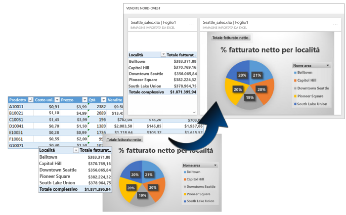
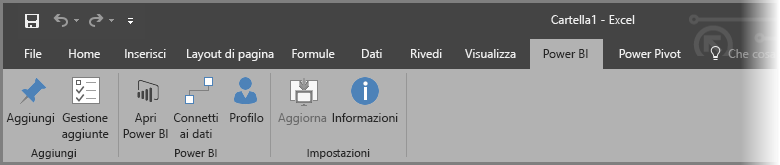
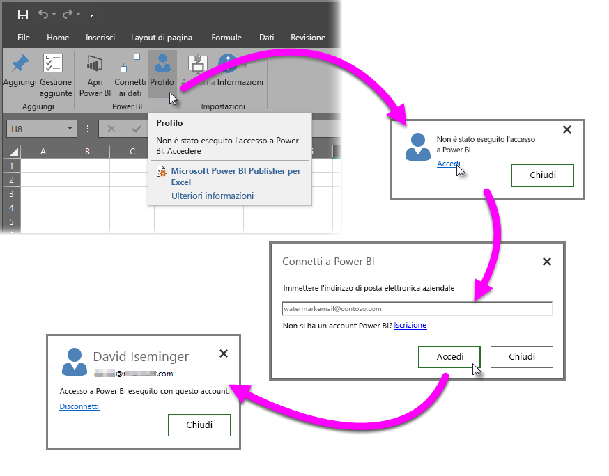
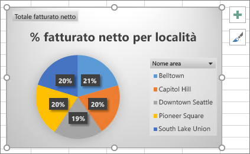
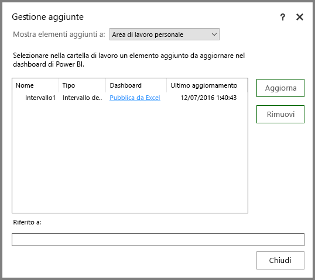
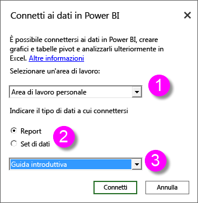
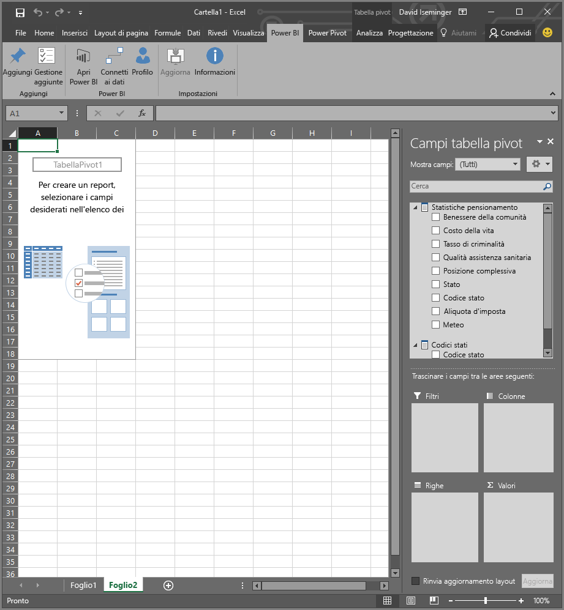
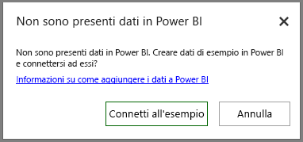

# Power BI Publisher per Excel
Con **Microsoft Power BI Publisher per Excel** è possibile acquisire snapshot delle informazioni più importanti in Excel, come tabelle pivot, grafici e intervalli, per poi aggiungerli al dashboard in Power BI.

Cosa si può aggiungere? Qualsiasi elemento presente in un foglio di lavoro di Excel. È possibile selezionare un intervallo di celle in un foglio o in una tabella, una tabella pivot o un grafico pivot, illustrazioni, immagini e testo.

Non è invece possibile aggiungere mappe 3D o visualizzazioni nei fogli di Power View. Esistono anche elementi che è possibile aggiungere anche se ciò non è di grande utilità, ad esempio un filtro dei dati o un filtro della sequenza temporale.

Quando si aggiunge un elemento da Excel, viene aggiunto un nuovo riquadro a un dashboard nuovo o esistente in Power BI. Il nuovo riquadro è uno snapshot, quindi non è dinamico, ma è comunque possibile aggiornarlo. Se ad esempio si modifica una tabella pivot o un grafico già aggiunto, il riquadro dashboard in Power BI non viene aggiornato automaticamente, ma è comunque possibile aggiornare gli elementi aggiunti usando **Gestione aggiunte**. Maggiori informazioni su **Gestione aggiunte** verranno fornite nelle sezioni seguenti.

## Download e installazione
Power BI Publisher per Excel è un componente aggiuntivo che si può scaricare e installare nelle versioni desktop di Microsoft Excel 2007 e versioni successive.

[Scarica Power BI Publisher per Excel](http://go.microsoft.com/fwlink/?LinkId=715729)

Al termine dell'installazione si noterà una nuova barra multifunzione **Power BI** in Excel, in cui è possibile accedere a Power BI (o disconnettersi), aggiungere elementi ai dashboard e gestire gli elementi già aggiunti.

Il componente aggiuntivo **Power BI Publisher per Excel** è abilitato per impostazione predefinita, ma se la scheda della barra multifunzione Power BI non è visibile in Excel, è necessario abilitarlo. Fare clic su **File** > **Opzioni** > **Componenti aggiuntivi** > **Componenti aggiuntivi COM**. Selezionare **Microsoft Power BI Publisher per Excel**.

## Aggiungere un intervallo a un dashboard
È possibile selezionare qualsiasi intervallo di celle dal foglio di lavoro e aggiungere uno snapshot di tale intervallo a qualsiasi dashboard nuovo o esistente in Power BI. È anche possibile aggiungere lo stesso snapshot a più dashboard.

Per iniziare, è necessario assicurarsi di aver effettuato l'accesso a Power BI.

1. Selezionare **Profilo** dalla scheda **Power BI** della barra multifunzione di Excel. Se è già stato effettuato l'accesso a Power BI, si noterà una finestra di dialogo che mostra l'account con il quale è stato effettuato l'accesso. Se si tratta dell'account che si vuole usare, passare alla successiva serie di passaggi per aggiungere l'intervallo. Selezionare *Disconnetti* per usare un account Power BI diverso. Se l'accesso non è stato effettuato, andare al passaggio successivo (passaggio 2).
   
   
2. Se l'accesso non è stato effettuato, selezionare il collegamento **Accedi** che viene visualizzato quando si seleziona **Profilo** dalla scheda della barra multifunzione **Power BI** in Excel; nella finestra di dialogo **Connetti a Power BI** digitare l'indirizzo di posta elettronica dell'account di Power BI che si vuole usare, quindi selezionare **Accedi**.
   
   

Una volta effettuato l'accesso, seguire la procedura seguente per aggiungere un intervallo a un dashboard:

1. In Excel selezionare la scheda della barra multifunzione **Power BI** per visualizzare il pulsante della barra multifunzione **Aggiungi**.
2. Selezionare un intervallo della cartella di lavoro di Excel.
3. Fare clic sul pulsante **Aggiungi** della barra multifunzione **Power BI** per visualizzare la finestra di dialogo **Aggiungi al dashboard**. Se non è già stato fatto, verrà chiesto di eseguire l'accesso a Power BI. Selezionare un'area di lavoro dall'elenco a discesa **Area di lavoro**. Per aggiungere un dashboard personalizzato, verificare che sia selezionato **Area di lavoro personale**. Se si vuole aggiungere un dashboard a un'area di lavoro di gruppo, selezionare il gruppo nell'elenco a discesa.
4. Scegliere se aggiungere il riquadro a un *dashboard esistente* o se creare un *nuovo dashboard*.
5. Fare clic su **Ok** per aggiungere la selezione al dashboard.
6. In **Aggiungi al dashboard** selezionare un dashboard esistente nello spazio di lavoro oppure crearne uno nuovo, quindi fare clic sul pulsante **Ok**.
   
   

## Aggiungere un grafico a un dashboard
Fare clic sul grafico e quindi su Aggiungi .

## Gestire gli elementi aggiunti
Con **Gestione aggiunte** è possibile aggiornare il riquadro associato a un elemento aggiunto in Power BI. È anche possibile rimuovere l'associazione a un elemento già aggiunto al dashboard in Power BI.

Per aggiornare i riquadri nel dashboard, selezionare uno o più elementi in **Gestione aggiunte** e quindi selezionare **Aggiorna**.

Per rimuovere il mapping tra un elemento aggiunto in Excel e il riquadro associato in un dashboard, selezionare **Rimuovi**. Quando si seleziona **Rimuovi** *non* si elimina l'elemento dal foglio di lavoro di Excel o il riquadro associato nel dashboard. Viene rimossa l'associazione, o il *mapping*, tra di essi. L'elemento rimosso non verrà più visualizzato in **Gestione aggiunte**. Se si aggiunge nuovamente l'elemento, verrà visualizzato in un nuovo riquadro.

Per rimuovere un elemento (riquadro) aggiunto da un dashboard, è necessario eseguire questa operazione in Power BI. Nel riquadro da eliminare fare clic sull'icona **Apri menu** e quindi selezionare **Elimina riquadro**.

## Connettersi ai dati in Power BI
A partire dalla versione di luglio 2016 di **Power BI Publisher per Excel** (inclusa la versione corrente, di cui viene fornito il collegamento sopra), è possibile connettersi direttamente ai dati nel servizio Power BI e analizzarli in Excel usando tabelle e grafici pivot. Questa funzionalità semplifica l'uso dei dati di Power BI con Excel per analizzare i dati più importanti.

I miglioramenti includono quanto segue:

* Tutti i driver necessari per connettersi ai dati in Power BI vengono aggiornati automaticamente a ogni versione, quindi non è necessario installare o gestire i driver manualmente.
* Non è più necessario scaricare i file con estensione ODC per creare le connessioni; **Power BI Publisher per Excel** crea automaticamente le connessioni quando si seleziona il report o i set di dati che si vuole usare.
* È ora possibile creare più connessioni e tabelle pivot nella stessa cartella di lavoro.
* Gli errori sono stati migliorati e sono specifici di **Power BI Publisher per Excel**, anziché essere messaggi di Excel predefiniti.

### Come connettersi ai dati di Power BI in Excel
Per connettersi ai dati di Power BI usando **Power BI Publisher per Excel**, seguire questi semplici passaggi:

1. Assicurarsi di aver eseguito l'accesso a Power BI. I passaggi che descrivono come eseguire l'accesso (anche con un account diverso) sono forniti in precedenza in questo articolo.
2. Una volta effettuato l'accesso a Power BI con l'account che si vuole usare, selezionare **Connettersi ai dati** dalla scheda della barra multifunzione **Power BI** di Excel.
   
   
3. Excel si connette a Power BI usando una connessione HTTPS e visualizza la finestra di dialogo **Connetti ai dati in Power BI**, dove è possibile selezionare l'*area di lavoro* da cui si vuole selezionare i dati (1, nell'immagine seguente), il *tipo di dati* a cui si vuole connettersi, ovvero un **report** o un **set di dati** (2), e un elenco a discesa (3) che consente di selezionare il *report o set di dati disponibile* a cui connettersi.
   
   
4. Quando si effettuano le scelte e si seleziona **Connetti** dalla finestra di dialogo **Connetti ai dati in Power BI**, Excel prepara una tabella pivot e visualizza il riquadro **Campi tabella pivot**, dove è possibile selezionare i campi dei dati di Power BI connessi e creare tabelle o grafici che consentono di analizzare i dati.
   
   

Se non sono presenti dati in Power BI, Excel lo rileva e propone la creazione di dati di esempio ai quali connettersi per provare.

In questa versione di **Power BI Publisher per Excel** è necessario tenere conto di alcuni aspetti:

* **Dati condivisi**: i dati che sono stati condivisi con l'utente, ma che non sono direttamente visibili all'utente in Power BI, non sono disponibili in **Connetti ai dati**.
* **SSAS locale**: se il set di dati selezionato proviene da SQL Server Analysis Services (SSAS) locale e il set di dati in Power BI usa DirectQuery per accedere ai dati, **Power BI Publisher per Excel** si connette ai dati usando la connessione di rete locale e *non* Power BI. Di conseguenza, qualsiasi utente che cerca di connettersi a tale set di dati deve essere connesso alla rete locale e viene autenticato per l'accesso a tali dati con il metodo di autenticazione usato dall'istanza di Analysis Services in cui i dati vengono archiviati.
* **Driver richiesti** - **: Power BI Publisher per Excel** installa automaticamente tutti i driver necessari per questa funzionalità, tra cui il driver OLE DB di Excel per Analysis Services. Se tale driver viene per qualsiasi motivo rimosso dall'utente, la connessione ai dati di Power BI non funzionerà.
* **I set di dati devono includere le misure**: per gestire le misure come valori nelle tabelle pivot di Excel e per analizzare correttamente i dati, nel set di dati devono essere definite misure del modello. Altre informazioni sulle [misure](desktop-measures.md).
* **Supporto per i gruppi**: i set di dati condivisi con altri utenti non inclusi nel gruppo specificato non sono supportati, quindi non è possibile stabilire una connessione.
* **Sottoscrizioni Pro e gratuite**: le attività associate ai gruppi non sono supportate per gli utenti gratuiti di Power BI, che quindi non visualizzeranno i set di dati o i report condivisi con un gruppo nella propria area di lavoro.
* **Report o set di dati condivisi**: non è possibile connettere i report o i set di dati condivisi con l'utente.
* **Utilizzo di tabelle invece di modelli di dati**: i set di dati e i report creati importando solo le tabelle di Excel, senza un modello di dati, non sono supportati al momento, quindi non è possibile stabilire una connessione.

Dopo aver creato grafici accattivanti o altri oggetti visivi, ad esempio un intervallo di dati, è possibile aggiungerli facilmente a un dashboard in Power BI, come descritto in precedenza in questo articolo.

## Articoli correlati
Esistono molti modi per usare insieme Excel e Power BI e ottenere risultati ottimali da entrambi. Per altre informazioni, vedere gli articoli seguenti.

* [Analizza in Excel](service-analyze-in-excel.md)
* [Risoluzione dei problemi di Analizza in Excel](desktop-troubleshooting-analyze-in-excel.md)

