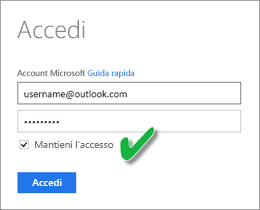

# Aggiornare un set di dati creato da un file CSV in OneDrive o SharePoint Online
## Quali sono i vantaggi?
Quando ci si connette a un file CSV in OneDrive o SharePoint Online, viene creato un set di dati in Power BI. I dati del file CSV vengono quindi importati nel set di dati in Power BI. Power BI si connette automaticamente al file e aggiorna le modifiche nel set di dati in Power BI. Se si modifica il file CSV in OneDrive o SharePoint Online, dopo il salvataggio le modifiche vengono visualizzate in Power BI, in genere entro circa un'ora. Vengono aggiornate automaticamente anche le visualizzazioni in Power BI basate sul set di dati.

Se i file si trovano in una cartella condivisa in OneDrive for Business o SharePoint Online, gli altri utenti possono lavorare sullo stesso file. Dopo il salvataggio, le modifiche apportate vengono aggiornate automaticamente in Power BI, in genere entro un'ora.

Molte organizzazioni usano processi che eseguono automaticamente le query nei database per i dati che verranno poi salvati giornalmente in un file CSV. Se il file viene archiviato in OneDrive o SharePoint Online e sovrascritto ogni giorno (invece di creare un nuovo file con un nome diverso ogni giorno), è possibile connettersi a tale file in Power BI. Il set di dati che si connette al file viene sincronizzato subito dopo l'aggiornamento del file in OneDrive o SharePoint Online. Vengono aggiornate automaticamente anche le visualizzazioni basate sul set di dati.

## Che cosa è supportato?
I file con valori delimitati da virgole sono file di testo semplici, quindi non sono supportate le connessioni alle origini dati esterne e ai report. Non è possibile pianificare l'aggiornamento in un set di dati creato da un file delimitato da virgole. Tuttavia, se il file si trova in OneDrive o in SharePoint Online, Power BI sincronizza automaticamente le modifiche apportate al file con il set di dati a intervalli di circa un'ora.

## OneDrive o OneDrive for Business. Qual è la differenza?
Se si ha un account OneDrive personale e OneDrive for Business, è consigliabile mantenere tutti i file ai quali connettersi in Power BI in OneDrive for Business. Motivo: è probabile che verranno usati due account diversi per l'accesso.

La connessione a OneDrive for Business in Power BI in genere non crea problemi perché l'account usato per accedere a Power BI spesso coincide con quello usato per accedere a OneDrive for Business. Invece, con l'account OneDrive personale, l'accesso viene solitamente eseguito con un altro [account Microsoft](https://account.microsoft.com).

Quando si accede all'account Microsoft, assicurarsi di selezionare Mantieni l'accesso. Power BI può quindi sincronizzare gli aggiornamenti con i set di dati in Power BI

Se si apportano modifiche al file CSV in OneDrive che non possono essere sincronizzate con il set di dati in Power BI perché le credenziali dell'account Microsoft sono state modificate, è necessario connettersi al file e importarlo nuovamente dall'account OneDrive personale.

## In caso di errore
Se i dati nel file CSV in OneDrive vengono modificati e le modifiche non vengono riportate in Power BI, è probabile che Power BI non riesca a connettersi a OneDrive. Provare a connettersi al file e a importarlo di nuovo. Se viene chiesto di effettuare l'accesso, assicurarsi di selezionare **Mantieni l'accesso**.

## Passaggi successivi
[Strumenti per la risoluzione di problemi di aggiornamento](service-gateway-onprem-tshoot.md)
[Scenari per la risoluzione dei problemi di aggiornamento](refresh-troubleshooting-refresh-scenarios.md)

Altre domande? [Provare a rivolgersi alla community di Power BI](https://community.powerbi.com/)

