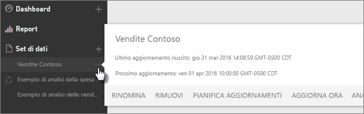
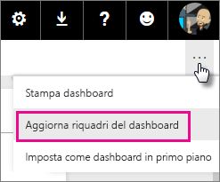
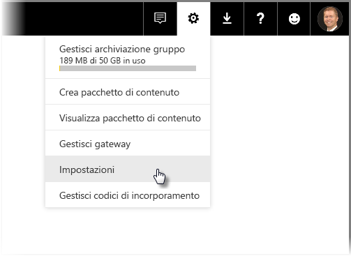
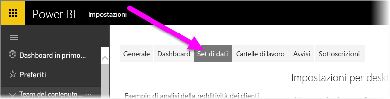

# Aggiornamento dei dati in Power BI
La disponibilità continua dei dati più recenti è spesso fondamentale per poter prendere le decisioni giuste. Molti hanno probabilmente già usato il comando Recupera dati in Power BI per connettersi ai dati e caricarli, nonché hanno creato report e un dashboard. A questo punto, è necessario assicurarsi che i dati siano davvero i più aggiornati e completi.

In molti casi non è necessario alcun intervento. Alcuni dati, come i pacchetti di contenuto di Salesforce o Marketo, vengono aggiornati automaticamente. Quando la connessione è dinamica o avviene con DirectQuery, i dati saranno sempre aggiornati. In altri casi, tuttavia, come con una cartella di lavoro di Excel o un file di Power BI Desktop che si connette a un'origine dati online esterna o locale, è necessario eseguire l'aggiornamento manualmente o configurare una pianificazione dell'aggiornamento in modo che Power BI possa aggiornare i dati di report e dashboard.

Questo articolo, insieme ad alcuni altri, è pensato per aiutare a comprendere come funziona effettivamente l'aggiornamento dei dati in Power BI, se è necessario o meno configurare una pianificazione dell'aggiornamento e cosa è necessario per aggiornare correttamente i dati.

## Informazioni sull'aggiornamento dei dati
Prima di configurare l'aggiornamento, è importante comprendere cosa si sta aggiornando e da dove provengono i dati.

Un' *origine dati* è la posizione da cui provengono i dati analizzati in report e dashboard. Ad esempio, un servizio online come Google Analytics o QuickBooks, un database nel cloud come il database SQL di Azure oppure un database o un file in un server o un computer locale nell'organizzazione. Il tipo di origine dati determina la modalità di aggiornamento dei relativi dati. L'aggiornamento per ogni tipo di origine dati verrà analizzato più avanti, nella sezione [Elementi che è possibile aggiornare](#what-can-be-refreshed).

Un *set di dati* viene creato automaticamente in Power BI quando si usa il comando Recupera dati per connettersi a un pacchetto di contenuto o a un file e caricare i dati oppure per connettersi a un'origine dati dinamica. In Power BI Desktop ed Excel 2016 è anche possibile pubblicare il file direttamente nel servizio Power BI, che equivale all'uso del comando Recupera dati.

In ogni caso viene creato un set di dati, che viene visualizzato nei contenitori Area di lavoro personale, o Gruppo, del servizio Power BI. Quando si seleziona i **puntini di sospensione (...)** per un set di dati, è possibile esplorare i dati in un report, modificare le impostazioni e configurare l'aggiornamento.

Un set di dati può ottenere dati da una o più origini dati. Ad esempio, è possibile usare Power BI Desktop per ottenere dati da un database SQL all'interno dell'organizzazione e ottenere altri dati da un feed OData online. Quindi, quando si pubblica il file in Power BI, viene creato un singolo set di dati che include però le origini dati sia per il database SQL sia per il feed OData.

Un set di dati contiene informazioni sulle origini dati, le credenziali delle origini dati e, nella maggior parte dei casi, un subset dei dati copiati dall'origine dati. Quando si creano visualizzazioni in report e dashboard, si osservano i dati nel set di dati o, nel caso di una connessione in tempo reale, ad esempio a un database SQL di Azure, il set di dati definisce i dati visualizzati direttamente dall'origine dati. Per una connessione dinamica ad Analysis Services, la definizione del set di dati proviene direttamente da Analysis Services.

> *Quando si aggiornano i dati, si aggiornano i dati nel set di dati archiviato in Power BI dall'origine dati. Questo aggiornamento è un aggiornamento completo e non incrementale.*
> 
> 

Ogni volta che si aggiornano i dati in un set di dati, usando il comando Aggiorna ora o configurando una pianificazione dell'aggiornamento, Power BI usa le informazioni nel set di dati per la connessione alle origini dati definite per il set, esegue una query per i dati aggiornati e quindi carica i dati aggiornati nel set di dati. Le visualizzazioni nei report o nei dashboard basate su tali dati vengono aggiornate automaticamente.

Prima di continuare, c'è un altro concetto molto importante da comprendere:

> *indipendentemente dalla frequenza di aggiornamento del set di dati o di visualizzazione dei dati dinamici, sono i dati nell'origine dati che devono essere aggiornati per prima cosa.*
> 
> 

La maggior parte delle organizzazioni elabora i dati una volta al giorno, in genere di sera. Se si pianifica l'aggiornamento per un set di dati creato da un file di Power BI Desktop che si connette a un database locale e il reparto IT elabora tale database SQL una volta di sera, è sufficiente configurare l'aggiornamento pianificato in modo che venga eseguito una volta al giorno. Ad esempio, dopo l'elaborazione del database ma prima dell'inizio della giornata lavorativa successiva. Naturalmente, ciò non è sempre valido. Power BI offre diversi modi per connettersi alle origini dati che vengono aggiornate di frequente o anche in tempo reale.

## Tipi di aggiornamento
Esistono quattro tipi principali di aggiornamento che si verificano all'interno di Power BI. Aggiornamento pacchetto, aggiornamento del modello/dei dati, aggiornamento del riquadro e aggiornamento contenitore visivo.

### Aggiornamento pacchetto
Il file di Power BI Desktop, o di Excel, viene sincronizzato tra il servizio Power BI e OneDrive, o SharePoint Online. Non vengono però estratti dati dalle origini dati originali. Il set di dati in Power BI verrà aggiornato solo con le risorse contenute nel file in OneDrive o SharePoint Online.

### Aggiornamento modello/dati
Si riferisce all'aggiornamento del set di dati, nell'ambito del servizio Power BI, con i dati provenienti dall'origine dati originale. Ciò avviene usando l'aggiornamento pianificato oppure il comando Aggiorna ora. Richiede un gateway per le origini dati locali.

### Aggiornamento del riquadro
L'aggiornamento del riquadro aggiorna la cache degli oggetti visivi del riquadro, nel dashboard, quando i dati vengono modificati. Ciò si verifica circa ogni 15 minuti. È possibile anche forzare l'aggiornamento di un riquadro selezionando i **puntini di sospensione (...)** nell'angolo in alto a destra del dashboard e scegliendo **Aggiorna riquadri del dashboard**.

Per informazioni dettagliate sugli errori comuni di aggiornamento del riquadro, vedere [Risoluzione degli errori del riquadro](refresh-troubleshooting-tile-errors.md).

### Aggiornamento contenitore visivo
L'aggiornamento del contenitore visivo aggiorna gli oggetti grafici del report memorizzati nella cache quando i dati vengono modificati.

## Elementi che è possibile aggiornare
In Power BI si usa in genere il comando Recupera dati per importare dati da un file in un'unità locale, OneDrive o SharePoint online, pubblicare un report da Power BI Desktop o connettersi direttamente a un database nel cloud nella propria organizzazione. È possibile aggiornare praticamente tutti i dati in Power BI, ma la necessità di farlo dipende da come è stato creato il set di dati e dalle origini dati a cui si connette. Verranno ora analizzate le modalità di aggiornamento dei dati.

Prima di continuare, ecco alcune definizioni importanti da comprendere:

**Aggiornamento automatico**  : significa che non è necessaria alcuna configurazione utente per l'aggiornamento del set di dati a intervalli regolari. Le impostazioni di aggiornamento dei dati vengono configurate automaticamente da Power BI. Per i provider di servizi online, l'aggiornamento viene eseguito in genere una volta al giorno. Per i file caricati da OneDrive, l'aggiornamento automatico viene eseguito circa ogni ora per i dati che non provengono da un'origine dati esterna. Sebbene sia possibile configurare diverse impostazioni di aggiornamento pianificato e manuale, probabilmente non è necessario.

**Aggiornamento pianificato o manuale configurato dall'utente** : significa che è possibile aggiornare manualmente un set di dati usando il comando Aggiorna ora oppure configurare una pianificazione dell'aggiornamento usando il comando Pianifica aggiornamento nelle impostazioni di un set di dati. Questo tipo di aggiornamento è necessario per i file di Power BI Desktop e le cartelle di lavoro di Excel che si connettono a origini dati online esterne e locali.

> [!NOTE]
> Quando si configura un'ora per l'aggiornamento pianificato, si può verificare un ritardo massimo di un'ora prima dell'inizio.
> 
> 

**Dinamico/DirectQuery**: significa che c'è una connessione in tempo reale tra Power BI e l'origine dati. Per le origini dati locali, gli amministratori dovranno aver configurato un'origine dati all'interno di un gateway aziendale, ma può non essere necessaria l'interazione dell'utente.

> [!NOTE]
> Per migliorare le prestazioni, i dashboard con dati connessi usando DirectQuery vengono aggiornati automaticamente. È anche possibile aggiornare manualmente un riquadro in qualsiasi momento, usando il menu **Altro** nel riquadro.
> 
> 

## File locali e file in OneDrive o SharePoint Online
L'aggiornamento dei dati è supportato per i file di Power BI Desktop e le cartelle di lavoro di Excel che si connettono a origini dati online esterne o locali. Verranno aggiornati solo i dati per il set di dati all'interno del servizio Power BI. Non verrà aggiornato il file locale.

Mantenendo i file in OneDrive o SharePoint online e connettendosi a essi da Power BI, è possibile ottenere un elevato livello di flessibilità. Questo modello offre grande flessibilità ma è anche piuttosto difficile da comprendere. L'aggiornamento pianificato per i file archiviati in OneDrive o SharePoint Online differisce dall'aggiornamento pacchetto. Per altre informazioni, vedere la sezione [Tipi di aggiornamento](#types-of-refresh).

### File di Power BI Desktop

| **Origine dati** | **Aggiornamento automatico** | **Aggiornamento pianificato o manuale configurato dall'utente** | **Gateway richiesto** |
| --- | --- | --- | --- |
| Il comando Recupera dati (sulla barra multifunzione) viene usato per connettersi ai dati provenienti da un'origine dati online elencata ed eseguire query su tali dati. |No |Sì |No (vedere sotto) |
| Il comando Recupera dati viene usato per connettersi a un database di Analysis Services ed esplorarlo in tempo reale. |Sì |No |Sì |
| Il comando Recupera dati viene usato per connettersi a un'origine dati DirectQuery locale ed esplorarla. |Sì |No |Sì |
| Il comando Recupera dati viene usato per connettersi a un database SQL di Azure, Azure SQL Data Warehouse o Azure HDInsight Spark ed eseguire query su tali dati. |Sì |Sì |No |
| Recupera dati viene usato per connettersi ai dati provenienti da un'origine dati locale elencata, ad eccezione di file Hadoop (HDFS) e Microsoft Exchange. |No |Sì |Sì |

> [!NOTE]
> Se si usa la funzione [**Web.Page**](https://msdn.microsoft.com/library/mt260924.aspx), è necessario un gateway se il set di dati o il report è stato ripubblicato dopo il 18 novembre 2016.
> 
> 

Per informazioni dettagliate, vedere [Aggiornare un set di dati creato da un file di Power BI Desktop in OneDrive](refresh-desktop-file-onedrive.md).

### Cartella di lavoro di Excel

| **Origine dati** | **Aggiornamento automatico** | **Aggiornamento pianificato o manuale configurato dall'utente** | **Gateway richiesto** |
| --- | --- | --- | --- |
| Tabelle di dati in un foglio di lavoro non caricato nel modello di dati di Excel. |Sì, ogni ora *(solo OneDrive/SharePoint Online)* |Solo manuale *(solo OneDrive/SharePoint Online)* |No |
| Tabelle di dati in un foglio di lavoro collegato a una tabella nel modello di dati di Excel (tabelle collegate). |Sì, ogni ora *(solo OneDrive/SharePoint Online)* |Solo manuale *(solo OneDrive/SharePoint Online)* |No |
| Power Query* viene usato per connettersi ai dati provenienti da un'origine dati online elencata, eseguire query su tali dati e caricare i dati nel modello di dati di Excel. |No |Sì |No |
| Power Query* viene usato per connettersi ai dati provenienti da un'origine dati locale elencata, ad eccezione di file Hadoop (HDFS) e Microsoft Exchange, eseguire query su tali dati e caricare i dati nel modello di dati di Excel. |No |Sì |Sì |
| Power Pivot viene usato per connettersi ai dati provenienti da un'origine dati online elencata, eseguire query su tali dati e caricare i dati nel modello di dati di Excel. |No |Sì |No |
| Power Pivot viene usato per connettersi ai dati provenienti da un'origine dati locale elencata, eseguire query su tali dati e caricare i dati nel modello di dati di Excel. |No |Sì |Sì |

*\* Power Query è noto come Recupera e trasforma in Excel 2016.*

Per informazioni più dettagliate, vedere [Aggiornare un set di dati creato da una cartella di lavoro di Excel in OneDrive](refresh-excel-file-onedrive.md).

### File con valori delimitati da virgole (estensione csv) in OneDrive o SharePoint Online

| **Origine dati** | **Aggiornamento automatico** | **Aggiornamento pianificato o manuale configurato dall'utente** | **Gateway richiesto** |
| --- | --- | --- | --- |
| File con valori delimitati da virgole semplice |Sì, ogni ora |Solo manuale |No |

Per informazioni più dettagliate, vedere [Aggiornare un set di dati creato da un file con valori delimitati da virgole (CSV) in OneDrive](refresh-csv-file-onedrive.md).

## Pacchetti di contenuto
In Power BI ci sono due tipi di pacchetti di contenuto:

**Pacchetti di contenuto di servizi online**: come Adobe Analytics, SalesForce e Dynamics CRM Online. I set di dati creati dai servizi online vengono aggiornati automaticamente una volta al giorno. Sebbene probabilmente non sia necessario, è possibile eseguire l'aggiornamento manualmente o configurare una pianificazione dell'aggiornamento. Dato che i servizi online sono nel cloud, non è necessario un gateway.

**Pacchetti di contenuto aziendali**: creati e condivisi dagli utenti dell'organizzazione. Chi utilizza i pacchetti di contenuto non può configurare una pianificazione dell'aggiornamento o l'aggiornamento manuale. Solo il creatore del pacchetto di contenuto può configurare l'aggiornamento per i set di dati nel pacchetto. Le impostazioni di aggiornamento vengono ereditate con il set di dati.

### Pacchetti di contenuto di servizi online

| **Origine dati** | **Aggiornamento automatico** | **Aggiornamento pianificato o manuale configurato dall'utente** | **Gateway richiesto** |
| --- | --- | --- | --- |
| Servizi online in Recupera dati &gt; Servizi |Sì |Sì |No |

### Pacchetti di contenuto aziendali
Le funzionalità di aggiornamento per un set di dati incluso nel pacchetto di contenuto di un'organizzazione dipendono dal set di dati. Vedere le informazioni sopra riportate in relazione a file locali, OneDrive o SharePoint Online.

Per altre informazioni, vedere [Introduzione ai pacchetti di contenuto aziendali](service-organizational-content-pack-introduction.md).

## Connessioni dinamiche e DirectQuery alle origini dati locali
Con il gateway dati locale è possibile eseguire query da Power BI sulle origini dati locali. Quando si interagisce con una visualizzazione, le query vengono inviate da Power BI direttamente al database. Vengono quindi restituiti i dati aggiornati e le visualizzazioni vengono aggiornate. Poiché c'è una connessione diretta tra Power BI e il database, non è necessario pianificare l'aggiornamento.

Quando ci si connette a un'origine dati di SQL Service Analysis Services (SSAS) usando una connessione dinamica, a differenza di DirectQuery, la connessione dinamica a un'origine SSAS può essere eseguita nella cache, anche durante il caricamento di un report. Questo comportamento migliora le prestazioni di caricamento per il report. È possibile richiedere i dati più recenti dall'origine dati SSAS usando il pulsante **Aggiorna**. I proprietari delle origini dati SSAS possono configurare la frequenza di aggiornamento pianificata della cache per il set di dati, in modo da assicurare che i report siano sempre aggiornati in base alle esigenze specifiche. 

Quando si configura un'origine dati con il gateway dati locale è possibile usare tale origine dati come opzione di aggiornamento pianificata. invece di usare il gateway personale.

> [!NOTE]
> Se il set di dati è configurato per una connessione dinamica o DirectQuery, i set di dati vengono aggiornati circa ogni ora o quando si verifica un'interazione con i dati. È possibile regolare manualmente la *frequenza di aggiornamento* usando l'opzione *Aggiornamento pianificato della cache* nel servizio Power BI.
> 
> 

| **Origine dati** | **Dinamico/DirectQuery** | **Aggiornamento pianificato o manuale configurato dall'utente** | **Gateway richiesto** |
| --- | --- | --- | --- |
| Analysis Services in modalità tabulare |Sì |Sì |Sì |
| Analysis Services in modalità multidimensionale |Sì |Sì |Sì |
| SQL Server |Sì |Sì |Sì |
| SAP HANA |Sì |Sì |Sì |
| Oracle |Sì |Sì |Sì |
| Teradata |Sì |Sì |Sì |

Per altre informazioni, vedere [Gateway dati locale](service-gateway-onprem.md)

## Database nel cloud
Con l'opzione DirectQuery c'è una connessione diretta tra Power BI e il database nel cloud. Quando si interagisce con una visualizzazione, le query vengono inviate da Power BI direttamente al database. Vengono quindi restituiti i dati aggiornati e le visualizzazioni vengono aggiornate. Poiché inoltre il servizio Power BI e l'origine dati sono nel cloud, non è necessario un gateway personale.

In assenza di interazione utente in una visualizzazione, i dati vengono aggiornati automaticamente circa ogni ora. Questa frequenza di aggiornamento può essere modificata usando l'opzione *Aggiornamento pianificato della cache* e impostando la frequenza desiderata.

Per impostare la frequenza, selezionare l'icona dell'**ingranaggio** sull'icona in alto a destra del servizio Power BI, quindi selezionare **Impostazioni**.

Viene visualizzata la pagina **Impostazioni**, in cui è possibile selezionare il set di dati per il quale si vuole regolare la frequenza. In questa pagina selezionare la scheda **Set di dati** nella parte superiore.

Selezionare il set di dati e nel riquadro di destra verrà visualizzato un insieme di opzioni per il set di dati. Per la connessione dinamica/DirectQuery, è possibile impostare la frequenza di aggiornamento da 15 minuti a settimanale usando il menu a discesa associato, come mostrato nell'immagine seguente.

| **Origine dati** | **Dinamico/DirectQuery** | **Aggiornamento pianificato o manuale configurato dall'utente** | **Gateway richiesto** |
| --- | --- | --- | --- |
| Azure SQL Data Warehouse |Sì |Sì |No |
| Spark in HDInsight |Sì |Sì |No |

Per altre informazioni, vedere [Azure e Power BI](service-azure-and-power-bi.md).

## Dashboard in tempo reale
I dashboard in tempo reale usano l'API REST di Microsoft Power BI o l'analisi di flusso Microsoft per garantire che i dati siano aggiornati. Poiché i dashboard in tempo reale non richiedono la configurazione dell'aggiornamento da parte degli utenti, esulano dall'ambito di questo articolo.

| **Origine dati** | **Automatico** | **Aggiornamento pianificato o manuale configurato dall'utente** | **Gateway richiesto** |
| --- | --- | --- | --- |
| App personalizzate sviluppate con l'API REST di Power BI o l'analisi di flusso Microsoft |Sì, streaming live |No |No |

Per altre informazioni, vedere [Creare un dashboard in tempo reale in Power BI](https://msdn.microsoft.com/library/mt267603.aspx).

## Configurare l'aggiornamento pianificato
Per informazioni su come configurare l'aggiornamento pianificato, vedere [Configurare l'aggiornamento pianificato](refresh-scheduled-refresh.md)

## Scenari comuni di aggiornamento dei dati
Talvolta il modo migliore per comprendere l'aggiornamento dei dati in Power BI consiste nell'esaminare alcuni esempi. Ecco alcuni dei più comuni scenari di aggiornamento dei dati:

### Cartella di lavoro di Excel con tabelle di dati
Si dispone di una cartella di lavoro di Excel con diverse tabelle di dati, nessuna delle quali è tuttavia caricata nel modello di dati di Excel. Si usa il comando Recupera dati per caricare il file della cartella di lavoro dall'unità locale in Power BI e creare un dashboard. Vengono però apportate alcune modifiche a un paio di tabelle della cartella di lavoro nell'unità locale e si vuole aggiornare il dashboard in Power BI con i nuovi dati.

Sfortunatamente, l'aggiornamento non è supportato in questo scenario. Per aggiornare il set di dati per il dashboard, sarà necessario caricare di nuovo la cartella di lavoro. Tuttavia, c'è una soluzione davvero straordinaria: spostare il file della cartella di lavoro in OneDrive o SharePoint Online.

Quando ci si connette a un file in OneDrive o SharePoint Online, i report e i dashboard mostrano i dati come sono nel file. In questo caso, la cartella di lavoro di Excel. Power BI controlla automaticamente il file circa ogni ora per gli aggiornamenti. Se si apportano modifiche alla cartella di lavoro (archiviata in OneDrive o SharePoint Online), tali modifiche si rifletteranno nel dashboard e nei report entro un'ora. Non è necessario configurare alcun aggiornamento. Se tuttavia è necessario visualizzare immediatamente gli aggiornamenti in Power BI, è possibile aggiornare manualmente il set di dati usando il comando Aggiorna ora.

Per altre informazioni, vedere [Dati di Excel in Power BI](service-excel-workbook-files.md) o [Aggiornare un set di dati creato da una cartella di lavoro di Excel in OneDrive](refresh-excel-file-onedrive.md).

### Cartella di lavoro di Excel che si connette a un database SQL nell'azienda
Si supponga di avere di una cartella di lavoro di Excel denominata SalesReport.xlsx nel computer locale. È stato usato Power Query in Excel per connettersi a un database SQL in un server nell'azienda ed eseguire una query per dati delle vendite caricati nel modello di dati. Ogni mattina, si apre la cartella di lavoro e la si aggiorna per aggiornare le tabelle pivot.

Si vogliono ora analizzare i dati delle vendite in Power BI, quindi si usa il comando Recupera dati per connettersi alla cartella di lavoro SalesReport.xlsx e caricarla dal disco locale.

In questo caso, è possibile aggiornare manualmente i dati nel set di dati SalesReport.xlsx oppure configurare una pianificazione dell'aggiornamento. Visto che i dati provengono effettivamente dal database SQL nell'azienda, è necessario scaricare e installare un gateway. Dopo avere installato e configurato il gateway, è necessario accedere alle impostazioni del set di dati SalesReport e accedere all'origine dati, ma questa operazione è necessaria una sola volta. È quindi possibile configurare una pianificazione dell'aggiornamento, in modo che Power BI si connetta automaticamente al database SQL e ottenga i dati aggiornati. Anche i report e i dashboard verranno aggiornati automaticamente.

> [!NOTE]
> Verranno aggiornati solo i dati all'interno del set di dati nel servizio Power BI. Il file locale non verrà aggiornato come parte dell'aggiornamento.
> 
> 

Per altre informazioni, vedere [Ottenere dati dai file delle cartelle di lavoro di Excel](service-excel-workbook-files.md), [Power BI Gateway - Personal](service-gateway-personal-mode.md), [Gateway dati locale](service-gateway-onprem.md) e [Aggiornare un set di dati creato da una cartella di lavoro di Excel in un'unità locale](refresh-excel-file-local-drive.md).

### File di Power BI Desktop con dati da un feed OData
In questo caso, si usa il comando Recupera dati in Power BI Desktop per connettersi ai dati del censimento e importarli da un feed OData.  Si creano diversi report in Power BI Desktop, quindi si assegna al file il nome WACensus e lo si salva in una condivisione all'interno dell'azienda. Si pubblica quindi il file nel servizio Power BI.

In questo caso, è possibile aggiornare manualmente i dati nel set di dati WACensus oppure configurare una pianificazione dell'aggiornamento. Poiché i dati nell'origine dati provengono da un feed OData online, non è necessario installare un gateway, ma è necessario passare alle impostazioni del set di dati WACensus e accedere all'origine dati OData. È quindi possibile configurare una pianificazione dell'aggiornamento, in modo che Power BI si connetta automaticamente al feed OData e ottenga i dati aggiornati. Anche i report e i dashboard verranno aggiornati automaticamente.

Per altre informazioni vedere [Pubblicare da Power BI Desktop](desktop-upload-desktop-files.md), [Aggiornare un set di dati creato da un file di Power BI Desktop in un'unità locale](refresh-desktop-file-local-drive.md) e [Aggiornare un set di dati creato da un file di Power BI Desktop in OneDrive](refresh-desktop-file-onedrive.md).

### Pacchetto di contenuto condiviso da un altro utente nell'organizzazione
È stata effettuata la connessione a un pacchetto di contenuto aziendale. Sono inclusi un dashboard, diversi report e un set di dati.

In questo scenario non è possibile configurare l'aggiornamento per il set di dati. L'analista che ha creato il pacchetto di contenuto è responsabile di garantire che il set di dati venga aggiornato, a seconda delle origini dati usate.

Se i dashboard e i report associati al pacchetto di contenuto non vengono aggiornati, rivolgersi all'analista che ha creato il pacchetto di contenuto.

Per altre informazioni, vedere [Introduzione ai pacchetti di contenuto aziendali](service-organizational-content-pack-introduction.md) e [Uso di pacchetti di contenuto aziendali](service-organizational-content-pack-copy-refresh-access.md).

### Pacchetto di contenuto da un provider di servizi online come Salesforce
In Power BI è stato usato il comando Recupera dati per connettersi ai dati di un provider di servizi online come Salesforce e quindi importarli. In tal caso non c'è molto da fare. Il set di dati di Salesforce è panificato per un aggiornamento automatico al giorno. 

Come la maggior parte dei provider di servizi online, Salesforce aggiorna i dati una volta al giorno, in genere durante la notte. È possibile aggiornare manualmente il set di dati di Salesforce o configurare una pianificazione dell'aggiornamento, ma ciò non è necessario perché Power BI aggiornerà automaticamente il set di dati e anche i report e i dashboard verranno aggiornati.

Per altre informazioni, vedere [Pacchetto di contenuto di Salesforce per Power BI](service-connect-to-salesforce.md).

## Risoluzione dei problemi
In caso di errori, il problema in genere è dovuto al fatto che Power BI non riesce ad accedere alle origini dati oppure al fatto che il set di dati si connette a un'origine dati locale e il gateway è offline. Assicurarsi che Power BI possa accedere alle origini dati. Se una password usata per accedere a un'origine dati viene modificata oppure Power BI viene disconnesso da un'origine dati, provare a effettuare di nuovo l'accesso alle origini dei dati in Credenziali origine dati.

Per altre informazioni sulla risoluzione dei problemi, vedere [Strumenti per la risoluzione dei problemi di aggiornamento](service-gateway-onprem-tshoot.md) e [Risoluzione dei problemi negli scenari si aggiornamento](refresh-troubleshooting-refresh-scenarios.md).

## Passaggi successivi
[Strumenti per la risoluzione dei problemi di aggiornamento](service-gateway-onprem-tshoot.md)  
[Scenari per la risoluzione dei problemi di aggiornamento](refresh-troubleshooting-refresh-scenarios.md)  
[Power BI Gateway - Personale](service-gateway-personal-mode.md)  
[Gateway dati locale](service-gateway-onprem.md)  

Altre domande? [Provare a rivolgersi alla community di Power BI](http://community.powerbi.com/)

