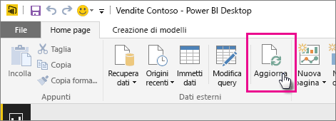
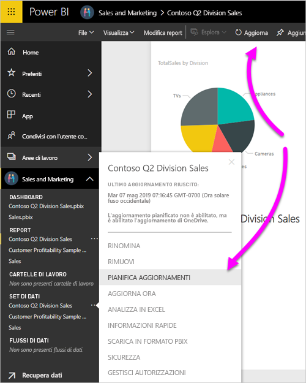
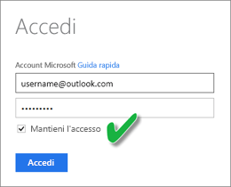

# Aggiornare un set di dati memorizzato in OneDrive o SharePoint Online
L'importazione di file da OneDrive o SharePoint Online nel servizio Power BI è un modo efficace per garantire la sincronizzazione delle operazioni in Power BI Desktop con il servizio Power BI.

## Vantaggi dell'aggiornamento di un file di Power BI Desktop in OneDrive o SharePoint Online
Quando si archivia un file di Power BI Desktop in OneDrive o SharePoint Online, i dati caricati nel modello di file vengono importati nel set di dati. I report creati nel file vengono caricati in **Report** nel servizio Power BI. Si immagini di apportare modifiche al file in OneDrive o SharePoint Online. Queste modifiche possono includere l'aggiunta di nuove misure, la modifica dei nomi di colonna o la modifica delle visualizzazioni. Dopo avere salvato il file, servizio Power BI esegue la sincronizzazione anche con tali modifiche, in genere entro circa un'ora.

È possibile eseguire un aggiornamento singolo manuale direttamente in Power BI Desktop selezionando **Aggiorna** nella scheda **Home** della barra multifunzione. Quando si seleziona **Aggiorna**, il modello di file viene aggiornato con i dati aggiornati provenienti dall'origine dati originale. Questo tipo di aggiornamento avviene interamente all'interno dell'applicazione Power BI Desktop. Si tratta di un'operazione diversa da un aggiornamento manuale o pianificato in Power BI ed è importante comprendere la differenza.

Quando si importa il file di Power BI Desktop da OneDrive o SharePoint Online, si caricano i dati e le informazioni sul modello in un set di dati in Power BI. È opportuno aggiornare il set di dati nel servizio Power BI perché è su questo che si basano i report. Dal momento che le origini dati sono esterne, è possibile aggiornare manualmente il set di dati usando **Aggiorna adesso** oppure impostare una pianificazione per l'aggiornamento usando **Pianifica aggiornamenti**. 

Quando si aggiorna il set di dati, Power BI non si connette al file in OneDrive o SharePoint Online per eseguire query per i dati aggiornati. Usa le informazioni nel set di dati per connettersi direttamente alle origini dati ed eseguire query per i dati aggiornati. I dati vengono quindi caricati nel set di dati. Questi dati aggiornati nel set di dati non vengono sincronizzati di nuovo con il file in OneDrive o SharePoint Online.

## Che cosa è supportato?
Power BI supporta le opzioni **Aggiorna** e **Pianifica aggiornamenti** per i set di dati creati da file di Power PI Desktop importati da un'unità locale in cui si usa **Recupera dati** o **Editor di query** per connettersi e caricare i dati dalle origini dati seguenti.

> [!NOTE]
> L'aggiornamento di OneDrive per i set di dati con connessione dinamica è supportato. Il cambio di un set di dati con un altro in un report già pubblicato, tuttavia, non è supportato nello scenario di aggiornamento di OneDrive.

### Power BI Gateway - Personal
* Tutte le origini dati online visualizzate in **Recupera dati** ed **Editor di query** di Power BI Desktop.
* Tutte le origini dati locali visualizzate in **Recupera dati** ed **Editor di query** di Power BI Desktop, ad eccezione di File Hadoop (HDFS) e Microsoft Exchange.

<!-- Refresh Data sources-->
[!INCLUDE [refresh-datasources](./includes/refresh-datasources.md)]

> [!NOTE]
> un gateway deve essere installato e in esecuzione per connettere Power BI alle origini dati locali e aggiornare il set di dati.
> 
> 

## OneDrive o OneDrive for Business. Qual è la differenza?
Se si hanno sia un account OneDrive personale che un account OneDrive for Business, è consigliabile conservare tutti i file da importare in Power BI in OneDrive for Business. Motivo: è probabile che verranno usati due account diversi per l'accesso.

Quando ci si connette a OneDrive for Business in Power BI, l'operazione è semplice perché l'account di Power BI corrisponde spesso a quello di OneDrive for Business. Con l'account OneDrive personale l'accesso viene solitamente eseguito con un altro [account Microsoft](https://account.microsoft.com).

Quando si accede con l'account Microsoft, assicurarsi di selezionare **Mantieni l'accesso**. Power BI può quindi sincronizzare tutti gli aggiornamenti apportati nel file in Power BI Desktop con i set di dati in Power BI.

Se le credenziali Microsoft sono state modificate, non sarà possibile sincronizzare le modifiche tra il file in OneDrive e il set di dati in Power BI. È necessario connettersi al file e importarlo di nuovo da OneDrive.

## Come si pianifica l'aggiornamento?
Quando si imposta una pianificazione per l'aggiornamento, Power BI si connette direttamente alle origini dati. Power BI usa le informazioni di connessione e le credenziali nel set di dati per eseguire query per i dati aggiornati. I dati aggiornati vengono quindi caricati nel set di dati da Power BI. Viene poi eseguito l'aggiornamento anche delle visualizzazioni dei report e dei dashboard in base al set di dati nel servizio Power BI.

Per informazioni dettagliate su come configurare l'aggiornamento pianificato, vedere [Configurare l'aggiornamento pianificato](refresh-scheduled-refresh.md).

## In caso di errore
Se si verificano problemi, sono in genere dovuti al fatto che Power BI non può accedere alle origini dati. Possono verificarsi problemi anche se il set di dati cerca di connettersi a un'origine dati locale ma il gateway è offline. Per evitare questi problemi, assicurarsi che Power BI possa accedere alle origini dati. Provare ad accedere alle origini dei dati in **Credenziali origine dati**. Talvolta la password usata per accedere a un'origine dati viene modificata oppure Power BI viene disconnesso da un'origine dati.

Quando si salvano le modifiche nel file di Power BI Desktop in OneDrive e tali modifiche non vengono riportate in Power BI entro circa un'ora, Power BI potrebbe non riuscire a connettersi a OneDrive. Riprovare a connettersi al file in OneDrive. Se viene chiesto di effettuare l'accesso, assicurarsi di selezionare **Mantieni l'accesso**. Poiché Power BI non è stato in grado di connettersi a OneDrive per la sincronizzazione con il file, è necessario importare nuovamente il file.

Assicurarsi di lasciare selezionato **Inviami il messaggio di notifica di aggiornamento non riuscito** . È opportuno sapere immediatamente se un aggiornamento pianificato non riesce.

## Risoluzione dei problemi
A volte, l'aggiornamento dei dati non funziona come previsto. In genere si verificano problemi di aggiornamento dei dati quando si è connessi con un gateway. Consultare gli articoli sulla risoluzione dei problemi del gateway per individuare gli strumenti utili e i problemi noti.

[Risoluzione dei problemi del gateway dati locale](service-gateway-onprem-tshoot.md)

[Risoluzione dei problemi di Gateway di Power BI - Personale](service-admin-troubleshooting-power-bi-personal-gateway.md)

Altre domande? Provare a chiedere alla [community di Power BI](https://community.powerbi.com/).

