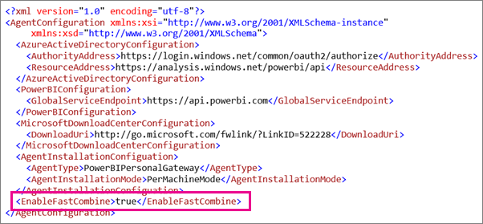

# Disabilitare l'impostazione di privacy in Gateway di Power BI - Personale
> [!NOTE]
> È disponibile una nuova versione del gateway personale per Power BI denominata **Gateway dati locale (modalità personale)**. Il seguente articolo descrive la versione precedente del gateway personale, chiamato **Power BI Gateway - Personal**, che verrà ritirato e cesserà di funzionare dopo il 31 luglio 2017. Per informazioni sulla nuova versione del gateway personale, comprese le istruzioni su come installare la nuova versione, vedere l'articolo [**Gateway dati locale (modalità personale)**](service-gateway-personal-mode.md). Combinazione rapida è disponibile anche nella nuova versione del gateway personale ed è descritta nel rispettivo articolo.
> 
> 

In base alle impostazioni di privacy per le origini dati quando vengono usate con un gateway personale, potrebbe essere visualizzato l'errore seguente.

> *Si è verificato un errore durante l'elaborazione dei dati nel set di dati.*
> 
> *[Non è possibile combinare i dati] &lt;parte della query&gt;/&lt;…&gt;/&lt;…&gt; accede a origini dati i cui livelli di privacy non possono essere usati contemporaneamente. Ricompilare la combinazione di dati.*
> 
> 

Per risolvere questo errore, è possibile attivare la **Combinazione rapida**. La **Combinazione rapida** ignora le impostazioni di privacy consentendo la combinazione di delle diverse origini dati.

> [!NOTE]
> I livelli di privacy non vengono considerati durante la combinazione dei dati. Ciò potrebbe esporre i dati sensibili o riservati a un'altra origine dati quando si combinano i dati.
> 
> 

## Che cos'è una Combinazione rapida?
Per altre informazioni sui livelli di privacy e sulla Combinazione rapida, vedere [Livelli di privacy](https://support.office.com/article/Privacy-levels-Power-Query-CC3EDE4D-359E-4B28-BC72-9BEE7900B540). Per impostazione predefinita, il livello di privacy viene impostato su privato e può causare l'errore indicato in precedenza. L'errore si verifica perché, se si imposta il livello su privato, l'origine dati verrà isolata dalle altre origini. Uno scenario di esempio del problema è rappresentato da una query con parametri che ottiene gli input da un'altra origine dati.

Se si attiva la Combinazione rapida, l'impostazione privata verrà ignorata e verrà consentita l'esecuzione.

## Attivare la Combinazione rapida
Seguire questa procedura per abilitare la Combinazione rapida per il gateway personale. Il gateway dati locale non include questa impostazione.

1. Aprire **ConnectorConfig.xml**.  Può trovarsi in uno dei due percorsi del proprio computer.  Per gli amministratori del computer sarà il seguente.
   
    <pre><code>C:\Program Files\Power BI Personal Gateway\1.0\Configurator\Connector</code></pre>
   
    Per gli utenti non amministratori, il percorso sarà il seguente.
   
    <pre><code>C:\Users\[username]\AppData\Local\Power BI Personal Gateway\1.0\Configurator\Connector</code></pre>
    
2. Aggiungere l'elemento **&lt;EnableFastCombine&gt;** con un valore True per il file config. L'aggiunta di questo elemento attiverà la **Combinazione rapida** .
   
   <pre><code>&lt;EnableFastCombine&gt;true&lt;/EnableFastCombine&gt;</code></pre>
   
   
3. Chiudere e riavviare la schermata di configurazione del gateway.
4. Viene visualizzato uno stato che informa l'utente che la Combinazione rapida è abilitata.
   
   

## Disattivare la Combinazione rapida
1. Aprire **ConnectorConfig.xml**.  Può trovarsi in uno dei due percorsi del proprio computer.  Per gli amministratori del computer sarà il seguente.
   
    <pre><code>C:\Program Files\Power BI Personal Gateway\1.0\Configurator\Connector</code></pre>
   
    Per gli utenti non amministratori, il percorso sarà il seguente.
   
    <pre><code>C:\Users\[username]\AppData\Local\Power BI Personal Gateway\1.0\Configurator\Connector</code></pre>

2. Rimuovere l'elemento **&lt;EnableFastCombine&gt;** dal file config. La rimozione di questo elemento disattiverà la **Combinazione rapida** .
3. Chiudere e riavviare la schermata di configurazione del gateway.
4. Non viene più visualizzato lo stato che informa l'utente che la **Combinazione rapida** è abilitata.

## Passaggi successivi
[On-premises data gateway (personal mode) - the new version of the personal gateway](service-gateway-personal-mode.md)
[Privacy Levels](https://support.office.com/article/Privacy-levels-Power-Query-CC3EDE4D-359E-4B28-BC72-9BEE7900B540) (Gateway dati locale (modalità personale) - Nuova versione del gateway personale - Livelli di privacy)  
[Attività di query comuni in Power BI Desktop](desktop-common-query-tasks.md)  
Altre domande? [Provare la community di Power BI](http://community.powerbi.com/)

