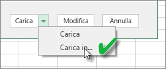
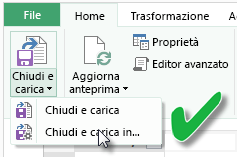
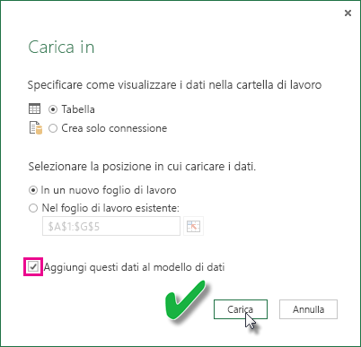

# Aggiornare un set di dati creato da una cartella di lavoro di Excel in un'unità locale
## Che cosa è supportato?
Le opzioni Aggiorna ora e Pianifica aggiornamenti in Power BI sono supportate per i set di dati creati dalle cartelle di lavoro di Excel importate da un'unità locale in cui viene usato Power Query (Recupera e trasforma in Excel 2016) o Power Pivot per connettersi a una delle origini dati seguenti e caricare i dati nel modello di dati:  

### Power BI Gateway - Personal
* Tutte le origini dati online visualizzate in Power Query.
* Tutte le origini dati locali visualizzate in Power Query, ad eccezione del file Hadoop (HDFS) e di Microsoft Exchange.
* Tutte le origini dati online visualizzate in Power Pivot.\*
* Tutte le origini dati locali visualizzate in Power Pivot, ad eccezione del file Hadoop (HDFS) e di Microsoft Exchange.

<!-- Refresh Data sources-->
[!INCLUDE [refresh-datasources](./includes/refresh-datasources.md)]

> **Note:**  
> 
> * un gateway deve essere installato e in esecuzione per connettere Power BI alle origini dati locali e aggiornare il set di dati.
> * Quando si usa Excel 2013, assicurarsi che Power Query sia aggiornato alla versione più recente.
> * L'aggiornamento non è supportato per le cartelle di lavoro di Excel importate da un'unità locale in cui i dati sono presenti solo nei fogli di lavoro e nelle tabelle collegate. L'aggiornamento è supportato per i dati del foglio di lavoro se sono stati archiviati e importati da OneDrive. Per altre informazioni, vedere [Aggiornare un set di dati creato da una cartella di lavoro di Excel in OneDrive o SharePoint Online](refresh-excel-file-onedrive.md).
> * Quando si aggiorna un set di dati creato da una cartella di lavoro di Excel importata da un'unità locale, vengono aggiornati solo i dati sottoposti a query dalle origini dati. Se si modifica la struttura del modello di dati in Excel o Power Pivot, ad esempio, se si crea una nuova misura o si modifica il nome di una colonna, le modifiche non verranno copiate nel set di dati. Se si apportano queste modifiche, è necessario caricare nuovamente o ripubblicare la cartella di lavoro. Se si prevede di modificare a intervalli regolari la struttura della cartella di lavoro e si vuole che tali modifiche vengano riportate nel set di dati in Power BI senza dover eseguire di nuovo il caricamento, si consiglia di inserire la cartella di lavoro in OneDrive. Power BI aggiorna automaticamente la struttura e i dati del foglio di lavoro dalle cartelle di lavoro archiviate e importate da OneDrive.
> 
> 

## Come si verifica il caricamento dei dati nel modello di dati di Excel?
Quando si usa Power Query (Recupera e trasforma i dati in Excel 2016) per connettersi a un'origine dati sono disponibili diverse opzioni per la posizione in cui caricare i dati. Per assicurarsi che i dati vengano caricati nel modello di dati, è necessario selezionare l'opzione **Aggiungi dati al modello di dati** nella finestra di dialogo **Carica in** .

> [!NOTE]
> Le immagini seguenti mostrano Excel 2016.
> 
> 

In **Strumento di navigazione**fare clic su **Carica in…**  
    

In alternativa, se si fa clic su **Modifica** nello Strumento di navigazione, viene aperto l'editor di query. Da qui è possibile fare clic su **Chiudi e carica in**.  
    

Quindi, in **Carica in**selezionare **Aggiungi dati al modello di dati**.  
    

### Cosa accade se si usano dati esterni in Power Pivot?
ma si tratta di un problema facilmente risolvibile. Quando si usa Power Pivot per connettersi ed eseguire query sui dati da un'origine dati online o locale, i dati vengono caricati automaticamente nel modello di dati.

## Come si pianifica l'aggiornamento?
Quando si configura una pianificazione dell'aggiornamento, Power BI si connetterà direttamente alle origini dati usando le informazioni e le credenziali di connessione nel set di dati per eseguire query per i dati aggiornati e quindi caricherà i dati aggiornati nel set di dati. Vengono aggiornate anche le visualizzazioni nei report e nei dashboard basati sul set di dati nel servizio Power BI.

Per informazioni dettagliate su come configurare l'aggiornamento pianificato, vedere [Configurare l'aggiornamento pianificato](refresh-scheduled-refresh.md).

## In caso di errore
In caso di errori, il problema in genere è dovuto al fatto che Power BI non riesce ad accedere alle origini dati oppure, se il set di dati si connette a un'origine dati locale, al fatto che il gateway è offline. Assicurarsi che Power BI possa accedere alle origini dati. Se una password usata per accedere a un'origine dati viene modificata oppure Power BI viene disconnesso da un'origine dati, provare a effettuare di nuovo l'accesso alle origini dei dati in Credenziali origine dati.

Assicurarsi di lasciare selezionato **Inviami il messaggio di notifica di aggiornamento non riuscito**. È opportuno sapere immediatamente se un aggiornamento pianificato non riesce.

>[!IMPORTANT]
>L'aggiornamento non è supportato per i feed OData a cui ci si connette e su cui vengono eseguite query da Power Pivot. Quando si usa un feed OData come origine dati, usare Power Query.

## Risoluzione dei problemi
A volte, l'aggiornamento dei dati non funziona come previsto. In genere si tratta di un problema relativo al gateway. Consultare gli articoli sulla risoluzione dei problemi del gateway per individuare gli strumenti utili e i problemi noti.

[Risoluzione dei problemi del gateway dati locale](service-gateway-onprem-tshoot.md)

[Risoluzione dei problemi di Gateway di Power BI - Personale](service-admin-troubleshooting-power-bi-personal-gateway.md)

## Passaggi successivi
Altre domande? [Provare la community di Power BI](http://community.powerbi.com/)

