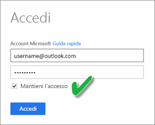
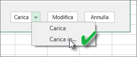
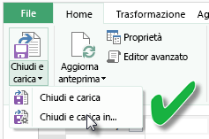
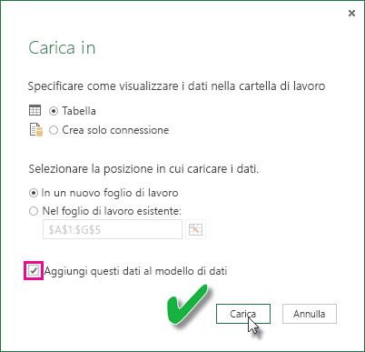

# Aggiornare un set di dati creato da una cartella di lavoro di Excel in OneDrive o SharePoint Online
È possibile importare le cartelle di lavoro di Excel archiviate nel computer locale o nella memoria cloud, ad esempio OneDrive for Business o SharePoint Online. Verranno ora esaminati i vantaggi dell'uso dell'archiviazione cloud per i file Excel. Per altre informazioni su come importare i file Excel in Power BI, vedere [Ottenere dati dai file delle cartelle di lavoro di Excel](service-excel-workbook-files.md).

## Quali sono i vantaggi?
Importare i file da OneDrive o SharePoint Online è un modo efficace per garantire la sincronizzazione delle operazioni in Excel con il servizio Power BI. I dati caricati nel modello di file vengono importati nel set di dati e i report creati nel file vengono caricati in Report in Power BI. Se si modifica il file in OneDrive o SharePoint Online, ad esempio si aggiungono nuove misure, si modificano i nomi delle colonne oppure si modificano le visualizzazioni, dopo il salvataggio le modifiche vengono aggiornate anche in Power BI, in genere entro circa un'ora.

Quando si importa una cartella di lavoro di Excel dall'account OneDrive personale, tutti i dati nella cartella di lavoro vengono importati in un nuovo set di dati in Power BI, ad esempio le tabelle nei fogli di lavoro e/o i dati caricati nel modello di dati di Excel e la struttura del modello di dati. Le visualizzazioni di Power View vengono ricreate in Report. Power BI si connette automaticamente alla cartella di lavoro in OneDrive a intervalli di circa un'ora per cercare gli aggiornamenti. Se la cartella di lavoro è stata modificata, Power BI aggiornerà il set di dati e i report nel servizio Power BI.

È possibile aggiornare il set di dati nel servizio Power BI. Quando si esegue un aggiornamento manuale o pianificato in un set di dati, Power BI si connette direttamente alle origini dati esterne per eseguire query per i dati aggiornati e quindi li carica nel set di dati. L'aggiornamento di un set di dati dall'interno di Power BI non aggiorna i dati nella cartella di lavoro in OneDrive o in SharePoint Online. 

## Che cosa è supportato?
Le opzioni Aggiorna ora e Pianifica aggiornamenti in Power BI sono supportate per i set di dati creati dai file di Power BI Desktop importati da un'unità locale in cui viene usato Recupera dati/Editor di query per connettersi e caricare i dati da una delle origini dati seguenti:  

### Power BI Gateway - Personal
* Tutte le origini dati online visualizzate in Recupera dati ed Editor di query di Power BI Desktop.
* Tutte le origini dati locali visualizzate in Recupera dati ed Editor di query di Power BI Desktop, tranne il file Hadoop (HDFS) e Microsoft Exchange.

<!-- Refresh Data sources-->
[!INCLUDE [refresh-datasources](./includes/refresh-datasources.md)]

> [!NOTE]
> un gateway deve essere installato e in esecuzione per connettere Power BI alle origini dati locali e aggiornare il set di dati.
> 
> 

## OneDrive o OneDrive for Business. Qual è la differenza?
Se si ha un account OneDrive personale e OneDrive for Business, è consigliabile mantenere tutti i file da importare in Power BI in OneDrive for Business. Motivo: è probabile che verranno usati due account diversi per l'accesso.

La connessione a OneDrive for Business in Power BI in genere non crea problemi perché l'account usato per accedere a Power BI spesso coincide con quello usato per accedere a OneDrive for Business. Invece, con l'account OneDrive personale, l'accesso viene solitamente eseguito con un altro [account Microsoft](http://www.microsoft.com/account/default.aspx).

Quando si accede con l'account Microsoft, assicurarsi di selezionare Mantieni l'accesso. Power BI può quindi sincronizzare tutti gli aggiornamenti apportati nel file di Power BI Desktop con i set di dati in Power BI  
    

Se si apportano modifiche al file in OneDrive che non possono essere sincronizzate con il set di dati o i report in Power BI perché le credenziali dell'account Microsoft sono state modificate, è necessario connettersi e importare di nuovo il file dall'account OneDrive personale.

## Opzioni per la connessione a un file di Excel
Quando ci si connette a una cartella di lavoro di Excel in OneDrive for Business o SharePoint Online sono disponibili due opzioni per trasferire il contenuto della cartella di lavoro in Power BI.

[**Importa i dati di Excel in Power BI**](service-excel-workbook-files.md#import-or-connect-to-an-excel-workbook-from-power-bi): quando si importa una cartella di lavoro di Excel da OneDrive for Business o SharePoint Online, funziona nel modo descritto sopra.

[**Connetti, gestisci e visualizza i dati di Excel in Power BI**](service-excel-workbook-files.md#one-excel-workbook--two-ways-to-use-it): quando si usa questa opzione viene creata una connessione diretta da Power BI alla cartella di lavoro in OneDrive for Business o SharePoint Online.

Quando ci si connette a una cartella di lavoro di Excel in questo modo, non viene creato alcun set di dati in Power BI. Tuttavia, la cartella di lavoro verrà visualizzata nel servizio Power BI in Report con l'icona di Excel accanto al nome. A differenza di Excel Online, quando ci si connette alla cartella di lavoro da Power BI, se la cartella di lavoro presenta connessioni a origini dati esterne che caricano i dati nel modello di dati di Excel, è possibile configurare una pianificazione dell'aggiornamento.

Quando si configura una pianificazione dell'aggiornamento in questo modo, l'unica differenza consiste nel fatto che i dati aggiornati vengono inseriti nel modello di dati della cartella di lavoro in OneDrive o SharePoint Online invece che in un set di dati in Power BI.

## Come si verifica il caricamento dei dati nel modello di dati di Excel?
Quando si usa Power Query (Recupera e trasforma i dati in Excel 2016) per connettersi a un'origine dati sono disponibili diverse opzioni per la posizione in cui caricare i dati. Per assicurarsi che i dati vengano caricati nel modello di dati, è necessario selezionare l'opzione **Aggiungi dati al modello di dati** nella finestra di dialogo **Carica in** .

> [!NOTE]
> Le immagini seguenti mostrano Excel 2016.
> 
> 

In **Strumento di navigazione**fare clic su **Carica in…**  
    

In alternativa, se si fa clic su **Modifica** nello Strumento di navigazione, viene aperto l'editor di query. Da qui è possibile fare clic su **Chiudi e carica in**.  
    

Quindi, in **Carica in**selezionare **Aggiungi dati al modello di dati**.  
    

### Cosa accade se si usano dati esterni in Power Pivot?
ma si tratta di un problema facilmente risolvibile. Quando si usa Power Pivot per connettersi ed eseguire query sui dati da un'origine dati online o locale, i dati vengono caricati automaticamente nel modello di dati.

## Come si pianifica l'aggiornamento?
Quando si configura una pianificazione dell'aggiornamento, Power BI si connetterà direttamente alle origini dati usando le informazioni e le credenziali di connessione nel set di dati per eseguire query per i dati aggiornati e quindi caricherà i dati aggiornati nel set di dati. Vengono aggiornate anche le visualizzazioni nei report e nei dashboard basati sul set di dati nel servizio Power BI.

Per informazioni dettagliate su come configurare l'aggiornamento pianificato, vedere [Configurare l'aggiornamento pianificato](refresh-scheduled-refresh.md).

## In caso di errore
In caso di errori, il problema in genere è dovuto al fatto che Power BI non riesce ad accedere alle origini dati oppure, se il set di dati si connette a un'origine dati locale, al fatto che il gateway è offline. Assicurarsi che Power BI possa accedere alle origini dati. Se una password usata per accedere a un'origine dati viene modificata oppure Power BI viene disconnesso da un'origine dati, provare a effettuare di nuovo l'accesso alle origini dei dati in Credenziali origine dati.

Assicurarsi di lasciare selezionato **Inviami il messaggio di notifica di aggiornamento non riuscito**. È opportuno sapere immediatamente se un aggiornamento pianificato non riesce.

## Note importanti
\* L'aggiornamento non è supportato per i feed OData a cui ci si connette e su cui vengono eseguite query da Power Pivot. Quando si usa un feed OData come origine dati, usare Power Query.

## Risoluzione dei problemi
A volte, l'aggiornamento dei dati non funziona come previsto. In genere si tratta di un problema relativo al gateway. Consultare gli articoli sulla risoluzione dei problemi del gateway per individuare gli strumenti utili e i problemi noti.

[Risoluzione dei problemi del gateway dati locale](service-gateway-onprem-tshoot.md)

[Risoluzione dei problemi di Gateway di Power BI - Personale](service-admin-troubleshooting-power-bi-personal-gateway.md)

Altre domande? [Provare la community di Power BI](http://community.powerbi.com/)

