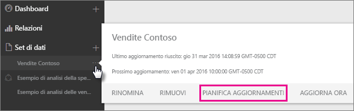
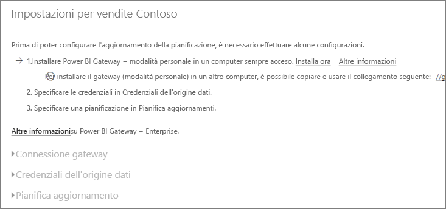
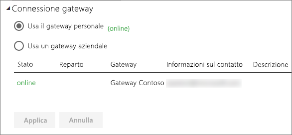
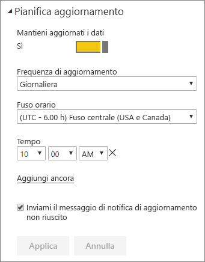

# Configurare l'aggiornamento pianificato

>[!NOTE]
>Dopo due mesi di inattività, l'aggiornamento pianificato sul set di dati viene messo in pausa. Per altre informazioni, vedere la sezione [*Aggiornamento pianificato*](#scheduled-refresh) più avanti in questo articolo.

Questo articolo descrive le opzioni disponibili per l'aggiornamento pianificato per il [gateway dati (modalità personale)](service-gateway-personal-mode.md) e per il [gateway dati locale](service-gateway-onprem.md). Le opzioni di aggiornamento vengono specificate nelle aree seguenti del servizio Power BI: **Connessione gateway**, **Credenziali origine dati** e **Pianifica aggiornamenti**, che verranno esaminate singolarmente. Per altre informazioni sull'aggiornamento dei dati, incluse le limitazioni per le pianificazioni degli aggiornamenti, vedere [Aggiornamento dei dati](refresh-data.md#data-refresh).

Per visualizzare la schermata **Pianifica aggiornamenti**:

1. Nel riquadro di spostamento, in **Set di dati** selezionare **Altre opzioni** (...) accanto a un set di dati elencato.
2. Selezionare **Pianifica aggiornamenti**.

    

## Connessione gateway

Le opzioni visualizzate variano a seconda del fatto che il gateway online e disponibile sia personale o aziendale.

Se non è disponibile alcun gateway, l'opzione **Connessione gateway** è disabilitata. Verrà anche visualizzato un messaggio che indica come installare il gateway personale.

Se è stato configurato un gateway personale, è possibile selezionarlo se è online. Se non è disponibile, risulterà offline.

Si può anche selezionare il gateway aziendale, se disponibile. Un gateway aziendale è disponibile solo il proprio account è elencato nella scheda **Utenti** dell'origine dati configurata per un determinato gateway.

## Credenziali origine dati

### Power BI Gateway - Personal

Se si usa il gateway personale per aggiornare i dati, è necessario specificare le credenziali usate per connettersi all'origine dati back-end. Se si è connessi a un pacchetto di contenuto da un servizio online, le credenziali immesse per la connessione vengono usate anche per l'aggiornamento pianificato.

L'accesso a un'origine dati viene richiesto solo al primo aggiornamento del set di dati. Una volta immesse, le credenziali vengono mantenute con il set di dati.

> [!NOTE]
> Se per alcuni metodi di autenticazione la password usata per accedere a un'origine dati scade o viene modificata, è necessario modificarla anche per l'origine dati in **Credenziali origine dati**.

In caso di errori, il problema in genere è dovuto al fatto che il gateway è offline perché non è stato in grado di accedere a Windows e avviare il servizio oppure Power BI non è stato in grado di accedere alle origini dati per eseguire una query per i dati aggiornati. Se l'aggiornamento non riesce, controllare le impostazioni del set di dati. Se il servizio gateway è offline, l'errore viene visualizzato in **Stato**. Se Power BI non può accedere alle origini dati, l'errore viene visualizzato in Credenziali origine dati.

### Gateway dati locale

Se si usa il gateway dati locale per aggiornare i dati, non è necessario specificare le credenziali poiché vengono definite per l'origine dati dall'amministratore del gateway.

> [!NOTE]
> Quando ci si connette a SharePoint locale per l'aggiornamento dei dati, Power BI supporta solo i meccanismi di autenticazione *Anonymous* (Anonimo), *Basic* (Di base) e *Windows (NTLM/Kerberos)* . Power BI non supporta *ADFS* o qualsiasi meccanismo di *autenticazione basata su form* per l'aggiornamento dei dati di origini dati di SharePoint locale.

## Aggiornamento pianificato

La sezione relativa all'**aggiornamento pianificato** viene usata per definire la frequenza e gli orari per l'aggiornamento del set di dati. Alcune origini dati non richiedono un gateway per essere configurate per l'aggiornamento, mentre altre origini dati lo richiedono.

Impostare il dispositivo di scorrimento **Mantieni aggiornati i dati** su **Sì** per configurare le impostazioni.

> [!NOTE]
> L'obiettivo è avviare l'aggiornamento entro 15 minuti dall'orario pianificato, ma può verificarsi un ritardo fino a un'ora se il servizio non è in grado di allocare prima le risorse necessarie.

> [!NOTE]
> Dopo due mesi di inattività, l'aggiornamento pianificato sul set di dati viene messo in pausa. Un set di dati viene considerato inattivo quando nessun utente ha visitato un qualsiasi dashboard o report integrato nel set di dati. A quel punto, il proprietario del set di dati viene informato tramite un messaggio di posta elettronica che l'aggiornamento pianificato è stato sospeso. La pianificazione dell'aggiornamento per il set di dati viene quindi visualizzata come **disabilitata**. Per riprendere la pianificazione dell'aggiornamento, è sufficiente accedere a un qualsiasi dashboard o report integrato nel set di dati.

## Che cosa è supportato?

Alcuni set di dati sono supportati in gateway diversi per l'aggiornamento pianificato. Ecco un riferimento per comprendere cosa è disponibile.

### Power BI Gateway - Personal

**Power BI Desktop**

* Tutte le origini dati online visualizzate in **Recupera dati** ed Editor di query di Power BI Desktop.
* Tutte le origini dati locali visualizzate in **Recupera dati** ed Editor di query di Power BI Desktop, tranne il file Hadoop (HDFS) e Microsoft Exchange.

**Excel**

* Tutte le origini dati online visualizzate in Power Query.
* Tutte le origini dati locali visualizzate in Power Query, ad eccezione del file Hadoop (HDFS) e di Microsoft Exchange.
* Tutte le origini dati online visualizzate in Power Pivot.
* Tutte le origini dati locali visualizzate in Power Pivot, ad eccezione del file Hadoop (HDFS) e di Microsoft Exchange.

> [!NOTE]
> In Excel 2016 e versioni successive Power Query è indicato nella sezione **Dati** della barra multifunzione in **Recupera e trasforma**.

### Power BI Gateway

Per informazioni sulle origini dati supportate, vedere [Origini dati supportate in Power BI](power-bi-data-sources.md).

## Risoluzione dei problemi
A volte, l'aggiornamento dei dati non funziona come previsto. In genere si tratta di un problema relativo al gateway. Consultare gli articoli sulla risoluzione dei problemi del gateway per individuare gli strumenti utili e i problemi noti.

- [Risoluzione dei problemi del gateway dati locale](service-gateway-onprem-tshoot.md)
- [Risoluzione dei problemi di Gateway di Power BI - Personale](service-admin-troubleshooting-power-bi-personal-gateway.md)

## Passaggi successivi

- [Aggiornamento dei dati in Power BI](refresh-data.md)  
- [Power BI Gateway - Personale](service-gateway-personal-mode.md)  
- [Gateway dati locale (modalità personale)](service-gateway-onprem.md)  
- [Risoluzione dei problemi del gateway dati locale](service-gateway-onprem-tshoot.md)  
- [Risoluzione dei problemi di Gateway di Power BI - Personale](service-admin-troubleshooting-power-bi-personal-gateway.md)  

Altre domande? [Provare a rivolgersi alla community di Power BI](https://community.powerbi.com/)