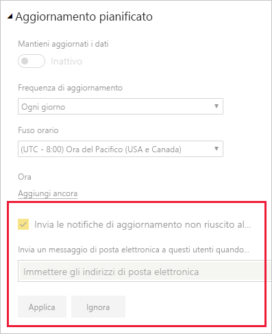

# Scenari per la risoluzione dei problemi di aggiornamento

In questo articolo è possibile trovare informazioni relative a vari scenari che si possono incontrare durante l'aggiornamento dei dati all'interno del servizio Power BI.

> [!NOTE]
> Se si verifica uno scenario diverso da quelli elencati di seguito e che causa problemi, è possibile richiedere ulteriore assistenza sul [sito della community](https://community.powerbi.com/) oppure creare un [ticket di supporto](https://powerbi.microsoft.com/support/).
>
>

## Notifiche tramite posta elettronica

Se si è arrivati a questo articolo da una notifica tramite posta elettronica e non si vogliono più ricevere messaggi di posta elettronica sui problemi di aggiornamento, contattare l'amministratore di Power BI. Chiedergli di rimuovere dai set di dati appropriati in Power BI l'indirizzo di posta elettronica o un elenco di indirizzi di posta elettronica a cui si è effettuata la sottoscrizione. Questa operazione può essere eseguita dall'area seguente nel portale di amministrazione di Power BI.

## L'aggiornamento con il connettore Web non funziona correttamente

Nel caso di uno script di connettore Web che usa la funzione [**Web.Page**](https://msdn.microsoft.com/library/mt260924.aspx), se il set di dati o il report è stato aggiornato dopo il 18 novembre 2016, è necessario usare un gateway per il corretto funzionamento dell'aggiornamento.

## Origine dati non supportata per l'aggiornamento

Quando si configura un set di dati, potrebbe verificarsi un errore che indica che il set di dati usa un'origine dati non supportata per l'aggiornamento. Per i dettagli, vedere [Risoluzione dei problemi relativi all'origine dati non supportata per l'aggiornamento](service-admin-troubleshoot-unsupported-data-source-for-refresh.md).

## Il dashboard non riflette le modifiche dopo l'aggiornamento

Attendere 10-15 minuti che l'aggiornamento venga visualizzato nei riquadri del dashboard. Se ancora non viene visualizzato, riaggiungere la visualizzazione nel dashboard.

## GatewayNotReachable durante l'impostazione delle credenziali

Si potrebbe verificare l'errore `GatewayNotReachable` quando si prova a impostare le credenziali per un'origine dati. L'errore può essere causato da un gateway non aggiornato. Installare il gateway più recente e riprovare.

## Errore di elaborazione: Si è verificato l'errore di sistema seguente: Tipo non corrispondente

Può trattarsi di un errore dello script M all'interno del file di Power BI Desktop o della cartella di lavoro di Excel. Può anche essere dovuto a una versione di Power BI Desktop non aggiornata.

## Errori di aggiornamento del riquadro

Per un elenco di errori che possono verificarsi con i riquadri del dashboard e le relative spiegazioni, vedere [Risoluzione degli errori del riquadro](refresh-troubleshooting-tile-errors.md).

## L'aggiornamento non riesce quando si aggiornano dati da origini che usano il token OAuth di AAD

Il token OAuth di Azure Active Directory (**AAD**), usato da numerose origini dati, scade dopo circa un'ora. Possono verificarsi casi in cui il caricamento dei dati richiede più tempo di quello previsto prima della scadenza dell'app (oltre un'ora), dal momento che il servizio Power BI attende fino a due ore quando si caricano i dati. In questo caso, il processo di caricamento dei dati non riesce e viene restituito un errore di credenziali.

Tra le origini dati che usano il token OAuth di AAD sono inclusi **Microsoft Dynamics CRM Online** e **SharePoint Online** (SPO). Se si esegue la connessione a tali origini dati e viene restituito un errore di credenziali quando il caricamento dei dati richiede più di un'ora, questa potrebbe essere la causa del problema.

Microsoft sta lavorando per individuare una soluzione che consenta al processo caricamento dei dati di aggiornare il token e continuare l'esecuzione. Se però l'istanza di Dynamics CRM Online o SharePoint Online (o di un'altra origine dati che usa un token OAuth di AAD) è di dimensioni tali da superare la soglia di caricamento dei dati, pari a due ore, può verificarsi anche un timeout del caricamento dati nel servizio Power BI.

Si noti anche che, per il corretto funzionamento dell'aggiornamento, quando ci si connette a un'origine dati di **SharePoint Online** tramite OAuth di AAD, è necessario usare lo stesso account usato per l'accesso al **servizio Power BI**.

## Limiti per l'aggiornamento dei dati non compressi

La dimensione massima per i set di dati importati nel **servizio Power BI** è 1 GB. Questi set di dati sono molto compressi per assicurare prestazioni elevate. Inoltre, nella capacità condivisa, questo servizio pone dei limiti alla quantità di dati non compressi che vengono elaborati durante l'aggiornamento a 10 GB. Questo limite considera la compressione ed è pertanto molto più alto di 1 GB. I set di dati in Power BI Premium non sono soggetti a questi limiti. Se l'aggiornamento nel servizio Power BI si conclude con un errore per questa ragione, ridurre la quantità di dati importati in Power BI e riprovare.

## Timeout dell'aggiornamento pianificato

Il timeout di un aggiornamento pianificato per i set di dati importati si verifica dopo due ore. Questo timeout è aumentato fino a cinque ore per i set di dati nelle aree di lavoro **Premium**. Se si raggiunge questo limite, considerare la possibilità di ridurre le dimensioni o la complessità del set di dati oppure di suddividere il set di dati in parti più piccole.

## Errori dell'aggiornamento pianificato

Se un aggiornamento pianificato non riesce quattro volte di seguito, Power BI lo disabilita. Risolvere il problema sottostante e quindi abilitare nuovamente l'aggiornamento pianificato.

## Accesso alla risorsa non consentito  

Questo errore può verificarsi perché le credenziali memorizzate nella cache sono scadute. Cancellare la cache del browser Internet accedendo a Power BI e andando a https://app.powerbi.com?alwaysPromptForContentProviderCreds=true. In questo modo viene forzato un aggiornamento delle credenziali.

## Aggiornamento dati non riuscito a causa di una modifica della password o di credenziali scadute

L'aggiornamento dei dati può non riuscire anche a causa della presenza di credenziali scadute nella cache. Cancellare la cache del browser Internet accedendo a Power BI e andando a https://app.powerbi.com?alwaysPromptForContentProviderCreds=true. In questo modo viene forzato un aggiornamento delle credenziali.

## Passaggi successivi

- [Aggiornamento dei dati in Power BI](refresh-data.md)  
- [Risoluzione dei problemi del gateway dati locale](service-gateway-onprem-tshoot.md)  
- [Risoluzione dei problemi di Gateway di Power BI - Personale](service-admin-troubleshooting-power-bi-personal-gateway.md)  

Altre domande? [Provare a rivolgersi alla community di Microsoft Power BI](https://community.powerbi.com/)

