# Creare un report impaginato basato su un set di dati condiviso di Power BI

È possibile usare un set di dati creato in Power BI Desktop come origine dati per i report impaginati di Generatore report di Power BI. Si immagini questo scenario: è stato creato un report di Power BI in Power BI Desktop. È stato dedicato molto tempo alla progettazione del modello di dati e quindi è stato creato un bellissimo report di Power BI con molti oggetti visivi interessanti. Il report include una matrice con molte righe, quindi è necessario scorrere per visualizzarle tutte. I lettori del report vogliono un report da poter stampare, in cui siano visibili tutte le righe della matrice. A tale scopo, è possibile usare un report impaginato di Power BI: stampare una tabella o una matrice che occupa più pagine, con intestazioni e piè di pagina e un layout di pagina perfetto progettato dall'utente. Questo report corrisponderà al report di Power BI Desktop. Si vuole che siano basati sugli stessi dati, senza discrepanze, quindi si usa lo stesso set di dati.

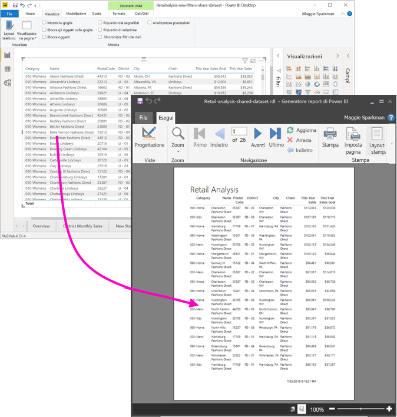

Non è necessario che il set di dati si trovi in un'area di lavoro con capacità Premium né che l'utente sia membro di tale area di lavoro. È sufficiente avere l'[autorizzazione di creazione](service-datasets-build-permissions.md) per il set di dati. Per pubblicare il report impaginato, è necessaria una licenza di Power BI Pro. È anche necessario almeno un ruolo Collaboratore per un'area di lavoro con capacità Premium.

## Elementi necessari

Ecco un elenco degli elementi necessari e non necessari per usare un set di dati condiviso in Generatore report di Power BI.

- Generatore report di Power BI. [Scaricare e installare Generatore report di Power BI](https://go.microsoft.com/fwlink/?linkid=2086513).
- Per accedere a un set di dati di Power BI, è necessaria l'autorizzazione di creazione per il set di dati. Leggere le informazioni sull'[autorizzazione di creazione](service-datasets-build-permissions.md).
- Non è necessaria una licenza di Power BI Pro per creare un report impaginato in Generatore report. 
- È necessaria una licenza di Power BI Pro per pubblicare il report impaginato. È anche necessario almeno un ruolo Collaboratore per un'area di lavoro con capacità Premium. 
- Facoltativo: per seguire questo articolo, è possibile scaricare il [file con estensione pbix dell'esempio di analisi delle vendite al dettaglio](https://download.microsoft.com/download/9/6/D/96DDC2FF-2568-491D-AAFA-AFDD6F763AE3/Retail%20Analysis%20Sample%20PBIX.pbix) di Power BI Desktop, aprirlo in Power BI Desktop e aggiungere una tabella con numerose colonne. Nel riquadro **Formato** disattivare **Totali**. Pubblicare quindi il report in un'area di lavoro nel servizio Power BI.

    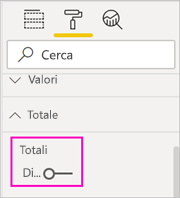

## Connettersi al set di dati di Power BI

1. Aprire Generatore report di Power BI.
1. Selezionare **Accedi** nell'angolo superiore destro di Generatore report per accedere al proprio account di Power BI.
1. Nel riquadro Dati report selezionare **Nuovo** > **Connessione al set di dati di Power BI**.

    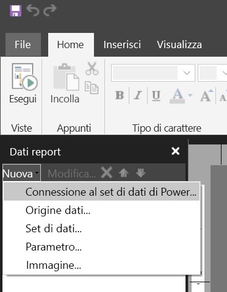

    > [!NOTE]
    > Non è possibile creare l'origine dati o il set di dati per un set di dati di Power BI usando le procedure guidate di creazione di una tabella, una matrice o un grafico di Generatore report. Dopo la creazione, è possibile usare le procedure guidate per creare tabelle, matrici o grafici basati su di essi.

1. Cercare il set di dati o l'area di lavoro in cui si trova > **Seleziona**.
    Generatore report inserisce il nome del set di dati.

    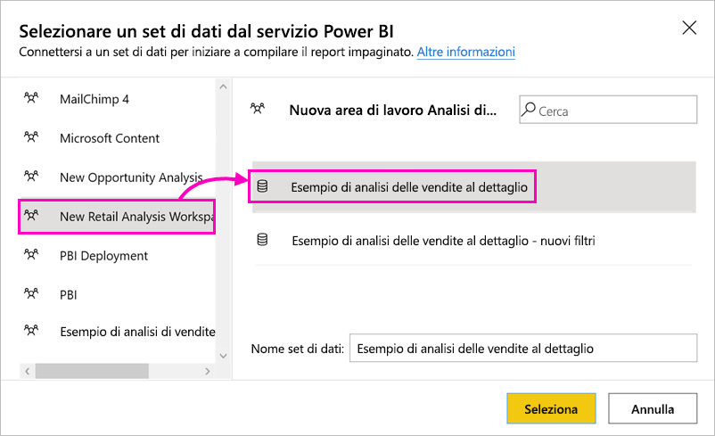
    
1. Il set di dati è elencato in Origini dati nel riquadro Dati report.

    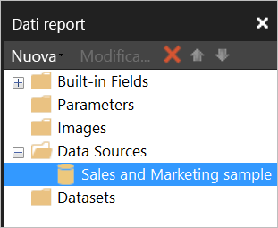

    Tenere presente che è possibile connettersi a più set di dati di Power BI e ad altre origini dati nello stesso report impaginato.

## Ottenere la query per il set di dati

Quando si vuole che i dati nel report di Power BI e nel report di Generatore report corrispondano, non è sufficiente connettersi al set di dati. È necessaria anche la query basata su tale set di dati.

1. Aprire il report di Power BI (con estensione pbix) in Power BI Desktop.
1. Assicurarsi che nel report sia presente una tabella contenente tutti i dati che devono essere presenti nel report impaginato.

1. Nella scheda **Visualizza** della barra multifunzione selezionare **Analizzatore prestazioni**.

    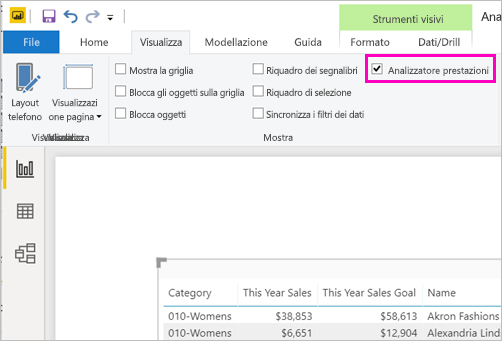

1. Nel riquadro **Analizzatore prestazioni** selezionare **Avvia registrazione** e quindi **Aggiorna gli oggetti visivi**.

    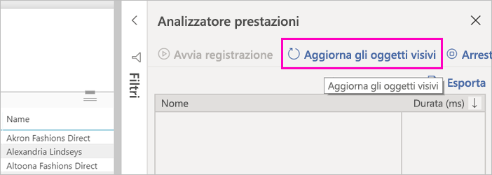

1. Espandere il segno più ( **+** ) accanto al nome della tabella e selezionare **Copia la query**. La query è la formula DAX necessaria per il set di dati in Generatore report di Power BI.

    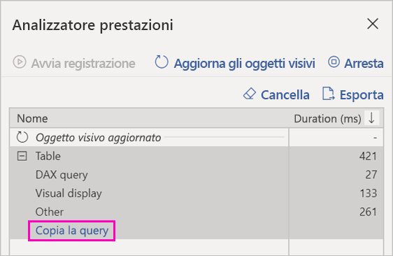

## Creare il set di dati con la query

1. Tornare a Generatore report di Power BI.
1. Fare clic con il pulsante destro del mouse sul set di dati in **Origini dati** e scegliere **Aggiungi set di dati**.

    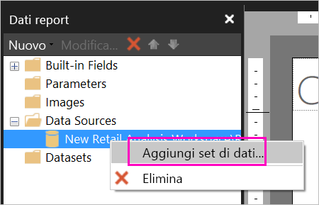

1. Nella finestra Proprietà set di dati specificare un nome e selezionare **Progettazione query**.

4. Verificare che sia selezionata l'opzione **DAX** e deselezionare l'icona **Modalità progettazione**.

    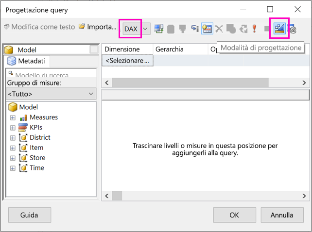

1. Nella casella superiore incollare la query copiata da Power BI Desktop.

1. Selezionare **Esegui query** (il punto esclamativo rosso, !) per assicurarsi che la query funzioni. 

    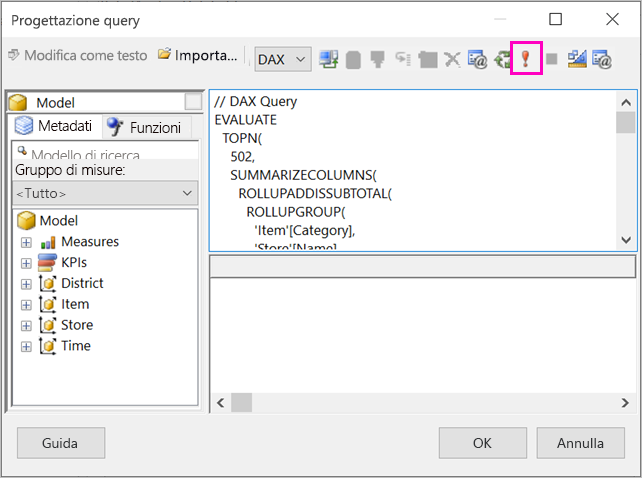

    I risultati della query verranno visualizzati nella casella inferiore.

    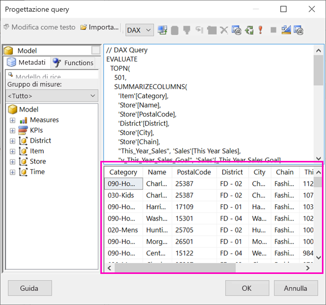

1. Seleziona **OK**.

    La query verrà visualizzata nella sezione **Query** della finestra di dialogo **Proprietà set di dati**.

    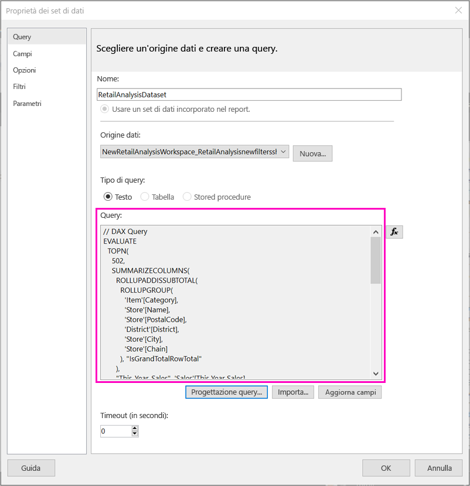

1. Seleziona **OK**.

    A questo punto è possibile visualizzare il nuovo set di dati con un elenco dei relativi campi nel riquadro Dati report.

    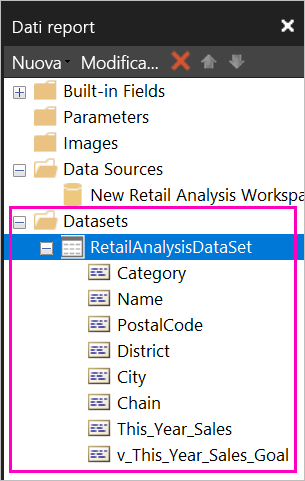

## Creare una tabella nel report

Un modo rapido per creare una tabella consiste nell'usare la Creazione guidata tabella.

1. Nella scheda **Inserisci** della barra multifunzione selezionare **Tabella** > **Creazione guidata tabella**.

    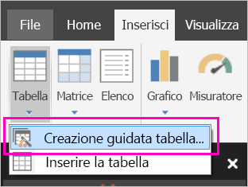

1. Scegliere il set di dati creato con la query DAX > **Avanti**.

    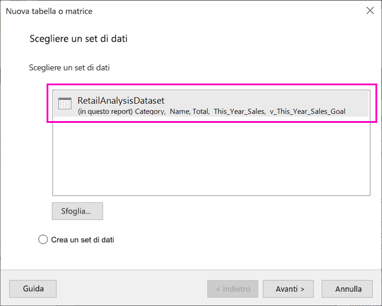

1. Per creare una tabella flat, selezionare i campi desiderati in **Campi disponibili**. È possibile selezionare più campi contemporaneamente selezionando il primo campo desiderato, tenendo premuto MAIUSC e selezionando l'ultimo.

    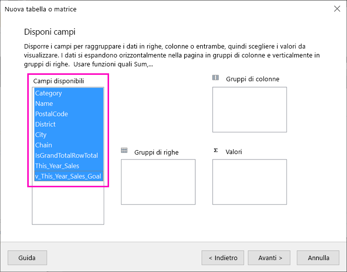

1. Trascinare i campi nella casella **Valori** > **Avanti**.

    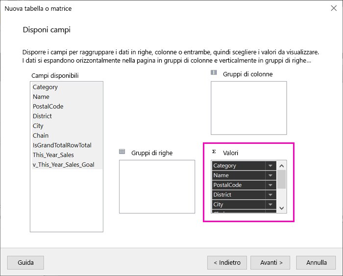

1. Scegliere le opzioni di layout desiderate > **Avanti**.

1. Fare clic su **Fine**.
    La tabella verrà aperta in visualizzazione Progettazione.

    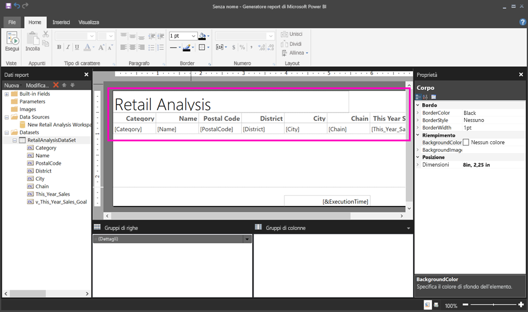

1. Selezionare **Fare clic per aggiungere il titolo** e aggiungere un titolo.

1. Selezionare **Esegui** per visualizzare in anteprima il report.

    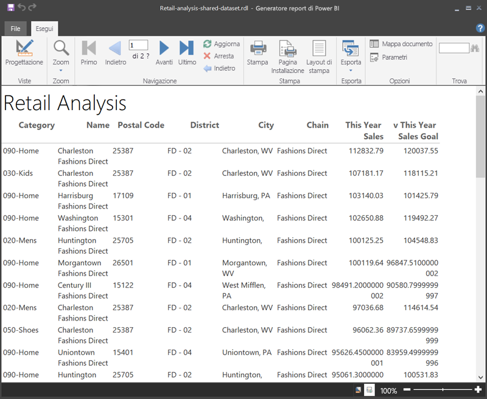

1. Selezionare **Layout di stampa** per vedere l'aspetto del report quando verrà stampato. 

    Il layout del report richiede alcune modifiche. Ha 54 pagine, perché le colonne e i margini fanno sì che la tabella occupi la larghezza di due pagine.

    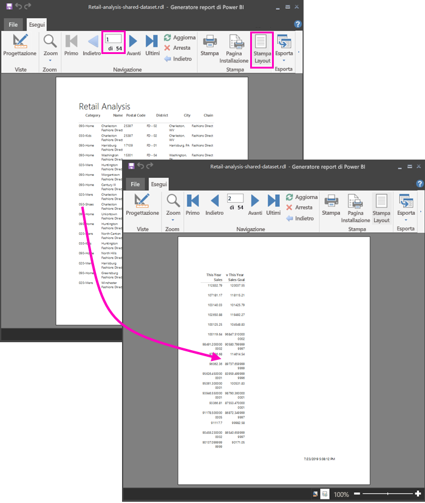

## Formattare il report

Sono disponibili diverse opzioni di formattazione per fare in modo che la tabella occupi una sola pagina. 

1. È possibile ridurre i margini di pagina nel riquadro Proprietà. Se il riquadro Proprietà non è visualizzato, fare clic sulla scheda **Visualizza** della barra multifunzione e selezionare la casella **Proprietà**.

1. Selezionare il report, non la tabella o il titolo.
1. Nel riquadro **Proprietà report**, in **Pagina** espandere **Margini** e modificare ogni margine impostandolo su **2 cm**.

    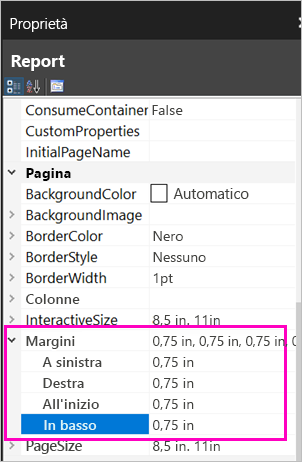

1. È anche possibile impostare una larghezza inferiore per le colonne. Selezionare il bordo della colonna e trascinare il lato destro verso sinistra.

    

1. Un'altra opzione consiste nel verificare che i valori numerici siano formattati correttamente. Selezionare una cella con un valore numerico. 
    > [!TIP]
    > È possibile formattare più celle contemporaneamente tenendo premuto MAIUSC mentre si selezionano le altre celle.

    

1. Nella scheda **Home** della barra multifunzione, nella sezione **Numero** modificare il formato **Predefinito** in un formato numerico, ad esempio **Valuta**.

    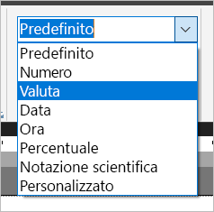

1. Modificare lo stile di **Segnaposto** in **Valori di esempio** per poter vedere la formattazione nella cella. 

    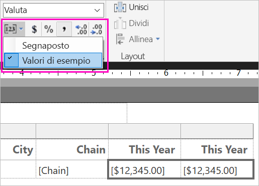

1. Se appropriato, nella sezione **Numero** diminuire i numeri decimali per risparmiare spazio.

### Eliminazione delle pagine vuote

Anche dopo aver impostato una larghezza inferiore per i margini e le colonne della tabella, è possibile che una pagina ogni due sia vuota. Questo problema dipende da una questione matematica. 

I margini di pagina impostati sommati alla larghezza del *corpo* del report devono dare un risultato inferiore alla larghezza del formato del report.

Si immagini, ad esempio, che il formato del report sia 21 x 28 cm e che siano stati impostati margini laterali di 2 cm. La somma dei due margini fa 4 cm, quindi il corpo deve avere una larghezza inferiore a 17 cm.

1. Selezionare il bordo destro dell'area di progettazione del report e trascinarlo in modo che sia inferiore al valore desiderato sul righello. 

    > [!TIP]
    > È possibile impostare il valore in modo più accurato nelle proprietà di **Corpo**. In **Dimensioni** impostare la proprietà **Larghezza**.

    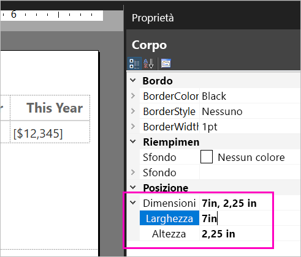

1. Selezionare **Esegui** per visualizzare l'anteprima del report e assicurarsi di avere eliminato le pagine vuote. Il report ora ha solo 26 pagine invece delle 54 originali. Operazione riuscita.

    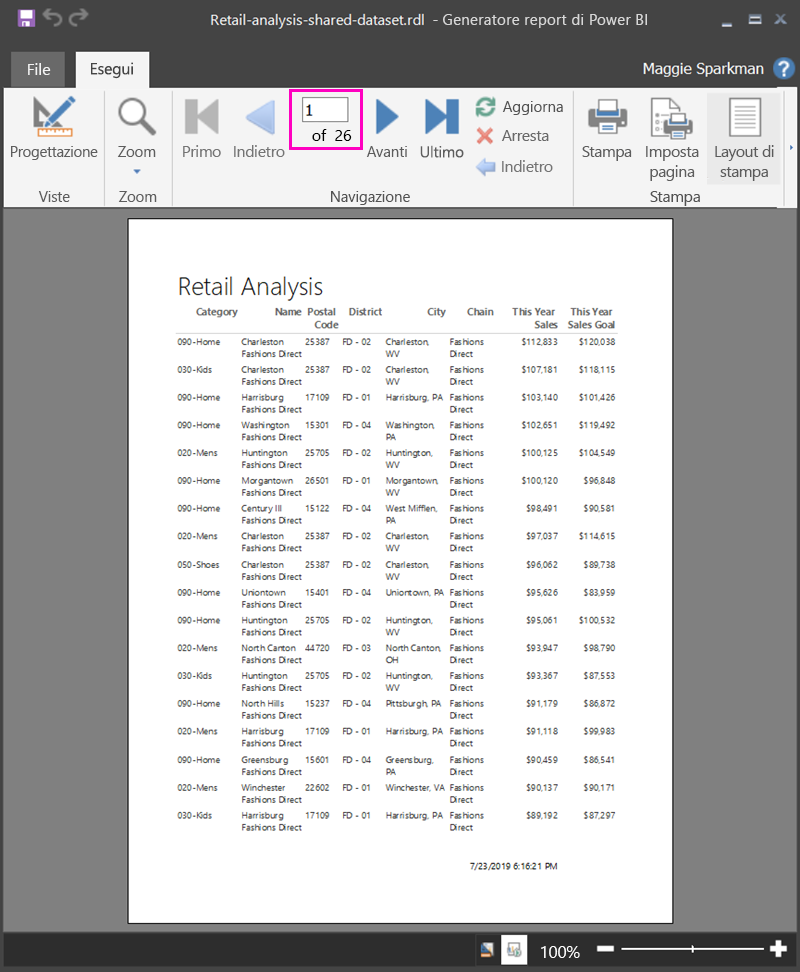

## Limitazioni e considerazioni 

- Per i set di dati che usano una connessione dinamica ad Analysis Services, è possibile connettersi direttamente usando la connessione di Analysis Services sottostante invece di un set di dati condiviso.
- I set di dati con l'indicazione Innalzato o Certificato vengono visualizzati nell'elenco di set di dati disponibili, ma non contrassegnati come tali. 

## Passaggi successivi

- [Che cosa sono i report impaginati in Power BI Premium?](paginated-reports-report-builder-power-bi.md)