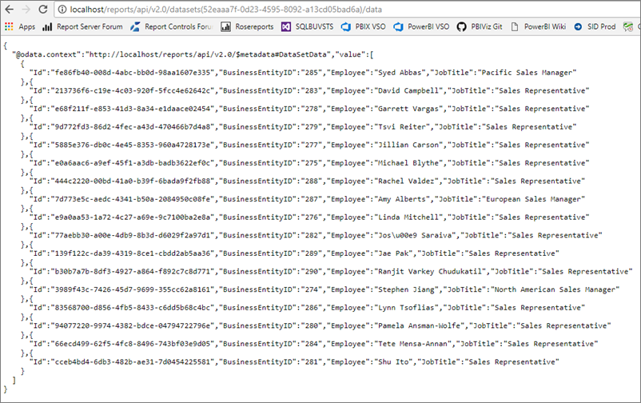
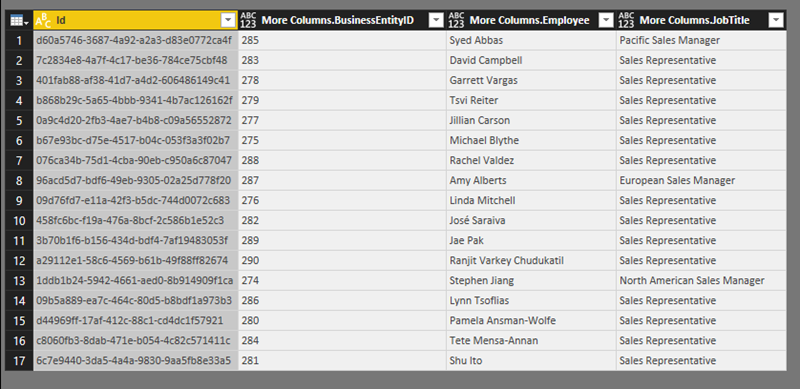
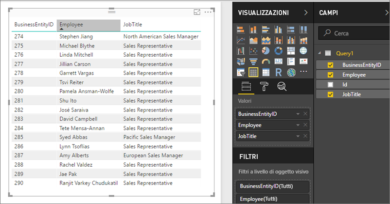

# Accesso ai set di dati condivisi come feed OData nel server di report di Power BI
È possibile accedere ai set di dati condivisi da Power BI Desktop con un feed OData.

1. L'URL del feed OData consente di connettersi all'origine OData.
   
    
2. Dopo avere spostato i dati in Power BI Desktop, è possibile modificarli nell'Editor di query.
   
    
3. È ora possibile usare i dati per la progettazione dei report.
   
    

Assicurarsi di usare le **Opzioni avanzate**, in modo da potere attivare le colonne di tipo aperto e formattare le colonne di conseguenza in Power Query in base alle esigenze specifiche.

Altre informazioni sulla [connessione ai feed OData in Power BI Desktop](../desktop-connect-odata.md).

Altre domande? [Provare a rivolgersi alla community di Power BI](https://community.powerbi.com/)

