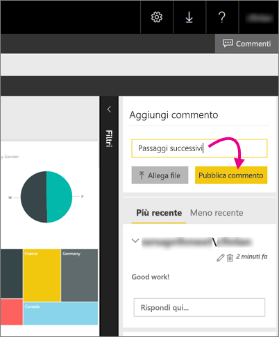

# Aggiungere commenti a un report in un server di report - Server di report di Power BI
È possibile aggiungere commenti ai report, anche ai report di Power BI, all'interno del portale Web di un server di report. I commenti sono in tempo reale nel report; tutti gli utenti con le appropriate autorizzazioni possono visualizzare i commenti per il report. Per informazioni dettagliate, vedere più avanti la sezione [Autorizzazioni](#permissions).

## Aggiungere o visualizzare i commenti
1. Aprire un report impaginato o di Power BI in un server di report.
2. Selezionare **Commenti** nell'angolo in alto a destra.
   
    
   
    Nel riquadro Commenti è possibile visualizzare i commenti esistenti.
3. Scrivere un commento, quindi selezionare **Pubblica commento**.
   
    
   
    Il commento viene mostrato nel riquadro sul portale Web, insieme a eventuali commenti precedenti, che non vengono visualizzati con il report nelle app per dispositivi mobili di Power BI.
   
   > [!TIP]
   > Non tutti lo sanno, ma è possibile [annotare i report di Power BI nell'app di Power BI per dispositivi mobili](../consumer/mobile/mobile-annotate-and-share-a-tile-from-the-mobile-apps.md) e condividere i report annotati con altri utenti.
   > 
   > 

## applicazione
A seconda delle autorizzazioni, è possibile:

* Non visualizzare i commenti.
* Vedere tutti i commenti, pubblicare, modificare ed eliminare i propri commenti.
* Vedere tutti i commenti; pubblicare, modificare ed eliminare i propri commenti, nonché eliminazione i commenti di altri utenti.

## Passaggi successivi
* [Che cos'è Server di report di Power BI?](get-started.md)  

Altre domande? [Provare a rivolgersi alla community di Power BI](https://community.powerbi.com/)

