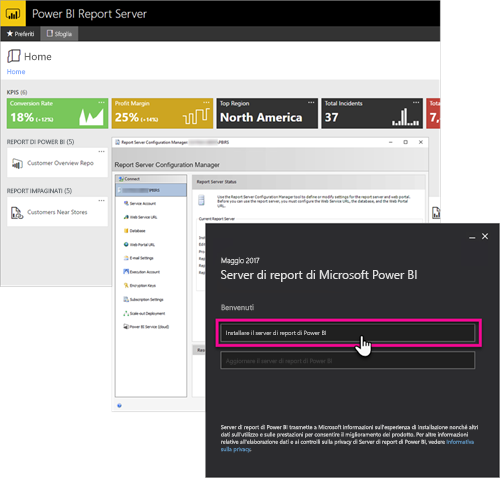

# Panoramica sull'amministrazione, Server di report di Power BI
Questo articolo è una panoramica sull'amministrazione del server di report di Power BI, un percorso locale per l'archiviazione e la gestione di report impaginati, per dispositivi mobili e di Power BI. Questo articolo introduce i concetti di pianificazione, distribuzione e gestione di Server di report di Power BI, con collegamenti ad altre informazioni.

## Installazione e migrazione
È necessario installare il server di report di Power BI per iniziare a usarlo. Sono disponibili articoli che descrivono come gestire questa attività.

Prima di iniziare a installare, aggiornare o eseguire la migrazione al server di report di Power BI, esaminiamo i [requisiti di sistema](system-requirements.md) per il server di report.

### Installazione
Se si distribuisce una nuova istanza di Server di report di Power BI, consultare il documento seguente per informazioni. 

[Installare il server di report di Power BI](install-report-server.md)

### Migrazione
Non è disponibile l'aggiornamento sul posto per SQL Server Reporting Services. Se si vuole trasformare un'istanza di SQL Server Reporting Services esistente in un server di report di Power BI, è necessario eseguire la migrazione. Esistono anche altri motivi per cui si potrebbe voler eseguire una migrazione. Rivedere il documento di migrazione per altri dettagli.

[Eseguire l'installazione di un server di report](migrate-report-server.md)

## Configurazione del server di report
Per la configurazione del server di report sono disponibili molte opzioni. Si userà SSL? Si sta configurando un server di posta elettronica? Si vuole eseguire l'integrazione con il servizio Power BI per aggiungere visualizzazioni?

La maggior parte della configurazione verrà eseguita all'interno di Report Server Configuration Manager. Per informazioni più dettagliate, vedere la [gestione di configurazione](https://docs.microsoft.com/sql/reporting-services/install-windows/reporting-services-configuration-manager-native-mode).

## Sicurezza
Sicurezza e protezione sono importanti per ogni organizzazione. La documentazione sulla [sicurezza](https://docs.microsoft.com/sql/reporting-services/security/reporting-services-security-and-protection) contiene informazioni importanti su autenticazione, autorizzazione, ruoli e permessi.

## Passaggi successivi
[Installare il server di report di Power BI](install-report-server.md)  
[Trovare il codice Product Key del server di report](find-product-key.md)  
[Installare Power BI Desktop ottimizzato per il server di report di Power BI](install-powerbi-desktop.md)  
[Scaricare Generatore report](https://www.microsoft.com/download/details.aspx?id=53613)  
[Scaricare SQL Server Data Tools (SSDT)](http://go.microsoft.com/fwlink/?LinkID=616714)

Altre domande? [Provare a rivolgersi alla community di Power BI](https://community.powerbi.com/)

