# <a name="configure-power-bi-report-server-with-azure-application-proxy"></a>Configurare Server di report di Power BI con Azure Application Proxy

Questo articolo illustra come usare Azure Active Directory Application Proxy per connettersi a Server di report di Power BI e a SQL Server Reporting Services (SSRS) 2016 e versioni successive. Grazie a questa integrazione, gli utenti che si trovano all'esterno della rete aziendale possono accedere ai report personali di Server di report di Power BI e Reporting Services dai browser client usufruendo della protezione di Azure Active Directory (AD). Continuare a leggere per altre informazioni sull'accesso remoto ad applicazioni locali tramite [Azure Active Directory Application Proxy](https://docs.microsoft.com/azure/active-directory/manage-apps/application-proxy).

## <a name="environment-details"></a>Dettagli dell'ambiente

Nell'esempio creato sono stati usati i valori seguenti. 

- Dominio: umacontoso.com
- Server di report di Power BI: PBIRSAZUREAPP.umacontoso.com
- Origine dati di SQL Server: SQLSERVERAZURE.umacontoso.com

## <a name="configure-power-bi-report-server"></a>Configurare il server di report di Power BI

Dopo aver installato Server di report di Power BI presumibilmente in una macchina virtuale di Azure, configurare gli URL del servizio Web e del portale Web di Server di report di Power BI attenendosi alla procedura seguente:

1. Creare regole in ingresso e in uscita nel firewall della macchina virtuale per la porta 80 (porta 443 se sono stati configurati URL HTTPS). Creare anche regole in ingresso e in uscita per la macchina virtuale di Azure dal portale di Azure per il protocollo TCP - porta 80.
2. Il nome DNS configurato per la macchina virtuale nell'ambiente è `pbirsazureapp.eastus.cloudapp.azure.com`.
3. Configurare l'URL del servizio Web esterno e del portale Web di Server di report di Power BI selezionando la scheda **Avanzate** > **pulsante Aggiungi** > scegliere **Nome intestazione host** e aggiungere il nome host (nome DNS), come illustrato qui.

    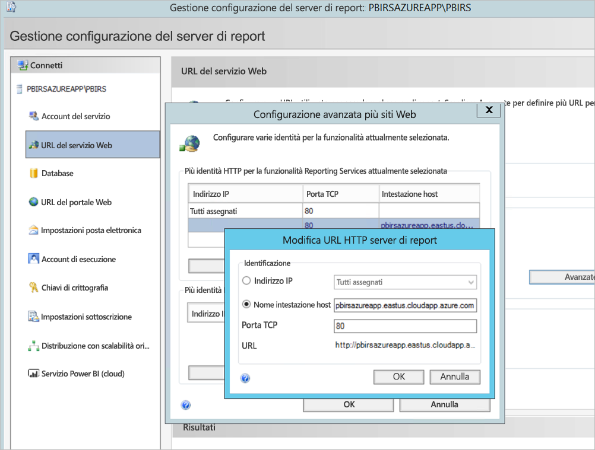

1. Il passaggio precedente è stato eseguito sia per la sezione del servizio Web sia per la sezione del portale Web e gli URL sono stati registrati in Gestione configurazione del server di report:

    - `https://pbirsazureapp.eastus.cloudapp.azure.com/ReportServer`
    - `https://pbirsazureapp.eastus.cloudapp.azure.com/Reports`

2. Nel portale di Azure vengono visualizzati due indirizzi IP per la macchina virtuale nella sezione relativa alla rete 

    - **IP pubblico**. 
    - **IP privato**. 
    
    L'indirizzo IP pubblico viene usato per accedere dall'esterno della macchina virtuale.

3. È stata quindi aggiunta la voce del file host nella macchina virtuale (Server di report di Power BI) per includere l'indirizzo IP pubblico e il nome host `pbirsazureapp.eastus.cloudapp.azure.com`.
4. Si noti che al riavvio della macchina virtuale, l'indirizzo IP dinamico potrebbe cambiare e potrebbe essere necessario aggiungere di nuovo l'indirizzo IP corretto nel file host. Per evitare questo problema, è possibile impostare l'indirizzo IP pubblico su statico nel portale di Azure.
5. Dopo aver apportato le modifiche indicate in precedenza, dovrebbero essere possibile accedere agli URL del servizio Web e del portale Web.
6. Quando si accede all'URL `https://pbirsazureapp.eastus.cloudapp.azure.com/ReportServer` nel server, vengono richieste tre volte le credenziali e viene visualizzata una schermata vuota.
7. Aggiungere la voce del Registro di sistema seguente:

    Chiave del Registro di sistema `HKEY\_LOCAL\_MACHINE \SYSTEM\CurrentControlset\Control \Lsa\ MSV1\_0`

1. Aggiungere un nuovo valore `BackConnectionHostNames`, un valore multistringa e specificare il nome host `pbirsazureapp.eastus.cloudapp.azure.com`.

A questo punto è possibile accedere anche agli URL nel server.

## <a name="configure-power-bi-report-server-to-work-with-kerberos"></a>Configurare Server di report di Power BI per usare Kerberos

### <a name="1-configure-the-authentication-type"></a>1. Configurare il tipo di autenticazione

Per autorizzare la delega vincolata di Kerberos è necessario configurare il tipo di autenticazione del server di report Questa configurazione viene eseguita nel file **rsreportserver.config**.

Nel file rsreportserver.config, cercare la sezione **Authentication/AuthenticationTypes**.

Assicurarsi che RSWindowsNegotiate sia elencato per primo nell'elenco dei tipi di autenticazione. L'URL dovrebbe essere simile a quello indicato di seguito.

```
<AuthenticationTypes>

    <RSWindowsNegotiate/>

</AuthenticationTypes>
```

Se il file di configurazione deve essere modificato, **arrestare e riavviare il servizio del server di report** da Gestione configurazione del server di report per assicurarsi che le modifiche abbiano effetto.

### <a name="2-register-service-principal-names-spns"></a>2. Registrare i nomi delle entità servizio (SPN)

Aprire il prompt dei comandi come amministratore ed eseguire i passaggi seguenti.

Registrare i nomi delle entità servizio seguenti nell'**account del servizio Server di report di Power BI** usando i comandi seguenti

```
setspn -s http/ Netbios name\_of\_Power BI Report Server\_server<space> Power BI Report Server\_ServiceAccount

setspn -s http/ FQDN\_of Power BI Report Server\_server<space> Power BI Report Server\_ServiceAccount
```

Registrare i nomi delle entità servizio seguenti nell'account del servizio SQL Server usando i comandi seguenti per un'istanza predefinita di SQL Server:

```
setspn -s MSSQLSVC/FQDN\_of\_SQL\_Server: 1433 (PortNumber) <SQL service service account>

setspn -s MSSQLSVC/FQDN\_of\_SQL\_Server<SQL service service account>
```

### <a name="3-configure-delegation-settings"></a>3. Configurare le impostazioni di delega

Configurare le impostazioni di delega nell'account del servizio del server di report.

1. Aprire Utenti e computer di Active Directory.
2. Aprire le proprietà dell'account del servizio del server di report all'interno di Utenti e computer di Active Directory.
3. Si vuole configurare la delega vincolata con protocollo in transito. Con la delega vincolata, è necessario dichiarare esplicitamente a quali servizi si vuole delegare.
4. Fare clic con il pulsante destro del mouse sull'**account del servizio del server di report** e selezionare **Proprietà**.
5. Selezionare la scheda **Delega**.
6. Selezionare **Computer attendibile per la delega solo ai servizi specificati**.
7. Selezionare **Utilizza un qualsiasi protocollo di autenticazione**.
8. In **Servizi ai quali l'account può presentare credenziali delegate:** selezionare **Aggiungi**.
9. Nella nuova finestra di dialogo selezionare **Utenti o computer**.
10. Immettere l'**account del servizio per il servizio SQL Server**e selezionare**OK**.

    Inizia con MSSQLSVC.

1. Aggiungere i nomi dell'entità servizio.
2. Selezionare **OK**. A questo punto verrà visualizzato il nome SPN nell'elenco.

Questi passaggi consentono di configurare Server di report di Power BI per usare il meccanismo di autenticazione Kerberos e ottenere la connessione di test all'origine dati presente nel computer locale.

## <a name="configure-azure-application-proxy-connector"></a>Configurare il connettore di Azure Application Proxy

Vedere l'articolo relativo alla [configurazione del connettore di Application Proxy](https://docs.microsoft.com/azure/active-directory/manage-apps/application-proxy-add-on-premises-application#add-an-on-premises-app-to-azure-ad)

Il connettore di Application Proxy è stato installato in Server di report di Power BI, ma è comunque possibile configurarlo in un server separato e assicurarsi che la delega sia configurata correttamente.

### <a name="ensure-the-connector-is-trusted-for-delegation"></a>Verificare che il connettore sia attendibile per la delega

Assicurarsi che il connettore sia attendibile per la delega al nome dell'entità servizio aggiunto all'account del pool di applicazioni del server di report.

Configurare la delega vincolata Kerberos in modo che il servizio Azure AD Application Proxy possa delegare le identità utente all'account del pool di applicazioni del server di report. A questo scopo, consentire al connettore proxy di applicazione di recuperare i ticket Kerberos per gli utenti autenticati in Azure AD. Il server passa quindi il contesto all'applicazione di destinazione o, in questo caso, a Server di report di Power BI.

Per configurare la delega vincolata Kerberos, ripetere i passaggi seguenti per ogni computer del connettore.

1. Eseguire l'accesso come amministratore di dominio a un controller di dominio, quindi aprire **Utenti e computer di Active Directory**.
2. Trovare il computer in cui è in esecuzione il connettore.
3. Fare doppio clic sul computer, quindi selezionare la scheda **Delega**.
4. Impostare la delega su **Computer attendibile per la delega solo ai servizi specificati**. Selezionare quindi **Usa un qualsiasi protocollo di autenticazione**.
5. Selezionare **Aggiungi**, poi **Utenti e computer**.
6. Immettere l'account del servizio che si sta usando per Server di report di Power BI. Si tratta dell'account a cui è stato aggiunto il nome dell'entità servizio durante la configurazione del server di report.
7. Fare clic su **OK**. 
8. Fare nuovamente clic su **OK** per salvare le modifiche.

## <a name="publish-through-azure-ad-application-proxy"></a>Pubblicare tramite Azure AD Application Proxy

A questo punto è possibile configurare Azure AD Application Proxy.

Usare le impostazioni seguenti per pubblicare Server di report di Power BI tramite Application Proxy. Per istruzioni dettagliate su come pubblicare un'applicazione tramite Application Proxy, vedere [Pubblicazione di applicazioni con Azure AD Application Proxy](https://docs.microsoft.com/azure/active-directory/manage-apps/application-proxy-add-on-premises-application#add-an-on-premises-app-to-azure-ad).

- **URL interno**: immettere l'URL del server di report che il connettore può raggiungere nella rete aziendale. Verificare che l'URL sia raggiungibile dal server in cui è installato il connettore. È consigliabile usare un dominio di primo livello, ad esempio `https://servername/`, per evitare problemi con i sottopercorsi pubblicati tramite Application Proxy. Usare ad esempio `https://servername/` anziché `https://servername/reports/` o `https://servername/reportserver/`. L'ambiente è stato configurato con `https://pbirsazureapp.eastus.cloudapp.azure.com/`.

    > [!NOTE]
    > È consigliabile usare una connessione HTTPS protetta al server di report. Per altre informazioni, vedere [Configurare connessioni SSL in un server di report in modalità nativa](https://docs.microsoft.com/sql/reporting-services/security/configure-ssl-connections-on-a-native-mode-report-server?view=sql-server-2017).

- **URL esterno**: immettere l'URL pubblico a cui si connetterà l'app Power BI per dispositivi mobili. Se ad esempio si usa un dominio personalizzato, potrebbe essere simile a `https://reports.contoso.com`. Per usare un dominio personalizzato, caricare un certificato per il dominio e scegliere un record DNS per il dominio msappproxy.net predefinito per l'applicazione. Per informazioni dettagliate sui passaggi da eseguire, vedere [Uso di domini personalizzati in Azure AD Application Proxy](https://docs.microsoft.com/azure/active-directory/manage-apps/application-proxy-configure-custom-domain).

L'URL esterno configurato per l'ambiente è `https://pbirsazureapp-umacontoso2410.msappproxy.net/`.

- **Metodo di autenticazione preliminare**: Azure Active Directory.
- **Gruppo di connettori**: Valore predefinito.

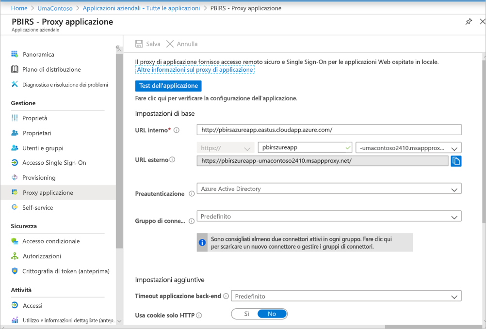

Nella sezione **Impostazioni aggiuntive** non sono state apportate modifiche. È configurato per funzionare con le opzioni predefinite:


### <a name="configure-single-sign-on"></a>Configura accesso Single Sign-On

Dopo la pubblicazione dell'app, configurare le impostazioni Single Sign-On eseguendo le operazioni seguenti:

1. Nella pagina dell'applicazione nel portale selezionare **Single Sign-On**.
2. Per **Modalità Single Sign-On**, selezionare **Autenticazione integrata di Windows**.
3. Impostare **Nome dell'entità servizio dell'applicazione interna** sul valore impostato in precedenza, Usare i passaggi seguenti per identificare questo valore:

    - Provare a eseguire un report o una connessione di test all'origine dati in modo da creare un ticket Kerberos.
    - Dopo aver eseguito il report o la connessione di test, aprire il prompt dei comandi ed eseguire il comando: `klist`. Nella sezione dei risultati verrà visualizzato un ticket con il nome dell'entità servizio `http/`. Se è uguale al nome dell'entità servizio configurato con Server di report di Power BI, usare tale nome SPN in questa sezione.

1. Scegliere l'**identità di accesso delegato** che il connettore userà per conto degli utenti. Per altre informazioni, vedere [Uso dell'accesso Single Sign-On quando le identità cloud e locali non sono identiche](https://docs.microsoft.com/azure/active-directory/manage-apps/application-proxy-configure-single-sign-on-with-kcd#working-with-different-on-premises-and-cloud-identities).

    È consigliabile usare il nome dell'entità utente. Nell'esempio è stato configurato per usare l'opzione **Nome entità utente**:

    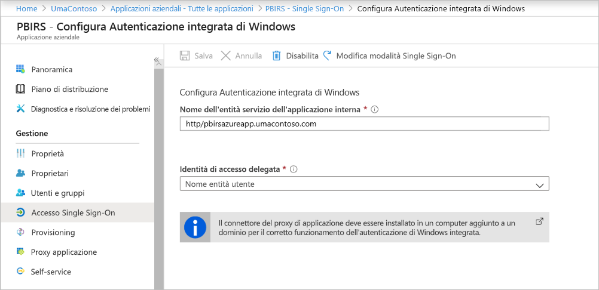

1. Fare clic su **Salva** per salvare le modifiche.

### <a name="finish-setting-up-your-application"></a>Completare la configurazione dell'applicazione

Per completare la configurazione dell'applicazione, passare alla sezione **Utenti e gruppi** e specificare gli utenti autorizzati ad accedere all'applicazione.

1. Configurare la sezione **Autenticazione** della registrazione dell'app per l'applicazione Server di report di Power BI come indicato di seguito per **URL di reindirizzamento** e **Impostazioni avanzate**:

    - Creare un nuovo URL di reindirizzamento e configurarlo con **Tipo** = **Web** e **URL di reindirizzamento** = `https://pbirsazureapp-umacontoso2410.msappproxy.net/`
    - Nella sezione **Impostazioni avanzate** impostare **URL di disconnessione** su `https://pbirsazureapp-umacontoso2410.msappproxy.net/?Appproxy=logout`

    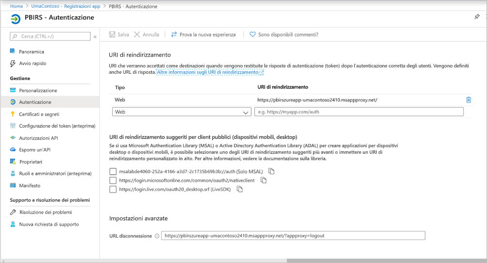

1. Continuare la configurazione della sezione **Autenticazione** della registrazione dell'app per l'applicazione Server di report di Power BI come indicato di seguito per **Concessione implicita**, **Tipo di client predefinito** e **Tipi di account supportati**:

    - Impostare **Concessione implicita** su **Token ID**.
    - Impostare **Tipo di client predefinito** su **No**.
    - Impostare **Tipi di account supportati** su **Account solo in questa directory dell'organizzazione (solo UmaContoso - Tenant singolo)** .

    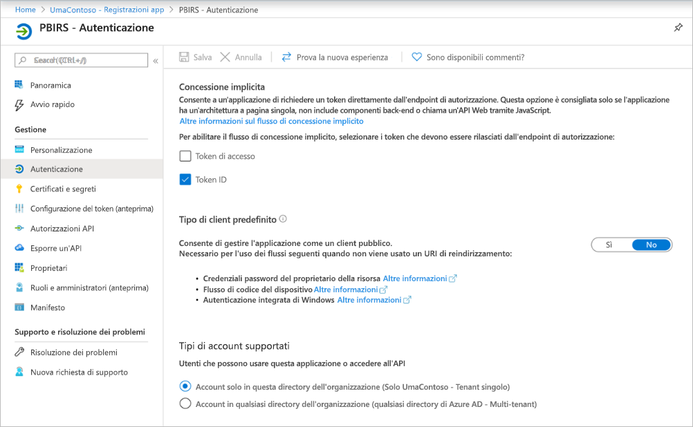

1. Dopo che la modalità Single Sign-On è stata configurata e l'URL `https://pbirsazureapp-umacontoso2410.msappproxy.net` funziona, è necessario assicurarsi che l'account con cui si esegue l'accesso sia sincronizzato con l'account in cui vengono specificate le autorizzazioni in Server di report di Power BI.

1. Configurare prima di tutto il dominio personalizzato che si vuole usare nell'account di accesso, quindi controllare che sia verificato
2. In questo caso è stato acquistato un dominio denominato umacontoso.com e la zona DNS è stata configurata con le voci. È anche possibile provare a usare il dominio `onmicrosoft.com` e sincronizzarlo con Active Directory locale.

    Vedere l'articolo [Esercitazione: Eseguire il mapping di un nome DNS personalizzato esistente al Servizio app di Azure](https://docs.microsoft.com/Azure/app-service/app-service-web-tutorial-custom-domain) per informazioni di riferimento.

1. Dopo aver verificato la voce DNS per il dominio personalizzato, dovrebbe essere possibile visualizzare dal portale lo stato **Verificato** in corrispondenza del dominio.

    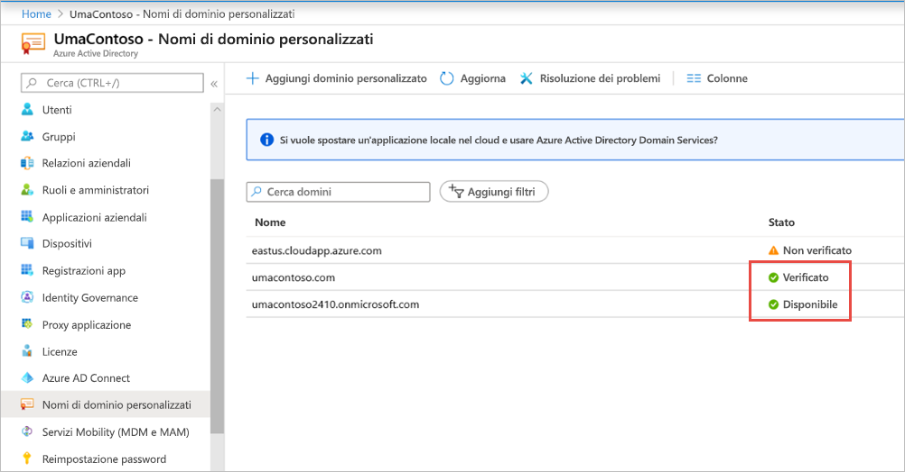

1. Installare Microsoft Azure AD Connect nel server del controller di dominio e configurarlo per la sincronizzazione con Azure AD.

    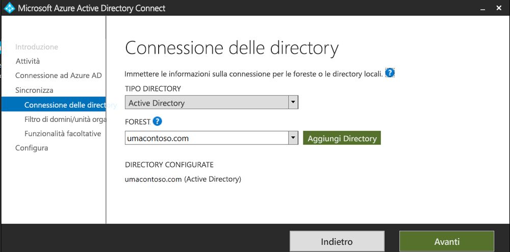

1. Al termine della sincronizzazione di Azure AD con Active Directory locale, verrà visualizzato lo stato seguente dal portale di Azure:

    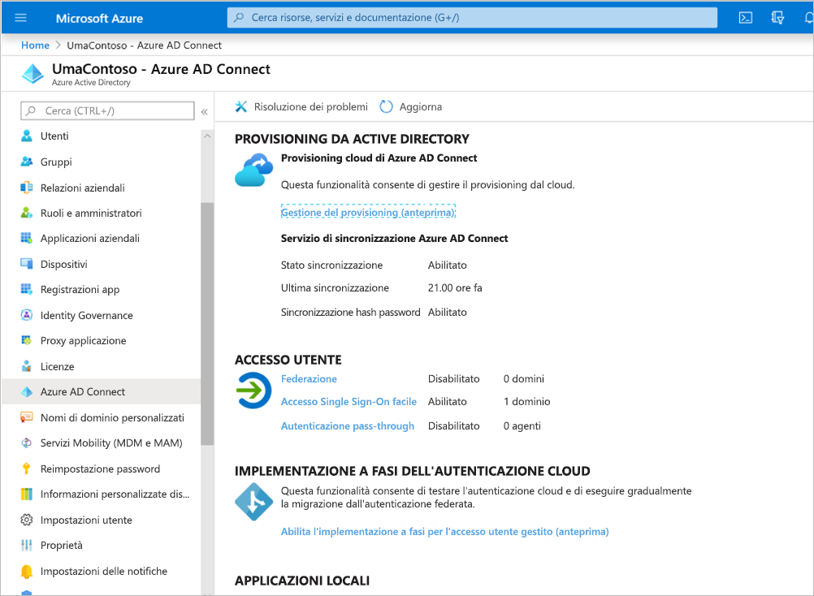

1. Dopo aver completato la sincronizzazione, aprire i domini e i trust di Active Directory nel controller di dominio. Fare clic con il pulsante destro del mouse su Domini e trust di Active Directory > Proprietà e aggiungere il nome UPN. In questo ambiente `umacontoso.com` è il dominio personalizzato acquistato.

1. Dopo l'aggiunta dell'UPN, sarà possibile configurare gli account utente con l'UPN in modo che l'account Azure AD e l'account Active Directory locale siano connessi e che il token sia riconosciuto durante l'autenticazione.

    Il nome di dominio AD viene elencato nell'elenco a discesa della sezione **Nome accesso utente** dopo aver eseguito il passaggio precedente. Configurare il nome utente e selezionare il dominio dall'elenco a discesa nella sezione **Nome accesso utente** delle proprietà dell'utente di Active Directory.

    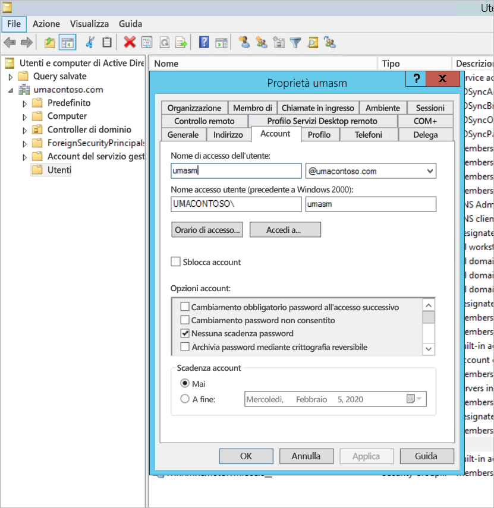

1. Dopo aver completato la sincronizzazione di Active Directory, l'account Active Directory locale verrà visualizzato nel portale di Azure nella sezione **Utenti e gruppi** dell'applicazione. L'origine dell'account è **AD di Windows Server**.
2. L'accesso con `umasm@umacontoso.com` sarà equivalente all'uso delle credenziali di Windows `Umacontoso\umasm`.

    I passaggi precedenti sono applicabili se Active Directory locale è configurato e si prevede di sincronizzarlo con Azure AD.

    Accesso riuscito dopo aver implementato i passaggi precedenti:

    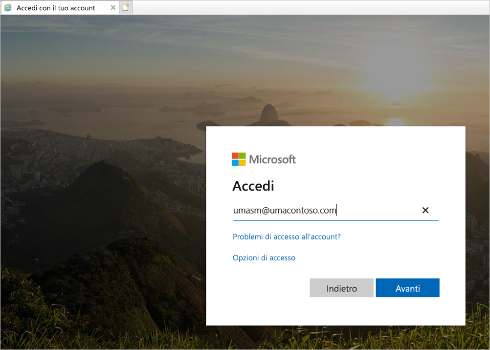

    Successiva visualizzazione del portale Web:

    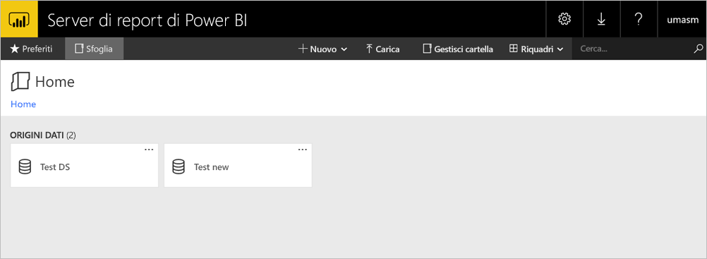

    Riuscita della connessione di test a un'origine dati che usa Kerberos come autenticazione:

    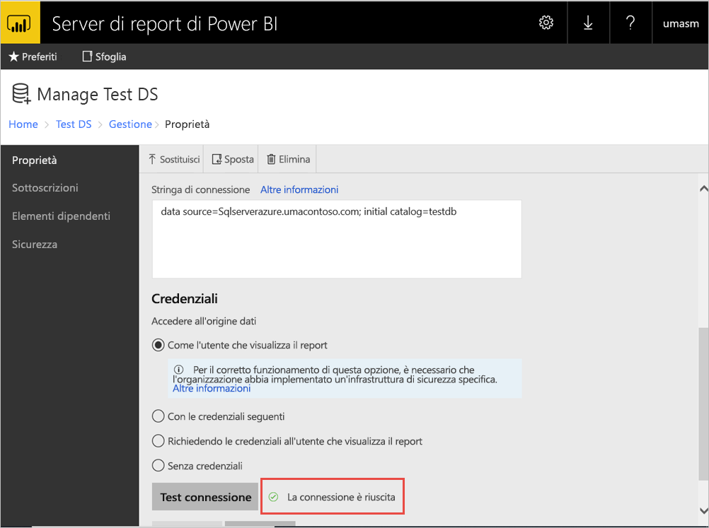

## <a name="access-from-power-bi-mobile-apps"></a>Accedere dalle app Power BI per dispositivi mobili

### <a name="configure-the-application-registration"></a>Configurare la registrazione dell'applicazione

Prima che l'app Power BI per dispositivi mobili possa connettersi e accedere a Server di report di Power BI, è necessario configurare la registrazione dell'applicazione creata automaticamente nella sezione precedente [Pubblicare tramite Azure AD Application Proxy](#publish-through-azure-ad-application-proxy) in questo articolo.

1. Nella pagina **Panoramica** di Azure Active Directory selezionare **Registrazioni app**.
2. Nella scheda **Tutte le applicazioni** cercare l'applicazione creata per Server di report di Power BI.
3. Selezionare l'applicazione, quindi scegliere **Autenticazione**.
4. Aggiungere gli URI di reindirizzamento seguenti in base alla piattaforma usata.

    Quando si configura l'app per Power BI per dispositivi mobili **iOS**, aggiungere gli URI di reindirizzamento seguenti di tipo Client pubblico (per dispositivi mobili e desktop):

    - `msauth://code/mspbi-adal%3a%2f%2fcom.microsoft.powerbimobile`
    - `msauth://code/mspbi-adalms%3a%2f%2fcom.microsoft.powerbimobilems`
    - `mspbi-adal://com.microsoft.powerbimobile`
    - `mspbi-adalms://com.microsoft.powerbimobilems`

    Quando si configura l'app per Power BI per dispositivi mobili **Android**, aggiungere gli URI di reindirizzamento seguenti di tipo Client pubblico (per dispositivi mobili e desktop):

    - `urn:ietf:wg:oauth:2.0:oob`
    - `mspbi-adal://com.microsoft.powerbimobile`
    - `msauth://com.microsoft.powerbim/g79ekQEgXBL5foHfTlO2TPawrbI%3D`
    - `msauth://com.microsoft.powerbim/izba1HXNWrSmQ7ZvMXgqeZPtNEU%3D`

    Quando si configura l'app per Power BI per dispositivi mobili iOS e Android, aggiungere gli URI di reindirizzamento seguenti di tipo Client pubblico (per dispositivi mobili e desktop) all'elenco degli URI di reindirizzamento configurati per iOS:

    - `urn:ietf:wg:oauth:2.0:oob`

    > [!IMPORTANT]
    > Per il corretto funzionamento dell'applicazione, è necessario aggiungere gli URI di reindirizzamento.

### <a name="connect-from-the-power-bi-mobile-apps"></a>Eseguire la connessione dalle app Power BI per dispositivi mobili

1. Nell'app Power BI per dispositivi mobili connettersi all'istanza del server di report. Per connettersi, immettere l'**URL esterno** per l'applicazione pubblicata tramite Application Proxy.
2. Selezionare **Connetti**. Si verrà indirizzati alla pagina di accesso di Azure Active Directory.
3. Immettere le credenziali valide per l'utente e selezionare **Accedi**. Verranno visualizzati gli elementi del server di report.

## <a name="next-steps"></a>Passaggi successivi

[Abilitare l'accesso remoto a Power BI per dispositivi mobili con Azure AD Application Proxy](https://docs.microsoft.com/azure/active-directory/manage-apps/application-proxy-integrate-with-power-bi)

Altre domande? [Provare a rivolgersi alla community di Power BI](https://community.powerbi.com/)

                