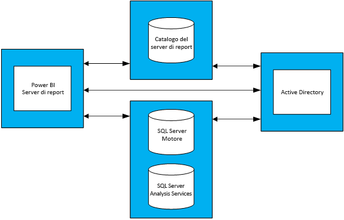

# Indicazioni sulla pianificazione della capacità per il server di report di Power BI
Il server di report di Power BI è una soluzione di business intelligence aziendale self-service e di creazione di report aziendali che i clienti possono distribuire localmente, dietro a firewall. Combina le funzionalità di report interattivi di Power BI Desktop con la piattaforma server locale di SQL Server Reporting Services. Con la crescita dell'utilizzo intenso delle analisi e dei report all'interno delle aziende, può risultare difficile allocare fondi sufficienti per l'infrastruttura hardware e le licenze software necessarie per la scalabilità per una base utenti aziendale. Questo articolo fornisce indicazioni sulla pianificazione della capacità per il server di report di Power BI, condividendo i risultati di numerose esecuzioni di test di carico di diversi carichi di lavoro in un server di report. Benché i report, le query e i modelli di utilizzo delle organizzazioni possano presentare differenze significative, i risultati presentati in questo articolo, oltre ai test effettivi usati e a una descrizione dettagliata della relativa modalità di esecuzione, possono servire da punto di riferimento per chiunque stia completando le fasi preliminari del processo di pianificazione della distribuzione del server di report di Power BI.

## Riepilogo
Sono stati eseguiti due tipi diversi di carichi di lavoro nel server di report di Power BI. Ogni carico di lavoro è costituito da rendering di diversi tipi di report e dall'esecuzione di diverse operazioni nel portale Web. 

* Nel carico di lavoro definito "Power BI Report Heavy" l'operazione eseguita con maggiore frequenza, ovvero l'operazione eseguita per il 60% del tempo, è costituita dal rendering di report di Power BI.
* Nel carico di lavoro "Paginated Report Heavy" l'operazione eseguita con maggiore frequenza è costituita dal rendering di report impaginati.

Con una topologia di quattro server per il server di report di Power BI e un'aspettativa che prevede che non più del 5% degli utenti eseguirà l'accesso a un server di report in un momento qualsiasi, la tabella seguente illustra il numero massimo di utenti che un server di report di Power BI può gestire con un'affidabilità almeno del 99%. 

| Carico di lavoro | 8 core/32 GB di RAM | 16 core/64 GB di RAM |
| --- | --- | --- |
| **Power BI Report Heavy** (>60%) |1.000 utenti |3.000 utenti |
| **Paginated (RDL) Report Heavy** (>60%) |2.000 utenti |3.200 utenti |

In ogni esecuzione la risorsa che presenta il sovraccarico maggiore è la CPU. L'aumento del numero di core per il server di report di Power BI potrebbe quindi permettere di ottenere un incremento superiore a livello di affidabilità del sistema rispetto all'aumento della quantità di memoria o dello spazio su disco rigido. 

## Metodologia di test
La topologia di test usata è basata sulle Macchine virtuali di Microsoft Azure, invece che su hardware fisico specifico di un fornitore. Tutte le macchine virtuali sono ospitate in aree degli Stati Uniti, per riflettere la tendenza generale della virtualizzazione hardware in locale e nel cloud pubblico. 

### Topologia del server di report di Power BI
La distribuzione del server di report di Power BI è costituita dalle macchine virtuali seguenti:

* Controller di dominio di Active Directory: usato dal motore di database di SQL Server, da SQL Server Analysis Services e dal server di report di Power BI per l'autenticazione sicura di tutte le richieste.
* Motore di database di SQL Server e SQL Server Analysis Services: posizione in cui sono stati archiviati tutti i database che i report devono utilizzare in fase di rendering.
* Server di report Power BI
* Database del server di report Power BI. Il database del server di report è ospitato in una macchina virtuale rispetto al server di report di Power BI, in modo che non debba competere con il motore di database di SQL Server per memoria, CPU, risorse di rete e di disco.

Per informazioni complete sulla configurazione di ogni macchina virtuale usata nella topologia, vedere Appendice 1.1 Topologia del server di report di Power BI e Appendice 1.2 Configurazione delle macchine virtuali per il server di report di Power BI.

### Test
I test usati nelle esecuzioni dei test di carico sono disponibili pubblicamente in un progetto GitHub denominato [Reporting Services LoadTest](https://github.com/Microsoft/Reporting-Services-LoadTest). Questo strumento consente agli utenti di studiare le prestazioni, l'affidabilità, la scalabilità e le caratteristiche di ripristinabilità di SQL Server Reporting Services e del server di report di Power BI. Questo progetto è costituito da quattro gruppi di test case:

* Test che simulano il rendering dei report di Power BI
* Test che simulano il rendering dei report per dispositivi mobili
* Test che simulano il rendering di report impaginati di piccole e grandi dimensioni 
* Test che simulano l'esecuzione di diversi tipi di operazioni nel portale Web 

Tutti i test sono stati scritti per l'esecuzione di un'operazione end-to-end, ad esempio il rendering di un report, la creazione di una nuova origine dati e così via. Per ottenere questo risultato, inviano una o più richieste Web per il server di report tramite le API. Nel mondo reale è possibile che un utente debba eseguire alcune operazioni intermedie per completare una di queste operazioni end-to-end. Ad esempio, per eseguire il rendering di un report, un utente dovrà passare al portale Web, selezionare la cartella in cui si trova il report e quindi fare clic sul report per sottoporlo a rendering. Anche se i test non eseguono tutte le operazioni necessarie per completare un'attività end-to-end, il carico è comunque molto simile a un carico effettivo del server di report di Power BI. L'esplorazione del progetto GitHub consente di ottenere molte informazioni sui diversi tipi di report usati e sulla varietà di operazioni eseguite.

### Carichi di lavoro
Nei test vengono usati due profili di carico di lavoro, ovvero "Power BI Report Heavy" e "Paginated Report Heavy". La tabella seguente illustra la distribuzione delle richieste eseguite nel server di report.

| Attività | Power BI Report Heavy, frequenza di occorrenza | Paginated Report Heavy, frequenza di occorrenza |
| --- | --- | --- |
| **Rendering di report di Power BI** |60% |10% |
| **Rendering di report impaginati (RDL)** |30% |60% |
| **Rendering di report per dispositivi mobili** |5% |20% |
| **Operazioni del portale Web** |5% |10% |

### Carico utente
Per ogni esecuzione di test, i test sono stati eseguiti in base alla frequenza specificata in uno dei due carichi di lavoro. I test sono iniziati con 20 richieste utente simultanee al server di report. Il carico utente è stato quindi incrementato gradualmente fino a quando il livello di affidabilità non è sceso al di sotto dell'obiettivo del 99%.

## Risultati
### Capacità di utenti simultanei
Come indicato in precedenza, i test sono iniziati con 20 utenti simultanei che inviano richieste al server di report. Il numero di utenti simultanei è stato quindi incrementato gradualmente fino a ottenere errori per l'1% di tutte le richieste. I risultati nella tabella seguente indicano il numero di richieste utente simultanee che il server sarebbe in grado di gestire in caso di picco del carico con una frequenza di errore inferiore all'1%.

| Carico di lavoro | 8 core/32 GB | 16 core/64 GB |
| --- | --- | --- |
| **Power BI Report Heavy** |50 utenti simultanei |150 utenti simultanei |
| **Paginated Report Heavy** |100 utenti simultanei |160 utenti simultanei |

### Capacità totale a livello di utenti
Presso Microsoft è disponibile una distribuzione di produzione del server di report di Power BI, che è stata usata da diversi team. Quando si analizza l'utilizzo effettivo di questo ambiente, si può notare che il numero di utenti simultanei in un momento qualsiasi, anche in caso di picco giornaliero del carico, non supera tendenzialmente il 5% della base utenti totale. Usando una percentuale di simultaneità del 5% come benchmark, è stato possibile dedurre la base utenti totale che il server di report di Power BI è in grado di gestire con un'affidabilità del 99%.

| Carico di lavoro | 8 core/32 GB | 16 core/64 GB |
| --- | --- | --- |
| **Power BI Report Heavy** |1.000 utenti |3.000 utenti |
| **Paginated Report Heavy** |2.000 utenti |3.200 utenti |

### Visualizzare i risultati
Selezionare un report per visualizzare i risultati del test di carico.

| Carico di lavoro | 8 core/32 GB | 16 core/64 GB |
| --- | --- | --- |
| **Power BI Report Heavy** |[Visualizzazione - 8 core](https://msit.powerbi.com/view?r=eyJrIjoiMDhhNGY4NGQtNGRhYy00Yzk4LTk2MzAtYzFlNWI5NjBkMGFiIiwidCI6IjcyZjk4OGJmLTg2ZjEtNDFhZi05MWFiLTJkN2NkMDExZGI0NyIsImMiOjV9) |[Visualizzazione - 16 core](https://msit.powerbi.com/view?r=eyJrIjoiNDBiODk1OGUtYTAyOC00MzVhLThmZmYtNzVjNTFjNzMwYzkwIiwidCI6IjcyZjk4OGJmLTg2ZjEtNDFhZi05MWFiLTJkN2NkMDExZGI0NyIsImMiOjV9) |
| **Paginated Report Heavy** |[Visualizzazione - 8 core](https://msit.powerbi.com/view?r=eyJrIjoiNDFiZWYzMTktZGIxNS00MzcwLThjODQtMmJkMGRiZWEzNjhlIiwidCI6IjcyZjk4OGJmLTg2ZjEtNDFhZi05MWFiLTJkN2NkMDExZGI0NyIsImMiOjV9) |[Visualizzazione - 16 core](https://msit.powerbi.com/view?r=eyJrIjoiOTU0YjJkYTgtNDg4Yy00NzlhLWIwMGYtMzg4YWI2MjNmOTZjIiwidCI6IjcyZjk4OGJmLTg2ZjEtNDFhZi05MWFiLTJkN2NkMDExZGI0NyIsImMiOjV9) |

<iframe width="640" height="360" src="https://msit.powerbi.com/view?r=eyJrIjoiMDhhNGY4NGQtNGRhYy00Yzk4LTk2MzAtYzFlNWI5NjBkMGFiIiwidCI6IjcyZjk4OGJmLTg2ZjEtNDFhZi05MWFiLTJkN2NkMDExZGI0NyIsImMiOjV9" frameborder="0" allowFullScreen="true"></iframe>

<iframe width="640" height="360" src="https://msit.powerbi.com/view?r=eyJrIjoiNDBiODk1OGUtYTAyOC00MzVhLThmZmYtNzVjNTFjNzMwYzkwIiwidCI6IjcyZjk4OGJmLTg2ZjEtNDFhZi05MWFiLTJkN2NkMDExZGI0NyIsImMiOjV9" frameborder="0" allowFullScreen="true"></iframe>

<iframe width="640" height="360" src="https://msit.powerbi.com/view?r=eyJrIjoiNDFiZWYzMTktZGIxNS00MzcwLThjODQtMmJkMGRiZWEzNjhlIiwidCI6IjcyZjk4OGJmLTg2ZjEtNDFhZi05MWFiLTJkN2NkMDExZGI0NyIsImMiOjV9" frameborder="0" allowFullScreen="true"></iframe>

<iframe width="640" height="360" src="https://msit.powerbi.com/view?r=eyJrIjoiOTU0YjJkYTgtNDg4Yy00NzlhLWIwMGYtMzg4YWI2MjNmOTZjIiwidCI6IjcyZjk4OGJmLTg2ZjEtNDFhZi05MWFiLTJkN2NkMDExZGI0NyIsImMiOjV9" frameborder="0" allowFullScreen="true"></iframe>

## Riepilogo
Per ogni esecuzione di test di carico, la CPU è stata la risorsa con maggiore sovraccarico in fase di picco del carico nella macchina virtuale del server di report di Power BI. È quindi necessario incrementare prima di tutto il numero di core. In alternativa, è possibile prendere in considerazione l'aumento del numero di server che ospitano il server di report di Power BI nella topologia specifica.

I risultati presentati in questo articolo sono basati sull'esecuzione di un set specifico di report che utilizza un set specifico di dati, ripetuta in modo specifico. Si tratta di un punto di riferimento utile, ma occorre ricordare che l'utilizzo dipenderà dai report, dalle query, dai modelli di utilizzo e dalla distribuzione del server di report di Power BI specifico.

## Appendice
### 1 Topologia
**1.1 Topologia del server di report di Power BI**

Per concentrarsi esclusivamente sul comportamento del server di report di Power BI in configurazioni diverse, la configurazione delle VM per ogni tipo di macchina virtuale, ad eccezione della macchina virtuale che ospita il server di report di Power BI, è fissa. Ogni macchina virtuale è stata sottoposta a provisioning come VM di tipo Serie D (v2) di seconda generazione con dischi di archiviazione Premium. È possibile trovare informazioni dettagliate su ogni dimensione di macchina virtuale nella sezione "Utilizzo generico" in https://azure.microsoft.com/en-us/pricing/details/virtual-machines/windows/.

| Tipo di macchina virtuale | Processore | Memoria | Dimensioni delle VM di Azure |
| --- | --- | --- | --- |
| **Controller di dominio di Active Directory** |2 core |7 GB |Standard_DS2_v2 |
| **Motore di Database di SQL Server e SQL Server Analysis Services** |16 core |56 GB |Standard_DS5_v2 |
| **Database del server di report** |16 core |56 GB |Standard_DS5_v2 |

**1.2 Configurazione delle macchine virtuali per il server di report di Power BI** 

Per la macchina virtuale che ospita il server di report di Power BI sono state usate diverse configurazioni di processore e memoria. A differenza delle altre VM, questa macchina virtuale è stata sottoposta a provisioning come VM di tipo Serie D (v3) di terza generazione con dischi di archiviazione Premium. È possibile trovare informazioni dettagliate su questa dimensione di macchina virtuale nella sezione "Utilizzo generico" in https://azure.microsoft.com/en-us/pricing/details/virtual-machines/windows/.

| Macchina virtuale | Processore | Memoria | Dimensioni delle VM di Azure |
| --- | --- | --- | --- |
| **Server di report Power BI (Small)** |8 core |32 GB |Standard_D8S_v3 |
| **Server di report Power BI (Large)** |16 core |64 GB |vStandard_D16S_v3 |

### 2 Eseguire lo strumento LoadTest
Se si vuole eseguire lo strumento Reporting Services LoadTest con la propria distribuzione o con una distribuzione di Microsoft Azure del server di report di Power BI, seguire questa procedura.

1. Clonare il progetto Reporting Services LoadTest da GitHub (https://github.com/Microsoft/Reporting-Services-LoadTest).
2. Nella directory del progetto è disponibile un file di soluzione denominato RSLoadTests.sln. Aprire questo file in Visual Studio 2015 o versione successiva.
3. Determinare se si vuole eseguire questo strumento con la propria versione del server di report di Power BI o con una distribuzione del server di report di Power BI in Microsoft Azure. In caso di esecuzione con la propria distribuzione, andare al Passaggio 5.
4. Seguire le istruzioni riportate in https://github.com/Microsoft/Reporting-Services-LoadTest#create-a-sql-server-reporting-services-load-environment-in-azure per creare un ambiente Server di Report di Power BI in Azure.
5. Dopo aver completato la distribuzione dell'ambiente, seguire le istruzioni riportate in https://github.com/Microsoft/Reporting-Services-LoadTest#load-test-execution per eseguire i test.

Altre domande? [Provare a rivolgersi alla community di Power BI](https://community.powerbi.com/)

