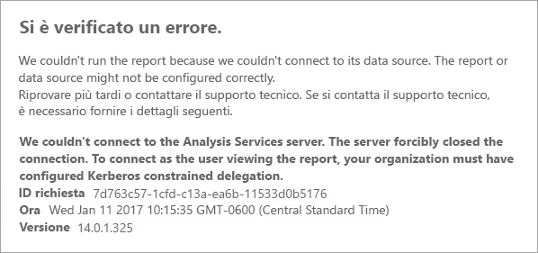
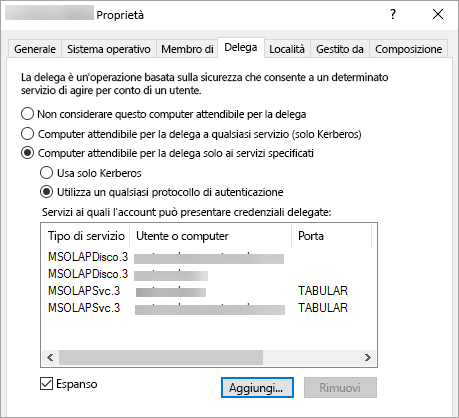
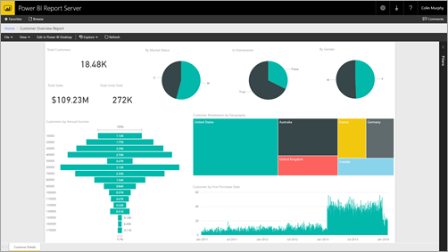

# <a name="configure-kerberos-to-use-power-bi-reports"></a>Configurare Kerberos per l'uso di report di Power BI
<iframe width="640" height="360" src="https://www.youtube.com/embed/vCH8Fa3OpQ0?showinfo=0" frameborder="0" allowfullscreen></iframe>

Informazioni su come configurare il server di report per l'autenticazione Kerberos nelle origini dati usate all'interno dei report di Power BI per un ambiente distribuito.

Il Server di Report di Power BI offre la possibilità di ospitare report di Power BI. Il server di report supporta molte origini dati. Questo articolo illustra in dettaglio SQL Server Analysis Services, ma è possibile usare i concetti e applicarli ad altre origini dati come SQL Server.

È possibile installare il Server di Report di Power BI, SQL Server e Analysis Services in un singolo computer e tutto dovrebbe funzionare senza alcuna configurazione aggiuntiva. Questo è ideale per ambienti di testing. Potrebbero verificarsi degli errori se si installano questi servizi in computer separati, cioè in un ambiente distribuito dove è necessario usare l'autenticazione Kerberos, la cui implementazione richiede una configurazione. 

In modo specifico, sarà necessario configurare la delega vincolata. Kerberos potrebbe essere già configurato nell'ambiente, ma non per la delega vincolata.

## <a name="error-running-report"></a>Errore durante l'esecuzione del report
Se il server di report non è configurato correttamente, si potrebbe ricevere l'errore seguente.

    Something went wrong.

    We couldn’t run the report because we couldn’t connect to its data source. The report or data source might not be configured correctly. 

Tra i dettagli tecnici, verrà visualizzato il messaggio seguente.

    We couldn’t connect to the Analysis Services server. The server forcibly closed the connection. To connect as the user viewing the report, your organization must have configured Kerberos constrained delegation.



## <a name="configuring-kerberos-constrained-delegation"></a>Configurazione della delega vincolata di Kerberos
Per il corretto funzionamento della delega vincolata occorre configurare diversi elementi, tra cui i nomi SPN e le impostazioni di delega negli account di servizio.

> [!NOTE]
> Per configurare i nomi SPN e le impostazioni di delega, è necessario essere un amministratore di dominio.
> 
> 

È necessario configurare o convalidare gli elementi seguenti.

1. Tipo di autenticazione nel file di configurazione del server di report.
2. Nomi SPN per l'account del servizio del server di report.
3. Nomi SPN per il servizio Analysis Services.
4. Nomi SPN per il servizio SQL Browser nel computer di Analysis Services (solo per le istanze denominate).
5. Impostazioni di delega nell'account del servizio del server di report.

## <a name="authentication-type-within-report-server-configuration"></a>Tipo di autenticazione nel file di configurazione del server di report
Per autorizzare la delega vincolata di Kerberos è necessario configurare il tipo di autenticazione del server di report all'interno del file **rsreportserver.config**, il cui percorso predefinito è `C:\Program Files\Microsoft Power BI Report Server\PBIRS\ReportServer`.

All'interno del file rsreportserver.config, cercare la sezione **Authentication/AuthenticationTypes**.

Assicurarsi che RSWindowsNegotiate sia elencato per primo nell'elenco dei tipi di autenticazione. L'URL dovrebbe essere simile a quello indicato di seguito.

```
<AuthenticationTypes>
    <RSWindowsNegotiate/>
    <RSWindowsNTLM/>
</AuthenticationTypes>
```

Se è stato necessario modificare il file di configurazione, è consigliabile arrestare e avviare il server di report per assicurarsi che le modifiche abbiano effetto.

Per altre informazioni, vedere [Configurare l'autenticazione di Windows in un server di report](https://docs.microsoft.com/sql/reporting-services/security/configure-windows-authentication-on-the-report-server).

## <a name="spns-for-the-report-server-service-account"></a>Nomi SPN per l'account del servizio del server di report
Successivamente, è necessario assicurarsi che nel server di report siano disponibili nomi SPN validi in base all'account del servizio configurato per il server di report.

### <a name="virtual-service-account-or-network-service"></a>Account del servizio virtuale o Servizio di rete
Se il server di report è configurato per l'Account del servizio virtuale o Servizio di rete, non è necessario eseguire alcuna operazione, perché sono contestuali nell'account del computer che, per impostazione predefinita, contiene nomi SPN HOST che coprono il servizio HTTP e saranno usati dal server di report.

Se si usa un nome del server virtuale, che non sia lo stesso dell'account del computer, le voci HOST non offriranno copertura e sarà necessario aggiungere manualmente i nomi SPN per il nome host del server virtuale.

### <a name="domain-user-account"></a>Account utente di dominio
Se il server di report è configurato per usare un account utente di dominio, è necessario creare manualmente i nomi SPN HTTP su tale account. A tale scopo, usare lo strumento setspn fornito con Windows.

> [!NOTE]
> Per creare il nome SPN sono necessari diritti di amministratore di dominio.
> 
> 

È consigliabile creare due nomi SPN: uno con il nome NetBIOS e l'altro con il nome di dominio completo (FQDN). Il nome SPN deve essere nel formato seguente.

    <Service>/<Host>:<port>

Il Server di Report di Power BI userà un servizio HTTP. Per i nomi SPN HTTP non verrà elencata una porta. In questo caso, l'obiettivo è il servizio HTTP. L'host del nome SPN sarà il nome usato in un URL, in genere il nome del computer. Se si è dietro un servizio di bilanciamento del carico, può trattarsi di un nome virtuale.

> [!NOTE]
> È possibile verificare l'URL esaminando il contenuto immesso nella barra degli indirizzi del browser oppure guardando in Gestione configurazione del Server di report nella scheda URL del portale Web.
> 
> 

Se il nome del computer è ContosoRS, il nome SPN sarà il seguente.

| Tipo SPN | NOME SPN |
| --- | --- |
| Nome di dominio completo (FQDN) |HTTP/ContosoRS.contoso.com |
| NetBIOS |HTTP/ContosoRS |

### <a name="location-of-spn"></a>Percorso del nome SPN
Il percorso in cui inserire il nome SPN è in qualsiasi account di servizio in uso. Se si usa l'Account del servizio virtuale o Servizio di rete, sarà l'account del computer. Come già accennato, tuttavia, questa operazione è necessaria solo per un URL virtuale. Se si usa un utente di dominio per l'account del servizio del server di report, si inserirà il nome SPN nell'account utente di tale dominio.

Ad esempio, se si usa l'account del servizio di rete e il nome del computer è ContosoRS, si inserirà il nome SPN in ContosoRS.

Se si usa un account utente di dominio di RSService, si inserirà il nome SPN in RSService.

### <a name="using-setspn-to-add-the-spn"></a>Uso di SetSPN per aggiungere il nome SPN
È possibile usare lo strumento SetSPN per aggiungere il nome SPN. Si seguirà lo stesso esempio precedente con l'account del computer e con l'account utente di dominio.

L'inserimento del nome SPN in un account del computer, sia per il nome di dominio completo che per il nome SPN di NetBIOS, avrebbe un aspetto simile al seguente se si stesse usando un URL virtuale per contosoreports.

      Setspn -a HTTP/contosoreports.contoso.com ContosoRS
      Setspn -a HTTP/contosoreports ContosoRS

L'inserimento del nome SPN in un account utente di dominio, sia per il nome di dominio completo che per il nome SPN di NetBIOS, avrebbe un aspetto simile al seguente se si stesse usando il nome del computer per l'host del nome SPN.

      Setspn -a HTTP/ContosoRS.contoso.com RSService
      Setspn -a HTTP/ContosoRS RSService

## <a name="spns-for-the-analysis-services-service"></a>Nomi SPN per il servizio Analysis Services
I nomi SPN per Analysis Services sono simili a quelli per il Server di report di Power BI. Il formato del nome SPN è leggermente diverso se si ha un'istanza denominata.

Per Analysis Services, si userà un servizio msolapsvc. 3. Verrà ora specificato il nome dell'istanza per l'indirizzo della porta sul nome SPN. La parte host del nome SPN sarà il nome del computer o il nome virtuale del cluster.

Un esempio di nome SPN di Analysis Services sarebbe simile al seguente.

| Tipo | Formato |
| --- | --- |
| Istanza predefinita |MSOLAPSvc.3/ContosoAS.contoso.com<br>MSOLAPSvc.3/ContosoAS |
| Istanza denominata |MSOLAPSvc.3/ContosoAS.contoso.com:INSTANCENAME<br>MSOLAPSvc.3/ContosoAS:INSTANCENAME |

Anche l'inserimento del nome SPN è simile alle operazioni menzionate per il Server di report di Power BI. È basato sull'account di servizio.  Se si usa il sistema locale o il servizio di rete, il contesto sarà l'account del computer. Se si usa un account utente di dominio per l'istanza di Analysis Services, si inserirà il nome SPN nell'account utente di dominio.

### <a name="using-setspn-to-add-the-spn"></a>Uso di SetSPN per aggiungere il nome SPN
È possibile usare lo strumento SetSPN per aggiungere il nome SPN. Per questo esempio, il nome del computer sarà ContosoAS.

L'inserimento del nome SPN in un account del computer, sia per il nome di dominio completo che per il nome SPN di NetBIOS, avrebbe un aspetto simile al seguente.

    Setspn -a MSOLAPSvc.3/ContosoAS.contoso.com ContosoAS
    Setspn -a MSOLAPSvc.3/ContosoAS ContosoAS

L'inserimento del nome SPN in un account del dominio utente, sia per il nome di dominio completo che per il nome SPN di NetBIOS, avrebbe un aspetto simile al seguente.

    Setspn -a MSOLAPSvc.3/ContosoAS.contoso.com OLAPService
    Setspn -a MSOLAPSvc.3/ContosoAS OLAPService

## <a name="spns-for-the-sql-browser-service"></a>Nomi SPN per il servizio SQL Browser
Se si ha un'istanza denominata di Analysis Services, è anche necessario assicurarsi di avere un nome SPN per il servizio browser, che sia univoco per Analysis Services.

I nomi SPN per SQL Browser sono simili a quelli per il Server di report di Power BI.

Per SQL Browser, si userà un servizio MSOLAPDisco.3. Verrà ora specificato il nome dell'istanza per l'indirizzo della porta sul nome SPN. La parte host del nome SPN sarà il nome del computer o il nome virtuale del cluster.
Non è necessario specificare un valore per la porta o il nome dell'istanza.

Un esempio di nome SPN di Analysis Services sarebbe simile al seguente.

    MSOLAPDisco.3/ContosoAS.contoso.com
    MSOLAPDisco.3/ContosoAS

Anche l'inserimento del nome SPN è simile alle operazioni menzionate per il Server di report di Power BI. La differenza è che SQL Browser viene sempre eseguito con l'account sistema locale: ciò significa che i nomi SPN verranno sempre inseriti nell'account del computer. 

### <a name="using-setspn-to-add-the-spn"></a>Uso di SetSPN per aggiungere il nome SPN
È possibile usare lo strumento SetSPN per aggiungere il nome SPN. Per questo esempio, il nome del computer sarà ContosoAS.

L'inserimento del nome SPN in un account del computer, sia per il nome di dominio completo che per il nome SPN di NetBIOS, avrebbe un aspetto simile al seguente.

    Setspn -a MSOLAPDisco.3/ContosoAS.contoso.com ContosoAS
    Setspn -a MSOLAPDisco.3/ContosoAS ContosoAS

Per altre informazioni, vedere [È richiesto un nome SPN per il servizio SQL Server Browser](https://support.microsoft.com/kb/950599).

## <a name="delegation-settings-on-the-report-server-service-account"></a>Impostazioni di delega nell'account del servizio del server di report
L'ultima parte da configurare sono le impostazioni di delega nell'account del servizio del server di report. Per eseguire questi passaggi sono disponibili diversi strumenti. Ai fini di questo documento, verrà usato lo strumento Utenti e computer di Active Directory.

È necessario iniziare accedendo alle proprietà dell'account del servizio del server di report all'interno di Utenti e computer di Active Directory. Si tratterà dell'account del computer, se si usa l'Account del servizio virtuale o del servizio di rete, oppure si tratterà di un account utente di dominio.

È consigliabile configurare la delega vincolata con protocollo in transito. Con la delega vincolata, è necessario dichiarare esplicitamente a quali servizi si vuole delegare. Verranno aggiunti sia il nome SPN del servizio Analysis Services sia il nome SPN di SQL Browser all'elenco a cui il Server di report di Power BI può delegare.

1. Fare clic con il pulsante destro del mouse sull'account di servizio del server di report e selezionare **Proprietà**.
2. Selezionare la scheda **Delega**.
3. Selezionare **Computer attendibile per la delega solo ai servizi specificati**.
4. Selezionare **Utilizza un qualsiasi protocollo di autenticazione**.
5. In **Servizi ai quali l'account può presentare credenziali delegate**: selezionare **Aggiungi**.
6. Nella nuova finestra di dialogo selezionare **Utenti o computer**.
7. Immettere l'account per il servizio Analysis Services e selezionare **OK**.
8. Selezionare il nome SPN creato, che inizierà con `MSOLAPSvc.3`. Se sono stati aggiunti sia il nome di dominio completo sia il nome SPN di NetBIOS, verranno selezionati entrambi, ma ne verrà visualizzato solo uno.
9. Selezionare **OK**.  A questo punto verrà visualizzato il nome SPN nell'elenco.
10. Facoltativamente, è possibile selezionare **Espansa** per visualizzare sia il nome di dominio completo sia il nome SPN di NetBIOS nell'elenco.
11. Selezionare di nuovo **Aggiungi**. A questo punto si aggiungerà il nome SPN di SQL Browser.
12. Nella nuova finestra di dialogo selezionare **Utenti o computer**.
13. Immettere il nome del computer sul quale si trova il servizio SQL Browser e selezionare **OK**.
14. Selezionare il nome SPN creato, che inizierà con `MSOLAPDisco.3`. Se sono stati aggiunti sia il nome di dominio completo sia il nome SPN di NetBIOS, verranno selezionati entrambi, ma ne verrà visualizzato solo uno.
15. Selezionare **OK**. La finestra di dialogo dovrebbe essere simile alla seguente quando la casella di controllo **Espansa** è selezionata.
    
    
16. Selezionare **OK**.
17. Riavviare il Server di report di Power BI.

## <a name="running-a-power-bi-report"></a>Esecuzione di un report di Power BI
Dopo aver completato la configurazione precedente, il report dovrà essere visualizzato correttamente. 



Nonostante questa configurazione dovrebbe funzionare nella maggior parte dei casi, con Kerberos, è possibile scegliere una configurazione diversa a seconda dell'ambiente. Se non è ancora possibile caricare il report, contattare l'amministratore di dominio per indagare ulteriormente oppure contattare il supporto tecnico.

## <a name="next-steps"></a>Passaggi successivi
[Panoramica amministratore](admin-handbook-overview.md)  
[Installare il server di report di Power BI](install-report-server.md)  

Altre domande? [Provare a rivolgersi alla community di Power BI](https://community.powerbi.com/)

