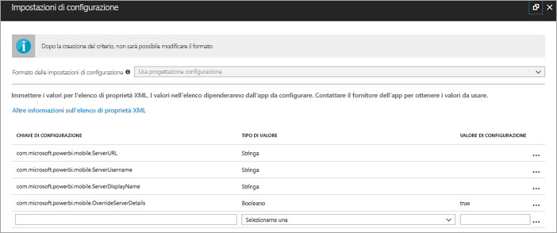
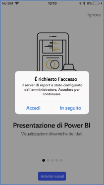
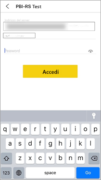

# Configurare l'accesso delle app per dispositivi mobili iOS di Power BI in modalità remota

In questo articolo viene spiegato come usare lo strumento MDM dell'organizzazione per configurare l'accesso delle app per dispositivi mobili iOS di Power BI a un server di report. Per procedere a questa impostazione, gli amministratori IT creano criteri di configurazione dell'app con le informazioni necessarie da inviare all'app. 

 Gli utenti delle app per dispositivi mobili iOS di Power BI possono quindi connettersi al server di report dell'organizzazione più facilmente perché la connessione al server di report è già configurata. 

## Creare i criteri di configurazione dell'app nello strumento MDM 

L'amministratore deve seguire i passaggi riportati di seguito in Microsoft Intune per creare i criteri di configurazione dell'app. I passaggi e l'esperienza di creazione dei criteri di configurazione dell'app potrebbero essere diversi in altri strumenti MDM. 

1. Connettere lo strumento MDM. 
2. Creare e denominare i nuovi criteri di configurazione dell'app. 
3. Scegliere gli utenti ai quali distribuire tali criteri di configurazione dell'app. 
4. Creare le coppie chiave-valore. 

Nella tabella seguente vengono illustrate in dettaglio le coppie.

|Chiave  |Tipo  |Descrizione  |
|---------|---------|---------|
| com.microsoft.powerbi.mobile.ServerURL | String | URL server di report   Deve iniziare con http/https |
| com.microsoft.powerbi.mobile.ServerUsername | String | [facoltativo]   Nome utente da usare per connettere il server.   Se non esiste, l'app richiede all'utente di digitare il nome utente per la connessione.| 
| com.microsoft.powerbi.mobile.ServerDisplayName | String | [facoltativo]   Il valore predefinito è "Server di report"   Nome descrittivo usato nell'app per rappresentare il server | 
| com.microsoft.powerbi.mobile.OverrideServerDetails | Booleano | Il valore predefinito è True   Se impostato su "True", esegue l'override di qualsiasi definizione di Server di report già presente nel dispositivo mobile (i server esistenti già configurati verranno eliminati).   Impostando l'override su True si impedisce anche all'utente di rimuovere tale configurazione.   Impostandolo su "False" vengono aggiunti i valori inviati lasciando le impostazioni esistenti.   Se nell'app mobile è già impostato l'URL del server di report, l'app lascia la configurazione esistente e non chiede all'utente di ripetere l'autenticazione per lo stesso server. |

Di seguito è riportato un esempio di configurazione dei criteri di configurazione con Intune.

## Utenti finali che si connettono a un server di report

Dopo aver pubblicato i criteri di configurazione dell'app, gli utenti e i dispositivi che appartengono alla lista di distribuzione definita per quei criteri hanno l'esperienza seguente quando avviano l'app per dispositivi mobili iOS di Power BI. 

1. Viene visualizzato un messaggio che informa che l'app per dispositivi mobili è configurata con un server di report. Toccare **Accedi**.

    

2.  Nella pagina **Connetti al server** il server di report è già compilato. Toccare **Connetti**.

    

3. Digitare una password per l'autenticazione e quindi toccare **Accedi**. 

    

È ora possibile visualizzare e interagire con gli indicatori KPI e i report di Power BI archiviati nel server di report.

## Passaggi successivi
[Panoramica amministratore](admin-handbook-overview.md)  
[Installare il server di report di Power BI](install-report-server.md)  

Altre domande? [Provare a rivolgersi alla community di Power BI](https://community.powerbi.com/)

