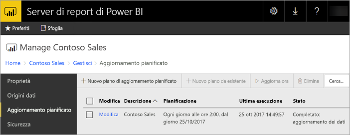
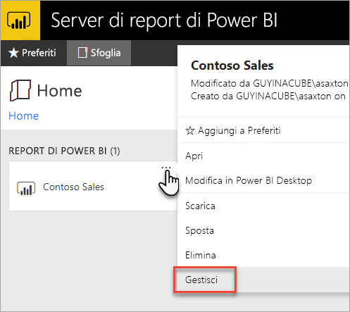
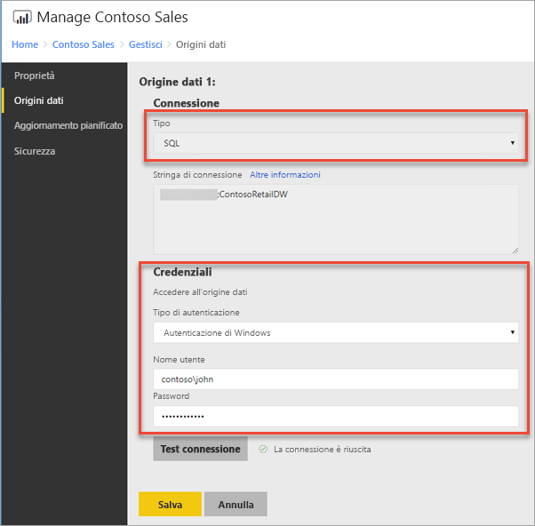
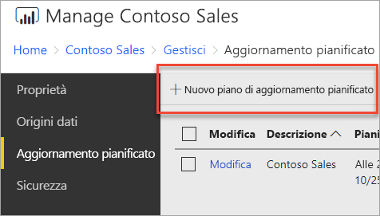
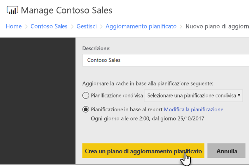
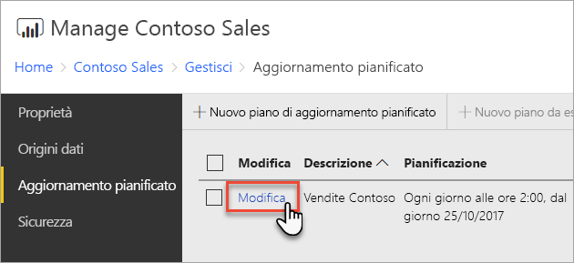
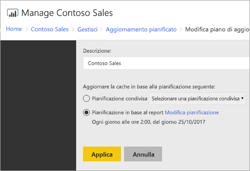

# Come configurare l'aggiornamento pianificato dei report di Power BI
Per aggiornare i dati in un report di Power BI, è necessario creare un piano di aggiornamento pianificato. Questa operazione viene eseguita nell'area *Gestisci* di un report di Power BI.

## Configurare le credenziali dell'origine dati
Prima di creare un piano di aggiornamento dei dati pianificato, è necessario configurare le credenziali per **ogni origine dati** usata nel report di Power BI.

1. Nel portale Web fare clic con il pulsante destro del mouse sul report di Power BI e scegliere **Gestisci**.
   
    
2. Nel menu a sinistra selezionare la scheda **Origini dati**.
3. Per ogni origine dati visualizzata, scegliere il tipo di autenticazione da usare per la connessione all'origine dati. Immettere le credenziali appropriate.
   
    

## Creazione di un piano di aggiornamento pianificato
Seguire questa procedura per creare un piano di aggiornamento pianificato.

1. Nel portale Web fare clic con il pulsante destro del mouse sul report di Power BI e scegliere **Gestisci**.
   
    
2. Nel menu a sinistra selezionare la scheda **Aggiornamento pianificato**.
3. Nella pagina **Aggiornamento pianificato** selezionare **Nuovo piano di aggiornamento pianificato**.
   
    
4. Nella pagina **Nuovo piano di aggiornamento pianificato** immettere una descrizione e impostare una pianificazione per l'aggiornamento del modello di dati.
5. Al termine, selezionare **Create scheduled refresh plan** (Crea un piano di aggiornamento pianificato).
   
    

## Modifica di un piano di aggiornamento pianificato
La modifica di un piano di aggiornamento pianificato è simile alla creazione di un piano.

1. Nel portale Web fare clic con il pulsante destro del mouse sul report di Power BI e scegliere **Gestisci**.
   
    
2. Nel menu a sinistra selezionare la scheda **Aggiornamento pianificato**.
3. Nella pagina **Aggiornamento pianificato** selezionare **Modifica** accanto al piano di aggiornamento da gestire.
   
    
4. Nella pagina **Edit Scheduled Refresh Plan** (Modifica piano di aggiornamento pianificato) immettere una descrizione e impostare una pianificazione per l'aggiornamento del modello di dati.
5. Al termine, selezionare **Applica**.
   
    

## Visualizzazione dello stato del piano di aggiornamento pianificato
Visualizzare lo stato di un piano di aggiornamento pianificato nel portale Web.

1. Nel portale Web fare clic con il pulsante destro del mouse sul report di Power BI e scegliere **Gestisci**.
   
    
2. Nel menu a sinistra selezionare la scheda **Aggiornamento pianificato**.
3. Nella pagina **Aggiornamento pianificato** la colonna a destra mostra lo stato di un piano.
   
   | **Stato** | **Descrizione** |
   | --- | --- |
   | Nuovo piano di aggiornamento pianificato |Il piano è stato creato ma non eseguito. |
   | Aggiornamento |Il processo di aggiornamento è stato avviato. |
   | Streaming del modello in Analysis Server |Copia del modello dal database del catalogo del server di report nell'istanza ospitata di Analysis Services. |
   | Aggiornamento dei dati |Aggiornamento dei dati nel modello. |
   | Rimozione delle credenziali dal modello |Rimozione delle credenziali usate per la connessione all'origine dati dal modello. |
   | Salvataggio del modello nel catalogo |L'aggiornamento dei dati è completato e il modello aggiornato viene salvato di nuovo nel database del catalogo del server di report. |
   | Completato: aggiornamento dei dati |L'aggiornamento è stato completato. |
   | Errore: |Si è verificato un errore durante l'aggiornamento e l'errore viene visualizzato. |

La pagina Web deve essere aggiornata per visualizzare lo stato corrente. Lo stato non verrà modificato automaticamente.

## Passaggi successivi
Per altre informazioni sulla creazione e sulla modifica delle pianificazioni, vedere [Creare, modificare ed eliminare pianificazioni](https://docs.microsoft.com/sql/reporting-services/subscriptions/create-modify-and-delete-schedules).

Per informazioni sulla risoluzione dei problemi degli aggiornamenti pianificati, vedere [Risolvere i problemi degli aggiornamenti pianificati nel server di report di Power BI](scheduled-refresh-troubleshoot.md).

Altre domande? [Provare a rivolgersi alla community di Power BI](https://community.powerbi.com/)

