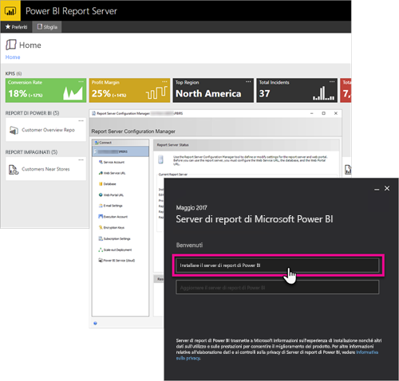

# Panoramica sul manuale per lo sviluppatore, Server di report di Power BI

Benvenuti nel manuale per lo sviluppatore del server di report di Power BI, un percorso locale per l'archiviazione e la gestione di report impaginati, per dispositivi mobili e di Power BI.

Questo manuale evidenzia le opzioni disponibili agli sviluppatori per l'uso del server di report di Power BI.

## Incorporamento

Per qualsiasi report nel server di report di Power BI è possibile incorporare in un iFrame aggiungendo il parametro querystring `?rs:Embed=true` all'URL. Questa tecnica funziona con i report di Power BI e con altri tipi di report.

### Controllo Visualizzatore report

Per i report impaginati, è possibile sfruttare il controllo Visualizzatore Report. È possibile posizionare il controllo all'interno di un'applicazione .NET Windows o Web. Per altre informazioni, vedere [Introduzione al controllo Visualizzatore Report](https://docs.microsoft.com/sql/reporting-services/application-integration/integrating-reporting-services-using-reportviewer-controls-get-started).

## API

Sono disponibili diverse opzioni di API per l'interazione con il server di report di Power BI, tra cui:

* [API REST](rest-api.md)
* [Accesso con URL](https://docs.microsoft.com/sql/reporting-services/url-access-ssrs)
* [Provider WMI](https://docs.microsoft.com/sql/reporting-services/wmi-provider-library-reference/reporting-services-wmi-provider-library-reference-ssrs)

È anche possibile usare le [utilità PowerShell](https://github.com/Microsoft/ReportingServicesTools) open source per gestire il server di report.

> [!NOTE]
> Attualmente le utilità PowerShell non supportano i file di Power BI Desktop (con estensione pbix).

## Estensioni personalizzate

La libreria di estensioni è un set di classi, interfacce e tipi di valore inclusi nel server di report di Power BI. Questa libreria fornisce l'accesso alle funzionalità del sistema ed è progettata per essere la base sula quale usare le applicazioni Microsoft .NET Framework per estendere i componenti del server di report di Power BI.

Esistono diversi tipi di estensioni che è possibile compilare.

* Estensioni per l'elaborazione dati
* Estensioni per il recapito
* Estensioni di rendering per report impaginati
* Estensioni di sicurezza

Per altre informazioni, vedere [Libreria di estensioni](https://docs.microsoft.com/sql/reporting-services/extensions/reporting-services-extension-library).

## Passaggi successivi

[Introduzione al controllo Visualizzatore Report](https://docs.microsoft.com/sql/reporting-services/application-integration/integrating-reporting-services-using-reportviewer-controls-get-started)  
[Creazione di applicazioni con il servizio Web e .NET Framework](https://docs.microsoft.com/sql/reporting-services/report-server-web-service/net-framework/building-applications-using-the-web-service-and-the-net-framework)  
[Accesso con URL](https://docs.microsoft.com/sql/reporting-services/url-access-ssrs)  
[Libreria di estensioni](https://docs.microsoft.com/sql/reporting-services/extensions/reporting-services-extension-library)  
[Provider WMI](https://docs.microsoft.com/sql/reporting-services/wmi-provider-library-reference/reporting-services-wmi-provider-library-reference-ssrs)

Altre domande? [Provare a rivolgersi alla community di Power BI](https://community.powerbi.com/)