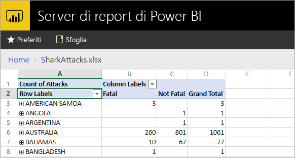
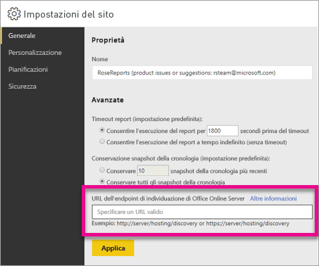

# <a name="configure-your-report-server-to-host-excel-workbooks-using-office-online-server-oos"></a>Configurare il server di report per l'hosting di cartelle di lavoro di Excel tramite Office Online Server (OOS)

Oltre a visualizzare i report di Power BI nel portale Web, Server di report di Power BI consente di ospitare cartelle di lavoro di Excel tramite [Office Online Server](https://docs.microsoft.com/officeonlineserver/office-online-server-overview) (OOS). Il server di report diventa una posizione centralizzata per la pubblicazione e la visualizzazione di contenuto Microsoft BI self-service.



## <a name="prepare-server-to-run-office-online-server"></a>Preparare il server per l'esecuzione di Office Online Server

Seguire queste procedure sul server che eseguirà Office Online Server. Il server deve essere Windows Server 2012 R2 o Windows Server 2016. Windows Server 2016 richiede Office Online Server di aprile 2017 o versione successiva.

### <a name="install-prerequisite-software-for-office-online-server"></a>Installare il software prerequisito per Office Online Server

1. Aprire il prompt di Windows PowerShell come amministratore ed eseguire questo comando per installare i ruoli e i servizi necessari.

    **Windows Server 2012 R2:**

    ```
    Add-WindowsFeature Web-Server,Web-Mgmt-Tools,Web-Mgmt-Console,Web-WebServer,Web-Common-Http,Web-Default-Doc,Web-Static-Content,Web-Performance,Web-Stat-Compression,Web-Dyn-Compression,Web-Security,Web-Filtering,Web-Windows-Auth,Web-App-Dev,Web-Net-Ext45,Web-Asp-Net45,Web-ISAPI-Ext,Web-ISAPI-Filter,Web-Includes,InkandHandwritingServices,NET-Framework-Features,NET-Framework-Core,NET-HTTP-Activation,NET-Non-HTTP-Activ,NET-WCF-HTTP-Activation45,Windows-Identity-Foundation,Server-Media-Foundation
    ```

    **Windows Server 2016:**

    ```
    Add-WindowsFeature Web-Server,Web-Mgmt-Tools,Web-Mgmt-Console,Web-WebServer,Web-Common-Http,Web-Default-Doc,Web-Static-Content,Web-Performance,Web-Stat-Compression,Web-Dyn-Compression,Web-Security,Web-Filtering,Web-Windows-Auth,Web-App-Dev,Web-Net-Ext45,Web-Asp-Net45,Web-ISAPI-Ext,Web-ISAPI-Filter,Web-Includes,NET-Framework-Features,NET-Framework-45-Features,NET-Framework-Core,NET-Framework-45-Core,NET-HTTP-Activation,NET-Non-HTTP-Activ,NET-WCF-HTTP-Activation45,Windows-Identity-Foundation,Server-Media-Foundation
    ```

    Se richiesto, riavviare il server.
2. Installare il software seguente:

   * [.NET Framework 4.5.2](https://go.microsoft.com/fwlink/p/?LinkId=510096)
   * [Visual C++ Redistributable Packages for Visual Studio 2013](https://www.microsoft.com/download/details.aspx?id=40784)
   * [Visual C++ Redistributable per Visual Studio 2015](https://go.microsoft.com/fwlink/p/?LinkId=620071)
   * [Microsoft.IdentityModel.Extention.dll](https://go.microsoft.com/fwlink/p/?LinkId=620072)

### <a name="install-office-online-server"></a>Installare Office Online Server

Se si prevede di usare funzionalità di Excel Online che utilizzano l'accesso a dati esterni, ad esempio PowerPivot, si noti che Office Online Server deve trovarsi nella stessa foresta di Active Directory in cui si trovano gli utenti ed eventuali origini dati esterne a cui si prevede di accedere tramite l'autenticazione basata su Windows.

1. Scaricare Office Online Server dal [Volume Licensing Service Center (VLSC)](http://go.microsoft.com/fwlink/p/?LinkId=256561). Il download è disponibile sotto i prodotti Office nel portale di VLSC. Per finalità di sviluppo, è possibile scaricare Office Online Server dai download per gli abbonati MSDN.
2. Eseguire Setup.exe.
3. Nella pagina **Leggi le Condizioni di licenza software Microsoft** selezionare **Accetto i termini del contratto** e quindi selezionare **Continua**.
4. Nella pagina **Scegliere il percorso del file** selezionare la cartella in cui installare i file di Office Online Server, ad esempio C:\Programmi\Microsoft Office Web Apps* e quindi selezionare **Installa ora**. Se la cartella specificata non esiste, verrà creata automaticamente dal programma di installazione.

    È consigliabile installare Office Online Server nell'unità di sistema.

5. Al termine dell'installazione di Office Online Server, selezionare **Chiudi**.

### <a name="install-language-packs-for-office-web-apps-server-optional"></a>Installare i Language Pack per Server Office Web Apps (facoltativo)

I Language Pack di Office Online Server consentono agli utenti di visualizzare i file di Office basati sul Web in più lingue.

Per installare i Language Pack, seguire questa procedura.

1. Scaricare i Language Pack di Office Online Server dall'[Area download Microsoft](http://go.microsoft.com/fwlink/p/?LinkId=798136).
2. Eseguire **wacserverlanguagepack.exe**.
3. Nella pagina **Leggi le Condizioni di licenza software Microsoft** della procedura guidata del Language Pack di Office Online Server selezionare **Accetto i termini del contratto** e quindi selezionare **Continua**.
4. Al termine dell'installazione di Office Online Server, selezionare **Chiudi**.

## <a name="deploy-office-online-server"></a>Distribuire Office Online Server

### <a name="create-the-office-online-server-farm-https"></a>Creare la farm di Office Online Server (HTTPS)

Usare il comando New-OfficeWebAppsFarm per creare una nuova farm di Office Online Server costituita da un singolo server, come mostrato nell'esempio seguente.

```
New-OfficeWebAppsFarm -InternalUrl "https://server.contoso.com" -ExternalUrl "https://wacweb01.contoso.com" -CertificateName "OfficeWebApps Certificate"
```

**Parametri**

* **–InternalURL** è il nome di dominio completo del server che esegue Office Online Server, ad esempio `http://servername.contoso.com`.
* **–ExternalURL** è il nome di dominio completo accessibile su Internet.
* **–CertificateName** è il nome descrittivo del certificato.

### <a name="create-the-office-online-server-farm-http"></a>Creare la farm di Office Online Server (HTTP)

Usare il comando New-OfficeWebAppsFarm per creare una nuova farm di Office Online Server costituita da un singolo server, come mostrato nell'esempio seguente.

```
New-OfficeWebAppsFarm -InternalURL "http://servername" -AllowHttp
```

**Parametri**

* **–InternalURL** è il nome del server che esegue Office Online Server, ad esempio `http://servername`.
* **–AllowHttp** configura la farm per l'uso di HTTP.

### <a name="verify-that-the-office-online-server-farm-was-created-successfully"></a>Verificare che la farm di Office Online Server sia stata creata correttamente

Dopo la creazione della farm, i dettagli relativi alla farm vengono visualizzati nel prompt di Windows PowerShell. Per verificare che Office Online Server sia installato e configurato correttamente, usare un Web browser per accedere all'URL di individuazione di Office Online Server, come mostrato nell'esempio seguente. L'URL di individuazione è il parametro *InternalUrl* specificato durante la configurazione della farm di Office Online Server, seguito da */hosting/discovery*, ad esempio:

```
<InternalUrl>/hosting/discovery
```

Se Office Online Server funziona come previsto, dovrebbe essere visualizzato un file XML di individuazione WOPI (Web Application Open Platform Interface Protocol) nel Web browser. Le prime righe del file dovrebbero essere simili all'esempio seguente:

```
<?xml version="1.0" encoding="utf-8" ?> 
- <wopi-discovery>
- <net-zone name="internal-http">
- <app name="Excel" favIconUrl="<InternalUrl>/x/_layouts/images/FavIcon_Excel.ico" checkLicense="true">
<action name="view" ext="ods" default="true" urlsrc="<InternalUrl>/x/_layouts/xlviewerinternal.aspx?<ui=UI_LLCC&><rs=DC_LLCC&>" /> 
<action name="view" ext="xls" default="true" urlsrc="<InternalUrl>/x/_layouts/xlviewerinternal.aspx?<ui=UI_LLCC&><rs=DC_LLCC&>" /> 
<action name="view" ext="xlsb" default="true" urlsrc="<InternalUrl>/x/_layouts/xlviewerinternal.aspx?<ui=UI_LLCC&><rs=DC_LLCC&>" /> 
<action name="view" ext="xlsm" default="true" urlsrc="<InternalUrl>/x/_layouts/xlviewerinternal.aspx?<ui=UI_LLCC&><rs=DC_LLCC&>" /> 
```

### <a name="configure-excel-workbook-maximum-size"></a>Configurare le dimensioni massime delle cartelle di lavoro di Excel

Le dimensioni massime del file per tutti i file nel Server di report di Power BI sono 100 MB. Per rispettare tale limite, è necessario configurarlo manualmente in Office Online Server.

```
Set-OfficeWebAppsFarm -ExcelWorkbookSizeMax 100
```

## <a name="using-effectiveusername-with-analysis-services"></a>Uso di EffectiveUserName con Analysis Services

È necessario consentire le connessioni dinamiche ad Analysis Services per le connessioni in una cartella di lavoro di Excel che usano EffectiveUserName. Per consentire a Office Online Server di usare EffectiveUserName, è necessario aggiungere l'account del computer del server di Office Online Server come amministratore per l'istanza di Analysis Services. A questo scopo, è necessario Management Studio per SQL Server 2016 o versione successiva.

In una cartella di lavoro di Excel sono attualmente supportate solo le connessioni incorporate di Analysis Services. L'account utente dovrà avere l'autorizzazione per la connessione ad Analysis Services, perché non è disponibile la possibilità di proxy per l'utente.

Eseguire i comandi di PowerShell seguenti nel server di Office Online Server.

```
Set-OfficeWebAppsFarm -ExcelUseEffectiveUserName:$true
Set-OfficeWebAppsFarm -ExcelAllowExternalData:$true
Set-OfficeWebAppsFarm -ExcelWarnOnDataRefresh:$false
```

## <a name="configure-a-power-pivot-instance-for-data-models"></a>Configurare un'istanza di PowerPivot per i modelli di dati

L'installazione di un'istanza di Analysis Services in modalità PowerPivot consente di usare le cartelle di lavoro di Excel che usano PowerPivot. Assicurarsi che il nome dell'istanza sia *POWERPIVOT*. Aggiungere l'account del computer del server di Office Online Server come amministratore per l'istanza di Analysis Services in modalità PowerPivot. A questo scopo, è necessario Management Studio per SQL Server 2016 o versione successiva.

Per consentire a Office Online Server di usare l'istanza in modalità PowerPivot, eseguire il comando seguente.

```
New-OfficeWebAppsExcelBIServer -ServerId <server_name>\POWERPIVOT
```

Se non sono già consentiti i dati esterni, dal passaggio precedente relativo ad Analysis Services eseguire il comando seguente.

```
Set-OfficeWebAppsFarm -ExcelAllowExternalData:$true
```

### <a name="firewall-considerations"></a>Considerazioni relative al firewall

Per evitare problemi relativi al firewall, potrebbe essere necessario aprire le porte 2382 e 2383. È anche possibile aggiungere *msmdsrv.exe* per l'istanza di Power Pivot come criterio del firewall dell'applicazione.

## <a name="configure-power-bi-report-server-to-use-the-oos-server"></a>Configurare il Server di report di Power BI per l'uso del server di Office Online Server

Nella pagina **Generale** di **Impostazioni del sito** immettere l'URL di individuazione di Office Online Server. L'URL di individuazione di Office Online Server corrisponde al valore *InternalUrl*, usato durante la distribuzione del server di Office Online Server, seguito da */hosting/discovery*. Ad esempio, `http://servername/hosting/discovery`, per HTTP. E `https://server.contoso.com/hosting/discovery` per HTTPS.

Per passare a **Impostazioni del sito**, selezionare l'**icona a forma di ingranaggio** in alto a destra e quindi selezionare **Impostazioni del sito**.

Solo un utente con ruolo **Amministratore sistema** potrà visualizzare l'impostazione relativa all'URL di individuazione di Office Online Server.



Dopo avere immesso l'URL di individuazione e avere selezionato **Applica**, la selezione di una cartella di lavoro di Excel nel portale Web consente di visualizzare la cartella di lavoro nel portale Web.

## <a name="limitations-and-considerations"></a>Limitazioni e considerazioni

* È possibile accedere alle cartelle di lavoro in modalità di sola lettura.

## <a name="next-steps"></a>Passaggi successivi

[Panoramica amministratore](admin-handbook-overview.md)  
[Installare il server di report di Power BI](install-report-server.md)  
[Scaricare Generatore report](https://www.microsoft.com/download/details.aspx?id=53613)  
[Scaricare SQL Server Data Tools (SSDT)](http://go.microsoft.com/fwlink/?LinkID=616714)

Altre domande? [Provare a rivolgersi alla community di Power BI](https://community.powerbi.com/)