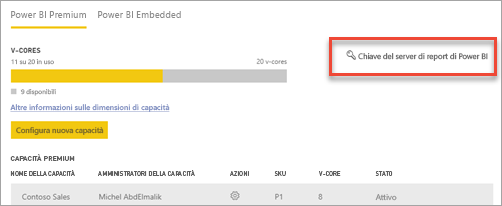
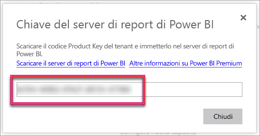
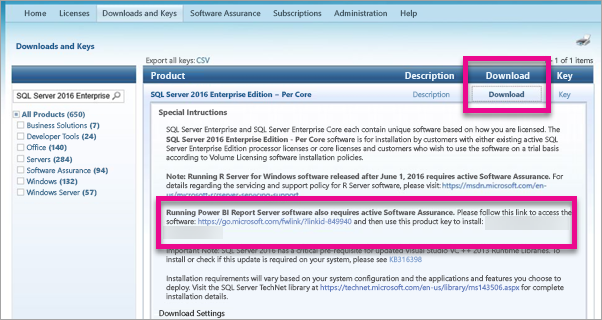

# Come trovare il codice Product Key del server di report
Informazioni su come è possibile trovare il codice Product Key del server di report di Power BI per installare il server in un ambiente di produzione.

<iframe width="640" height="360" src="https://www.youtube.com/embed/6CQnf-NGtpU?rel=0&amp;showinfo=0" frameborder="0" allowfullscreen></iframe>

Si è scaricato il server di report di Power BI e sottoscritto un contratto SQL Server Enterprise Software Assurance oppure si è acquistato Power BI Premium. Si vuole installare il server in un ambiente di produzione, ma è necessario un codice Product Key a tale scopo. Dove è il codice Product Key? 

Il codice Product Key sarà in una di due posizioni a seconda di ciò che è stato acquistato.

## Acquisto di Power BI Premium
Se è stato acquistato Power BI Premium, nella scheda **Impostazioni di capacità** del portale di amministratore di Power BI, si avrà accesso al codice Product Key del Server di Report di Power BI. Questo sarà disponibile solo per gli amministratori globali o per gli utenti a cui è stato assegnato il ruolo di amministratore del servizio Power BI.

Se si seleziona **Chiave del server di report di Power BI** viene visualizzata una finestra di dialogo contenente il codice Product Key. È possibile copiarlo e usarlo durante l'installazione.

## Contratto Software Assurance acquistato
Se si dispone di un contratto SQL Server Enterprise SA, è possibile ottenere il codice Product Key dal [Centro servizi per contratti multilicenza](https://www.microsoft.com/Licensing/servicecenter/). Cercare l'ultima versione di SQL Server nel service pack più recente. Se non è presente, cercare nell'ultima versione RTM di SQL Server.

> [!NOTE]
> È necessario cercare nella sezione dedicata ai download, non in quella delle chiavi.
> 
> 

## Passaggi successivi
[Installare il server di report di Power BI](install-report-server.md)  
[Installare Power BI Desktop ottimizzato per il server di report di Power BI](install-powerbi-desktop.md)  
[Scaricare Generatore report](https://www.microsoft.com/download/details.aspx?id=53613)  
[Scaricare SQL Server Data Tools (SSDT)](http://go.microsoft.com/fwlink/?LinkID=616714)

Altre domande? [Provare a rivolgersi alla community di Power BI](https://community.powerbi.com/)

