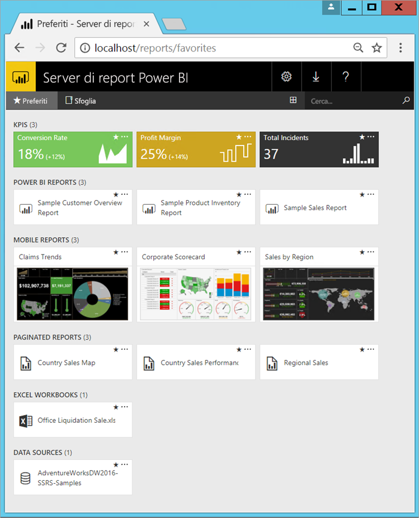
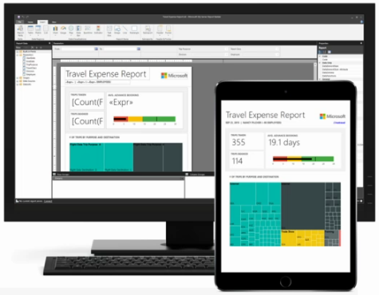

# Che cos'è Server di report di Power BI?

Server di report di Power BI è un server di report locale con un portale Web in cui vengono visualizzati e gestiti report e indicatori KPI. Insieme al server vengono offerti strumenti per creare report di Power BI, report impaginati, report per dispositivi mobili e indicatori KPI. Gli utenti possono accedere ai report in vari modi, ad esempio in un Web browser, in un dispositivo mobile o come messaggio di posta elettronica nella posta in arrivo.

## Confronto di Server di report di Power BI 
Server di report di Power BI è simile a SQL Server Reporting Services e al servizio Power BI online, ma per aspetti diversi. Come il servizio Power BI, Server di report di Power BI ospita report di Power BI (file con estensione pbix), file di Excel e report impaginati (con estensione rdl). Come Reporting Services, Server di report di Power BI è in locale. Le funzionalità di Server di report di Power BI sono un soprainsieme di Reporting Services. In Server di report di Power BI si può fare tutto ciò che si fa in Reporting Services, con l'aggiunta del supporto per i report di Power BI. Per informazioni dettagliate, vedere [Confronto tra Server di report di Power BI e il servizio Power BI](compare-report-server-service.md).

## Licenze di Server di report di Power BI
Il Server di report di Power BI è disponibile tramite due licenze diverse: [Power BI Premium](../admin/service-premium-what-is.md) e SQL Server Enterprise Edition con Software Assurance. Per informazioni dettagliate, vedere [Microsoft Volume Licensing](https://www.microsoftvolumelicensing.com/DocumentSearch.aspx?Mode=3&DocumentTypeId=1&ShowArchived=True). Con una licenza di Power BI Premium è possibile creare una distribuzione ibrida cloud e locale.  

> [!NOTE]
> Per Power BI Premium, Server di report di Power BI è incluso solo con gli SKU P. Non è incluso con gli SKU EM.

## Portale Web
Il punto di ingresso a Server di report di Power BI è un portale Web sicuro che può essere visualizzato in qualsiasi browser moderno. Da qui si accede a tutti i report e agli indicatori KPI. Il contenuto sul portale Web è organizzato in una gerarchia di cartelle tradizionale. Nelle cartelle il contenuto è raggruppato per tipo: report di Power BI, report per dispositivi mobili, report impaginati, indicatori KPI e cartelle di lavoro di Excel. I set di dati e le origini dati condivisi sono archiviati in cartelle personalizzate, da usare come blocchi predefiniti per i report. È possibile contrassegnare gli elementi preferiti per visualizzarli in un'unica cartella e creare direttamente gli indicatori KPI nel portale Web. 

A seconda delle autorizzazioni di cui si dispone, è possibile gestire il contenuto nel portale Web. È possibile pianificare l'elaborazione dei report, accedere ai report su richiesta e sottoscrivere report pubblicati. È anche possibile [personalizzare](https://docs.microsoft.com/sql/reporting-services/branding-the-web-portal) il portale Web. 

Altre informazioni sul [portale Web di Server di report di Power BI](https://docs.microsoft.com/sql/reporting-services/web-portal-ssrs-native-mode).

## Report di Power BI
I report di Power BI (file con estensione pbix) si creano con la versione di Power BI Desktop ottimizzata per il server di report. Dopo la creazione, è possibile pubblicarli e visualizzarli nel portale Web nel proprio ambiente.

Un report di Power BI consente di visualizzare un modello di dati da più punti di vista, grazie a visualizzazioni che rappresentano conclusioni e approfondimenti diversi ottenuti da tale modello di dati.  Un report può includere una sola visualizzazione oppure contenere pagine con più visualizzazioni. In base al proprio ruolo, è possibile leggere ed esplorare i report oppure crearli per altri utenti.

Informazioni sull'[installazione di Microsoft Power BI Desktop](install-powerbi-desktop.md).

## Report impaginati
I report impaginati (file con estensione rdl) sono report in formato documento con visualizzazioni, in cui tabelle si espandono orizzontalmente e verticalmente per mostrare tutti i dati, continuando da una pagina all'altra in base alle esigenze. Sono ideali per generare documenti con layout fisso e ad alta risoluzione grafica ottimizzati per la stampa, ad esempio file in formato PDF e Word. 

È possibile creare report impaginati con [Generatore report](https://docs.microsoft.com/sql/reporting-services/report-builder/report-builder-in-sql-server-2016) o Progettazione report in [SQL Server Data Tools (SSDT)](https://docs.microsoft.com/sql/reporting-services/tools/reporting-services-in-sql-server-data-tools-ssdt).

## Report per dispositivi mobili di Reporting Services
I report per dispositivi mobili si connettono ai dati locali e hanno un layout reattivo che si adatta a diversi dispositivi e ai diversi modi per impugnarli. Si creano con Microsoft SQL Server Mobile Report Publisher.

Altre informazioni sui [Report per dispositivi mobili di Reporting Services](https://docs.microsoft.com/sql/reporting-services/mobile-reports/create-mobile-reports-with-sql-server-mobile-report-publisher). 

## Funzionalità di programmazione del server di report
È possibile sfruttare le funzionalità di programmazione di Server di report di Power BI in modo da estendere e personalizzare i report, con API che consentono di integrare o estendere l'elaborazione di dati e report nelle applicazioni personalizzate.

Altra [documentazione per sviluppatori di server di report](https://docs.microsoft.com/sql/reporting-services/reporting-services-developer-documentation).

## Passaggi successivi
[Installare il server di report di Power BI](install-report-server.md)  
[Scaricare Generatore report](https://www.microsoft.com/download/details.aspx?id=53613)  

Altre domande? [Provare a rivolgersi alla community di Power BI](https://community.powerbi.com/)
