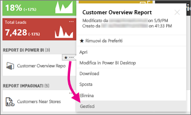
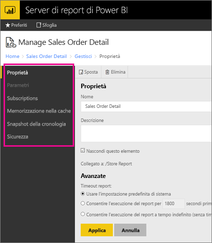

# Gestire il contenuto nel portale Web 
Il portale Web del Server di report di Power BI è un percorso locale per la visualizzazione, l'archiviazione e la gestione di indicatori KPI e di report impaginati, per dispositivi mobili e di Power BI.

È possibile visualizzare il portale Web in qualsiasi browser moderno. Nel portale Web, i report e gli indicatori KPI sono organizzati in cartelle ed è possibile contrassegnarli come Preferiti. È anche possibile archiviare qui le cartelle di lavoro Excel. Dal portale web, è possibile avviare gli strumenti necessari per creare report:

* **Report di Power BI** creati con Power BI Desktop: è possibile visualizzarli nel portale Web e nelle app Power BI per dispositivi mobili.
* **Report impaginati** creati in Generatore Report: documenti dall'aspetto moderno, con layout fisso e ottimizzati per la stampa.
* **Indicatori KPI** creati direttamente nel portale Web.

Nel portale Web è possibile esplorare le cartelle del server di report o cercare report specifici. È possibile visualizzare un report, le sue proprietà generali e vecchie copie del report che vengono acquisite nella cronologia del report. A seconda delle autorizzazioni, è anche possibile sottoscrivere il recapito dei report nella posta in arrivo o in una cartella condivisa nel file system.

## Ruoli e autorizzazioni del portale Web
L'applicazione del portale Web viene eseguita in un browser. Quando si avvia il portale Web, le pagine, i collegamenti e le opzioni visualizzati variano in base alle autorizzazioni dell'utente nel server di report. Se all'utente viene assegnato un ruolo con autorizzazioni complete, è possibile accedere al set completo di menu e pagine dell'applicazione per la gestione di un server di report. Se all'utente viene assegnato un ruolo con autorizzazioni per visualizzare ed eseguire report, verranno visualizzati solo i menu e le pagine necessari per tali attività. È possibile avere diverse assegnazioni di ruolo per diversi server di report o anche per i vari report e cartelle in un singolo server di report.

## Avviare il portale Web
1. Aprire il Web browser.
   
    Consultare l'elenco [Web browser e versioni supportati](browser-support.md).
2. Digitare l'URL del portale Web nella barra degli indirizzi.
   
    Per impostazione predefinita, l'URL è *http://[NomeComputer]/reports*.
   
    Il server di report potrebbe essere configurato in modo da usare una porta specifica. Ad esempio, *http://[NomeComputer]:80/reports* o *http://[NomeComputer]:8080/reports*
   
    Si noterà che il portale Web raggruppa gli elementi nelle categorie seguenti:
   
   * Indicatori KPI
   * Report per dispositivi mobili
   * Report impaginati
   * Report di Power BI Desktop
   * Cartelle di lavoro di Excel
   * Set di dati
   * Origini dati
   * Risorse

## Gestire gli elementi nel portale Web
Il Server di Report di Power BI offre un controllo dettagliato degli elementi archiviati nel portale Web. Ad esempio, è possibile impostare sottoscrizioni, memorizzazione nella cache, snapshot e sicurezza per i singoli report impaginati.

1. Selezionare i puntini di sospensione (...) nell'angolo superiore destro di un elemento e quindi selezionare **Gestisci**.
   
    
2. Scegliere la proprietà o altre funzionalità che si vogliono impostare.
   
    
3. Selezionare **Applica**.

Altre informazioni sull'[utilizzo delle sottoscrizioni nel portale Web](https://docs.microsoft.com/sql/reporting-services/working-with-subscriptions-web-portal).

## Passaggi successivi
[Manuale per l'utente](user-handbook-overview.md)  
[Report impaginati](quickstart-create-paginated-report.md)  
[Report di Power BI](quickstart-create-powerbi-report.md)

Altre domande? [Provare a rivolgersi alla community di Power BI](https://community.powerbi.com/)

