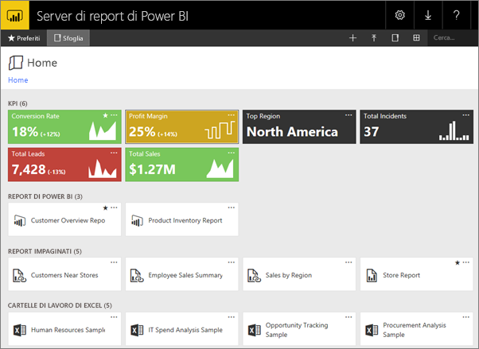
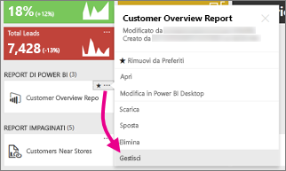

# Esplorazione del portale Web del Server di report di Power BI
Il portale Web del Server di report di Power BI è un percorso locale per la visualizzazione, l'archiviazione e la gestione di indicatori KPI e di report impaginati, per dispositivi mobili e di Power BI.

È possibile visualizzare il portale Web in qualsiasi browser moderno. Nel portale Web, i report e gli indicatori KPI sono organizzati in cartelle ed è possibile contrassegnarli come Preferiti. È anche possibile archiviare qui le cartelle di lavoro Excel. Dal portale web, è possibile avviare gli strumenti necessari per creare report:

* **Report di Power BI** creati con Power BI Desktop: è possibile visualizzarli nel portale Web e nelle app Power BI per dispositivi mobili.
* **Report impaginati** creati in Generatore Report: documenti dall'aspetto moderno, con layout fisso e ottimizzati per la stampa.
* **Indicatori KPI** creati direttamente nel portale Web.

Nel portale Web è possibile esplorare le cartelle del server di report o cercare report specifici. È possibile visualizzare un report, le sue proprietà generali e vecchie copie del report che vengono acquisite nella cronologia del report. A seconda delle autorizzazioni, è anche possibile sottoscrivere il recapito dei report nella posta in arrivo o in una cartella condivisa nel file system.

## Attività del portale Web
È possibile usare il portale Web per una serie di attività, tra cui:

* Visualizzare, cercare, stampare e sottoscrivere report.
* Creare, proteggere e gestire la gerarchia di cartelle per organizzare gli elementi sul server.
* Configurare le proprietà di esecuzione, la cronologia e i parametri dei report.
* Creare pianificazioni e origini dati condivise per rendere più gestibili le connessioni alle origini dati e alle pianificazioni.
* Creare sottoscrizioni basate sui dati per implementare i report in un lungo elenco di destinatari.
* Creare report collegati per riutilizzare e reimpiegare un report esistente in modi diversi.
* Scaricare e aprire strumenti comuni, ad esempio Power BI Desktop (Server di Report), Generatore Report e Mobile Report Publisher.
* [Creare gli indicatori KPI](https://docs.microsoft.com/sql/reporting-services/working-with-kpis-in-reporting-services).
* Inviare commenti e suggerimenti o richieste di funzionalità.
* [Personalizzazione del portale Web](https://docs.microsoft.com/sql/reporting-services/branding-the-web-portal)
* [Utilizzo di indicatori KPI](https://docs.microsoft.com/sql/reporting-services/working-with-kpis-in-reporting-services)
* [Utilizzo di set di dati condivisi](https://docs.microsoft.com/sql/reporting-services/work-with-shared-datasets-web-portal)

## Ruoli e autorizzazioni del portale Web
Il portale web è un'applicazione web che viene eseguita in un browser. Quando si avvia il portale Web, le pagine, i collegamenti e le opzioni visualizzati variano in base alle autorizzazioni dell'utente nel server di report. Se all'utente viene assegnato un ruolo con autorizzazioni complete, è possibile accedere al set completo di menu e pagine dell'applicazione per la gestione di un server di report. Se all'utente viene assegnato un ruolo con autorizzazioni per visualizzare ed eseguire report, verranno visualizzati solo i menu e le pagine necessari per tali attività. È possibile avere diverse assegnazioni di ruolo per diversi server di report o anche per i vari report e cartelle in un singolo server di report.

## Avviare il portale Web
1. Aprire il Web browser.
   
    Consultare l'elenco [Web browser e versioni supportati](browser-support.md).
2. Digitare l'URL del portale Web nella barra degli indirizzi.
   
    Per impostazione predefinita, l'URL è *http://[NomeComputer]/reports*.
   
    Il server di report potrebbe essere configurato in modo da usare una porta specifica. Ad esempio, *http://[NomeComputer]:80/reports* o *http://[NomeComputer]:8080/reports*
   
    Si noterà che il portale Web raggruppa gli elementi nelle categorie seguenti:
   
   * Indicatori KPI
   * Report per dispositivi mobili
   * Report impaginati
   * Report di Power BI Desktop
   * Cartelle di lavoro di Excel
   * Set di dati
   * Origini dati
   * Risorse

## Creare e modificare i report di Power BI Desktop (file PBIX)
È possibile visualizzare, caricare, creare, organizzare e gestire le autorizzazioni per i report di Power BI Desktop nel portale Web.

### Creare un report di Power BI Desktop
1. Selezionare **Nuovo** > **Report di Power BI**.
   
    
   
    Verrà visualizzata l'app Power BI Desktop.
   
    
2. Creare il report di Power BI. Per informazioni dettagliate, vedere [Avvio rapido: report di Power BI](quickstart-create-powerbi-report.md).
3. Caricare il report nel server di report.

### Modificare un report di Power BI Desktop esistente
1. Selezionare i puntini di sospensione (**...**) nell'angolo superiore destro del riquadro del report > **Modifica in Power BI Desktop**.
   
    
   
    Verrà visualizzata l'app Power BI Desktop.
2. Apportare le modifiche e salvare.

## Creare e modificare report impaginati (file RDL)
È possibile visualizzare, caricare, creare, organizzare e gestire le autorizzazioni per i report impaginati nel portale Web.

### Creare un report impaginato
1. Selezionare **Nuovo** > **Report impaginato**.
   
    Viene visualizzata l'app Generatore report.
   
    
2. Creare il report impaginato. Per informazioni dettagliate, vedere [Avvio rapido: report impaginati](quickstart-create-paginated-report.md).
3. Caricare il report nel server di report.

### Modificare un report impaginato esistente
1. Selezionare i puntini di sospensione (...) nell'angolo superiore destro del riquadro del report > **Modifica in Generatore report**.
   
    
   
    Viene visualizzata l'app Generatore report.
2. Apportare le modifiche e salvare.

## Caricare e organizzare le cartelle di lavoro di Excel
È possibile caricare, organizzare e gestire le autorizzazioni per i report di Power BI Desktop e le cartelle di lavoro di Excel, che saranno raggruppati nel portale Web.

Le cartelle di lavoro vengono archiviate all'interno del Server di report di Power BI, analogamente ad altri file di risorse. Selezionando una delle cartelle di lavoro verrà effettuato il download in locale sul desktop. È possibile salvare le modifiche apportate caricandola nuovamente sul server di report.

## Gestire gli elementi nel portale Web
Il Server di Report di Power BI offre un controllo dettagliato degli elementi archiviati nel portale Web. Ad esempio, è possibile impostare sottoscrizioni, memorizzazione nella cache, snapshot e sicurezza per i singoli report impaginati.

1. Selezionare i puntini di sospensione (...) nell'angolo superiore destro di un elemento e quindi selezionare **Gestisci**.
   
    
2. Scegliere la proprietà o altre funzionalità che si vogliono impostare.
   
    
3. Selezionare **Applica**.

Altre informazioni sull'[utilizzo delle sottoscrizioni nel portale Web](https://docs.microsoft.com/sql/reporting-services/working-with-subscriptions-web-portal).

## Contrassegnare i report gli indicatori KPI preferiti
È possibile contrassegnare i report e gli indicatori KPI come preferiti. Sono più semplici da trovare perché sono tutti raccolti in una singola cartella Preferiti nel portale Web e nelle app Power BI per dispositivi mobili. 

1. Selezionare i puntini di sospensione (**…**) nell'angolo superiore destro dell'indicatore KPI o del report da impostare come preferito e selezionare **Aggiungi a Preferiti**.
   
    
2. Selezionare **Preferiti** sulla barra multifunzione del portale Web per visualizzarlo insieme agli altri preferiti nella pagina Preferiti nel portale Web.
   
    
   
    A questo punto, nelle app Power BI per dispositivi mobili si vedranno questi preferiti insieme ai dashboard preferiti del servizio Power BI.
   
    

## Nascondere o visualizzare gli elementi nel portale Web
È possibile nascondere gli elementi nel portale Web e scegliere di visualizzare gli elementi nascosti.

### Nascondere un elemento
1. Selezionare i puntini di sospensione (...) nell'angolo superiore destro di un elemento e quindi selezionare **Gestisci**.
   
    
2. Selezionare **Nascondi questo elemento**.
   
    
3. Selezionare **Applica**.

### Visualizzare gli elementi nascosti
1. Selezionare **Riquadri** (o **Elenco**) nell'angolo superiore destro > **Mostra elementi nascosti**.
   
    Gli elementi vengono visualizzati in grigio, ma è comunque possibile aprirli e modificarli.
   
    

## Ricerca di elementi
È possibile immettere un termine di ricerca per visualizzare tutto ciò a cui è possibile accedere. I risultati sono suddivisi in categorie come indicatori KPI, report, set di dati e altri elementi. È quindi possibile interagire con i risultati e aggiungerli all'elenco dei Preferiti.  

## Spostare o eliminare elementi nella Visualizzazione elenco
Per impostazione predefinita, il portale Web visualizza il relativo contenuto nella Visualizzazione affiancata.

È possibile passare alla Visualizzazione elenco, in cui è facile spostare o eliminare più elementi contemporaneamente. 

1. Selezionare **Riquadri** > **Elenco**.
   
    
2. Selezionare gli elementi e quindi **Sposta** o **Elimina**.

## Passaggi successivi
[Manuale per l'utente](user-handbook-overview.md)  
[Avvio rapido: report impaginati](quickstart-create-paginated-report.md)  
[Avvio rapido: report di Power BI](quickstart-create-powerbi-report.md)

Altre domande? [Provare a rivolgersi alla community di Power BI](https://community.powerbi.com/)

