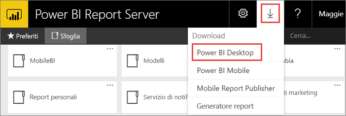
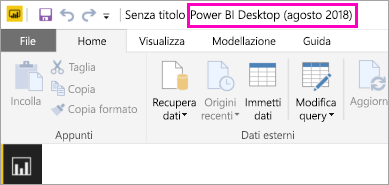
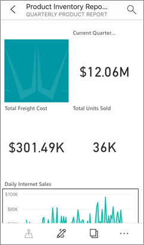

# Installare Power BI Desktop ottimizzato per il server di report di Power BI
Informazioni su come installare Power BI Desktop ottimizzato per il server di report di Power BI.

Per creare report di Power BI per il server di report di Power BI, è necessario installare Power BI Desktop ottimizzato per il server di report di Power BI. Si tratta di una versione diversa dalla versione di Power BI Desktop usata con il servizio Power BI, Ad esempio, la versione di Power BI Desktop per il servizio Power BI include funzionalità in anteprima disponibili nella versione del server di report di Power BI solo dopo il rilascio. necessaria per assicurarsi che il server di report possa interagire con una versione nota dei report e del modello. 

Ora è possibile installare side-by-side sullo stesso computer Power BI Desktop e Power BI Desktop ottimizzato per il server di report di Power BI.

## Scaricare e installare Power BI Desktop

Il modo più facile per assicurarsi di aver installato la versione più aggiornata di Power BI Desktop ottimizzato per il server di report di Power BI è iniziare dal portale Web del server di report.

1. Nel portale Web del server di report selezionare la freccia **Scarica** > **Power BI Desktop**.

    

    In alternativa, è possibile passare direttamente a [Microsoft Power BI Desktop](https://www.microsoft.com/download/details.aspx?id=57271) (ottimizzato per il server di report di Power BI - Agosto 2018) nell'Area download Microsoft.

2. Nella pagina dell'Area download selezionare **Scarica**.

3. In base al computer specifico, selezionare: 

    - **PBIDesktopRS.msi** (versione a 32 bit) oppure

    - **PBIDesktopRS_x64.msi** (versione a 64 bit).

1. Dopo il download del programma di installazione, eseguire l'installazione guidata di Power BI Desktop (agosto 2018).

2. Al termine dell'installazione, selezionare **Avvia Power BI Desktop**.
   
    Verrà avviato automaticamente e si è pronti per iniziare.

## Verificare di usare la versione corretta
È possibile verificare che si sta usando la versione corretta di Power BI Desktop esaminando la schermata di avvio o la barra del titolo all'interno di Power BI Desktop. La barra del titolo indicherà il mese e l'anno di rilascio della versione.

La versione di Power BI Desktop per il servizio Power BI non avrà il mese e l'anno nella barra del titolo.

## Associazione dell'estensione di file
Se sono stati installati sia Power BI Desktop sia Power BI Desktop ottimizzato per il server di report di Power BI nello stesso computer, l'ultima installazione di Power BI desktop avrà l'associazione file con l'estensione pbix. Ciò significa che quando si fa doppio clic su un file PBIX, verrà avviata la versione di Power BI Desktop installata per ultima.

Se è stata eseguita l'installazione di Power BI Desktop ottimizzato per il server di report di Power BI in un computer che conteneva già Power BI Desktop, per impostazione predefinita tutti i file PBIX verranno aperti in Power BI Desktop ottimizzato per il server di report di Power BI. Se invece si preferisce avviare per impostazione predefinita Power BI Desktop all'apertura di un file PBIX, reinstallarlo dal servizio Power BI.

È sempre possibile aprire la versione di Power BI Desktop che si vuole usare per prima, quindi aprire il file da Power BI Desktop.

Se si modifica un report di Power BI da un server di report di Power BI o si crea un nuovo report di Power BI dal portale Web, verrà sempre aperta la versione corretta di Power BI Desktop.

## Considerazioni e limitazioni
I report Power BI nel server di report di Power BI, nel servizio Power BI (http://app.powerbi.com)) e nelle app per dispositivi mobili Power BI funzionano in modo quasi identico, ma alcune funzionalità sono diverse.

### In un browser
I report del server di report di Power BI supportano tutte le visualizzazioni, tra cui:

* Oggetti visivi personalizzati

I report del server di report di Power BI non supportano:

* Oggetti visivi R
* Mappe di ArcGIS
* Percorsi di navigazione
* Funzionalità in anteprima di Power BI Desktop

### Nelle app Power BI per dispositivi mobili
I report del server di report di Power BI supportano tutte le funzionalità di base nelle [app Power BI per dispositivi mobili](../consumer/mobile/mobile-apps-for-mobile-devices.md), tra cui:

* [Layout del report per il telefono](../desktop-create-phone-report.md): è possibile ottimizzare un report per le app Power BI per dispositivi mobili. Sul telefono cellulare i report ottimizzati hanno un layout e un'icona speciale, .
  
    

I report del server di report di Power BI non supportano queste funzionalità nelle app Power BI per dispositivi mobili:

* Oggetti visivi R
* Mappe di ArcGIS
* Oggetti visivi personalizzati
* Percorsi di navigazione
* Filtro geografico o codici a barre

## Power BI Desktop per le versioni precedenti del server di report di Power BI

Se la versione del server di report è precedente, è necessario disporre della versione corrispondente di Power BI Desktop. Di seguito sono elencate le due versioni precedenti.

- Microsoft Power BI Desktop ([ottimizzato per il server di report di Power BI - ottobre 2017](https://www.microsoft.com/download/details.aspx?id=56136))
- Microsoft Power BI Desktop ([ottimizzato per il server di report di Power BI - giugno 2017](https://www.microsoft.com/download/details.aspx?id=55330))

## Passaggi successivi
Ora che è stato installato Power BI Desktop, è possibile iniziare a creare i report di Power BI.

[Creare un report di Power BI per Server di report di Power BI](quickstart-create-powerbi-report.md)  
[Che cos'è Server di report di Power BI?](get-started.md)

Altre domande? [Provare a rivolgersi alla community di Power BI](https://community.powerbi.com/)

