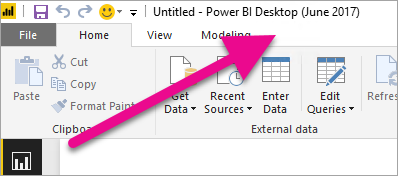

# Installare Power BI Desktop ottimizzato per il server di report di Power BI
Informazioni su come installare Power BI Desktop ottimizzato per il server di report di Power BI.

È necessario scaricare e installare Power BI Desktop ottimizzato per il server di report di Power BI. Si tratta di una versione diversa da quella usata con il servizio Power BI, necessaria per assicurarsi che il server di report possa essere indiretto con una versione nota dei report e del modello. 

> [!NOTE]
> Power BI Desktop e Power BI Desktop ottimizzato per il server di report di Power BI possono essere installati side-by-side.
> 
> 

## Download e installazione
È possibile scaricare Power BI Desktop ottimizzato per il server di report di Power BI dall'[Area download Microsoft](https://go.microsoft.com/fwlink/?linkid=837581) o dal portale Web del server di report.

Dopo aver scaricato il programma di installazione, è possibile installare Power BI Desktop.

## Verificare di usare la versione corretta
È possibile verificare che si sta usando la versione corretta di Power BI Desktop esaminando la schermata di avvio o la barra del titolo all'interno di Power BI Desktop. La barra del titolo indicherà il mese e l'anno di rilascio.

La versione di Power BI Desktop per il servizio Power BI non avrà il mese e l'anno nella barra del titolo.

## Associazione dell'estensione di file
Se sono stati installati sia Power BI Desktop sia Power BI Desktop ottimizzato per il server di report di Power BI nello stesso computer, l'ultima installazione di Power BI desktop avrà l'associazione file con l'estensione pbix. Ciò significa che quando si fa doppio clic su un file PBIX, verrà avviata la versione di Power BI Desktop installata per ultima.

Se è stata eseguita l'installazione di Power BI Desktop ottimizzato per il server di report di Power BI in un computer che conteneva già Power BI Desktop, per impostazione predefinita tutti i file PBIX verranno aperti in Power BI Desktop ottimizzato per il server di report di Power BI. Se invece si preferisce avviare per impostazione predefinita Power BI Desktop all'apertura di un file PBIX, reinstallarlo dal servizio Power BI.

È sempre possibile aprire la versione di Power BI Desktop che si vuole usare per prima, quindi aprire il file da Power BI Desktop.

Se si modifica un report di Power BI da un server di report di Power BI o si crea un nuovo report di Power BI dal portale Web, verrà sempre aperta la versione corretta di Power BI Desktop.

## Passaggi successivi
Ora che è stato installato Power BI Desktop, è possibile iniziare a creare i report di Power BI.

[Avvio rapido: Creare un report di Power BI per il server di report di Power BI](quickstart-create-powerbi-report.md)  
[Introduzione a Power BI Desktop](../desktop-getting-started.md)  
Apprendimento guidato: [Introduzione a Power BI Desktop](../guided-learning/gettingdata.yml#step-2)  
[Panoramica sul manuale per l'utente, Server di report di Power BI](user-handbook-overview.md)

Altre domande? [Provare a rivolgersi alla community di Power BI](https://community.powerbi.com/)

