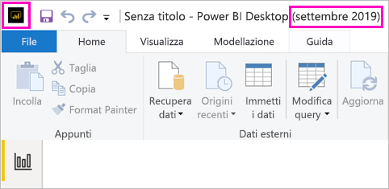

# Installare Power BI Desktop ottimizzato per il server di report di Power BI

Per creare report di Power BI per Server di report di Power BI, è necessario installare la versione di Power BI Desktop ottimizzata per Server di report di Power BI. Si tratta di una versione diversa dalla versione di Power BI Desktop usata con il servizio Power BI, Ad esempio la versione di Power BI Desktop per il servizio Power BI include funzionalità in anteprima, che diventano disponibili nella versione di Server di report di Power BI solo quando sono disponibili a livello generale. necessaria per assicurarsi che il server di report possa interagire con una versione nota dei report e del modello. 

Ora è possibile installare side-by-side sullo stesso computer Power BI Desktop e Power BI Desktop ottimizzato per il server di report di Power BI.

## Scaricare e installare Power BI Desktop

Il modo più facile per assicurarsi di aver installato la versione più aggiornata di Power BI Desktop ottimizzato per il server di report di Power BI è iniziare dal portale Web del server di report.

1. Nel portale Web del server di report selezionare la freccia **Scarica** > **Power BI Desktop**.

    

    In alternativa, passare alla home page di [Server di report di Power BI](https://powerbi.microsoft.com/report-server/) e selezionare **Opzioni avanzate di download**.

2. Nella pagina dell'Area download selezionare una lingua, quindi selezionare **Scarica**.

3. In base al computer specifico, selezionare: 

    - **PBIDesktopRS.msi** (versione a 32 bit) oppure
    - **PBIDesktopRS_x64.msi** (versione a 64 bit).

1. Dopo il download del programma di installazione, eseguire l'installazione guidata di Power BI Desktop (settembre 2019).

2. Al termine dell'installazione, selezionare **Avvia Power BI Desktop**.

    Verrà avviato automaticamente e si è pronti per iniziare.

## Verificare di usare la versione corretta
È facile verificare che si sta usando versione corretta di Power BI Desktop: osservare la barra del titolo o la schermata avvio di Power BI Desktop. Per determinare se la versione in uso è quella corretta, verificare che nella barra del titolo sia presente **Power BI Desktop (settembre 2019)** . Anche i colori del logo di Power BI sono invertiti (giallo sul nero invece che nero su giallo).

La versione di Power BI Desktop per il servizio Power BI non include il mese e l'anno nella barra del titolo.

## Associazione dell'estensione di file
Se sono stati installati sia Power BI Desktop sia Power BI Desktop ottimizzato per il server di report di Power BI nello stesso computer, l'installazione più recente di Power BI Desktop ha l'associazione con i file con estensione pbix. Di conseguenza, quando si fa doppio clic su un file con estensione pbix viene avviata l'istanza di Power BI Desktop installata più di recente.

Se è stata eseguita l'installazione di Power BI Desktop ottimizzato per il server di report di Power BI in un computer che conteneva già Power BI Desktop, per impostazione predefinita tutti i file con estensione pbix vengono aperti in Power BI Desktop ottimizzato per il server di report di Power BI. Se come impostazione predefinita si preferisce avviare Power BI Desktop all'apertura di un file con estensione pbix, reinstallare [Power BI Desktop da Microsoft Store](https://aka.ms/pbidesktopstore).

È sempre possibile aprire la versione di Power BI Desktop che si vuole usare per prima, quindi aprire il file da Power BI Desktop.

Se si modifica un report di Power BI dall'interno di Server di report di Power BI o si crea un nuovo report di Power BI dal portale Web, viene sempre aperta la versione corretta di Power BI Desktop.

## Considerazioni e limitazioni

I report Power BI nel server di report di Power BI, nel servizio Power BI (https://app.powerbi.com) ) e nelle app per dispositivi mobili Power BI funzionano in modo quasi identico, ma alcune funzionalità sono diverse.

### Selezione di una lingua

Per Power BI Desktop ottimizzato per Server di report di Power BI, selezionare la lingua quando si installa l'app. Non è possibile modificarla dopo, ma è possibile installare una versione in un'altra lingua.

### Oggetti visivi del report in un browser

I report di Server di report di Power BI supportano tutte le visualizzazioni, inclusi gli oggetti visivi di Power BI. I report del server di report di Power BI non supportano:

* Oggetti visivi R
* Mappe di ArcGIS
* Percorsi di navigazione
* Funzionalità in anteprima di Power BI Desktop

### Report nelle app Power BI per dispositivi mobili

I report del server di report di Power BI supportano tutte le funzionalità di base nelle [app Power BI per dispositivi mobili](../consumer/mobile/mobile-apps-for-mobile-devices.md), tra cui:

* [Layout del report per il telefono](../desktop-create-phone-report.md): è possibile ottimizzare un report per le app Power BI per dispositivi mobili. Sul telefono cellulare i report ottimizzati hanno un layout e un'icona speciale, .
  
    

I report del server di report di Power BI non supportano queste funzionalità nelle app Power BI per dispositivi mobili:

* Oggetti visivi R
* Mappe di ArcGIS
* Oggetti visivi di Power BI
* Percorsi di navigazione
* Filtro geografico o codici a barre

### Sicurezza personalizzata

Power BI Desktop ottimizzato per Server di report di Power BI non supporta la sicurezza personalizzata. Se Server di report di Power BI è configurato con un'estensione di sicurezza personalizzata, non è possibile salvare un report di Power BI da Power BI Desktop (ottimizzato per Server di report di Power BI) nell'istanza di Server di report di Power BI. È necessario salvare il file di report con estensione pbix da Power BI Desktop e caricarlo nel sito del portale di Server di report di Power BI.

## Power BI Desktop per le versioni precedenti del server di report di Power BI

Se la versione del server di report è precedente, è necessario disporre della versione corrispondente di Power BI Desktop. Ecco il collegamento per scaricare una versione precedente.

- Microsoft Power BI Desktop ([ottimizzato per Server di report di Power BI - settembre 2019](https://go.microsoft.com/fwlink/?linkid=2103723))

## Passaggi successivi

Ora che è stato installato Power BI Desktop, è possibile iniziare a creare i report di Power BI.

[Creare un report di Power BI per Server di report di Power BI](quickstart-create-powerbi-report.md)  
[Che cos'è Server di report di Power BI?](get-started.md)

Altre domande? [Provare a rivolgersi alla community di Power BI](https://community.powerbi.com/)
