# Installare il server di report di Power BI

Informazioni su come installare il server di report di Power BI.

## Scaricare il server di report di Power BI

Nella pagina [Creazione di report in locale con il server di report di Power BI](https://powerbi.microsoft.com/report-server/) selezionare **Scarica la versione di prova gratuita**.

Quando si esegue il file PowerBIReportServer.exe, si seleziona la versione di valutazione gratuita oppure si immette il codice Product Key. Continuare a leggere per informazioni dettagliate.

## Prima di eseguire l'installazione

Prima di installare il server di report di Power BI è consigliabile esaminare i [requisiti hardware e software per l'installazione del server di report di Power BI](system-requirements.md).

 > [!IMPORTANT]
 > Anche se è possibile installare Server di report di Power BI in un ambiente con un controller di dominio di sola lettura (RODC), Server di report di Power BI deve avere accesso a un controller di dominio di lettura/scrittura per funzionare correttamente. Se Server di report di Power BI può accedere solo a un controller di dominio di sola lettura, potrebbero verificare errori quando si prova ad amministrare il servizio.

### Codice Product Key del Server di report Power BI

È possibile ottenere il codice Product Key per il server di report di Power BI da due origini diverse:

- Power BI Premium
- SQL Server Enterprise Software Assurance (SA)

Continuare a leggere per informazioni dettagliate.

#### Power BI Premium

Se è stato acquistato Power BI Premium, nella scheda **Impostazioni Premium** del portale di amministrazione di Power BI si ha accesso al codice Product Key del server di report di Power BI. Il portale di amministrazione è disponibile solo per gli amministratori globali o per gli utenti a cui è stato assegnato il ruolo di amministratore del servizio Power BI.

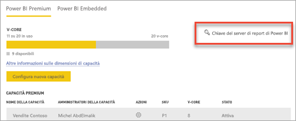

Se si seleziona **Chiave del server di report di Power BI** viene visualizzata una finestra di dialogo contenente il codice Product Key. È possibile copiarlo e usarlo durante l'installazione.

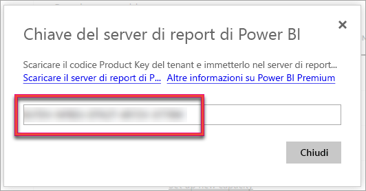

#### SQL Server Enterprise Software Assurance (SA)

Se si ha un contratto SQL Server Enterprise SA, è possibile ottenere il codice Product Key dal [Centro servizi per contratti multilicenza](https://www.microsoft.com/Licensing/servicecenter/).

## Installare il server di report

L'installazione del server di report di Power BI è molto semplice e richiede solo pochi passaggi.

Al momento dell'installazione non è necessario un server del motore di database di SQL Server, ma ne servirà uno per configurare Reporting Services dopo l'installazione.

1. Cercare il percorso di PowerBIReportServer.exe e avviare il programma di installazione.

2. Selezionare **Install Power BI Report Server**.

    
3. Scegliere una versione da installare e quindi selezionare **Next**.

    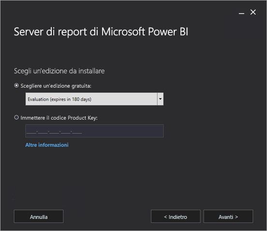

    Scegliere la versione Evaluation o Developer.

    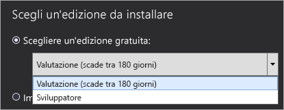

    Altrimenti, immettere il codice Product Key ottenuto dal servizio Power BI o dal Volume Licensing Service Center. Per altre informazioni su come ottenere il codice Product Key, vedere la sezione precedente [Prima di eseguire l'installazione](#before-you-install).
4. Leggere e accettare i termini e le condizioni di licenza, quindi selezionare **Avanti**.

    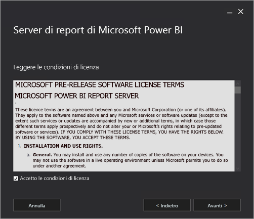
5. È necessario un motore di database per archiviare il database del server di report. Selezionare **Next** per installare solo il server di report.

    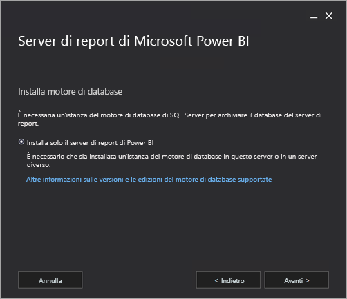
6. Specificare il percorso di installazione del server di report. Selezionare **Install** per continuare.

    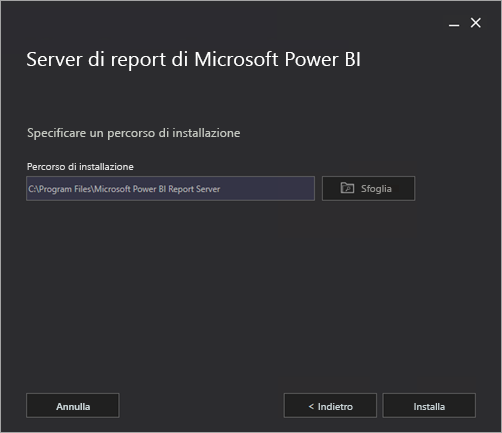

    Il percorso predefinito è C:\Programmi\Server di report di Power BI.

7. Dopo la corretta installazione, selezionare **Configure Report Server** per avviare Reporting Services Configuration Manager.

    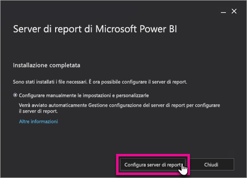

## Configurare il server di report

Dopo la selezione di **Configura Report Server** nel programma di installazione, viene visualizzato Gestione configurazione Reporting Services. Per altre informazioni, vedere [Reporting Services Configuration Manager](https://docs.microsoft.com/sql/reporting-services/install-windows/reporting-services-configuration-manager-native-mode).

Per completare la configurazione iniziale di Reporting Services, è necessario [creare un database del server di report](https://docs.microsoft.com/sql/reporting-services/install-windows/ssrs-report-server-create-a-report-server-database). Per completare questo passaggio è necessario un server di Database SQL Server.

### Creazione di un database in un server diverso

Se si sta creando il database del server di report in un server di database in un computer diverso, modificare l'account di servizio del server di report in credenziali riconosciute nel server di database. 

Per impostazione predefinita, il server di report usa l'account del servizio virtuale. Se si prova a creare un database in un server diverso, potrebbe verificarsi l'errore seguente durante il passaggio Applicazione dei diritti di connessione.

`System.Data.SqlClient.SqlException (0x80131904): Windows NT user or group '(null)' not found. Check the name again.`

Per risolvere l'errore, è possibile modificare l'account del servizio in un account del servizio di rete o di dominio. Modificare l'account del servizio nel servizio di rete applica i diritti nel contesto dell'account computer del server di report.

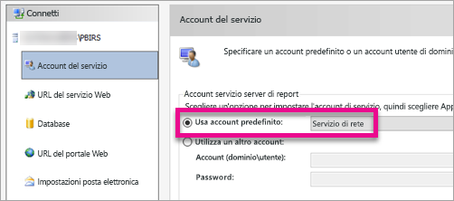

Per altre informazioni, vedere [Configurare l'account del servizio del server di report](https://docs.microsoft.com/sql/reporting-services/install-windows/configure-the-report-server-service-account-ssrs-configuration-manager).

## Servizio di Windows

Un servizio di Windows viene creato come parte dell'installazione. Viene visualizzato come **Server di report di Power BI**. Il nome del servizio è **PowerBIReportServer**.

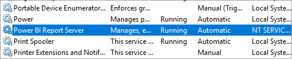

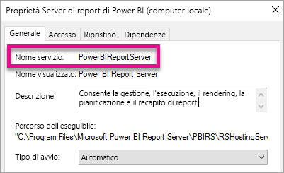

## Prenotazioni URL predefinite

Le prenotazioni URL sono composte da un prefisso, un nome host, una porta e una directory virtuale:

| Parte | Description |
| --- | --- |
| Prefisso |Il prefisso predefinito è HTTP. Se è stato precedentemente installato un certificato SSL (Secure Sockets Layer), il programma di installazione prova a creare prenotazioni URL che usano il prefisso HTTPS. |
| Nome host |Il nome host predefinito è un carattere jolly complesso (+). Specifica che il server di report accetta qualsiasi richiesta HTTP sulla porta designata per qualsiasi nome host risolto nel computer, tra cui `https://<computername>/reportserver`, `https://localhost/reportserver`, o `https://<IPAddress>/reportserver.` |
| Porta |La porta predefinita è 80. Se si usa una porta diversa dalla porta 80, è necessario aggiungerla in modo esplicito all'URL quando si apre il portale Web in una finestra del browser. |
| Directory virtuale |Per impostazione predefinita, le directory virtuali vengono create nel formato di ReportServer per il servizio Web ReportServer e Report per il portale Web. Per il servizio Web ReportServer, la directory virtuale predefinita è **reportserver**. Per il portale web, la directory virtuale predefinita è **reports**. |

Un esempio di stringa dell'URL completa potrebbe essere come segue:

* `https://+:80/reportserver`, fornisce l'accesso al server di report.
* `https://+:80/reports`, fornisce l'accesso al portale Web.

## Firewall

Se si accede al server di report da un computer remoto, assicurarsi di aver configurato le regole del firewall, se è presente.

Aprire la porta TCP che è stata configurata per l'URL del servizio Web e l'URL del portale Web. Per impostazione predefinita, questi vengono configurati sulla porta TCP 80.

## Configurazione aggiuntiva

* Per configurare l'integrazione con il servizio Power BI in modo che sia possibile aggiungere elementi del report a un dashboard di Power BI, vedere [Integrazione con il servizio Power BI](https://docs.microsoft.com/sql/reporting-services/install-windows/power-bi-report-server-integration-configuration-manager).
* Per configurare la posta elettronica per l'elaborazione di sottoscrizioni, vedere [Impostazioni di posta elettronica](https://docs.microsoft.com/sql/reporting-services/install-windows/e-mail-settings-reporting-services-native-mode-configuration-manager) e [Recapito di posta elettronica in un server di report](https://docs.microsoft.com/sql/reporting-services/subscriptions/e-mail-delivery-in-reporting-services).
* Per configurare il portale Web in modo che sia possibile accedervi in un computer di report per visualizzare e gestire report, vedere [Configurare un firewall per l'accesso ai server di report](https://docs.microsoft.com/sql/reporting-services/report-server/configure-a-firewall-for-report-server-access) e [Configurare un server di report per l'amministrazione remota](https://docs.microsoft.com/sql/reporting-services/report-server/configure-a-report-server-for-remote-administration).
* Per informazioni dettagliate sull'impostazione delle proprietà di sistema del server di report in SQL Server Management Studio, vedere [Pagina Avanzate delle proprietà del server](https://docs.microsoft.com/sql/reporting-services/tools/server-properties-advanced-page-reporting-services). Se non diversamente specificato, le opzioni si applicano sia a Server di report di Power BI che a SQL Server Reporting Services.

## Passaggi successivi

[Panoramica amministratore](admin-handbook-overview.md)  
[Come trovare il codice Product Key del server di report](find-product-key.md)  
[Installare Power BI Desktop ottimizzato per il server di report di Power BI](install-powerbi-desktop.md)  
[Verificare l'installazione di Reporting Services](https://docs.microsoft.com/sql/reporting-services/install-windows/verify-a-reporting-services-installation)  
[Configurare l'account del servizio del server di report](https://docs.microsoft.com/sql/reporting-services/install-windows/configure-the-report-server-service-account-ssrs-configuration-manager)  
[Configurare gli URL del server di report](https://docs.microsoft.com/sql/reporting-services/install-windows/configure-report-server-urls-ssrs-configuration-manager)  
[Configurare una connessione al database del server di report](https://docs.microsoft.com/sql/reporting-services/install-windows/configure-a-report-server-database-connection-ssrs-configuration-manager)  
[Inizializzare un server di report](https://docs.microsoft.com/sql/reporting-services/install-windows/ssrs-encryption-keys-initialize-a-report-server)  
[Configurare le connessioni SSL in un server di report](https://docs.microsoft.com/sql/reporting-services/security/configure-ssl-connections-on-a-native-mode-report-server)  
[Configurare le autorizzazioni e gli account del servizio di Windows](https://docs.microsoft.com/sql/database-engine/configure-windows/configure-windows-service-accounts-and-permissions)  
[Supporto del browser per il server di report di Power BI](browser-support.md)

Altre domande? [Provare a rivolgersi alla community di Power BI](https://community.powerbi.com/)