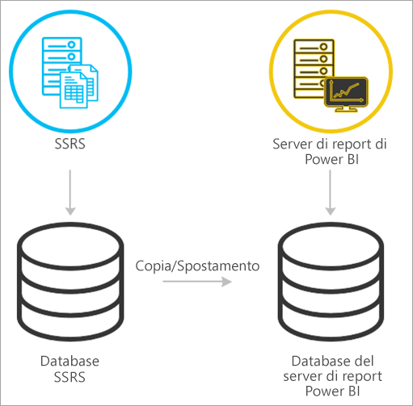
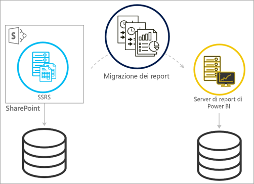
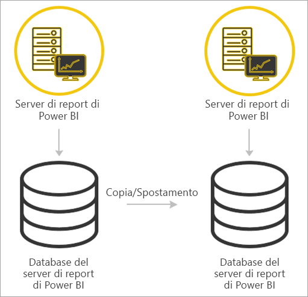

# <a name="migrate-a-report-server-installation"></a>Migrazione di un'installazione del server di report

Informazioni su come eseguire la migrazione dell'istanza di SQL Server Reporting Services (SSRS) esistente a un'istanza del server di report di Power BI.

La migrazione è definita come lo spostamento dei file di dati dell'applicazione in una nuova istanza del server di report di Power BI. Di seguito sono elencate le cause più comuni per poter eseguire la migrazione dell'installazione:

* Si vuole passare da SQL Server Reporting Services al server di report di Power BI
  
  > [!NOTE]
  > Non esiste un upgrade diretto da SQL Server Reporting Services al server di report di Power BI: è necessaria una migrazione.

* Si hanno requisiti di distribuzione o aggiornamento su larga scala
* Si sta cambiando l'hardware o la topologia dell'installazione
* Si verifica un problema che blocca l'upgrade

## <a name="migrating-to-power-bi-report-server-from-ssrs-native-mode"></a>Migrazione al server di report di Power BI da SSRS (modalità nativa)

La migrazione da un'istanza SSRS (modalità nativa) al server di report di Power BI è costituita da alcuni passaggi.



> [!NOTE]
> SQL Server 2008 Reporting Services e versioni successive sono supportati per la migrazione.

* File di configurazione, applicazione e database di backup
* Eseguire il backup della chiave di crittografia
* Clonare il database del server di report che ospita i report
* Installare il server di report di Power BI. Se si usa lo stesso hardware, è possibile installare il server di report di Power BI nello stesso server dell'istanza SSRS. Per altre informazioni sull'installazione di un server di report di Power BI, vedere [Installare il server di report di Power BI](install-report-server.md).

> [!NOTE]
> Il nome dell'istanza per il server di report di Power BI sarà *PBIRS*.

* Configurare il server di report usando Reporting Services Configuration Manager e connettersi al database clonato.
* Eseguire l'eventuale pulizia necessaria per l'istanza SSRS (modalità nativa)

## <a name="migration-to-power-bi-report-server-from-ssrs-sharepoint-integrated-mode"></a>Migrazione al server di report di Power BI da SSRS (modalità integrata SharePoint)

La migrazione da un'istanza SSRS (modalità integrata SharePoint) al server di report di Power BI non è diretta come la modalità nativa. Mentre questi passaggi forniscono alcune indicazioni, potrebbero esserci altri file e risorse all'interno di SharePoint che è necessario gestire al di fuori di questi passaggi.



È necessario eseguire la migrazione del contenuto del server di report specifico da SharePoint al server di report di Power BI. È necessario avere già installato il server di report di Power BI nell'ambiente in uso. Per altre informazioni sull'installazione di un server di report di Power BI, vedere [Installare il server di report di Power BI](install-report-server.md).

Se si vuole copiare il contenuto del server di report dall'ambiente di SharePoint al server di report di Power BI, è necessario usare strumenti come **rs.exe** per copiare il contenuto. Di seguito è riportato un esempio dello script necessario per copiare il contenuto del server di report da SharePoint al server di report di Power BI.

> [!NOTE]
> Lo script di esempio dovrebbe funzionare con SharePoint 2010 e versioni successive e con SQL Server 2008 Reporting Services e versioni successive.

### <a name="sample-script"></a>Script di esempio

```
Sample Script
rs.exe
-i ssrs_migration.rss -e Mgmt2010
-s http://SourceServer/_vti_bin/reportserver
-v st="sites/bi" -v f="Shared Documents“
-u Domain\User1 -p Password
-v ts=http://TargetServer/reportserver
-v tu="Domain\User" -v tp="Password"
```

## <a name="migrating-from-one-power-bi-report-server-to-another"></a>Migrazione da un server di report di Power BI a un altro

La migrazione da un server di report di Power BI è lo stesso processo della migrazione da SSRS (modalità nativa).



* File di configurazione, applicazione e database di backup
* Eseguire il backup della chiave di crittografia
* Clonare il database del server di report che ospita i report
* Installare il server di report di Power BI. *Non è possibile* installare il server di report di Power BI nello stesso server dal quale si sta effettuando la migrazione. Per altre informazioni sull'installazione di un server di report di Power BI, vedere [Installare il server di report di Power BI](install-report-server.md).

> [!NOTE]
> Il nome dell'istanza per il server di report di Power BI sarà *PBIRS*.

* Configurare il server di report usando Reporting Services Configuration Manager e connettersi al database clonato.
* Eseguire la pulizia necessaria per l'installazione del server di report di Power BI precedente.

## <a name="next-steps"></a>Passaggi successivi

[Panoramica amministratore](admin-handbook-overview.md)  
[Installare il server di report di Power BI](install-report-server.md)  
[Script con l'utilità rs.exe e il servizio Web](https://docs.microsoft.com/sql/reporting-services/tools/script-with-the-rs-exe-utility-and-the-web-service)

Altre domande? [Provare a rivolgersi alla community di Power BI](https://community.powerbi.com/)