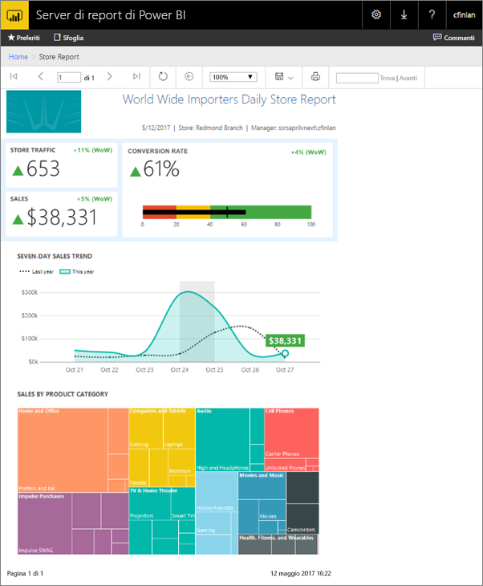
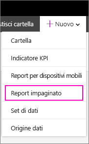
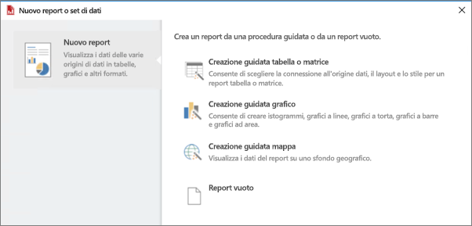
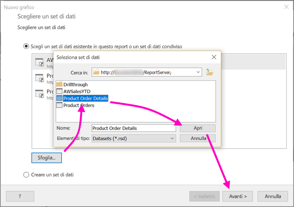
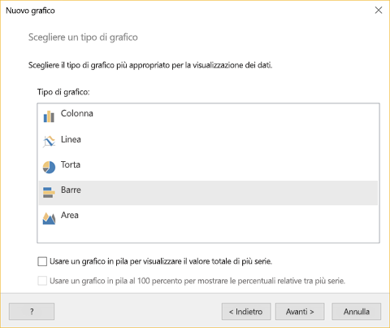
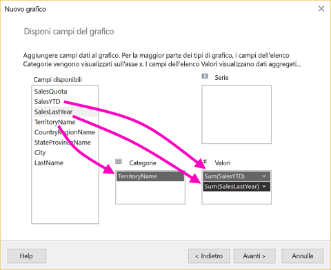
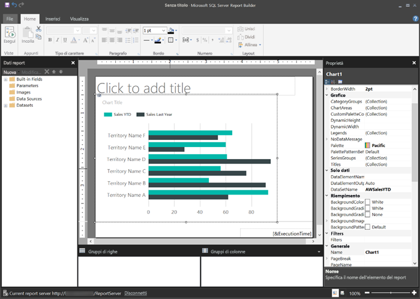
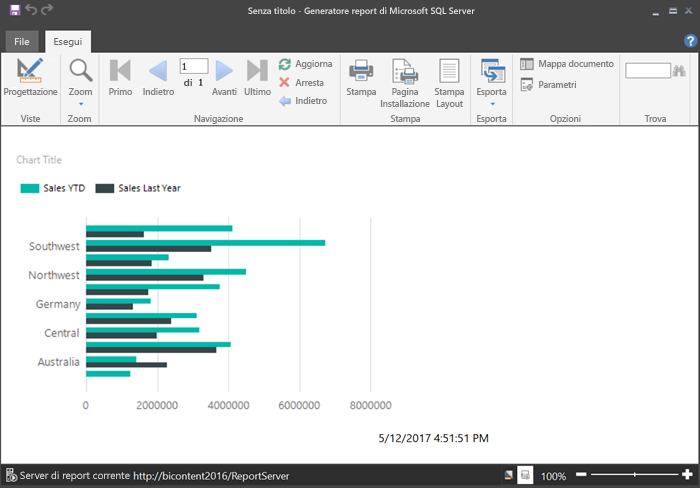
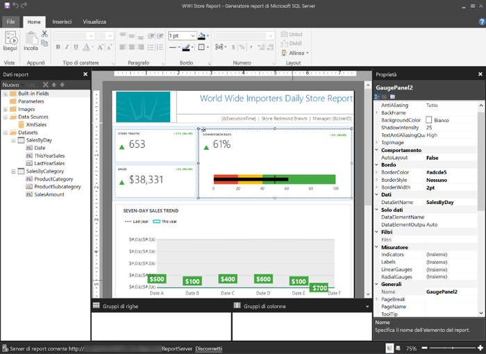

# Creare un report impaginato per Server di report di Power BI
Come suggerisce il nome, i report impaginati possono contenere più pagine. Hanno un formato fisso e offrono opzioni di personalizzazione precise. I report impaginati sono file con estensione rdl.

È possibile archiviare e gestire report impaginati nel portale Web del server di report di Power BI, proprio come nel portale Web di SQL Server Reporting Services (SSRS). È possibile crearli e modificarli in Generatore report o Progettazione report in SQL Server Data Tools (SSDT), quindi pubblicarli in un portale Web. Quindi, i lettori dei report nell'organizzazione possono visualizzarli in un browser oppure in un'app Power BI per dispositivi mobili sul proprio dispositivo.

Se sono già stati creati report impaginati in Generatore Report o Progettazione report, si è pronti per creare report impaginati per il Server di report di Power BI. In caso contrario, ecco alcuni passaggi rapidi per iniziare.

## Passaggio 1: Installare e avviare Generatore report
Si potrebbe già avere installato Generatore report per creare report per un server SSRS. È possibile usare la stessa versione o Generatore report per creare report per il server di report di Power BI. Se è ancora stato installato, il processo è semplice.

1. Nel portale Web del Server di report di Power BI selezionare **Nuovo** > **Report impaginato**.
   
    
   
    Se Generatore report non è già installato, l'utente verrà guidato nel processo di installazione.
2. Dopo l'installazione, viene visualizzata la schermata **Nuovo report o set di dati** di Generatore report.
   
    
3. Selezionare la procedura guidata per il tipo di report che si vuole creare:
   
   * Tabella o matrice
   * Grafico
   * Map
   * Vuoto
4. Iniziamo con la creazione guidata Grafico.
   
    La creazione guidata Grafico illustra i passaggi della creazione di un grafico di base in un report. Da qui, è possibile personalizzare il report in modo illimitato.

## Passaggio 2: Eseguire la creazione guidata Grafico
La creazione guidata Grafico illustra i passaggi di base della creazione di una visualizzazione in un report.

I report impaginati possono connettersi a un'ampia gamma di origini dati, da Microsoft SQL Server e Database SQL di Microsoft Azure a Oracle, Hyperion e molte altre. Leggere l'argomento relativo alle [origini dati supportate dai report impaginati](connect-data-sources.md).

Nella prima pagina della creazione guidata Grafico, **	Scegliere un set di dati**, è possibile creare un set di dati o sceglierne uno condiviso in un server. I *set di dati* restituiscono i dati del report da una query in un'origine dati esterna.

1. Selezionare **Sfoglia** > selezionare un set di dati condiviso in un server > **Apri** > **Avanti**.
   
    
   
     Se è necessario creare un set di dati, vedere come [creare un set di dati condiviso o incorporato](https://docs.microsoft.com/sql/reporting-services/report-data/create-a-shared-dataset-or-embedded-dataset-report-builder-and-ssrs).
2. Scegliere un tipo di grafico, in questo caso un grafico a barre.
   
    
3. Disporre i campi trascinandoli nelle caselle **Categorie**, **Serie** e **Valori**.
   
    
4. Selezionare **Avanti** > **Fine**.

## Passaggio 3: Progettare il report
Si passerà ora alla visualizzazione Progettazione report. Si noti che quelli visualizzati sono solo dati segnaposto.

* Per visualizzare i propri dati, selezionare **Esegui**.
  
     
* Per tornare alla visualizzazione Progettazione, selezionare **Progettazione**.

È possibile modificare il grafico appena creato, cambiando il layout, i valori, la legenda: praticamente tutto.

È anche possibile aggiungere qualsiasi tipo di visualizzazione: indicatori, tabelle, matrici, mappe e molto altro. È possibile aggiungere intestazioni e piè di pagina per più pagine. Per provare autonomamente, vedere le [esercitazioni di Generazione report](https://docs.microsoft.com/sql/reporting-services/report-builder-tutorials).

## Passaggio 4: Salvare il report nel server di report
Quando il report è pronto, salvarlo nel Server di report di Power BI.

1. Scegliere **Salva con nome** dal menu **File** e salvarlo nel server di report. 
2. A questo punto è possibile visualizzarlo nel browser.
   
    

## Passaggi successivi
Esistono numerose ottime risorse per la progettazione di report in Generatore Report e in Progettazione Report di SQL Server Data Tools. Le esercitazioni di Generatore report sono un buon punto di partenza.

* [Esercitazioni di Generatore report](https://docs.microsoft.com/sql/reporting-services/report-builder-tutorials)
* [Che cos'è Server di report di Power BI?](get-started.md)  

Altre domande? [Provare a rivolgersi alla community di Power BI](https://community.powerbi.com/)

