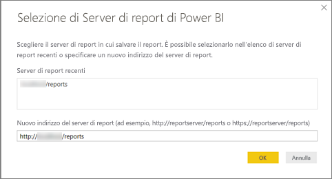

# Creare un report di Power BI per Server di report di Power BI
È possibile archiviare e gestire report di Power BI nel portale Web del Server di report di Power BI, proprio come nel cloud nel servizio Power BI (https://powerbi.com)). È possibile creare e modificare i report in Power BI Desktop e pubblicarli nel portale Web. Quindi, i lettori dei report nell'organizzazione possono visualizzarli in un browser oppure in un'app Power BI per dispositivi mobili su un dispositivo mobile.

Ecco quattro passaggi rapidi per iniziare.

## Passaggio 1: Installare Power BI Desktop ottimizzato per il server di report di Power BI

Se sono già stati creati report di Power BI in Power BI Desktop, si è quasi pronti per creare report di Power BI per il server di report di Power BI. Si consiglia di installare la versione di Power BI Desktop ottimizzata per il server di report di Power BI: in tal modo, ci si assicura che il server e l'app siano sempre sincronizzati. È possibile avere entrambe le versioni di Power BI Desktop nello stesso computer.

1. Nel portale Web del server di report selezionare la freccia **Scarica** > **Power BI Desktop**.

    

    In alternativa, passare direttamente a [Microsoft Power BI Desktop](https://www.microsoft.com/download/details.aspx?id=56723) (ottimizzato per il server di report di Power BI - marzo 2018) nell'Area download Microsoft.

2. Nella pagina dell'Area download selezionare **Scarica**.

3. In base al computer specifico, selezionare:

    - **PBIDesktopRS.msi** (versione a 32 bit) oppure

    - **PBIDesktopRS_x64.msi** (versione a 64 bit).

4. Dopo il download del programma di installazione, eseguire l'installazione guidata di Power BI Desktop (marzo 2018).

2. Al termine dell'installazione, selezionare **Avvia Power BI Desktop**.
   
    Verrà avviato automaticamente e si è pronti per iniziare. Per determinare se la versione in uso è quella corretta, verificare che nella barra del titolo sia presente "Power BI Desktop (marzo 2018)".

    

3. Se non si ha familiarità con Power BI Desktop, è consigliabile guardare i video nella schermata iniziale.
   
    

## Passaggio 2: Selezionare un'origine dati
È possibile connettersi a una vasta gamma di origini dati. Altre informazioni sulla [connessione alle origini dati](connect-data-sources.md).

1. Nella schermata iniziale selezionare **Recupera dati**.
   
    In alternativa, nella schermata **Home** selezionare **Recupera dati**.
2. Selezionare l'origine dati, in questo esempio **Analysis Services**.
   
    
3. Compilare i campi **Server** e, facoltativamente, **Database**. Assicurarsi che **Connessione dinamica** sia selezionato > **OK**.
   
    
4. Scegliere il server di report in cui si salveranno i report.
   
    

## Passaggio 3: Progettare il report
Qui la cosa si fa interessante, perché si è giunti al momento di creare oggetti visivi per illustrare i propri dati.

Ad esempio, è possibile creare un grafico a imbuto di clienti e valori del gruppo in base al reddito annuo.

1. In **Visualizzazioni**selezionare **Grafico a imbuto**.
2. Trascinare il campo da conteggiare nell'area **Valori**. Se non è un campo numerico, Power BI Desktop lo rende automaticamente un *Conteggio di* valore.
3. Trascinare il campo sul gruppo nell'area **Gruppo**.

Sono disponibili altre informazioni sulla [progettazione di un report di Power BI](../desktop-report-view.md).

## Passaggio 4: Salvare il report nel server di report
Quando il report è pronto, salvarlo nel server di report di Power BI scelto nel passaggio 2.

1. Nel menu **File** selezionare **Salva con nome** > **Server di report di Power BI**.
   
    
2. A questo punto è possibile visualizzarlo nel portale Web.
   
    

## Considerazioni e limitazioni
I report nel server di report di Power BI e nel servizio Power BI (http://powerbi.com)) funzionano in modo quasi identico, ma alcune funzionalità sono diverse.

### In un browser
I report del server di report di Power BI supportano tutte le visualizzazioni, tra cui:

* Oggetti visivi personalizzati

I report del server di report di Power BI non supportano:

* Oggetti visivi R
* Mappe di ArcGIS
* Percorsi di navigazione
* Funzionalità in anteprima di Power BI Desktop

### Nelle app Power BI per dispositivi mobili
I report del server di report di Power BI supportano tutte le funzionalità di base nelle [app Power BI per dispositivi mobili](../mobile-apps-for-mobile-devices.md), tra cui:

* [Layout del report per il telefono](../desktop-create-phone-report.md): è possibile ottimizzare un report per le app Power BI per dispositivi mobili. Sul telefono cellulare i report ottimizzati hanno un layout e un'icona speciale, .
  
    

I report del server di report di Power BI non supportano queste funzionalità nelle app Power BI per dispositivi mobili:

* Oggetti visivi R
* Mappe di ArcGIS
* Oggetti visivi personalizzati
* Percorsi di navigazione
* Filtro geografico o codici a barre

## Passaggi successivi
### Power BI Desktop
Esistono tantissime ottime risorse per creare report in Power BI Desktop. Questi collegamenti sono un buon punto di partenza.

* [Introduzione a Power BI Desktop](../desktop-getting-started.md)
* Apprendimento guidato: [Introduzione a Power BI Desktop](../guided-learning/gettingdata.yml?tutorial-step=2)

### Server di report Power BI
* [Installare Power BI Desktop ottimizzato per il server di report di Power BI](install-powerbi-desktop.md)  
* [Che cos'è Server di report di Power BI?](get-started.md)  

Altre domande? [Provare a rivolgersi alla community di Power BI](https://community.powerbi.com/)
