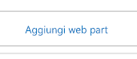
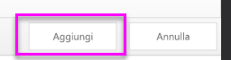
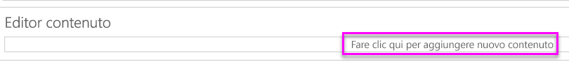

# <a name="quickstart-embed-a-power-bi-report-server-report-using-an-iframe-in-sharepoint-server"></a>Guida rapida: Incorporare un report di Server di report di Power BI in SharePoint Server usando un iFrame

Questa guida introduttiva illustra come incorporare un report di Server di report di Power BI in una pagina di SharePoint usando un iFrame. Se si usa SharePoint Online, Server di report di Power BI deve essere accessibile pubblicamente. In SharePoint Online, la web part Power BI che funziona con il servizio Power BI non funziona con Server di report di Power BI. 


## <a name="prerequisites"></a>Prerequisiti
* È necessario aver installato e configurato [Server di report di Power BI](https://powerbi.microsoft.com/en-us/report-server/).
* È necessario aver installato [Power BI Desktop ottimizzato per Server di report di Power BI](install-powerbi-desktop.md).
* È necessario disporre di un ambiente [SharePoint](https://docs.microsoft.com/sharepoint/install/install) installato e configurato.

## <a name="creating-the-power-bi-report-server-report-url"></a>Creazione dell'URL del report di Server di report di Power BI

1. Scaricare l'esempio [Blog Demo](https://github.com/Microsoft/powerbi-desktop-samples) da GitHub.

    

2. Aprire il file PBIX di esempio da GitHub in **Power BI Desktop ottimizzato per Server di report di Power BI**.

    

3. Salvare il file in **Server di report di Power BI**. 

    

4. Visualizzare il report nel **portale Web**.

    

### <a name="capturing-the-url-parameter"></a>Acquisizione del parametro URL

Dopo aver creato l'URL, è possibile creare un iFrame all'interno di una pagina di SharePoint che ospiti il report. Per qualsiasi report di Server di report di Power BI, è possibile aggiungere all'URL un parametro della stringa di query `?rs:embed=true` per incorporare il report in un iFrame. 

   ad esempio:
    ``` 
    http://myserver/reports/powerbi/Sales?rs:embed=true
    ```
## <a name="embedding-a-power-bi-report-server-report-in-a-sharepoint-iframe"></a>Incorporamento di un report di Server di report di Power BI in un iFrame di SharePoint

1. Passare a una pagina **Contenuto del sito** di SharePoint.

    

2. Scegliere la pagina in cui si vuole aggiungere il report.

    

3. Selezionare l'icona dell'ingranaggio in alto a destra e selezionare **Modifica pagina**.

    

4. Selezionare **Aggiungi web part**.

    

5. In **Categorie** selezionare **Elementi multimediali e contenuto**, in **Parti** selezionare **Editor contenuto**, quindi selezionare **Aggiungi** .

     

6. Selezionare **Fare clic qui per aggiungere nuovo contenuto**.

    

7. Nella barra multifunzione selezionare la scheda **Formato testo** e quindi selezionare **Modifica origine**.

     

8. Nella finestra Modifica origine incollare il codice iFrame e selezionare OK.

    

     ad esempio:
     ```
     <iframe width="800" height="600" src="http://myserver/reports/powerbi/Sales?rs:embed=true" frameborder="0" allowFullScreen="true"></iframe>
     ```

9. Nella barra multifunzione selezionare la scheda **Pagina** e selezionare **Interrompi modifica**.

    

10. Il report dovrebbe essere visualizzato nella pagina.

    

## <a name="next-steps"></a>Passaggi successivi

[Avvio rapido: Creare un report di Power BI per il server di report di Power BI](quickstart-create-powerbi-report.md)  
[Guida rapida: creare un report impaginato per il server di report di Power BI](quickstart-create-paginated-report.md)  

Altre domande? [Provare a rivolgersi alla community di Power BI](https://community.powerbi.com/) 