# <a name="embed-a-power-bi-report-server-report-using-an-iframe-in-sharepoint-server"></a>Incorporare un report di Server di report di Power BI in SharePoint Server usando un iFrame

Questo articolo illustra come incorporare un report di Server di report di Power BI in una pagina di SharePoint usando un iFrame. Se si usa SharePoint Online, Server di report di Power BI deve essere accessibile pubblicamente. In SharePoint Online, la Web part Power BI che funziona con il servizio Power BI non funziona con Server di report di Power BI.  

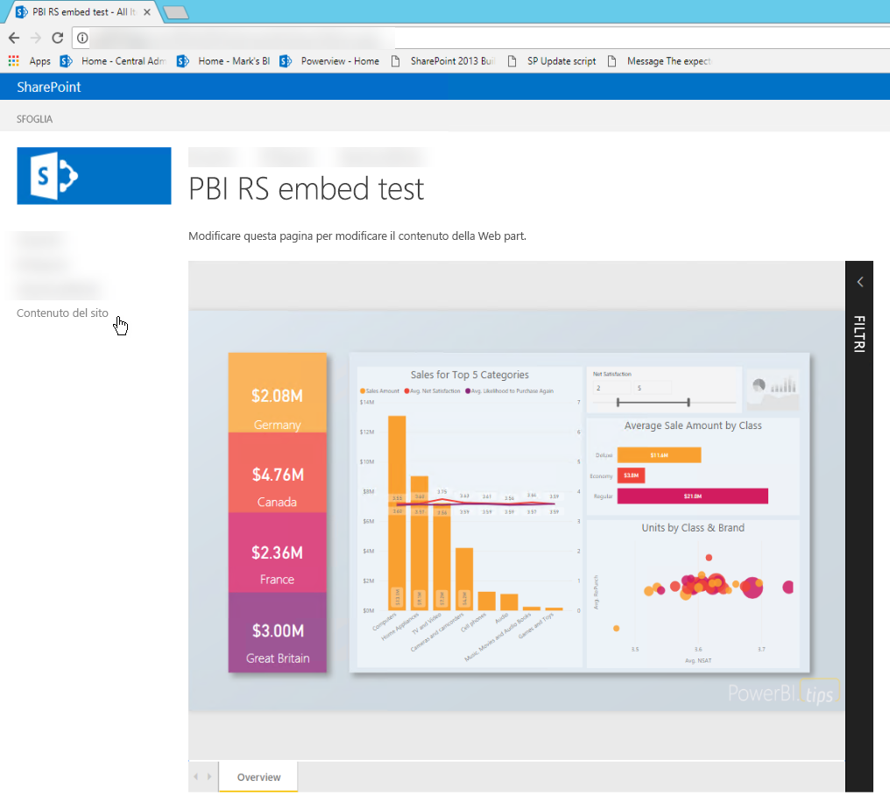

## <a name="prerequisites"></a>Prerequisiti
* [Server di report di Power BI](https://powerbi.microsoft.com/report-server/) installato e configurato.
* [Power BI Desktop ottimizzato per Server di report di Power BI](install-powerbi-desktop.md) installato.
* Ambiente [SharePoint](https://docs.microsoft.com/sharepoint/install/install) installato e configurato.
* Internet Explorer 11 è supportato solo se la modalità documento è impostata sulla modalità IE11 (Edge) o se si usa SharePoint Online. È possibile usare altri browser supportati con SharePoint locale e SharePoint Online.

## <a name="create-the-power-bi-report-url"></a>Creare l'URL del report Power BI

1. Scaricare l'esempio da GitHub: [Demo del blog](https://github.com/Microsoft/powerbi-desktop-samples). Selezionare **Clone or download** (Clona o scarica) e quindi **Download ZIP** (Scarica ZIP).

    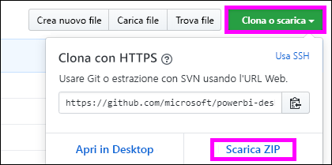

2. Decomprimere il file, aprire il file di esempio con estensione pbix in Power BI Desktop ottimizzato per Server di report di Power BI.

    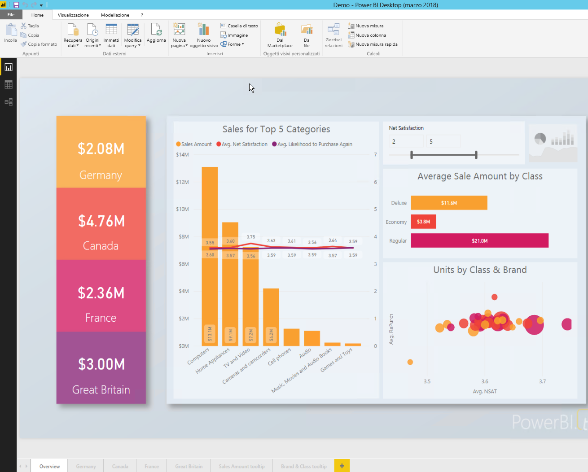

3. Salvare il file in **Server di report di Power BI**. 

    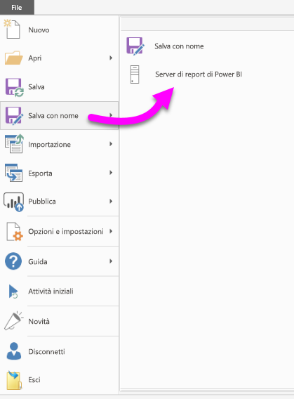

4. Visualizzare il report nel portale Web di Server di report di Power BI.

    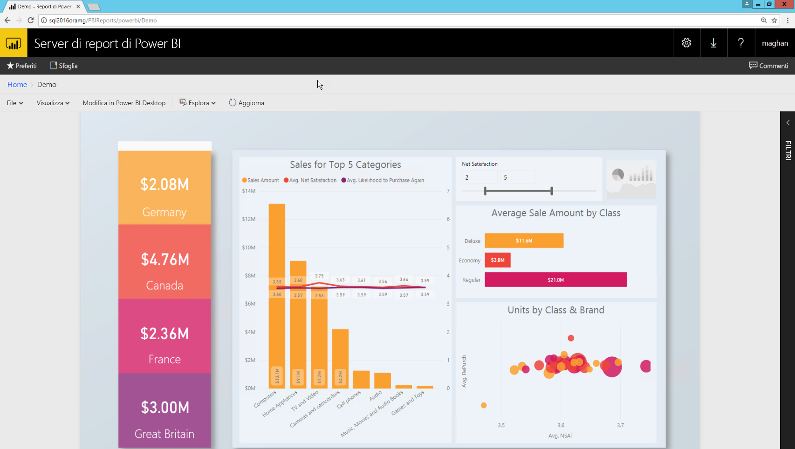

### <a name="capture-the-url-parameter"></a>Acquisire il parametro URL

Dopo aver acquisito l'URL, è possibile creare un iFrame all'interno di una pagina di SharePoint per ospitare il report. Per qualsiasi URL di report di Server di report di Power BI, aggiungere il parametro della stringa di query seguente per incorporare il report in un iFrame di SharePoint: `?rs:embed=true`.

   ad esempio:
    ``` 
    https://myserver/reports/powerbi/Sales?rs:embed=true
    ```
## <a name="embed-the-report-in-a-sharepoint-iframe"></a>Incorporare il report in un iFrame di SharePoint

1. Passare a una pagina **Contenuto del sito** di SharePoint.

    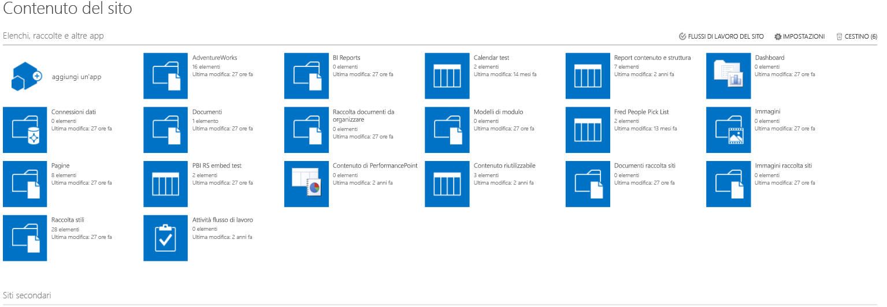

2. Scegliere la pagina in cui si vuole aggiungere il report.

    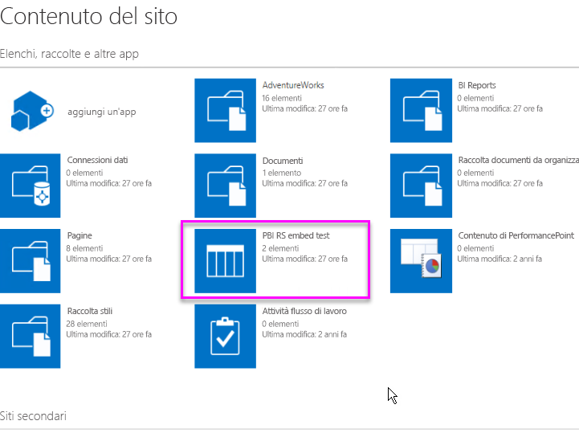

3. Selezionare l'icona dell'ingranaggio in alto a destra e quindi selezionare **Modifica pagina**.

    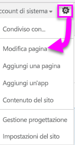

4. Selezionare **Aggiungi web part**.

5. In **Categorie** selezionare **Elementi multimediali e contenuto**. In **Parti** selezionare **Editor contenuto** e quindi **Aggiungi**.

    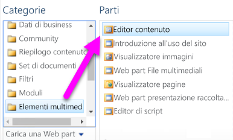

6. Selezionare **Fare clic qui per aggiungere nuovo contenuto**.

7. Dal menu in alto selezionare **Formatta testo** e quindi **Modifica origine**.

     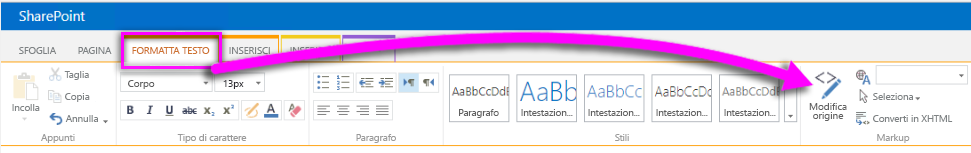

8. Nella finestra **Modifica origine** incollare il codice iFrame in **HTML** e quindi selezionare **OK**.

    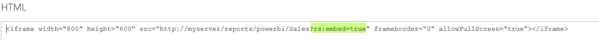

     ad esempio:
     ```html
     <iframe width="800" height="600" src="https://myserver/reports/powerbi/Sales?rs:embed=true" frameborder="0" allowFullScreen="true"></iframe>
     ```

9. Dal menu in alto selezionare **Pagina** e quindi **Interrompi modifica**.

    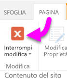

    Il report viene visualizzato nella pagina.

    

## <a name="next-steps"></a>Passaggi successivi

- [Creare un report di Power BI per Server di report di Power BI](quickstart-create-powerbi-report.md).  
- [Creare un report impaginato per Server di report di Power BI](quickstart-create-paginated-report.md).  

Altre domande? [Provare la community di Power BI](https://community.powerbi.com/). 
