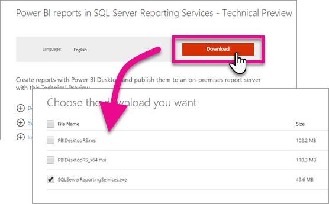
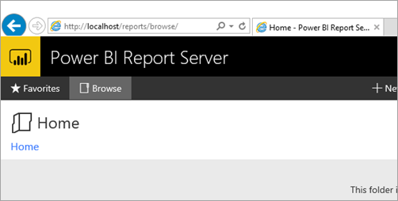

# Avvio rapido: installazione del Server di report di Power BI
L'installazione del server di report di Power BI è molto rapida. Dal download, all'installazione e alla configurazione, si sarà operativi in pochi minuti.

Ecco una breve presentazione su come installare un server di report se si vuole essere subito operativi. Per informazioni più dettagliate sull'installazione di un server di report, vedere [Installare il server di report di Power BI](install-report-server.md).

## Video: Installare il server di report di Power BI

<iframe width="640" height="360" src="https://www.youtube.com/embed/zacaEb9A4F0?showinfo=0" frameborder="0" allowfullscreen></iframe>

## Prima di iniziare
Prima di installare il server di report di Power BI è consigliabile esaminare i [requisiti hardware e software per l'installazione del server di report di Power BI](system-requirements.md).

## Passaggio 1: Download

Per scaricare il server di report di Power BI e Power BI Desktop ottimizzati per il server di report di Power BI, visitare [Creazione di report in locale con il server di report di Power BI](https://powerbi.microsoft.com/report-server/) e selezionare **Scarica la versione di valutazione gratuita**.

Seguire le istruzioni per scaricare i file di installazione in locale per il server di report di Power BI. 

## Passaggio 2: Eseguire il programma di installazione
Eseguire il file PowerBIReportServer.exe che è stato scaricato ed esaminare le schermate di installazione. È possibile selezionare il percorso di installazione, nonché la versione che si vuole installare. È possibile scegliere tra una versione di valutazione con scadenza entro 180 giorni, una versione per sviluppatori oppure fornire un codice "product key".

## Passaggio 3: Configurare il server
Dopo aver completato l'installazione, verrà eseguito il gestore di configurazione per completare la configurazione del server. È necessario creare un database di catalogo ReportServer, nonché verificare il portale Web e gli URL del servizio web.

## Passaggio 4: Accedere al portale web
Al termine della configurazione, sarà possibile passare al portale Web del server usando un browser. Per impostazione predefinita, questo sarà `http://localhost/reports`. Sarà anche possibile spostarsi usando il nome del computer anziché localhost per impostazione predefinita, supponendo che non sia presente il blocco da un tipo qualsiasi di firewall.

## Passaggi successivi
[Manuale per l'amministratore](admin-handbook-overview.md)  
[Come trovare il codice Product Key del server di report](find-product-key.md)  
[Installare il server di report di Power BI](install-report-server.md)  
[Installare Power BI Desktop ottimizzato per il server di report di Power BI](install-powerbi-desktop.md)  
[Supporto del browser per il server di report di Power BI](browser-support.md)

Altre domande? [Provare a rivolgersi alla community di Power BI](https://community.powerbi.com/)

