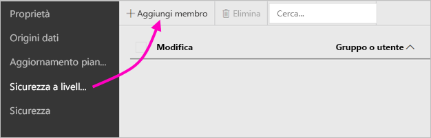

# Sicurezza a livello di riga (RLS) nel server di report di Power BI

L'impostazione della sicurezza a livello di riga con il server di report di Power BI può limitare l'accesso ai dati per determinati utenti. I filtri limitano l'accesso ai dati a livello di riga ed è possibile definirli all'interno dei ruoli.  Se si usano le autorizzazioni predefinite nel server di report di Power BI, qualsiasi utente con autorizzazioni di pubblicazione o gestione contenuto per il report di Power BI può assegnare membri ai ruoli per il report.    

È possibile configurare la sicurezza a livello di riga per i report importati in Power BI con Power BI Desktop. È anche possibile configurare la sicurezza a livello di riga nei report che usano DirectQuery, ad esempio SQL Server.  Tenere presente che a la sicurezza a livello di riga non viene rispettata se la connessione di DirectQuery usa l'autenticazione integrata per i lettori del report. Per le connessioni dinamiche ad Analysis Services è possibile configurare la sicurezza a livello di riga nel modello locale. L'opzione di sicurezza non viene visualizzata per i set di dati di connessione dinamica. 

[!INCLUDE [rls-desktop-define-roles](../includes/rls-desktop-define-roles.md)]

## Filtro incrociato bidirezionale

Per impostazione predefinita, i filtri per la sicurezza a livello di riga usano i filtri unidirezionali, indipendentemente dal fatto che le relazioni siano impostate come unidirezionali o bidirezionali. È possibile abilitare manualmente il filtro incrociato bidirezionale con la sicurezza a livello di riga.

- Selezionare la relazione e selezionare la casella di controllo  **Applica filtro di sicurezza in entrambe le direzioni** . 

    

Selezionare questa casella di controllo quando si implementa la  [sicurezza dinamica a livello di riga](https://docs.microsoft.com/sql/analysis-services/supplemental-lesson-implement-dynamic-security-by-using-row-filters) basata sul nome utente o sull'ID di accesso. 

Per altre informazioni, vedere [Filtro incrociato bidirezionale con DirectQuery in Power BI Desktop](../desktop-bidirectional-filtering.md) e il whitepaper tecnico [Securing the Tabular BI Semantic Model](http://download.microsoft.com/download/D/2/0/D20E1C5F-72EA-4505-9F26-FEF9550EFD44/Securing%20the%20Tabular%20BI%20Semantic%20Model.docx) (Protezione del modello semantico tabulare di BI).

[!INCLUDE [rls-desktop-view-as-roles](../includes/rls-desktop-view-as-roles.md)]

## Aggiungere membri ai ruoli 

Dopo aver salvato il report nel server di Report di Power BI è possibile gestire la sicurezza e aggiungere o rimuovere membri nel server. L'opzione per la sicurezza a livello di riga è disponibile (e non disattivata) solo per gli utenti con autorizzazioni editore o gestione contenuto.

 Se il report non dispone dei ruoli necessari, aprirlo in Power BI Desktop, aggiungere o modificare i ruoli, quindi salvarlo nuovamente nel server di Report di Power BI. 

1. In Power BI Desktop salvare il report nel server di report di Power BI. È necessario usare la versione di Power BI Desktop ottimizzata per il server di report di Power BI.
2. Nel servizio Report di Power BI selezionare i puntini di sospensione (**...**) accanto al report. 

3. Selezionare  **Gestisci** > **Sicurezza a livello di riga**. 

     

    Nella pagina **Sicurezza a livello di riga** è possibile aggiungere membri a un ruolo creato in Power BI Desktop.

5. Per aggiungere un membro selezionare **Aggiungi membro**.

1. Immettere l'utente o il gruppo nella casella di testo con il formato nome utente (DOMINIO\Utente) e selezionare i ruoli da assegnare. Il membro deve essere interno all'organizzazione.   

    

    A seconda della configurazione di Active Directory, è possibile che sia supportata l'immissione del Nome entità utente in questo campo. In tal caso il server di report visualizza il nome utente corrispondente nell'elenco.

1. Fare clic su **OK** per applicare l'impostazione.   

8. Per rimuovere membri selezionare la casella accanto ai relativi nomi e selezionare **Elimina**.  È possibile eliminare più membri alla volta. 

    

## username() e userprincipalname()

È possibile usare le funzioni DAX username() o userprincipalname() nel set di dati. Queste funzioni possono essere usate all'interno di espressioni in Power BI Desktop. Quando si pubblica il modello, il server di report di Power BI usa queste funzioni.

In Power BI Desktop username() restituisce un utente nel formato DOMINIO\Utente, mentre userprincipalname() restituisce un utente nel formato user@contoso.com.

Nel server di report di Power BI sia username() sia userprincipalname() restituiscono il Nome entità utente (UPN), che è simile a un indirizzo di posta elettronica.

Se si usa l'autenticazione personalizzata nel server di report di Power BI, viene restituito il formato del nome utente che è stato configurato per gli utenti.  

## Limitazioni 

Di seguito sono riportate le limitazioni correnti per la sicurezza a livello di riga nei modelli Power BI. 

Gli utenti con report che usavano la funzione DAX username() noteranno un comportamento nuovo per cui viene restituito il Nome dell'entità utente (UPN), SALVO quando si usa DirectQuery con la sicurezza integrata.  Poiché la sicurezza a livello di riga (RLS) non viene rispettata in tale scenario, il comportamento resta invariato.

È possibile definire la sicurezza a livello di riga solo per i set di dati creati con Power BI Desktop. Per abilitare la sicurezza a livello di riga per i set di dati creati con Excel, prima di tutto è necessario convertire i file in file di Power BI Desktop (con estensione pbix). Altre informazioni sulla [conversione di file di Excel](../desktop-import-excel-workbooks.md).

Sono supportate solo le connessioni Estrai, Trasforma, Carica (ETL) e DirectQuery che usano le credenziali archiviate. Le connessioni dinamiche ad Analysis Services e le connessioni DirectQuery che usano l'autenticazione integrata vengono gestite nell'origine dati sottostante. 

Se si usa la sicurezza integrata con DirectQuery, gli utenti potrebbero notare quanto segue:
- La sicurezza a livello di riga è disabilitata e vengono restituiti tutti i dati.
- Gli utenti non possono aggiornare le proprie assegnazioni di ruolo e ricevono un errore nella pagina di gestione della sicurezza a livello di riga.
- Per la funzione DAX username si continua a ricevere il nome utente come DOMINIO\UTENTE. 

Gli autori di report non hanno accesso alla visualizzazione dei dati del report nel server di report di Power BI, fino a quando non si assegnano i ruoli necessari dopo il caricamento del report. 

 

## DOMANDE FREQUENTI 

### È possibile creare questi ruoli per le origini dati di Analysis Services? 

È possibile se i dati sono stati importati in Power BI Desktop. Se si usa una connessione dinamica, non è possibile configurare la sicurezza a livello di riga all'interno del servizio Power BI. La sicurezza a livello di riga viene definita all'interno del modello di Analysis Services in locale. 

### È possibile usare la sicurezza a livello di riga per limitare le colonne o le misure accessibili agli utenti? 

No. Se un utente può accedere a una riga specifica di dati, può visualizzare tutte le colonne di dati per tale riga. 

### La sicurezza a livello di riga consente di nascondere i dati dettagliati ma di concedere l'accesso al riepilogo dati negli oggetti visivi? 

No. È possibile proteggere singole righe di dati, ma gli utenti possono visualizzare sempre sia i dettagli sia il riepilogo dati. 

### È possibile aggiungere nuovi ruoli in Power BI Desktop se sono già presenti ruoli esistenti e membri assegnati? 

Sì, se sono già presenti ruoli definiti e membri assegnati nel server di report di Power BI è possibile creare ruoli aggiuntivi e ripubblicare il report senza alcun effetto sulle assegnazioni correnti. 
 

## Passaggi successivi

[Che cos'è Server di report di Power BI?](get-started.md) 
[Manuale per l'amministratore](admin-handbook-overview.md)  

Altre domande? [Provare a rivolgersi alla community di Power BI](https://community.powerbi.com/)