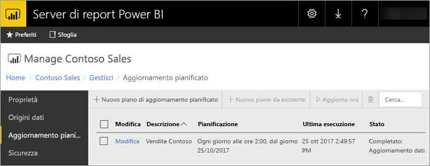

# Aggiornamento pianificato dei report di Power BI nel server di report di Power BI
L'aggiornamento pianificato per i report di Power BI permette di mantenere aggiornati i dati di un report.

L'aggiornamento pianificato è specifico per i report di Power BI con un modello incorporato. Questo significa che i dati nel report sono stati importanti invece di usare una connessione in tempo reale o DirectQuery. Quando i dati vengono importati, questi sono disconnessi dall'origine dati originale e devono essere aggiornati per poter usufruire sempre delle informazioni più recenti. L'aggiornamento pianificato consente di mantenere i dati aggiornati

e si configura dalla sezione di gestione di un report. Per altre informazioni su come configurare l'aggiornamento pianificato, vedere [Come configurare l'aggiornamento pianificato dei report di Power BI](configure-scheduled-refresh.md).

## Come funziona
Per l'aggiornamento pianificato per i report di Power BI sono coinvolti numerosi componenti.

* SQL Server Agent come timer per generare gli eventi pianificati.
* I processi pianificati vengono aggiunti a una coda di eventi e notifiche nel database del server di report. In una distribuzione con scalabilità orizzontale, la coda è condivisa tra tutti i server di report nella distribuzione.
* L'elaborazione dei report che si verifica a seguito di un evento pianificato viene eseguita come processo in background.
* Il modello di dati è caricato in un'istanza di Analysis Services.
* Per alcune origini dati, viene il motore di mashup di Power Query per connettersi alle origini dati e trasformare i dati. Altre origini dati possono essere connesse direttamente da un servizio Analysis Services usato per ospitare i modelli di dati per il server di report di Power BI.
* I nuovi dati vengono caricati nel modello di dati in Analysis Services.
* Analysis Services elabora i dati ed esegue i calcoli necessari.

Il server di report di Power BI mantiene una coda di eventi per tutte le operazioni pianificate. Esegue il polling della coda a intervalli regolari per verificare la presenza di nuovi eventi. Per impostazione predefinita, la coda viene analizzata a intervalli di 10 secondi. Per cambiare l'intervallo, modificare le impostazioni di configurazione **PollingInterval**, **IsNotificationService** e **IsEventService** nel file RSReportServer.config. Per impostare se un server di report deve elaborare gli eventi pianificati, è anche possibile usare **IsDataModelRefreshService**.

### Analysis Services
Il rendering di un report di Power BI e l'esecuzione di un aggiornamento pianificato richiedono il caricamento del modello di dati del report di Power BI in Analysis Services. Un processo Analysis Services sarà in esecuzione nel server di report di Power BI.

## Considerazioni e limitazioni
### Quando non è possibile usare l'aggiornamento pianificato
Non è possibile creare un piano di aggiornamento pianificato per tutti i report di Power BI. L'elenco seguente mostra un elenco di report di Power BI per cui non è possibile creare un piano di aggiornamento pianificato.

* Il report contiene una o più origini dati Analysis Services che usano una connessione in tempo reale.
* Il report contiene una o più origini dati che usano DirectQuery.
* Il report non contiene alcuna origine dati. Ad esempio, i dati sono immessi manualmente tramite *Immettere i dati* o un report contiene solo contenuto statico, come immagini, testo e così via.

Oltre all'elenco precedente, alcuni scenari specifici relativi alle origini dati in modalità di *importazione*, non consentono di creare piani di aggiornamento.

* Se viene usata un'origine dati *File* o *Cartella* e il percorso è un percorso locale, ad esempio C:\Utenti\utente\Documenti, non è possibile creare un piano di aggiornamento. Il percorso deve essere un percorso al quale il server di report può connettersi come a una condivisione di rete. Ad esempio: *\\myshare\Documenti*.
* Se è possibile connettere l'origine dati solo tramite OAuth, ad esempio Facebook, Google Analytics, Salesforce e così via, non si può creare un piano di aggiornamento della cache. Al momento il server di report non supporta l'autenticazione OAuth per alcuna origine dati, indipendentemente dal tipo di report, impaginato, per dispositivi mobili o Power BI.

### Limiti di memoria
Il carico di lavoro tradizionale per un server di report è simile a quello di un'applicazione Web. La possibilità di caricare report con dati importati o DirectQuery e la possibilità di eseguire un aggiornamento pianificato si basano su un'istanza di Analysis Services ospitata nel server di report. Di conseguenza, questo può determinare un carico di memoria imprevisto nel server. Pianificare la distribuzione del server tenendo conto dell'utilizzo di memoria sia di Analysis Services che del server di report.

Per informazioni su come monitorare un'istanza di Analysis Services, vedere [Monitorare un'istanza di Analysis Services](https://docs.microsoft.com/sql/analysis-services/instances/monitor-an-analysis-services-instance).

Per informazioni sulle impostazioni della memoria in Analysis Services, vedere [Proprietà della memoria](https://docs.microsoft.com/sql/analysis-services/server-properties/memory-properties).

### Autenticazione e Kerberos
Se l'origine dati è impostata per usare le credenziali di Windows, potrebbe essere necessario configurare la delega vincolata Kerberos. Per altre informazioni, vedere [Configurare l'autenticazione di Windows in un server di report](https://docs.microsoft.com/sql/reporting-services/security/configure-windows-authentication-on-the-report-server).

## Passaggi successivi
Configurare l'[aggiornamento pianificato](configure-scheduled-refresh.md) in un report di Power BI.

Altre domande? [Provare a rivolgersi alla community di Power BI](https://community.powerbi.com/)

