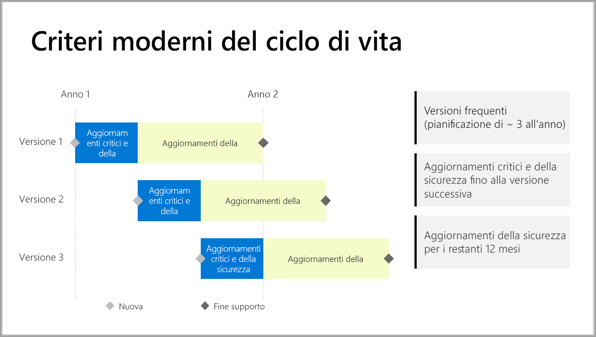

# Sequenza temporale del supporto per il server di report di Power BI

Il server di report di Power BI viene rilasciato più volte l'anno. Gli aggiornamenti critici e di sicurezza sono disponibili fino alla disponibilità generale della versione successiva. Dopo il rilascio della versione successiva, la versione precedente continuerà a ricevere gli aggiornamenti di sicurezza per il resto della durata di 12 mesi.

Questo criterio di supporto consente di fornire innovazione ai clienti in tempi rapidi, pur offrendo la flessibilità di adottarla in base alle proprie esigenze.

* Fase di manutenzione degli aggiornamenti critici e della sicurezza: quando si esegue l'ultima versione corrente del server di report di Power BI, si ricevono sia gli aggiornamenti critici sia quelli di sicurezza.
* Fase di manutenzione dei soli aggiornamenti della sicurezza: dopo il rilascio di una nuova versione, il supporto per le versioni precedenti viene limitato agli aggiornamenti della sicurezza solo per il ciclo di vita residuo dei 12 mesi di supporto (illustrato nella figura 1).

    

## Cronologia versioni

| **Versione** | **Data di disponibilità** | **Data di fine del supporto** |
| --- | --- | --- |
| Giugno 2017 |12 giugno 2017 |Non più supportato |
| Ottobre 2017 |31 ottobre 2017 | Non più supportato |
| Marzo 2018 | 19 marzo 2018 | Non più supportato |
| Agosto 2018 | 15 agosto 2018 | Non più supportato |
| Gennaio 2019 | 23 gennaio 2019 | 23 gennaio 2020 |
| Maggio 2019 | 22 maggio 2019 | 22 maggio 2020 |
| Settembre 2019 | Settembre 2019 | Settembre 2020 

Per scaricare il server di report di Power BI e Power BI Desktop ottimizzati per il server di report di Power BI, visitare [Creazione di report in locale con il server di report di Power BI](https://powerbi.microsoft.com/report-server/).

## Passaggi successivi
[Novità del Server di report di Power BI](whats-new.md)  
[Che cos'è Server di report di Power BI?](get-started.md)
[Panoramica amministratore](admin-handbook-overview.md)  
[Installare il server di report di Power BI](install-report-server.md)  

Altre domande? [Provare a rivolgersi alla community di Power BI](https://community.powerbi.com/)