# Esercitazione: Esplorare il portale Web di Server di report di Power BI in una macchina virtuale
In questa esercitazione si crea una macchina virtuale di Azure con Server di Report di Power BI già installato per imparare a visualizzare, modificare e gestire report impaginati e indicatori KPI di esempio di Power BI.

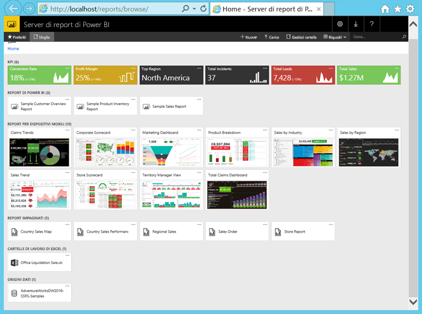

Ecco le attività che si eseguiranno in questa esercitazione:

> [!div class="checklist"]
> * Creare e connettersi a una macchina virtuale
> * Avviare ed esplorare il portale Web di Server di report di Power BI
> * Contrassegnare un elemento preferito
> * Visualizzare e modificare un report di Power BI
> * Visualizzare, gestire e modificare un report impaginato
> * Visualizzare una cartella di lavoro di Excel in Excel Online

Per questa esercitazione è necessaria una sottoscrizione di Azure. Se non se ne ha una, creare un [account gratuito](https://azure.microsoft.com/free/?WT.mc_id=A261C142F) prima di iniziare.

## Creare una macchina virtuale per Server di report di Power BI

Il team di Power BI ha creato una macchina virtuale che viene fornita con Server di report di Power BI già installato.

1. In Azure Marketplace selezionare Power BI Report Server. Il collegamento apre direttamente [Power BI Report Server](https://azuremarketplace.microsoft.com/marketplace/apps/reportingservices.technical-preview?tab=Overview).  

2. Selezionare **Scarica adesso**.
3. Per accettare le condizioni per l'utilizzo e l'informativa sulla privacy del provider, selezionare **Continua**.

4. Selezionare **Crea**.

    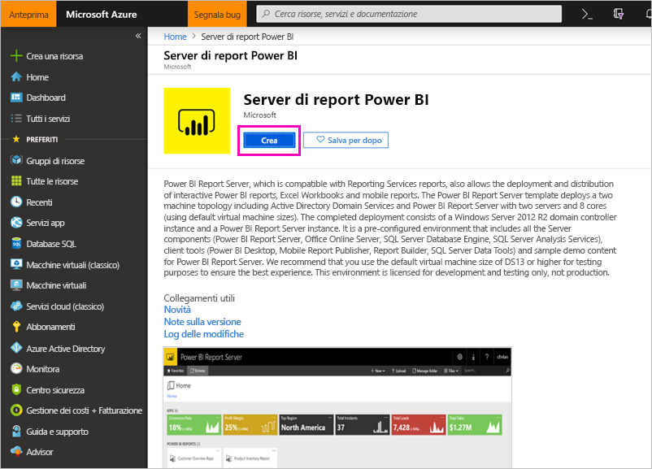

5. In **Passaggio 1 Informazioni di base** per **Nome macchina virtuale** inserire **reportservervm**.

    Il nome della macchina virtuale del server di report di Power BI non può contenere trattini.

5. Creare un nome utente e una password.

6. Per **Gruppo di risorse** selezionare **Crea nuovo** e assegnare il nome **reportserverresourcegroup** > **OK**.

    Se si visualizza l'esercitazione più di una volta, è necessario assegnare al gruppo di risorse un nome diverso dopo la prima volta. Non è possibile usare lo stesso nome di gruppo di risorse due volte in una sottoscrizione. 

    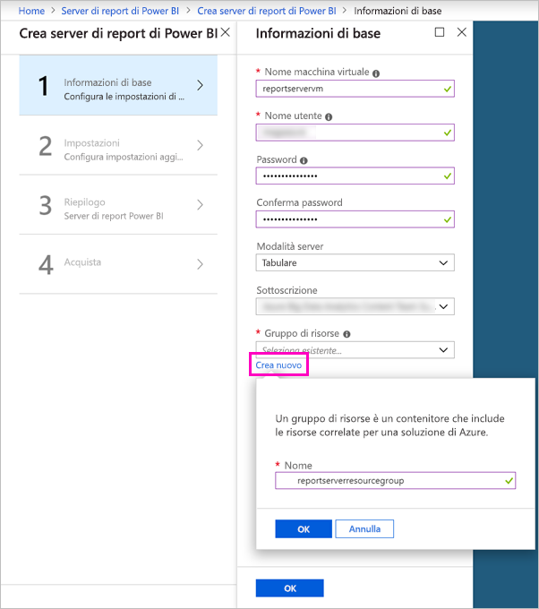

7. Mantenere le altre impostazioni predefinite > **OK**.

8. In **Passaggio 2 Impostazioni** mantenere le impostazioni predefinite > **OK**.
 
    Anche i valori **SQL Storage account** (Account di archiviazione SQL) e **Diagnostics Storage account** (Account di archiviazione di diagnostica) devono essere univoci. Se si esegue l'esercitazione più di una volta, è necessario assegnare ai gruppi di risorse nomi diversi.

9. In **Passaggio 3 Riepilogo** rivedere le selezioni > **OK**.

10. In **Passaggio 4 Acquisto** rivedere le Condizioni per l'utilizzo e l'Informativa sulla privacy > **Crea**.

    Il processo **Invio della distribuzione per Server di report di Power BI** può richiedere alcuni minuti.

## Connettersi alla macchina virtuale

1. Nel riquadro di spostamento di Azure selezionare **Macchine virtuali**. 

2. Nella casella **Filtra per nome** digitare "report". 

3. Selezionare la macchina virtuale denominata **REPORTSERVERVM**.

    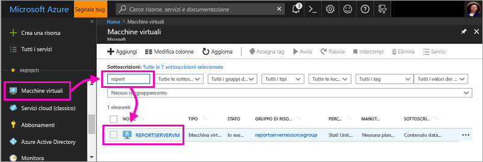

4. Nella macchina virtuale REPORTSERVERVM selezionare **Connetti**.

    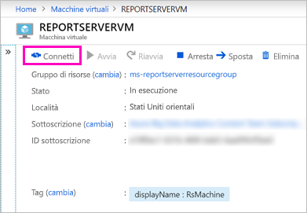

5. Nel riquadro **Connetti a macchina virtuale** mantenere le impostazioni predefinite e selezionare **Scarica file RDP**.

1. Nella finestra di dialogo **Connessione Desktop remoto** selezionare **Connetti**.

6. Immettere il nome e la password create per la macchina virtuale > **OK**.

7. La finestra di dialogo visualizza il messaggio **Impossibile verificare l'identità del computer remoto. Connettersi comunque?** Selezionare **Sì**.

   La nuova macchina virtuale viene aperta.

## Server di report di Power BI nella macchina virtuale

Ecco gli elementi che compaiono sul desktop all'apertura della macchina virtuale.

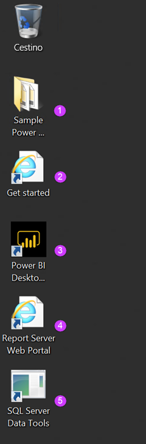

|Numero  |Descrizione  |
|---------|---------|
| | Report di Power BI di esempio (con estensione PBIX) |
| | Collegamento alla documentazione di Server di Report di Power BI |
| | Avvia Power BI Desktop ottimizzato per Server di report di Power BI (gennaio 2019) |
| | Apre il portale Web di Server di report di Power BI nel browser |
| | Avvia SQL Server Data Tools per la creazione di report impaginati (con estensione RDL) |

Fare doppio clic sull'icona del **portale Web del server di report**. Il browser apre `https://localhost/reports/browse`. Nel portale Web sono visibili vari file raggruppati per tipo. 

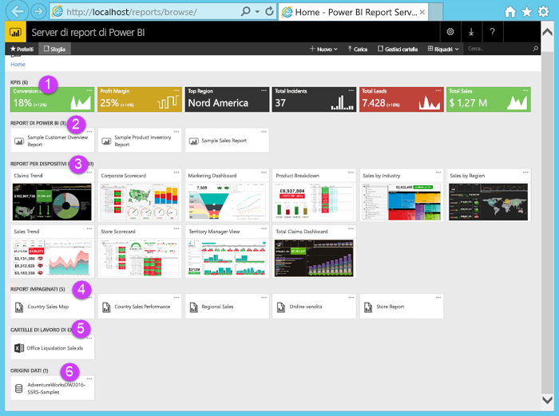

|Numero  |Descrizione  |
|---------|---------|
| | Indicatori KPI creati nel portale Web |
| |  Report di Power BI (con estensione PBIX)  |
| | Report per dispositivi mobili creati in SQL Server Mobile Report Publisher  |
| |  Report impaginati creati in Generatore report o SQL Server Data Tools  |
| | Cartelle di lavoro di Excel   | 
| | Origini dati dei report impaginati | 

## Contrassegnare gli elementi preferiti
È possibile contrassegnare i report e gli indicatori KPI come preferiti. Sono più semplici da trovare perché sono tutti raccolti in una singola cartella Preferiti nel portale Web e nelle app Power BI per dispositivi mobili. 

1. Selezionare i puntini di sospensione ( **...** ) nell'angolo superiore destro dell'indicatore KPI **Profit Margin** > **Aggiungi a Preferiti**.
   
    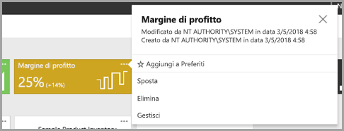
2. Selezionare **Preferiti** sulla barra multifunzione del portale Web per visualizzarlo insieme agli altri preferiti nella pagina Preferiti nel portale Web.
   
    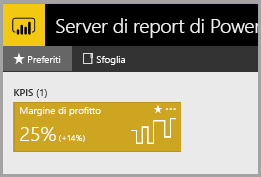

3. Selezionare **Sfoglia** per tornare al portale Web.
   
## Visualizzare gli elementi in visualizzazione Elenco
Per impostazione predefinita, il portale Web visualizza il relativo contenuto nella Visualizzazione affiancata.

È possibile passare alla Visualizzazione elenco, in cui è facile spostare o eliminare più elementi contemporaneamente. 

1. Selezionare **Riquadri** > **Elenco**.
   
    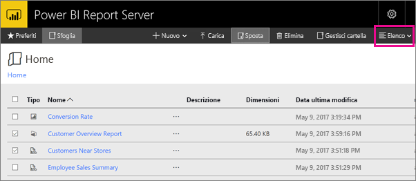

2. Tornare alla visualizzazione Riquadri: selezionare **Elenco** > **Riquadri**.

## Report di Power BI

È possibile visualizzare e interagire con i report di Power BI nel portale Web e avviare Power BI Desktop direttamente dal portale Web.

### Visualizzare report di Power BI

1. Nel portale Web in **Report di Power BI** selezionare **Sample Customer Overview Report**. Il report si apre nel browser.

1. Selezionare il blocco United States nella mappa ad albero per vedere come vengono evidenziati i valori correlati negli altri oggetti visivi.

    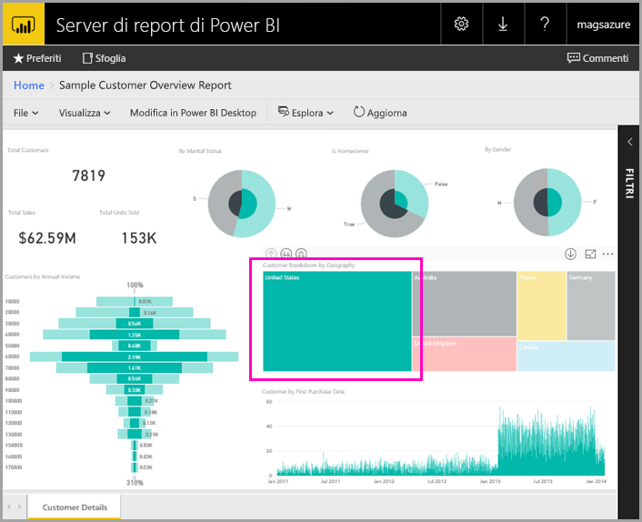

### Modifica in Power BI Desktop

1. Selezionare **Modifica in Power BI Desktop**.

1. Selezionare **Consenti** per consentire al sito Web di aprire un programma nel computer. 

     Il report si apre in Power BI Desktop. Si noti il nome nella barra superiore, "Power BI Desktop (gennaio 2019)". Si tratta della versione ottimizzata per Server di report di Power BI.

    Usare la versione di Power BI Desktop che viene installata nella macchina virtuale. Non è possibile passare da un dominio all'altro per caricare un report.

3. Nel riquadro Campi espandere la tabella Customers e trascinare il campo Occupation nei filtri a livello di report.

    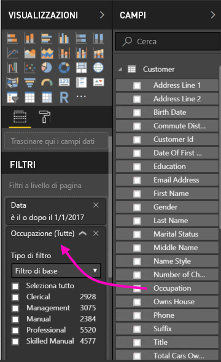

1. Salvare il report.

1. Tornare al report nel browser e selezionare l'icona **Aggiorna** del browser.

    

8. Espandere il riquadro **Filtri** per visualizzare il filtro **Occupation** aggiunto. Selezionare **Professional**.

    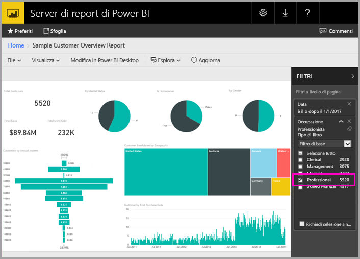

3. Selezionare **Sfoglia** per tornare al portale Web.

## Report impaginati (RDL)

È possibile visualizzare e gestire report impaginati e avviare Generatore report tramite il portale Web.

### Gestire un report impaginato

1. Nel portale Web, in **Report impaginati**, selezionare **Altre opzioni** (...) accanto a **Sales Order** > **Gestisci**.

1. Selezionare **Parametri**, modificare il valore predefinito per **SalesOrderNumber** in **SO50689** > **Applica**.

   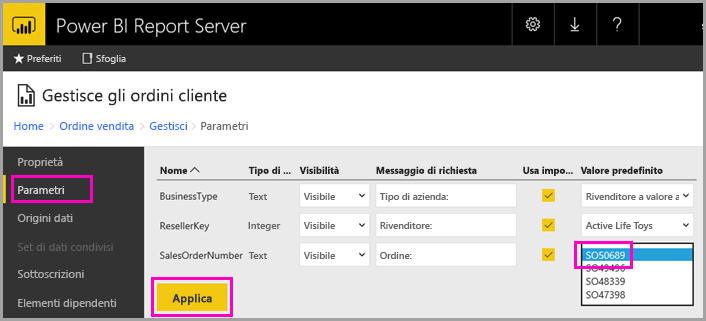

3. Selezionare **Sfoglia** per tornare al portale Web.

### Visualizzare un report impaginato

1. Selezionare **Sales Order** nel portale Web.
 
3.  Il report si apre sul parametro **Order** impostato, **SO50689**. 

    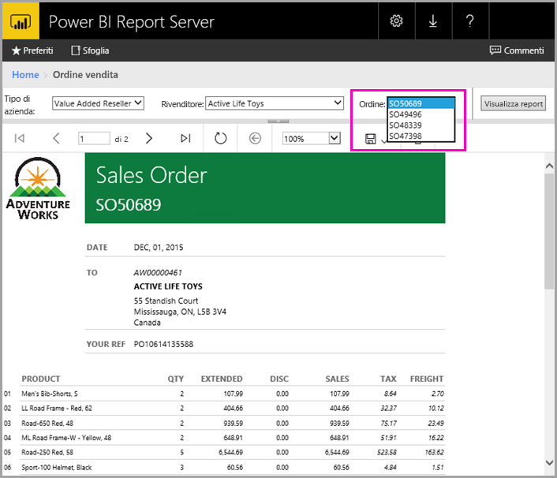

    Qui è possibile modificare questo e altri parametri senza modificare le impostazioni predefinite.

1. Selezionare **Order** **SO48339** > **Visualizza report**.

4. Si noti che questa è la pagina 1 di 2. Selezionare la freccia a destra per vedere la seconda pagina. La tabella continua a pagina 2.

    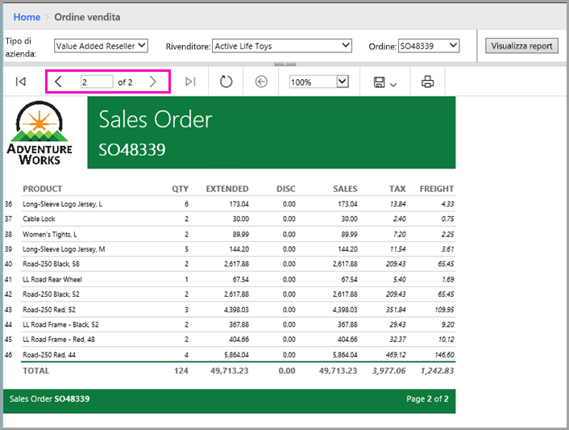

5. Selezionare **Sfoglia** per tornare al portale Web.

### Modificare un report impaginato

È possibile modificare i report impaginati in Generatore report, che si può avviare direttamente dal browser.

1. Nel portale Web selezionare **Altre opzioni** (...) accanto a **Sales Order** > **Modifica in Generatore report**.

1. Selezionare **Consenti** per consentire al sito Web di aprire un programma nel computer.

1. Il report Sales Order si apre in Generatore report in visualizzazione Progettazione.

    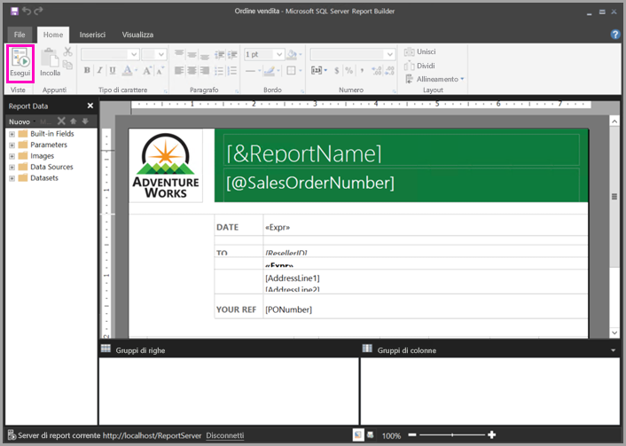

1. Selezionare **Esegui** per visualizzare in anteprima il report.

    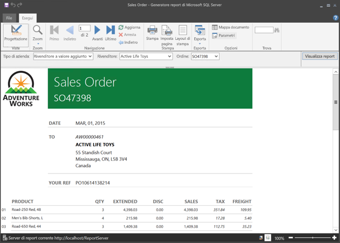

5. Chiudere Generatore Report e tornare al browser.

## Visualizzare cartelle di lavoro di Excel

È possibile visualizzare e interagire con le cartelle di lavoro di Excel in Excel Online in Server di Report di Power BI. 

1. Selezionare la cartella di lavoro di Excel **Office Liquidation Sale.xlsx**. È possibile che vengano chieste le credenziali. Selezionare **Annulla**. 
    La cartella di lavoro si apre nel portale Web.
1. Selezionare **Appliance** nel filtro dei dati.

    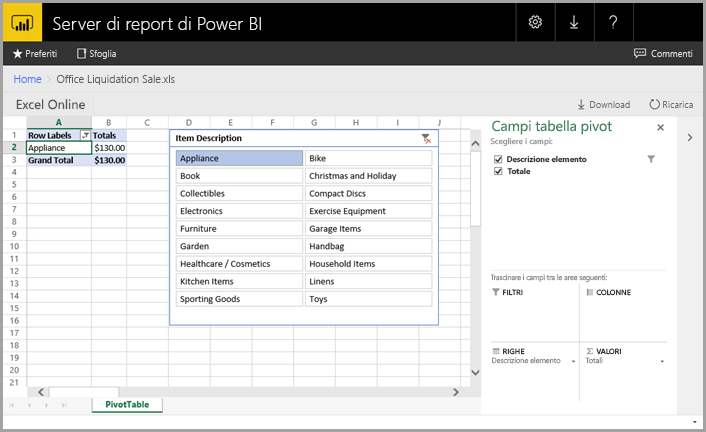

1. Selezionare **Sfoglia** per tornare al portale Web.

## Pulire le risorse

Una volta completata l'esercitazione, eliminare il gruppo di risorse, la macchina virtuale e tutte le risorse correlate. 

- A questo scopo, selezionare il gruppo di risorse per la macchina virtuale e quindi selezionare **Elimina**.

## Passaggi successivi

In questa esercitazione è stata creata una macchina virtuale con Server di Report di Power BI. Si è provato a usare alcune delle funzionalità del portale Web e si sono aperti un report di Power BI e un report impaginato nei rispettivi editor. Questa macchina virtuale possiede origini dati di SQL Server Analysis Services installate, pertanto è possibile provare a creare la propria Power BI e report impaginati con le stesse origini dati. 

Per altre informazioni sulla creazione di report per Server di Report di Power BI, continuare a leggere.

> [!div class="nextstepaction"]
> [Creare un report di Power BI per Server di report di Power BI](./quickstart-create-powerbi-report.md)

