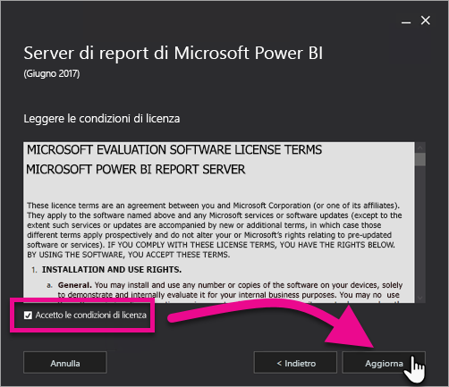

# Aggiornare il server di report di Power BI

Informazioni su come aggiornare il server di report di Power BI.

 **Scarica** 

Per scaricare il server di report di Power BI e Power BI Desktop ottimizzati per il server di report di Power BI, visitare [Creazione di report in locale con il server di report di Power BI](https://powerbi.microsoft.com/report-server/).

## Prima di iniziare

Prima di aggiornare un server di report, è consigliabile eseguire la procedura seguente per fare il backup del server di report.

### Backup delle chiavi di crittografia

È consigliabile eseguire il backup delle chiavi di crittografia quando si configura un'installazione di server di report per la prima volta. È inoltre consigliabile eseguire il backup delle chiavi di ogni volta che si modifica l'identità degli account di servizio o si rinomina il computer. Per altre informazioni, vedere [Eseguire il backup e ripristinare le chiavi di crittografia dei servizi di creazione report](https://docs.microsoft.com/sql/reporting-services/install-windows/ssrs-encryption-keys-back-up-and-restore-encryption-keys).

### Backup dei database del server di report

Poiché un server di report è un server senza stato, tutti i dati dell'applicazione vengono archiviati nei database **reportserver** e **reportservertempdb** eseguiti in un'istanza del motore di database di SQL Server. È possibile eseguire il backup di **reportserver** e **reportservertempdb** usando uno dei metodi supportati per il backup dei database di SQL Server. Le indicazioni specifiche per i database del server di report includono:

* Usare il modello di recupero con registrazione completa per eseguire il backup di **reportserver** database.
* Usare il modello di recupero con registrazione minima per il backup di **reportservertempdb** database.
* È possibile usare diverse pianificazioni di backup per ogni database. L'unico motivo per eseguire il backup di **reportservertempdb** per non doverlo ricreare nel caso si verifica un errore hardware. In caso di errore hardware, non è necessario ripristinare i dati in **reportservertempdb**, ma è necessaria la struttura della tabella. Se si perde **reportservertempdb**, l'unico modo per recuperarlo è ricreare il database del server di report. Se si ricrea **reportservertempdb**, è importante assegnargli lo stesso nome del database del server di report principale.

Per altre informazioni sul backup e il ripristino dei database relazionali di SQL Server, vedere [Backup e ripristino di database SQL Server](https://docs.microsoft.com/sql/relational-databases/backup-restore/back-up-and-restore-of-sql-server-databases).

### Backup dei file di configurazione

Il server di report di Power BI usa i file di configurazione per archiviare le impostazioni dell'applicazione. È consigliabile eseguire il backup dei file quando si configura prima il server e dopo avere distribuito eventuali estensioni personalizzate. I file di cui eseguire il backup includono:

* config.json
* RSHostingService.exe.config
* Rsreportserver.config
* Rssvrpolicy.config
* Reportingservicesservice.exe.config
* Web.config per le applicazioni ASP.NET del server di report
* Machine.config per ASP.NET

## aggiornare il server di report

L'aggiornamento del server di report di Power BI è molto semplice. e richiede solo pochi passaggi.

1. Cercare il percorso di PowerBIReportServer.exe e avviare il programma di installazione.

2. Selezionare **Upgrade Power BI Report Server** (Aggiornare il server di report di Power BI).

    

3. Leggere e accettare i termini e le condizioni di licenza, quindi selezionare **Aggiorna**.

    

4. Dopo il corretto aggiornamento, selezionare **Configure Report Server** (Configura il server di report) per avviare la Gestione configurazione Reporting Services oppure selezionare **Chiudi** per uscire dal programma di installazione.

    

## Aggiornare Power BI Desktop

Dopo avere eseguito l'aggiornamento del server di report, è possibile assicurarsi che gli autori di report di Power BI eseguano l'aggiornamento alla versione di Power BI Desktop ottimizzate per il server di report di Power BI che corrisponde al server.

## Passaggi successivi

* [Panoramica amministratore](admin-handbook-overview.md)  
* [Installare Power BI Desktop ottimizzato per il server di report di Power BI](install-powerbi-desktop.md)  
* [Verificare l'installazione di Reporting Services](https://docs.microsoft.com/sql/reporting-services/install-windows/verify-a-reporting-services-installation)  
* [Configurare l'account del servizio del server di report](https://docs.microsoft.com/sql/reporting-services/install-windows/configure-the-report-server-service-account-ssrs-configuration-manager)  
* [Configurare gli URL del server di report](https://docs.microsoft.com/sql/reporting-services/install-windows/configure-report-server-urls-ssrs-configuration-manager)  
* [Configurare una connessione al database del server di report](https://docs.microsoft.com/sql/reporting-services/install-windows/configure-a-report-server-database-connection-ssrs-configuration-manager)  
* [Inizializzare un server di report](https://docs.microsoft.com/sql/reporting-services/install-windows/ssrs-encryption-keys-initialize-a-report-server)  
* [Configurare le connessioni SSL in un server di report](https://docs.microsoft.com/sql/reporting-services/security/configure-ssl-connections-on-a-native-mode-report-server)  
* [Configurare le autorizzazioni e gli account del servizio di Windows](https://docs.microsoft.com/sql/database-engine/configure-windows/configure-windows-service-accounts-and-permissions)  
* [Supporto del browser per il server di report di Power BI](browser-support.md)

Altre domande? [Provare a rivolgersi alla community di Power BI](https://community.powerbi.com/)