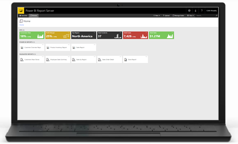
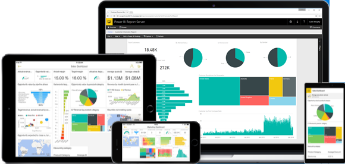

# Panoramica sul manuale per l'utente per Server di report di Power BI
Benvenuti nel manuale per l'utente del server di report di Power BI, un percorso locale per l'archiviazione e la gestione di report impaginati, per dispositivi mobili e di Power BI.

Il server di report di Power BI è anche un set di prodotti ed esperienze che contribuiscono a creare visualizzazioni dinamiche dei dati:

* Un [portale Web](#web-portal) che è possibile visualizzare in qualsiasi browser moderno. Nel portale Web, i report e gli indicatori KPI sono organizzati e visualizzati in cartelle ed è possibile contrassegnarli come Preferiti. È anche possibile archiviare qui le cartelle di lavoro Excel.
* [Report di Power BI](#power-bi-reports) creati con Power BI Desktop, che è possibile visualizzare nel portale Web o nelle app Power BI per dispositivi mobili.
* [Report impaginati](#paginated-reports): documenti dall'aspetto moderno, con layout fisso ottimizzati per la stampa e con strumenti di creazione.

Continuare a leggere per altre informazioni su ciascuno di essi.

## Portale Web

L'accesso principale al server di report di Power BI è un moderno portale Web che può essere visualizzato in qualsiasi browser. È possibile accedere a tutti i report e agli indicatori KPI nel nuovo portale.

Il portale Web può presentare il brand personalizzato dell'organizzazione e mostrare direttamente gli indicatori KPI, che permettono di visualizzare le metriche aziendali principali con un solo sguardo al browser, in modo da non dover aprire un report.

Il contenuto del portale Web è organizzato in cartelle e, all'interno di ogni cartella, è organizzato per tipo: report di Power BI, report per dispositivi mobili, report impaginati e indicatori KPI, più cartelle di lavoro di Excel. È possibile contrassegnare i report gli indicatori KPI preferiti, che sono tutti raccolti nella cartella Preferiti per poterli trovare più velocemente.

## Report di Power BI

Un report di Power BI consente di visualizzare un set di dati da più punti di vista, grazie a visualizzazioni che rappresentano conclusioni e approfondimenti diversi ottenuti da tale set di dati. Un report può includere una sola visualizzazione oppure contenere pagine con più visualizzazioni. In base al proprio ruolo, si può essere un utente che crea report e/o che visualizza e interagisce con i report.

I report sono basati su un singolo set di dati. Le visualizzazioni in un report rappresentano ognuna una parte di informazioni. Le visualizzazioni non sono statiche: analogamente a un dashboard, ma in misura maggiore, un report è un elemento interattivo e personalizzabile in cui le visualizzazioni vengono aggiornate quando cambiano i dati sottostanti.

* Gli autori di report possono aggiungere e rimuovere dati, aggiungere o riorganizzare le visualizzazioni oppure modificare i tipi di visualizzazione.
* I visualizzatori di report possono ordinare e applicare filtri e filtri dei dati quando analizzano i dati per rilevare informazioni dettagliate e cercare risposte.

È possibile creare report di Power BI con una versione speciale di Power BI Desktop. Scaricare [Microsoft Power BI Desktop](https://go.microsoft.com/fwlink/?linkid=837581) (ottimizzato per il server di report di Power BI - versione disponibile a livello generale, ottobre 2017).

## Report impaginati

I report impaginati sono report in formato documento, in cui maggiore è la quantità di dati presente, maggiore sarà la quantità di righe nelle tabelle e di pagine nel report. I report impaginati sono documenti con layout fisso e ad alta risoluzione grafica ottimizzati per la stampa, ad esempio file in formato PDF e Word.

I report impaginati vengono creati con [Generatore report](https://docs.microsoft.com/sql/reporting-services/report-builder/report-builder-in-sql-server-2016) o Progettazione report in [SQL Server Data Tools (SSDT)](https://docs.microsoft.com/sql/reporting-services/tools/reporting-services-in-sql-server-data-tools-ssdt).

## Passaggi successivi
[Installare Power BI Desktop ottimizzato per il server di report di Power BI](install-powerbi-desktop.md)  
[Avvio rapido: report impaginati](quickstart-create-paginated-report.md)  
[Avvio rapido: report di Power BI](quickstart-create-powerbi-report.md)

Altre domande? [Provare a rivolgersi alla community di Power BI](https://community.powerbi.com/)

