# Esempio Analisi della redditività dei clienti per Power BI: Presentazione

## Panoramica dell'esempio di analisi della redditività dei clienti
Il pacchetto di contenuto di esempio Analisi della redditività dei clienti contiene un dashboard, un report e un set di dati per una società che produce materiali di marketing. Il dashboard è stato creato da una responsabile amministrativa per ottenere le metriche principali relative ai cinque responsabili di business unit, ai prodotti, ai clienti e ai margini lordi e trovare subito i fattori che influiscono negativamente sulla redditività.

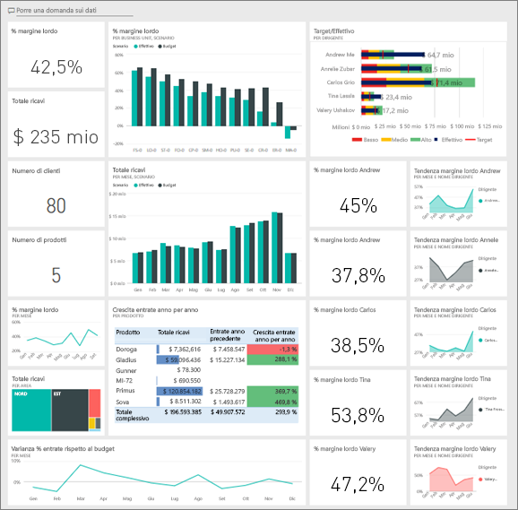

Questo esempio fa parte di una serie che illustra come usare Power BI con dati, report e dashboard orientati al business. L'esempio è stato creato con dati reali messi a disposizione da [obviEnce](http://www.obvience.com/) che sono stati resi anonimi. I dati sono disponibili in diversi formati: pacchetto di contenuto/app, file di Power BI Desktop con estensione pbix o cartella di lavoro di Excel. Vedere [Esempi per Power BI](sample-datasets.md). 

Questa esercitazione usa il servizio Power BI e il pacchetto di contenuto di esempio Analisi della redditività dei clienti. Dato che le esperienze per i report sono molto simili, è anche possibile seguire le descrizioni usando Power BI Desktop e il file con estensione pbix di esempio. 

## Prerequisiti

Prima di poter usare l'esempio, è necessario scaricarlo come [pacchetto di contenuto](#get-the-content-pack-for-this-sample), [file con estensione pbix](#get-the-pbix-file-for-this-sample) o [cartella di lavoro di Excel](#get-the-excel-workbook-for-this-sample).

### Scaricare il pacchetto di contenuto per questo esempio

1. Aprire il servizio Power BI (app.powerbi.com), eseguire l'accesso e aprire l'area di lavoro in cui salvare l'esempio.

2. Nell'angolo in basso a sinistra selezionare **Recupera dati**.

   
3. Nella pagina **Recupera dati** che viene visualizzata selezionare **Esempi**.

4. Selezionare **Esempio di analisi della redditività dei clienti**, quindi scegliere **Connetti**.  

    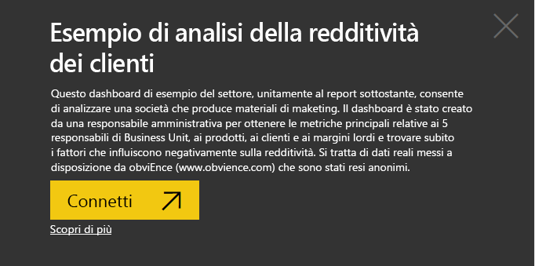
5. Power BI importa il pacchetto di contenuto e quindi aggiunge un nuovo dashboard, report e set di dati all'area di lavoro corrente.

    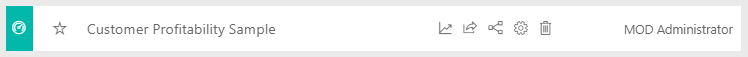

### Scaricare il file con estensione pbix per questo esempio

In alternativa è possibile scaricare l'[esempio Analisi della redditività dei clienti](http://download.microsoft.com/download/6/A/9/6A93FD6E-CBA5-40BD-B42E-4DCAE8CDD059/Customer%20Profitability%20Sample%20PBIX.pbix) come file con estensione pbix, progettato per l'uso con Power BI Desktop.

### Scaricare la cartella di lavoro di Excel per questo esempio

Se si vuole visualizzare l'origine dati per questo esempio, è disponibile anche come [cartella di lavoro di Excel](http://go.microsoft.com/fwlink/?LinkId=529781). La cartella di lavoro contiene fogli di Power View che è possibile visualizzare e modificare. Per vedere i dati non elaborati, abilitare i componenti aggiuntivi di Analisi dati, quindi selezionare **Power Pivot > Gestisci**. Per abilitare i componenti aggiuntivi Power View e Power Pivot, vedere [Esaminare gli esempi di Excel direttamente da Excel ](sample-datasets.md#optional-take-a-look-at-the-excel-samples-from-inside-excel-itself) per informazioni dettagliate.

## Informazioni fornite dal dashboard

Nell'area di lavoro in cui è stato salvato l'esempio trovare il dashboard Redditività clienti e selezionarlo:

### Riquadri del dashboard a livello societario
1. Aprire il dashboard nel servizio Power BI. I riquadri del dashboard offrono alla responsabile amministrativa una visualizzazione delle metriche aziendali di alto livello più importanti. Quando trova dati interessanti, può selezionare un riquadro per analizzarli in dettaglio.

2. Esaminare i riquadri sul lato sinistro del dashboard.

    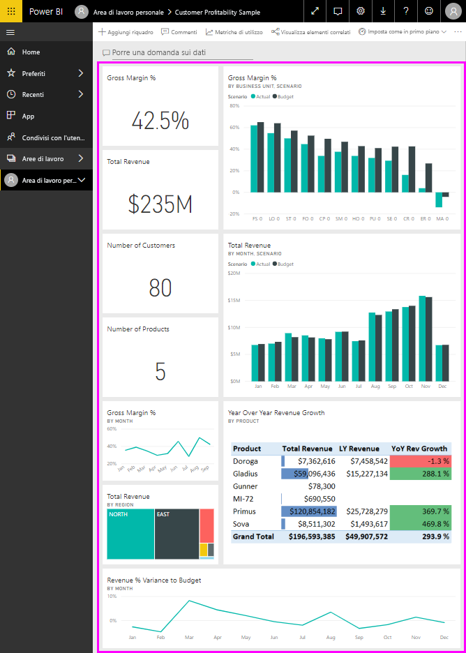

   Tenere presenti questi dettagli:
   - Il margine lordo della società è del 42,5%.
   - Ha 80 clienti.
   - Vende cinque prodotti diversi.
   - La più bassa percentuale di varianza dei ricavi rispetto al budget si è avuta a febbraio, seguita dalla più alta a marzo.
   - Gran parte del fatturato proviene dalle aree est e nord. Il margine lordo non ha mai superato il budget. Sono richieste ulteriori indagini sulle business unit ER-0 e MA-0.
   - Il fatturato totale per l'anno in corso è vicino al budget.

### Riquadri del dashboard specifici del responsabile
I riquadri sul lato destro del dashboard forniscono una scorecard del team. La responsabile amministrativa deve monitorare i responsabili a lei sottoposti e questi riquadri le offrono una panoramica del profitto di alto livello, usando la percentuale di margine lordo. Se la tendenza della percentuale di margine lordo è imprevista per qualsiasi responsabile, la responsabile amministrativa potrà eseguire ulteriori indagini.

Analizzando i riquadri del dashboard riservati ai responsabili si possono formulare le osservazioni seguenti:

- Tutti i dirigenti, ad eccezione di Carlos, hanno già superato gli obiettivi di vendita. Le vendite effettive di Carlos sono, tuttavia, le più alte.
- La percentuale di margine lordo di Annelie è la più bassa, ma si osserva un aumento costante a partire da marzo.
- Valery, d'altro canto, ha visto un calo significativo della sua percentuale di margine lordo.
- Andrew ha avuto un anno volatile.

## Esplorare i dati sottostanti del dashboard
Questo dashboard contiene riquadri collegati a un report e a una cartella di lavoro di Excel.

### Aprire l'origine dati di Excel Online
Due riquadri in questo dashboard, **Target vs Actual** (Vendite previste ed effettive) e **Year Over Year Revenue Growth** (Crescita annuale dei ricavi) sono stati aggiunti da una cartella di lavoro di Excel. Quando si seleziona uno di questi riquadri, Power BI apre l'origine dati, in questo caso, Excel Online.

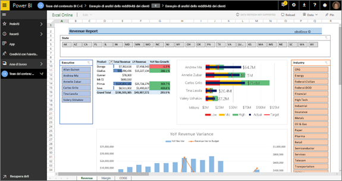

1. Selezionare uno dei riquadri aggiunti da Excel. Excel Online viene aperto all'interno del servizio Power BI.
2. Si noti che la cartella di lavoro comprende tre schede di dati. Aprire **Revenue** (Ricavi).
3. Si cercherà ora di capire perché Carlos non ha ancora raggiunto gli obiettivi:  

    a. Dal dispositivo di scorrimento **Executive** (Responsabile) selezionare **Carlos Grilo**.   

    b. La prima tabella pivot indica che la crescita dei ricavi di Carlos per il suo prodotto principale, Primus, è diminuita del 152% rispetto all'anno precedente. Il grafico **YoY Revenue Variance** (Varianza dei ricavi negli anni) indica che per la maggior parte dei mesi non raggiunge il budget.  

    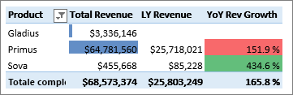

    

4. Continuare a esplorare. Se si trova qualcosa di interessante, selezionare **Aggiungi**  nell'angolo in alto a destra per [aggiungerla a un dashboard](service-dashboard-pin-tile-from-excel.md).

5. Usare la freccia indietro del browser per tornare al dashboard.

### Aprire il report di Power BI sottostante
Molti riquadri nel dashboard di esempio Redditività clienti sono stati aggiunti dal report di esempio di analisi della redditività dei clienti sottostante.

1. Selezionare uno di questi riquadri per aprire il report nella visualizzazione di lettura.

   Se il riquadro è stato creato in Domande e risposte, la sua selezione apre la finestra Domande e risposte. Selezionare **Chiudi Domande e risposte** per tornare al dashboard e provare un riquadro diverso.

2. Il report ha tre pagine. Ogni scheda nella parte inferiore del report rappresenta una pagina.

    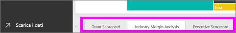

    * **Team Scorecard** è incentrata sulle prestazioni dei cinque responsabili e il relativo fatturato clienti.
    * **Industry Margin Analysis** indica come analizzare la redditività rispetto all'andamento dell'intero settore.
    * **Executive Scorecard** fornisce una vista di ciascuno dei manager formattata per la visualizzazione in Cortana.

### Pagina Team Scorecard
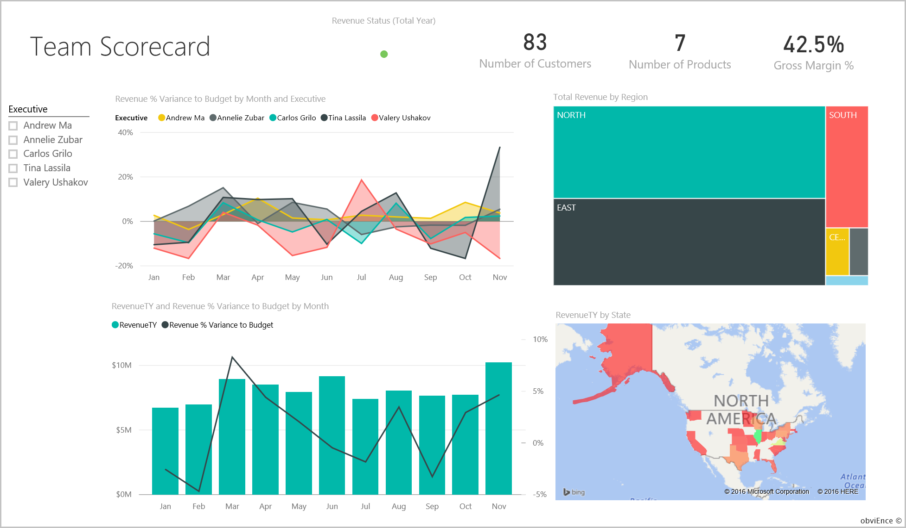

Verranno ora esaminati nel dettaglio due membri del team per ottenere informazioni più approfondite: 

1. Nel filtro dei dati **Executive** a sinistra selezionare il nome di Andrew per filtrare la pagina del report in modo da visualizzare solo i dati su Andrew:

   * Per un indicatore KPI rapido, esaminare lo stato dei ricavi di Andrew in **Revenue Status (Total Year)** . È verde, il che significa che sta ottenendo ottimi risultati.
   * Il grafico **Revenue % Variance to Budget by Month and Executive** (Percentuale varianza ricavi rispetto al budget per mese e responsabile) mostra che, fatta eccezione per una flessione a febbraio, nel complesso Andrew sta ottenendo risultati buoni. La sua area dominante è l'est, in cui gestisce 49 clienti e 5 prodotti su 7. La sua percentuale di margine lordo non è la più elevata né la più ridotta.
   * Il grafico **RevenueTY and Revenue % Var to Budget by Month** (Ricavi annuali e % varianza ricavi rispetto al budget per mese) mostra un profitto costante e uniforme. Tuttavia, se si filtra il grafico selezionando il quadrato dell'area **Central** nella mappa ad albero, si scopre che Andrew può contare su ricavi solo a marzo e solo nello stato dell'Indiana. Si tratta di un comportamento intenzionale oppure è un fatto su cui indagare ulteriormente?

2. Passiamo ora a Valery. Nel filtro dei dati **Executive** selezionare il nome di Valery per filtrare la pagina del report e visualizzare solo i dati sull'utente. 

   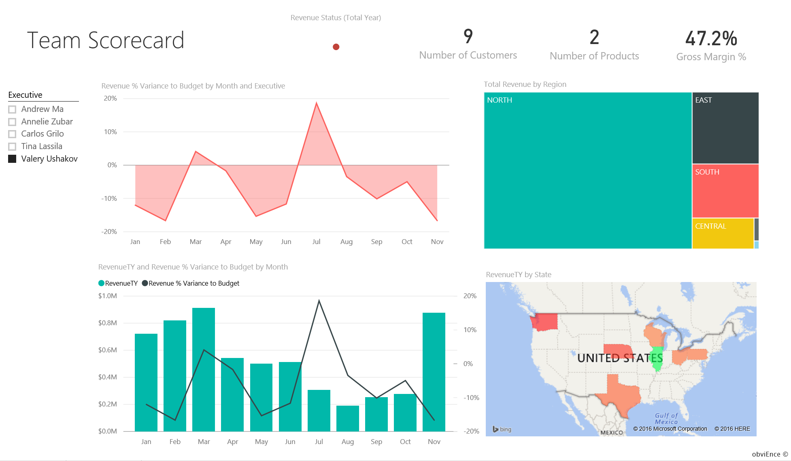

   * Si noti l'indicatore KPI rosso per **Revenue Status (Total Year)** (Stato dei ricavi totali per anno). Decisamente, è necessario indagare ulteriormente su questo elemento.
   * Anche la varianza dei ricavi di Valery dipinge un quadro preoccupante: non ha raggiunto i margini di ricavo previsti.
   * Valery ha solo nove clienti, gestisce solo due prodotti e lavora quasi esclusivamente con i clienti nell'area nord. Questa specializzazione potrebbe spiegare le ampie fluttuazioni nelle sue metriche.
   * Se si seleziona il quadrato **North** nella mappa ad albero si scopre che il margine lordo di Valery nell'area nord è coerente con il suo margine complessivo.
   * Selezionando uno a uno gli altri quadrati di **Total Revenue by Region** (Ricavi totali per area) si apprende che la sua percentuale di margine lordo va dal 23% al 79% e le cifre dei ricavi, in tutte le aree tranne quella nord, sono estremamente stagionali.

3. Continuiamo a esplorare per scoprire il motivo per cui l'area di Valery non offre buoni risultati. Osservare le aree, le altre business unit e la pagina successiva del report: **Industry Margin Analysis** (Analisi del margine di settore).

### Analisi del margine di settore
Questa pagina del report mostra una sezione diversa dei dati. Illustra il margine lordo dell'intero settore, suddiviso in base al segmento. La responsabile amministrativa usa questa pagina per confrontare le metriche della società e della business unit con le metriche del settore, per provare a capire le tendenze e la redditività. Ci si potrebbe chiedere perché il grafico **Gross Margin % by Month and Executive** (% margine lordo per mese e responsabile) sia in questa pagina, dal momento che è specifico per il team. L'inserimento in questa sede consente di filtrare la pagina in base al responsabile di business unit.  

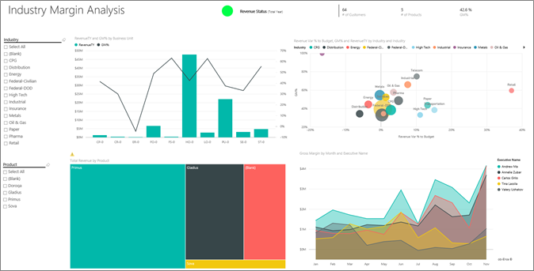

1. In che modo varia la redditività per ogni settore? In che modo sono suddivisi i prodotti e i clienti per ogni settore? Per rispondere a queste domande, selezionare uno o più settori nella parte superiore sinistra, iniziando dal settore CPG. Per cancellare il filtro, selezionare l'icona a forma di gomma.

2. Nel grafico a bolle **Revenue Var % to Budget, GM%, and RevenueTY by Industry**, la responsabile amministrativa cerca le bolle più grandi, perché sono quelle che hanno l'impatto più significativo sui ricavi. Per facilitare la visualizzazione dell'impatto di ogni responsabile in base al segmento del settore, filtrare la pagina selezionando in sequenza i nomi dei responsabili nel grafico ad aree.

3. Man mano che si selezionano i singoli responsabili nel grafico, si noti quanto segue:
   * L'area di influenza di Andrew attraversa molti segmenti del settore differenti, con percentuali di varianza e di margine lordo assai variabili (la maggior parte verso il lato positivo)
   * Il grafico di Annelie è simile, tranne per il fatto che lei si concentra solo su una manciata di segmenti del settore, con particolare attenzione al segmento Federal e al prodotto Gladius.
   * Carlos è chiaramente concentrato sul segmento Services, con buoni risultati. Ha migliorato notevolmente la percentuale di varianza per il segmento High Tech e in un nuovo segmento, Industrial, ha prodotto risultati eccezionali rispetto al budget.
   * Tina lavora con pochi segmenti e vanta la percentuale di margine lordo più alta di tutti, ma le dimensioni in gran parte ridotte delle sue bolle mostrano che il suo impatto sul bilancio aziendale è minimo.
   * Valery, che è responsabile di un solo prodotto, lavora solo in cinque segmenti del settore. La sua influenza sul settore è stagionale, ma produce sempre una bolla di grandi dimensioni, che indica un impatto significativo sul bilancio aziendale. I segmenti del settore possono spiegare i suoi risultati negativi?

### Executive Scorecard
Questa pagina è formattata come una pagina di risposte per Cortana. Per altre informazioni, vedere [Creare una pagina di risposte personalizzata per Cortana](service-cortana-answer-cards.md).

## Esaminare i dati in maniera più approfondita ponendo domande con le Domande e risposte
Per questa analisi sarebbe utile determinare quale settore genera il maggior ricavo per Valery. A tale scopo, verranno usate le Domande e risposte.

1. Selezionare **Modifica report** per aprire il report in visualizzazione di modifica. La visualizzazione di modifica è disponibile solo per il proprietario del report. Questa visualizzazione viene talvolta definita modalità *autore*. Se il report è stato condiviso solo con l'utente corrente, invece, non sarà possibile aprirlo in visualizzazione di modifica.

2.  Nella parte superiore del dashboard selezionare **Invia una domanda** per aprire la finestra per le domande e risposte.

    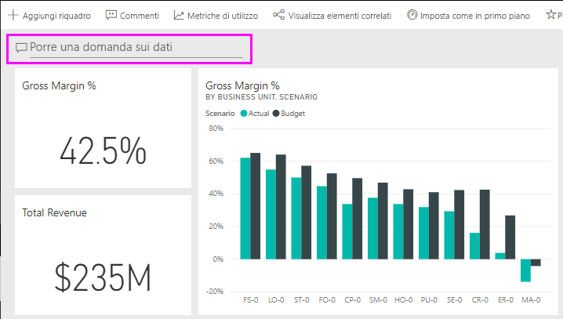

3. Digitare *total revenue by industry for Valery Ushakov* (ricavo totale per settore per Valery Ushakov) nella casella delle domande. Notare gli aggiornamenti della visualizzazione mentre si digita la domanda.

    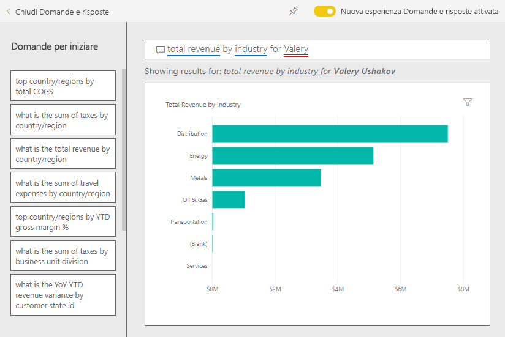

   Come si può notare, il settore Distribution è la maggiore area di ricavo per Valery.

### Eseguire un'analisi più approfondita aggiungendo filtri
Verrà ora esaminato il settore Distribution.  

1. Aprire la pagina del report **Industry Margin Analysis** (Analisi del margine del settore).
2. Senza selezionare alcuna visualizzazione nella pagina del report, espandere il riquadro Filtri sulla destra, se non è già espanso. Nel riquadro **Filtri** dovrebbero essere visualizzati solo **Filtri a livello di pagina**.  

   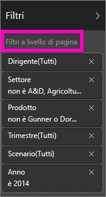
3. Individuare il filtro per **Industry** (Settore) e selezionare la freccia per espandere l'elenco. A questo punto aggiungere un filtro di pagina per il settore Distribution (Distribuzione). Deselezionare innanzitutto tutte le opzioni selezionate, facendo clic sulla casella di controllo **Seleziona tutto**. Quindi selezionare solo **Distribution**.  

   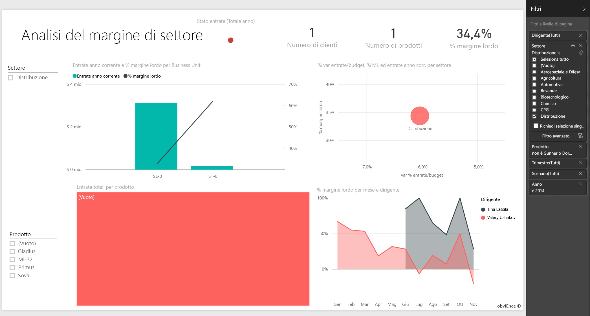
4. Il grafico **Gross Margin % by Month and Executive** indica che solo Valery e Tina hanno clienti in questo settore e che Valery ha lavorato in questo settore solo da giugno a novembre.   
5. Selezionare **Tina** e quindi **Valery** nella legenda del grafico **Gross Margin by Month and Executive**. Si noti che la parte di Tina di **Total Revenue by Product** (Ricavi totali in base al prodotto) è davvero minima se confrontata a quella di Valery.
6. Per visualizzare i ricavi effettivi, selezionare la casella Domande e risposte nel dashboard e immettere *total revenue by executive for distribution by scenario* (totale dei ricavi per la distribuzione in base allo scenario e al dirigente).  

     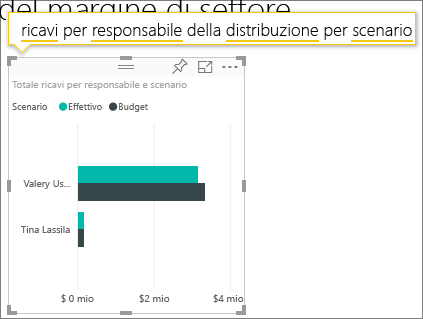

    In maniera simile, è possibile esplorare altri settori e persino aggiungere clienti agli elementi visivi per comprendere le cause delle prestazioni di Valery.

Questo ambiente è sicuro perché è possibile scegliere di non salvare le modifiche, ma, se le si salva, è sempre possibile scegliere **Recupera dati** per ottenere una nuova copia di questo esempio.

## Passaggi successivi: Connettersi ai dati
Ci auguriamo che questa presentazione abbia illustrato in che modo i dashboard di Power BI, le domande e risposte e i report forniscono informazioni dettagliate sui dati del cliente. È ora possibile iniziare e connettersi ai propri dati. Con Power BI è possibile connettersi a una vasta gamma di origini dati. Per altre informazioni, vedere [Introduzione al servizio Power BI](service-get-started.md).

[Esempi per Power BI](sample-datasets.md)  
