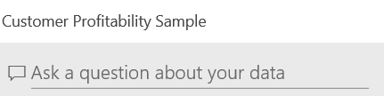
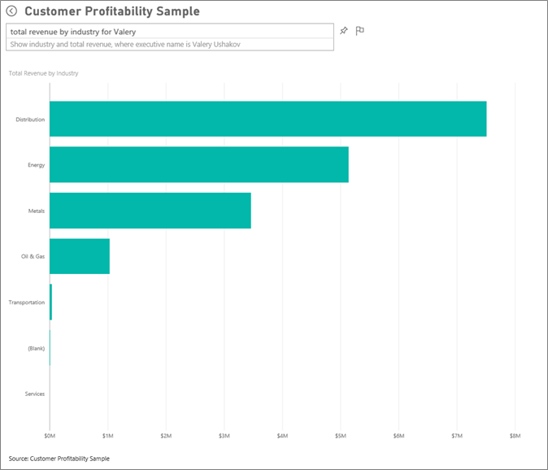
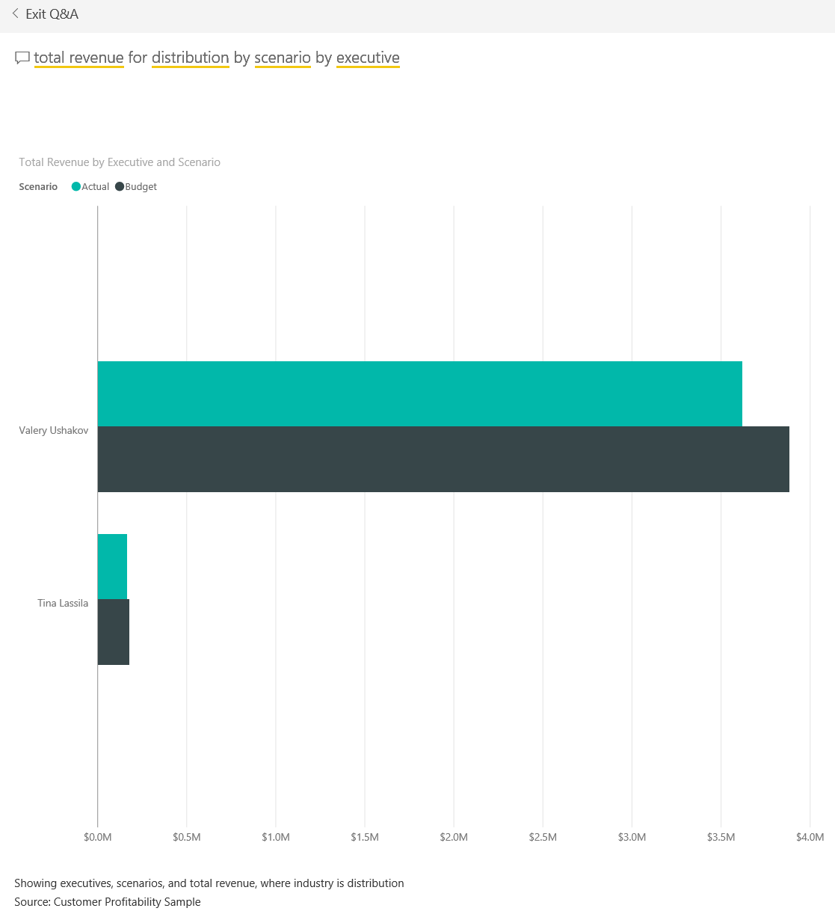

# Presentazione dell'esempio Analisi della redditività dei clienti per Power BI
Il pacchetto di contenuto "Esempio di analisi della redditività dei clienti" contiene un dashboard, un report e un set di dati per una società che produce materiali di marketing. Il dashboard è stato creato da una responsabile amministrativa per ottenere le metriche principali relative ai 5 responsabili di Business Unit, ai prodotti, ai clienti e ai margini lordi e trovare subito i fattori che influiscono negativamente sulla redditività.

Questo esempio fa parte di una serie che illustra come usare Power BI con dati, report e dashboard orientati al business. Si tratta di dati reali messi a disposizione da obviEnce ([www.obvience.com](http://www.obvience.com/)) che sono stati resi anonimi.

È anche possibile [scaricare solo il set di dati (cartella di lavoro di Excel) per questo esempio](http://go.microsoft.com/fwlink/?LinkId=529781).  

## Informazioni fornite dal dashboard
### Riquadri del dashboard a livello societario
Questi riquadri offrono alla responsabile amministrativa una visualizzazione delle metriche aziendali di alto livello più importanti.  Quando trova dati interessanti, può selezionare un riquadro per analizzarli in dettaglio.

1. Il margine lordo della società è del 42,5%.
2. Abbiamo 80 clienti.
3. Vendiamo 5 diversi prodotti.
4. La più bassa percentuale di varianza dei ricavi rispetto al budget si è avuta a febbraio, seguita dalla più alta a marzo.
5. Gran parte del fatturato proviene dalle aree Est e Nord. Il margine lordo non ha mai superato il budget, richiedendo ulteriori indagini su ER-0 e MA-0.
6. Il fatturato totale per l'anno in corso è vicino al budget.

### Riquadri del dashboard specifici del responsabile
Questi riquadri forniscono una scorecard del team. La responsabile amministrativa deve monitorare i responsabili a lei sottoposti e questi riquadri le offrono una panoramica del profitto di alto livello, usando la percentuale di margine lordo. Se la tendenza della percentuale di margine lordo è imprevista per qualsiasi responsabile, la responsabile amministrativa potrà eseguire ulteriori indagini.

La percentuale di margine lordo di Annelie è la più bassa, ma si osserva un aumento costante a partire da marzo. Valery, d'altro canto, ha visto un calo significativo della sua percentuale di margine lordo. Andrew, infine, ha avuto un anno volatile. Fare clic su uno dei riquadri specifici dei responsabili per aprire il report sottostante. Il report contiene tre pagine e si apre alla pagina "Industry Margin Analysis" (Analisi dei margini del settore).

## Esplorare le pagine del report
Il report è costituito da 3 pagine:

* "Team Scorecard" è incentrata sulle prestazioni dei 5 responsabili e il relativo "fatturato clienti".
* "Industry Margin Analysis" indica come analizzare la redditività rispetto all'andamento dell'intero settore.
* "Executive Scorecard" fornisce una vista di ciascuno dei manager formattata per la visualizzazione in Cortana.

### Pagina Team Scorecard

Verranno ora esaminati nel dettaglio due membri del team per ottenere informazioni più approfondite. Nel filtro dei dati a sinistra selezionare il nome di Andrew per filtrare la pagina del report in modo da visualizzare solo i dati su Andrew.

* Per un indicatore KPI rapido, esaminare lo stato dei ricavi di Andrew in **Revenue Status**, che è di colore verde. Andrew sta ottenendo ottimi risultati.
* Il grafico ad aree "Revenue Var % to Budget by Month" (Percentuale varianza mensile ricavi rispetto al budget) mostra che, fatta eccezione per una flessione a febbraio, nel complesso Andrew sta ottenendo risultati piuttosto buoni. La sua area dominante è l'Est, in cui gestisce 49 clienti e 5 prodotti (su 7). La sua percentuale di margine lordo non è la più elevata né la più ridotta.
* Il grafico "RevenueTY and Revenue Var % to Budget by Month" mostra un profitto costante e uniforme. Tuttavia, se si filtra il grafico facendo clic sul quadrato relativo all'area **Central** nella mappa ad albero, si scoprirà che Andrew può contare su ricavi solo a marzo e solo nello stato dell'Indiana. Si tratta di un comportamento intenzionale oppure è un fatto su cui indagare ulteriormente?

Passiamo ora a Valery. Nel filtro dei dati, selezionare il nome di Valery per filtrare la pagina del report in modo da visualizzare solo i dati sull'utente.  

* Si noti l'indicatore KPI rosso per **RevenueTY Status**. Decisamente, è necessario indagare ulteriormente su questo elemento.
* Anche la varianza dei ricavi di Valery dipinge un quadro preoccupante: non ha raggiunto i margini di ricavo previsti.
* Valery ha solo 9 clienti, gestisce solo 2 prodotti e lavora quasi esclusivamente con i clienti nell'area nord. Questa specializzazione potrebbe spiegare le ampie fluttuazioni nelle sue metriche.
* Selezionando il quadrato **North** nella mappa ad albero si scopre che il margine lordo di Valery nell'area nord è coerente con il suo margine complessivo.
* Selezionando gli altri quadrati **Region** si apprende una storia interessante: la sua percentuale di margine lordo va dal 23% al 79% e le cifre dei ricavi, in tutte le aree tranne quella nord, sono estremamente stagionali.

Continuiamo ad andare al fondo della questione per scoprire il motivo per cui l'area di Valery non offre buoni risultati. Osservare le aree, le altre business unit e la pagina successiva del report, "Industry Margin Analysis".

### Industry Margin Analysis
Questa pagina del report mostra una sezione diversa dei dati. Illustra il margine lordo dell'intero settore, suddiviso in base al segmento. La responsabile amministrativa usa questa pagina per confrontare le metriche della società e della business unit con le metriche del settore, per provare a capire le tendenze e la redditività. Ci si potrebbe chiedere perché il grafico ad aree "Gross Margin by Month and Executive Name" sia in questa pagina, dal momento che è specifico del team. L'inserimento in questa sede consente di filtrare la pagina in base al responsabile di business unit.  

In che modo varia la redditività per ogni settore? In che modo sono suddivisi i prodotti e i clienti per ogni settore? Selezionare uno o più settori nella parte superiore sinistra (iniziare dal settore CPG). Per cancellare il filtro, selezionare l'icona a forma di gomma.

Nel grafico a bolle, la responsabile amministrativa cerca le bolle più grandi perché sono quelle che hanno l'impatto più significativo sui ricavi. Filtrare la pagina in base al responsabile facendo clic sui relativi nomi nel grafico ad aree facilita la visualizzazione dell'impatto di ogni responsabile in base al segmento del settore.

* L'area di influenza di Andrew attraversa molti segmenti del settore differenti, con percentuali di varianza e di margine lordo assai variabili (la maggior parte verso il lato positivo)  
* Il grafico di Annelie è simile, tranne per il fatto che lei si concentra solo su una manciata di segmenti del settore, con particolare attenzione al segmento Federal e al prodotto Gladius. 
* Carlos è chiaramente concentrato sul segmento Services, con buon profitto. Ha migliorato notevolmente la percentuale di varianza per il segmento High Tech e in un nuovo segmento, Industrial, ha prodotto risultati eccezionali rispetto al budget. 
* Tina lavora con pochi segmenti e vanta la percentuale di margine lordo più alta di tutti, ma le dimensioni in gran parte ridotte delle sue bolle mostrano che il suo impatto sul bilancio aziendale è minimo. 
* Valery, che è responsabile di un solo prodotto, lavora solo in 5 segmenti del settore. La sua influenza sul settore è stagionale, ma produce sempre una bolla di grandi dimensioni, che indica un impatto significativo sul bilancio aziendale. Il settore può spiegare i suoi risultati negativi?

### Executive Scorecard
Questa pagina è formattata come una scheda di risposta per Cortana. Per altre informazioni, vedere [Creare schede di risposta per Cortana](service-cortana-answer-cards.md).

## Esaminare i dati in maniera più approfondita ponendo domande con le Domande e risposte
Per questa analisi sarebbe utile determinare quale settore genera il maggior ricavo per Valery. A tale scopo, verranno usate le Domande e risposte.

1. Selezionare **Power BI** nella barra di spostamento superiore per tornare al dashboard.
2. Selezionare la casella della domanda di Domande e risposte nella parte superiore del dashboard.
   
    
3. Digitare **total revenue by industry for Valery**(ricavo totale per settore per Valery). Notare gli aggiornamenti della visualizzazione mentre si digita la domanda.
   
    
   
   La distribuzione è la maggiore area di ricavo per Valery.

### Eseguire un'analisi più approfondita aggiungendo filtri
Verrà ora esaminato il settore *Distribution*.  

1. Tornare al dashboard e selezionare il grafico ad aree con il Gross Margin Trend (tendenza margine lordo) di Andrew. Verrà aperto il report per la pagina "Industry Margin Analysis" (Analisi dei margini del settore).
2. Senza selezionare alcuna visualizzazione nella pagina del report, espandere il riquadro Filtri sulla destra. Nel riquadro Filtri dovrebbero essere visualizzati solo i filtri a livello di pagina.  
   
   
3. Individuare il filtro per **Industry** (Settore) e selezionare la freccia per espandere l'elenco. A questo punto aggiungere un filtro di pagina per il settore Distribution (Distribuzione). Deselezionare innanzitutto tutte le opzioni selezionate, facendo clic sulla casella di controllo **Seleziona tutto**. Selezionare quindi **Distribution**.  
   
   
4. Il grafico ad aree "Gross margin by Month and Executive Name" indica che solo Valery e Tina hanno clienti in questo settore e che Valery ha lavorato in questo settore solo da giugno a novembre.   
5. Selezionare **Tina** e quindi **Valery** nella legenda del grafico ad aree "Gross Margin by Month and Executive". Si noti che la parte dei ricavi totali in base al prodotto di Tina (indicata in "Total Revenue by Product") è davvero minima se confrontata a quella di Valery. 
6. Per visualizzare i ricavi effettivi, tornare al dashboard e usare Domande e risposte per chiedere quale è il **totale dei ricavi per la distribuzione in base allo scenario e al dirigente**.  
   
   

In maniera simile, è possibile esplorare altri settori e persino aggiungere clienti agli elementi visivi per comprendere le cause delle prestazioni di Valery.

Si tratta di un ambiente sicuro in cui operare: è sempre possibile scegliere di non salvare le modifiche, ma, se le si salva, è sempre possibile scegliere **Recupera dati** per ottenere una nuova copia di questo esempio.

## Passaggi successivi: Connettersi ai dati
Ci auguriamo che questa presentazione abbia illustrato in che modo i dashboard di Power BI, le domande e risposte e i report forniscono informazioni dettagliate sui dati del cliente. È ora possibile connettersi ai propri dati. Con Power BI è possibile connettersi a una vasta gamma di origini dati. Per altre informazioni, vedere [Introduzione a Power BI](service-get-started.md).

[Torna a Esempi per Power BI](sample-datasets.md)  

