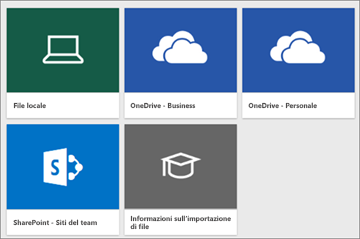
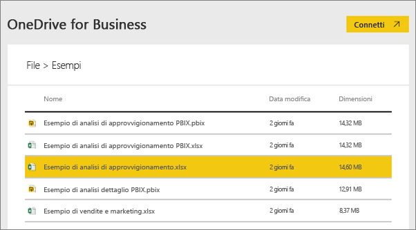
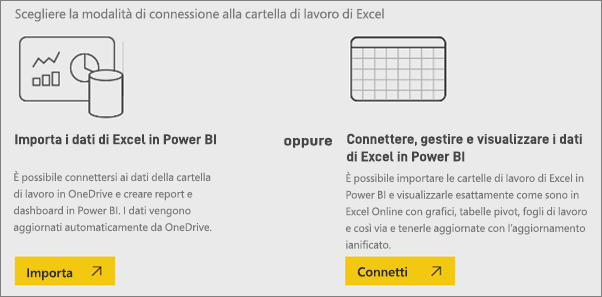
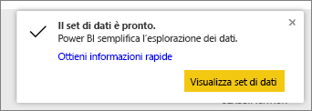
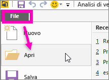

# Quali dati di esempio sono disponibili per l'uso con Power BI?
Non si ha dimestichezza con Power BI e si vorrebbe provarlo, ma non si hanno dati da usare?  O forse si dispone di un set di dati. Non conoscendo (ancora) funzionamento di Power BI, è necessario che si teme di danneggiare il set di dati?

Nessun problema! obviEnce ([www.obvience.com](http://www.obvience.com/)) e Microsoft hanno creato esempi che è possibile usare per acquisire familiarità con Power BI.  I dati sono stati resi anonimi e sono rappresentativi di diversi settori, come finanze, risorse umane, vendite e altri. Inoltre, la documentazione online Usa questi dati di esempio nelle esercitazioni ed esempi, pertanto sarà in grado di seguire la procedura.      

   

Ognuno di questi esempi è disponibile in diversi formati: come pacchetto di contenuto, come singola cartella di lavoro di Excel e come file con estensione pbix. Se non si conoscono questi elementi o non si sa come ottenerli, nessun problema. Verranno illustrati più avanti in questo articolo. Per ogni esempio è stata creata una *tour*. Le presentazioni sono articoli che racconta la storia dietro il codice di esempio e illustra diversi scenari. Gli scenari possibili includono, ad esempio, la risposta alle domande per il responsabile, la ricerca di approfondimenti sulla concorrenza o la creazione di report e dashboard da condividere oppure la spiegazione di una variazione di business.   

Prima di iniziare, ecco le linee guida legali per l'uso di esempi. Al termine, si introducono gli esempi e Mostra come usarli.   

## Linee guida per l'utilizzo delle cartelle di lavoro di Excel di esempio per Power BI

©2015 Microsoft Corporation. Tutti i diritti sono riservati. Documenti e cartelle di lavoro vengono forniti così come sono. Le informazioni e le opinioni espresse nel presente documento, inclusi gli URL e altri riferimenti a siti Web, possono essere soggette a modifiche senza preavviso. L'utente accetta di usarle a proprio rischio. Alcuni esempi vengono forniti a solo scopo illustrativo e sono fittizi. Nessuna associazione reale è intenzionale o può essere desunta. Microsoft non offre alcuna garanzia, esplicita o implicita, relativamente alle informazioni fornite.

Le cartelle di lavoro non implicano la concessione di alcun diritto legale di proprietà intellettuale relativo a prodotti Microsoft. È possibile copiare e usare questa cartella di lavoro per finalità di riferimento interni.

Le cartelle di lavoro e i dati correlati sono forniti da obviEnce. [www.obvience.com](http://www.obvience.com)

ObviEnce è un ISV e un incubatore di proprietà intellettuale (IP) che si occupa principalmente di Microsoft Business Intelligence. ObviEnce collabora a stretto contatto con Microsoft per sviluppare procedure consigliate e leadership di pensiero per ottimizzare e distribuire soluzioni Microsoft Business Intelligence.

Le cartelle di lavoro e i dati sono di proprietà di obviEnce, LLC e sono stati condivisi solo scopo di illustrare la funzionalità di Power BI con dati di esempio del settore.

Eventuali usi delle cartelle di lavoro e/o dei dati devono includere l'attribuzione precedente (presente anche nel foglio di lavoro Info di ogni cartella di lavoro). La cartella di lavoro e le eventuali visualizzazioni devono essere accompagnate dal seguente avviso di copyright: obviEnce©.

Facendo clic su uno dei collegamenti seguenti per scaricare i file delle cartelle di lavoro di Excel o i file PBIX, si accettano i termini sopra illustrati.

## Esempi disponibili
Sono disponibili otto esempi che è possibile usare.  Ognuno di essi rappresenta un settore diverso.

### Esempio di analisi della redditività dei clienti  
[Presentazione dell'esempio di analisi della redditività dei clienti](sample-customer-profitability.md)

Questo esempio di settore analizza le metriche principali di una responsabile amministrativa per i dirigenti della società, prodotti e clienti. È possibile esaminare quali fattori influiscono sulla redditività della società.

### Esempio di analisi delle risorse umane  
[Presentazione dell'esempio sulle risorse umane](sample-human-resources.md)

Questo esempio di settore è incentrato sulla strategia di assunzione per una società analizzando i nuovi assunti, dipendenti attivi e i dipendenti che hanno lasciato.  Esplorando i dati è possibile trovare le tendenze relative alle separazioni volontarie e i pregiudizi nella strategia di assunzione.

### Esempio di analisi della spesa IT 
[Presentazione dell'esempio di analisi della spesa IT](sample-it-spend.md)

In questo esempio di settore, vengono analizzati i pianificata e i costi effettivi del reparto IT di un'azienda. Il confronto consente di valutare l'accuratezza delle pianificazioni per l'anno in corso e verificare le aree che evidenziano importanti deviazioni dalla pianificazione. La società di questo esempio prevede un ciclo di pianificazione annuale e genera una nuova ultima stima ogni trimestre per valutare le variazioni nella spesa IT nel corso dell'esercizio fiscale.

### Opportunity Analysis Sample  
[Presentazione dell'esempio di analisi delle opportunità](sample-opportunity-analysis.md)

Questo esempio di settore esamina il canale di vendita di una società di software. I responsabili delle vendite monitorano i canali di vendita diretti e partner tenendo traccia delle opportunità e dei ricavi per area, volume dell'offerta e canale.

### Esempio di analisi dell'approvvigionamento  
[Presentazione dell'esempio di analisi dell'approvvigionamento](sample-procurement.md)

Questo esempio di settore analizza le metriche principali di una responsabile amministrativa per i dirigenti della società, prodotti e clienti. È possibile esaminare quali fattori influiscono sulla redditività della società.

### Esempio di analisi delle vendite al dettaglio  
[Presentazione dell'esempio di analisi delle vendite al dettaglio](sample-retail-analysis.md)

Questo esempio di settore analizza i dati delle vendite al dettaglio relativi ad articoli venduti in più negozi e in più zone. Grazie alle metriche è possibile confrontare le prestazioni dell'anno corrente con quelle dell'anno precedente in diverse aree, tra cui vendite, unità, profitto lordo e scostamento, oltre ad analizzare i nuovi negozi.

### Esempio di analisi di vendite e marketing  
[Presentazione dell'esempio di analisi di vendita e marketing](sample-sales-and-marketing.md)

Questo esempio di settore analizza una società di produzione, VanArsdel Ltd. Consente al responsabile marketing di tenere sotto controllo il settore e la quota di mercato della società VanArsdel.  Esaminando l'esempio, è possibile trovare la quota di mercato, i volumi di produzione, le vendite e il sentiment della società.

### Esempio di analisi della qualità dei fornitori  
[Presentazione dell'esempio di analisi della qualità dei fornitori](sample-supplier-quality.md)

Questo esempio di settore è incentrato su una delle problematiche tipiche della supply chain, ovvero l'analisi della qualità dei fornitori. Questa analisi si basa su due metriche principali: numero totale di difetti e tempo totale di inattività causato da tali difetti. Questo esempio ha due obiettivi principali: trovare i migliori e i peggiori fornitori in termini di qualità e identificare gli stabilimenti che presentano le prestazioni migliori nell'individuazione e nello scarto di prodotti difettosi.

Una volta indicato quali esempi sono disponibili, vediamo dove trovarli.  

## Come ottenere gli esempi
Come spiegato sopra, gli esempi sono disponibili in vari formati: pacchetti di contenuto, cartelle di lavoro di Excel e file con estensione pbix. Verrà illustrato come utilizzare ognuno di questi formati, a partire da pacchetti di contenuto.

## Esempi di Power BI come pacchetti di contenuto
I pacchetti di contenuto sono l'unico formato di esempio disponibile in Power BI e non è necessario uscire da Power BI per trovarli. Un pacchetto di contenuto è essenzialmente un raggruppamento di uno o più dashboard, i set di dati e report che un utente crea e che può essere utilizzato con il servizio Power BI. Gli utenti creano pacchetti di contenuto da condividere con i colleghi. Ognuno dei pacchetti di contenuto di esempio per Power BI contiene un set di dati, un report e un dashboard.  I pacchetti di contenuto non sono disponibili per Power BI Desktop. Per altre informazioni sui pacchetti di contenuto, vedere [Introduzione ai pacchetti di contenuto in Power BI](service-organizational-content-pack-introduction.md).

### Ottenere e aprire un pacchetto di contenuto di esempio nel servizio Power BI
1. Aprire il servizio Power BI (app.powerbi.com) e accedere.
2. Nell'angolo inferiore sinistro, selezionare **ottenere dati**.

    
3. Nella pagina Recupera dati che viene visualizzata selezionare l'icona **Esempi**.

   
4. Selezionare uno degli esempi per visualizzarne una descrizione. Scegliere quindi **Connetti**.  

   
5. Power BI importa il pacchetto di contenuto e aggiunge un nuovo dashboard, report e set di dati all'area di lavoro corrente. I nuovi contenuti sono contrassegnati con un asterisco giallo. Gli esempi sono risorse utili per provare il funzionamento di Power BI.  

   

Ora che si hanno i dati, si può procedere.  Seguire alcune delle esercitazioni usando i pacchetti di contenuto di esempio oppure aprire il servizio Power BI ed esplorare.

## Esempi di Power BI come file Excel
Ognuno dei pacchetti di contenuto di esempio è disponibile anche come cartella di lavoro di Excel. Le cartelle di lavoro di Excel sono progettate per l'uso con il servizio Power BI.  

1. Scaricare i singoli file usando i collegamenti seguenti oppure [scaricare un file ZIP con tutti i file di esempio](http://go.microsoft.com/fwlink/?LinkId=535020). Per gli utenti avanzati può essere utile scaricare le cartelle di lavoro di Excel per esaminare o modificare i modelli di dati.

   * [Esempio di analisi delle vendite al dettaglio](http://go.microsoft.com/fwlink/?LinkId=529778)
   * [Esempio di analisi della qualità dei fornitori](http://go.microsoft.com/fwlink/?LinkId=529779)
   * [Esempio di analisi delle risorse umane](http://go.microsoft.com/fwlink/?LinkId=529780)
   * [Esempio di analisi della redditività dei clienti](http://go.microsoft.com/fwlink/?LinkId=529781)
   * [Esempio di analisi delle opportunità](http://go.microsoft.com/fwlink/?LinkId=529782)
   * [Esempio di analisi della spesa IT](http://go.microsoft.com/fwlink/?LinkId=529783)
   * [Esempio di analisi dell'approvvigionamento](http://go.microsoft.com/fwlink/?LinkId=529784)
   * [Esempio di analisi di vendite e marketing](http://go.microsoft.com/fwlink/?LinkId=529785)
2. Salvare il file scaricato. La posizione di salvataggio è importante.

   *  **Locale**: se si salva il file in un'unità locale del computer o in un'altra posizione all'interno dell'organizzazione, da Power BI è possibile importare il file in Power BI. Il file effettivamente rimarrà nell'unità locale, in modo che l'intero file non verranno importato in Power BI. Cosa accade è un nuovo set di dati viene creato il sito di Power BI e i dati e in alcuni casi, il modello di dati, vengono caricati nel set di dati. Se il file contiene report, questi report vengono visualizzati nel sito di Power BI in report.
   *  **onedrive for Business** : se si ha OneDrive for Business e accesso al suo interno con lo stesso account di accesso a Power BI, OneDrive for Business è di gran lunga il modo migliore per sincronizzare il lavoro in Excel Power BI, o un oggetto. CSV file sincronizzati con il set di dati, report e dashboard in Power BI. Dato che sia Power BI che OneDrive sono nel cloud, Power BI si connette al file in OneDrive all'incirca ogni ora. Se vengono rilevate modifiche, il set di dati, i report e i dashboard vengono aggiornati automaticamente in Power BI.
   *  **OneDrive - Personale**: se si salvano i file nel proprio account OneDrive personale, si ottengono molti dei vantaggi offerti da OneDrive for Business. La differenza principale consiste nel fatto che quando ci si connette al file per la prima volta (scegliendo Recupera dati > File > OneDrive - Personale) è necessario accedere a OneDrive con il proprio account Microsoft, che in genere è diverso da quello usato per accedere a Power BI. Quando si accede a OneDrive con l'account Microsoft, assicurarsi di selezionare l'opzione Mantieni l'accesso. In questo modo, Power BI potrà connettersi al file circa ogni ora e verificare che il set di dati in Power BI sia sincronizzato.
   *  **SharePoint - Siti del team**: il salvataggio dei file di Power BI in SharePoint - Siti del team corrisponde a grandi linee al salvataggio in OneDrive for Business. La differenza principale è rappresentata dalla modalità di connessione al file da Power BI. Si può specificare un URL o connettersi alla cartella radice.
1. Aprire il servizio Power BI (app.powerbi.com) e accedere.

   > [!TIP]
   > A questo punto è consigliabile creare un nuovo dashboard e assegnargli un nome corrispondente al file che si intende importare.  In caso contrario, quando si importerà il set di dati di Excel, Power BI non creerà un nuovo dashboard denominato in base all'esempio, ma aggiungerà un riquadro al dashboard attualmente aperto. Selezionando questo riquadro verrà visualizzato il report del set di dati. La differenza non è sostanziale perché è sempre possibile creare un nuovo dashboard in un secondo momento, ma se si inizia da un nuovo dashboard si risparmiano alcuni passaggi.
   >
   >
4. Nell'angolo inferiore sinistro, selezionare **ottenere dati**.

    
5. Nella pagina Recupera dati che viene visualizzata selezionare **File > Recupera**.

     
6. Passare al percorso in cui è stato scaricato e salvato l'esempio.

   
7. Selezionare il file, in questo caso **approvvigionamento Analysis Sample. xlsx**, che è stato salvato in OneDrive for Business e scegliere **Connect**.

   
8. Scegliere se importare i dati o caricare la cartella di lavoro in Power BI e visualizzarla esattamente com'è in Excel Online.

    
9. Se si seleziona **Importa**, Power BI importa la cartella di lavoro e la aggiunge come nuovo set di dati denominato **Procurement Analysis Sample**.  Se la cartella di lavoro contiene fogli, tabelle o intervalli di Power View oppure un modello di dati, Power BI crea anche un report (con lo stesso nome). Inoltre, se non si è già aperto un dashboard, Power BI ne crea automaticamente uno nuovo. Se invece è già aperto un dashboard quando si fa clic su **Recupera dati**, si noterà un nuovo riquadro vuoto nel dashboard.  Selezionando questo riquadro è possibile accedere al report per il set di dati appena aggiunto. Il nuovo contenuto è denominato in base all'esempio ed è contrassegnato da un asterisco giallo.
10. Quando viene visualizzata la schermata **Il set di dati è pronto** verrà visualizzata la schermata, selezionare **Visualizza set di dati** oppure **Ottieni informazioni rapide** oppure utilizzare la barra di spostamento a sinistra di Power BI per individuare e aprire il report associato o il dashboard.  

     

### (Facoltativo) Esaminare gli esempi di Excel direttamente da Excel
Se si vuole comprendere come vengono convertiti i dati in una cartella di lavoro di Excel in report e set di dati di Power BI, aprendo gli esempi di Excel ***in Excel*** ed esplorando i fogli di lavoro è possibile ottenere alcuni chiarimenti utili.

* Quando si apre una cartella di lavoro di esempio in Excel per la prima volta, possono essere visualizzati due avvisi. Il primo avviso sostiene che la cartella di lavoro è in visualizzazione protetta. Selezionare **Abilita modifica**. Il secondo avviso potrebbe indicare che la cartella di lavoro contiene connessioni dati esterne. Selezionare **Abilita contenuto**.
* Ogni cartella di lavoro contiene più fogli di Power View. Se si desidera visualizzare i fogli di Power View in Excel, è necessario [abilitare il componente aggiuntivo Power View](https://support.office.com/article/flash-silverlight-and-shockwave-controls-blocked-in-microsoft-office-55738f12-a01d-420e-a533-7cef1ff6aeb1) scaricando un pacchetto di chiavi del Registro di sistema.
* I dati effettivi si trovano nel modello di dati di Power Pivot. I fogli di Power View per visualizzare i dati non è necessario. Nel **PowerPivot** scheda, seleziona **Gestisci**.

    Non vengono visualizzati i **Power Pivot** scheda? [abilitare il componente aggiuntivo Power Pivot](https://support.office.com/article/Start-Power-Pivot-in-Microsoft-Excel-2013-add-in-A891A66D-36E3-43FC-81E8-FC4798F39EA8).

    In Power Pivot, è possibile visualizzare i dati in tutte le tabelle sottostanti, oltre a tutte le formule DAX. 

* La scheda Info fornisce informazioni su obviEnce, la società che ha creato l'esempio.

## Esempi di Power BI come file PBIX
Ognuno dei pacchetti di contenuto di esempio è disponibile anche come file con estensione pbix. I file con estensione pbix sono progettati espressamente per Power BI Desktop.  

1. Per scaricare i singoli file, usare i collegamenti riportati di seguito. Se si selezionano questi collegamenti il file viene salvato automaticamente nella cartella Download. 

   * [Esempio di analisi delle vendite come file con estensione pbix](http://download.microsoft.com/download/9/6/D/96DDC2FF-2568-491D-AAFA-AFDD6F763AE3/Retail%20Analysis%20Sample%20PBIX.pbix)
   * [Esempio di analisi della qualità dei fornitori come file con estensione pbix](http://download.microsoft.com/download/8/C/6/8C661638-C102-4C04-992E-9EA56A5D319B/Supplier-Quality-Analysis-Sample-PBIX.pbix)
   <!-- Previous link doesn't work -->
   * [Esempio di analisi delle risorse umane come file con estensione pbix](http://download.microsoft.com/download/6/9/5/69503155-05A5-483E-829A-F7B5F3DD5D27/Human%20Resources%20Sample%20PBIX.pbix)
   * [Esempio di analisi della redditività dei clienti come file con estensione pbix](http://download.microsoft.com/download/6/A/9/6A93FD6E-CBA5-40BD-B42E-4DCAE8CDD059/Customer%20Profitability%20Sample%20PBIX.pbix)
   * [Esempio di analisi delle opportunità come file con estensione pbix](http://download.microsoft.com/download/9/1/5/915ABCFA-7125-4D85-A7BD-05645BD95BD8/Opportunity%20Analysis%20Sample%20PBIX.pbix)
   * [Esempio di analisi della spesa IT come file con estensione pbix](http://download.microsoft.com/download/E/9/8/E98CEB6D-CEBB-41CF-BA2B-1A1D61B27D87/IT%20Spend%20Analysis%20Sample%20PBIX.pbix)
   * [Esempio di analisi di approvvigionamento come file con estensione pbix](http://download.microsoft.com/download/D/5/3/D5390069-F723-413B-8D27-5888500516EB/Procurement%20Analysis%20Sample%20PBIX.pbix)
   * [Esempio di analisi di vendite e marketing come file con estensione pbix](http://download.microsoft.com/download/9/7/6/9767913A-29DB-40CF-8944-9AC2BC940C53/Sales%20and%20Marketing%20Sample%20PBIX.pbix)

1. Da Power BI Desktop selezionare **File > Apri** e passare alla posizione in cui è stato salvato l'esempio in formato pbix.

   
4. Selezionare il file con estensione pbix per aprirlo in Power BI Desktop.

## Passaggi successivi
[Concetti di base di Power BI](consumer/end-user-basic-concepts.md)

[Esercitazione: Connettersi agli esempi di Power BI](sample-tutorial-connect-to-the-samples.md)

[Origini dati per Power BI](service-get-data.md)

Altre domande? [Provare la community di Power BI](http://community.powerbi.com/)
