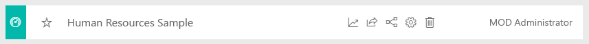

# Esempio di analisi delle risorse umane per Power BI: Presentazione

Il pacchetto di contenuto di esempio di analisi delle risorse umane contiene un dashboard, un report e un set di dati per un reparto risorse umane. Nell'esempio il reparto risorse umane usa lo stesso modello di report tra società diverse, anche quando si differenziano per settore o dimensioni. Questo esempio esamina le nuove assunzioni, i dipendenti attivi e gli ex dipendenti. Lo scopo è quello di individuare eventuali tendenze nella strategia di assunzione. Gli obiettivi principali sono quelli di comprendere:

* Chi viene assunto
* Pregiudizi nella strategia di assunzione
* Tendenze nelle separazioni volontarie

Questo esempio fa parte di una serie che illustra come usare Power BI con dati, report e dashboard orientati al business. L'esempio è stato creato con dati reali di [obviEnce](http://www.obvience.com/), che sono stati resi anonimi. I dati sono disponibili in diversi formati: pacchetto di contenuto, file di Power BI Desktop con estensione pbix o cartella di lavoro di Excel. Vedere [Esempi per Power BI](sample-datasets.md). 

Questa esercitazione esplora il pacchetto di contenuto Human Resources Sample nel servizio Power BI. Dato che l'esperienza per i report è simile in Power BI Desktop e nel servizio, è anche possibile seguire le descrizioni usando il file con estensione pbix dell'esempio in Power BI Desktop. 

Non occorre una licenza di Power BI per esplorare gli esempi in Power BI Desktop. Se non si ha una licenza Power BI Pro, è possibile salvare l'esempio nell'area di lavoro personale nel servizio Power BI. 

## Ottenere l'esempio

Prima di poter usare l'esempio, è necessario scaricarlo come [pacchetto di contenuto](#get-the-content-pack-for-this-sample), [file con estensione pbix](#get-the-pbix-file-for-this-sample) o [cartella di lavoro di Excel](#get-the-excel-workbook-for-this-sample).

### Scaricare il pacchetto di contenuto per questo esempio

1. Aprire il servizio Power BI (app.powerbi.com), eseguire l'accesso e aprire l'area di lavoro in cui salvare l'esempio.

   Se non si ha una licenza Power BI Pro, è possibile salvare l'esempio nell'area di lavoro personale.

2. Nell'angolo in basso a sinistra selezionare **Recupera dati**.
   
   
3. Nella pagina **Recupera dati** visualizzata selezionare **Esempi**.
   
4. Selezionare **Esempio di analisi delle risorse umane** e quindi scegliere **Connetti**.  
   
   

5. Power BI importa il pacchetto di contenuto e quindi aggiunge un nuovo dashboard, un report e un set di dati all'area di lavoro corrente.
   
   
  
### Scaricare il file con estensione pbix per questo esempio

In alternativa, è possibile scaricare l'esempio di analisi delle risorse umane come [file con estensione pbix](http://download.microsoft.com/download/6/9/5/69503155-05A5-483E-829A-F7B5F3DD5D27/Human%20Resources%20Sample%20PBIX.pbix), progettato per l'uso con Power BI Desktop.

### Scaricare la cartella di lavoro di Excel per questo esempio

Se si vuole visualizzare l'origine dati per questo esempio, è disponibile anche come [cartella di lavoro di Excel](http://go.microsoft.com/fwlink/?LinkId=529780). La cartella di lavoro contiene fogli di Power View che è possibile visualizzare e modificare. Per vedere i dati non elaborati, abilitare i componenti aggiuntivi di Analisi dati, quindi selezionare **Power Pivot > Gestisci**. Per abilitare i componenti aggiuntivi Power View e Power Pivot, vedere [Esaminare gli esempi di Excel direttamente da Excel](sample-datasets.md#optional-take-a-look-at-the-excel-samples-from-inside-excel-itself) per informazioni dettagliate.

## Nuovi assunti
Esaminare prima di tutto i nuovi assunti.

1. Nell'area di lavoro selezionare la scheda **Dashboard** e aprire il dashboard **Esempio di analisi delle risorse umane**.
2. Nel dashboard selezionare il riquadro **New Hire Count, New Hires Same Period Last Year, Actives YoY % Change By Month**.  

     

   Viene aperta la pagina **New Hires** del report Esempio di analisi delle risorse umane.  

   

3. Esaminare questi elementi di interesse:

    * Il grafico combinato **New Hire Count, New Hires SPLY and Actives YoY % Change by Month** indica che ogni mese dell'anno corrente sono state assunte più persone rispetto all'anno precedente. In alcuni mesi il numero di persone è significativamente maggiore.
    * Nel grafico combinato **New Hire Count and Active Employee Count by Region and Ethnicity**si può notare che sono state assunte meno persone nell'area **East**.
    * Il grafico a cascata **New Hires YoY Var by Age Group** mostra che si sta assumendo principalmente personale più giovane. Questa tendenza può essere dovuta alla natura prevalentemente part-time dell'impiego.
    * Il grafico a torta **New Hire Count by Gender** mostra una suddivisione più o meno equa.

    È possibile reperire altre informazioni dettagliate? Ad esempio, un'area in cui la suddivisione tra i sessi non è equa. 

4. Selezionare le diverse fasce di età e i sessi nei grafici per esplorare le relazioni tra età, sesso, regione e gruppo etnico.

5. Selezionare **Esempio di analisi delle risorse umane** nella barra di spostamento superiore per tornare al dashboard.

   

## Confrontare i dipendenti attivi e gli ex dipendenti
Esaminare i dati per i dipendenti attivi e i dipendenti che non lavorano più per la società.

1. Nel dashboard selezionare il riquadro **Active Employee Count by Age Group**.

   

   Viene aperta la pagina **Active Employees vs. Separations** del report Esempio di analisi delle risorse umane.  

   

 2. Esaminare questi elementi di interesse:

    * I due grafici combinati a sinistra mostrano il cambiamento anno dopo anno per i dipendenti attivi e gli ex dipendenti. Nell'anno in corso ci sono più dipendenti attivi grazie a una politica di assunzione rapida, ma anche più ex dipendenti rispetto all'anno precedente.
    * In agosto ci sono state più interruzioni nel rapporto di lavoro rispetto agli altri mesi. Selezionare le diverse fasce di età, i sessi o le aree per vedere se è possibile trovare eventuali ex dipendenti.
    * Esaminando i grafici a torta, si nota una suddivisione equa tra i dipendenti attivi per sesso e fascia di età. Selezionare diverse fasce di età per vedere la suddivisione dei sessi in base all'età. Esiste una suddivisione uniforme per sesso in ogni fascia d'età?

## Motivi per la separazione
Verrà ora esaminato il report in Visualizzazione di modifica. È possibile modificare i grafici a torta in modo da visualizzare i dati per gli ex dipendenti invece che per quelli attivi.

1. Selezionare **Modifica report** nell'angolo in alto a sinistra.

2. Selezionare il grafico a torta **Active Employee Count by Age Group**.

3. In **Campi** selezionare **Employees** per espandere la tabella **Employees**. Deselezionare **Active Employee Count** per rimuovere il campo.

4. Selezionare **Separation Count** nella tabella **Employees** per aggiungere il campo alla casella **Valori** nell'area **Campi**.

5. Nell'area di disegno report selezionare la barra **Voluntary** nel grafico a barre **Separation Count by Separation Reason**. 

   Ciò consente di evidenziare i dipendenti che hanno lasciato volontariamente l'impiego negli altri oggetti visivi del report.

6. Selezionare la sezione 50+ del grafico a torta **Separation Count by Age Group**.

7. Esaminare il grafico a linee nell'angolo in basso a destra. Questo grafico è filtrato in modo da mostrare le separazioni volontarie.  

   

   Esaminare la tendenza nella fascia di età 50+. Nella seconda parte dell'anno si è dimesso volontariamente un numero maggiore di dipendenti di età superiore ai 50 anni. Questa tendenza rappresenta un aspetto da approfondire con altri dati.

8. È possibile seguire gli stessi passaggi anche per il grafico a torta **Active Employee Count by Gender** visualizzando gli ex dipendenti invece che i dipendenti attivi. Osservare i dati di separazione volontaria per sesso per determinare se è possibile reperire altre informazioni.

9. Selezionare **Esempio di analisi delle risorse umane** nella barra di spostamento superiore per tornare al dashboard. È possibile scegliere di salvare le modifiche apportate al report.

## Assunzioni non andate a buon fine
L'ultima area da esplorare è quella delle assunzioni non andate a buon fine, ossia quei dipendenti la cui collaborazione con l'azienda non è durata più di 60 giorni. Le assunzioni avvengono rapidamente, ma i candidati assunti sono buoni candidati?

1. Selezionare il riquadro **Bad Hires as % of Actives by Age Group** del dashboard. Il report verrà aperto nella scheda tre, **Bad Hires**.

     
2. Selezionare **Northwest** nel filtro dei dati **Region** a sinistra e selezionare **Male** nel grafico ad anello **Bad Hire Count by Gender**. Esaminare gli altri grafici nella pagina **Bad Hires**. È possibile notare che ci sono più uomini che donne tra le assunzioni non andate a buon fine e che molti casi sono nel Gruppo A.

     

3. Osservando il grafico ad anello **Bad Hires by Gender** e selezionando diverse aree nel filtro dei dati **Region**, è possibile notare che l'area orientale è l'unica con più donne che uomini tra le assunzioni non andate a buon fine.  

4. Per tornare al dashboard, selezionare il relativo nome nella barra di spostamento superiore.

## Porre una domanda nella casella Domande e risposte del dashboard
Nella [casella Domande e risposte](power-bi-tutorial-q-and-a.md) del dashboard è possibile porre una domanda sui dati usando il linguaggio naturale. Domande e risposte riconosce le parole digitate e determina la posizione nel set di dati in cui trovare la risposta.

1. Selezionare la casella delle domande di Domande e risposte. Si noti che, ancora prima di iniziare a digitare, la casella Domande e risposte mostra alcuni suggerimenti utili a formulare la domanda.

   

2. È possibile scegliere uno dei suggerimenti o digitare: *show age group, gender, and bad hires SPLY where region is east*.  

   

   Si noti che la maggior parte delle assunzioni non andate a buon fine di sesso femminile ha un'età inferiore ai 30 anni.

## Passaggi successivi: Connettersi ai dati
Questo ambiente è sicuro perché è possibile scegliere di non salvare le modifiche, ma, se le si salva, è sempre possibile scegliere **Recupera dati** per ottenere una nuova copia di questo esempio.

La presentazione ha tentato di mostrare il modo in cui i dashboard, la casella Domande e risposte e i report di Power BI possono fornire analisi approfondite dei dati di esempio. È ora possibile iniziare e connettersi ai propri dati. Con Power BI è possibile connettersi a una vasta gamma di origini dati. Per altre informazioni, vedere [Introduzione al servizio Power BI](service-get-started.md).
