# Presentazione dell'Esempio di analisi delle risorse umane per Power BI

## Panoramica dell'Esempio di analisi delle risorse umane
Il reparto Risorse umane ha lo stesso modello di reporting tra società diverse, anche quando si differenziano per settore o dimensioni. In questo esempio vengono esaminati nuovi assunti, dipendenti attivi ed ex dipendenti e prova a rilevare eventuali tendenze nella strategia di assunzione. Gli obiettivi principali sono quelli di comprendere:

* Chi viene assunto
* Pregiudizi nella strategia di assunzione
* Tendenze nelle separazioni volontarie

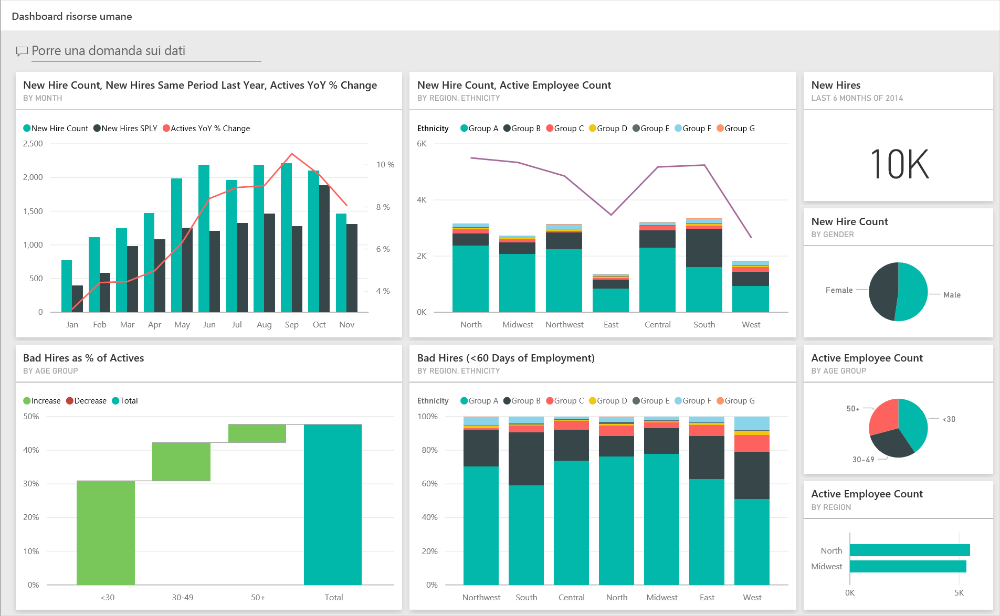

Questo esempio fa parte di una serie che illustra come usare Power BI con dati, report e dashboard orientati al business. Si tratta di dati reali messi a disposizione da obviEnce ([www.obvience.com](http://www.obvience.com/)) che sono stati resi anonimi.

## Prerequisiti

 Prima di poter usare l'esempio, è necessario scaricarlo come pacchetto di contenuto, file con estensione pbix o cartella di lavoro di Excel.

### Scaricare il pacchetto di contenuto per questo esempio

1. Aprire il servizio Power BI (app.powerbi.com) ed eseguire l'accesso.
2. Nell'angolo in basso a sinistra selezionare **Recupera dati**.
   
    
3. Nella pagina Recupera dati che viene visualizzata selezionare l'icona **Esempi**.
   
   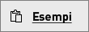
4. Selezionare l'**esempio di analisi delle risorse umane** e quindi scegliere **Connetti**.  
   
   
5. Power BI importa il pacchetto di contenuto e aggiunge un nuovo dashboard, report e set di dati all'area di lavoro corrente. I nuovi contenuti sono contrassegnati con un asterisco giallo. 
   
   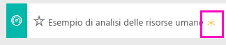
  
### Scaricare il file con estensione pbix per questo esempio

In alternativa, è possibile scaricare l'esempio come file con estensione pbix, progettato per l'uso con Power BI Desktop. 

 * [Esempio di analisi delle risorse umane](http://download.microsoft.com/download/6/9/5/69503155-05A5-483E-829A-F7B5F3DD5D27/Human Resources Sample PBIX.pbix)

### Scaricare la cartella di lavoro di Excel per questo esempio
È anche possibile [scaricare solo il set di dati (cartella di lavoro di Excel)](http://go.microsoft.com/fwlink/?LinkId=529780) per questo esempio. La cartella di lavoro contiene fogli di Power View che è possibile visualizzare e modificare. Per visualizzare i dati non elaborati, selezionare **Power Pivot > Gestisci**.

## Nuovi assunti
Esaminare prima di tutto i nuovi assunti.

1. Nell'area di lavoro selezionare la scheda **Dashboard** e aprire il dashboard dell'esempio di analisi delle risorse umane.
2. Nel dashboard selezionare il riquadro **New Hire Count, New Hires Same Period Last Year, Actives YoY % Change** **By Month**.  
   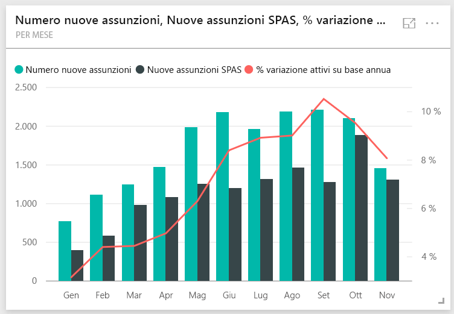  

   Viene aperta la pagina **New Hires** del report Esempio di analisi delle risorse umane.  

   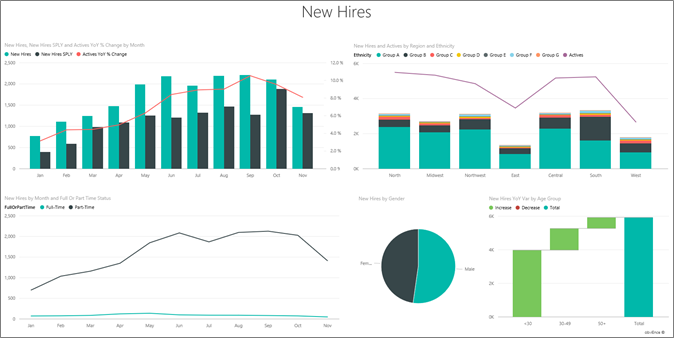

Si noti quanto segue:

* Il grafico combinato **New Hire Count, New Hires SPLY and Actives YoY % Change by Month** indica che ogni mese dell'anno corrente sono state assunte più persone rispetto all'anno precedente e un numero significativamente superiore in alcuni mesi.
* Nel grafico combinato **New Hire Count and Active Employee Count by Region and Ethnicity**si può notare che sono state assunte meno persone nell'area **East**.
* Il grafico a cascata **New Hires YoY Var by Age Group** mostra che si sta assumendo principalmente personale più giovane. Ciò può essere dovuto in larga misura alla natura part-time dell'impiego.
* Il grafico a torta **New Hire Count by Gender** mostra una suddivisione ancora più netta.

È possibile reperire altre informazioni dettagliate, ad esempio quale area non prevede una pari suddivisione dei sessi. Selezionare le diverse fasce di età e i sessi nei grafici per esplorare le relazioni tra età, sesso, regione e gruppo etnico.

Per tornare al dashboard, selezionarne il nome nella barra di spostamento superiore.

## Confrontare i dipendenti attivi e gli ex dipendenti
A questo punto verranno esaminati i dati per i dipendenti attivi e i dipendenti che non lavorano più per la società.

Nel dashboard selezionare il riquadro **Active Employee Count by Age Group**.  
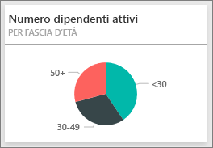

Viene aperta la pagina **Active Employees vs. Separations** del report Esempio di analisi delle risorse umane.  
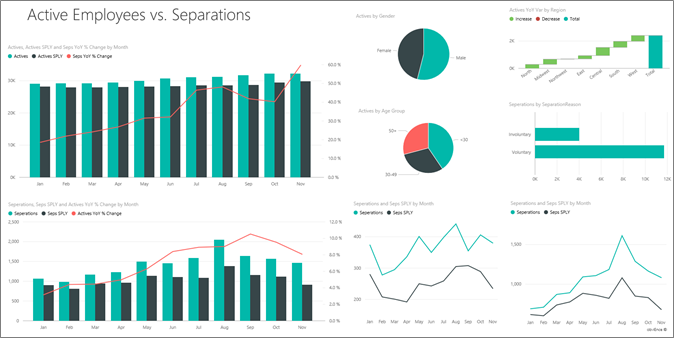

**Elementi di interesse**:

* I grafici combinati a sinistra mostrano il cambiamento anno dopo anno per i dipendenti attivi e gli ex dipendenti. Quest'anno ci sono più dipendenti attivi grazie a una politica di assunzione rapida, ma anche più ex dipendenti rispetto all'anno precedente.
* Ad agosto ci sono stati più ex dipendenti rispetto agli altri mesi. Selezionare le diverse fasce di età, i sessi o le aree per vedere se è possibile trovare eventuali ex dipendenti.
* Esaminando i grafici a torta, si nota una suddivisione abbastanza netta per sesso e fascia di età tra i dipendenti attivi. Selezionare le diverse fasce d'età per vedere la suddivisione dei sessi in base all'età. Esiste una suddivisione uniforme per sesso in ogni fascia d'età?

## Motivi per la separazione
Verrà ora esaminato il report in Visualizzazione di modifica. Selezionare **Modifica report** nell'angolo in alto a sinistra.

Modificare i grafici a torta in modo da visualizzare i dati sugli ex dipendenti anziché su quelli attivi.

1. Selezionare il grafico a torta **Active Employee Count by Age Group**.
2. In **Fields** selezionare la freccia accanto a **Employees** per espandere la tabella Employees. Deselezionare la casella di controllo accanto ad **Active Employee Count** per rimuovere il campo.
3. Selezionare la casella di controllo accanto a **Separation Count** nella tabella Employees per aggiungerla alla casella **Values** nel campo.
4. Nell'area di disegno report selezionare la barra **Voluntary** nel grafico a barre **Separation Count by Separation Reason**. Ciò consente di evidenziare i dipendenti che hanno lasciato volontariamente l'impiego negli altri oggetti visivi del report.
5. Fare clic sulla sezione 50+ del grafico a torta Separation Count by Age Group.

   Esaminare il grafico a linee Separations by Reason nell'angolo in basso a destra. Questo grafico è filtrato in modo da mostrare le separazioni volontarie.  
   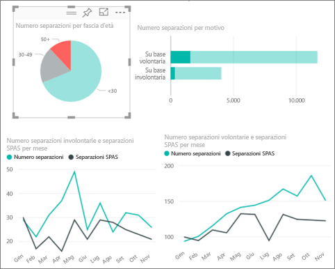

   Si noti la tendenza nella fascia d'età 50+: nella seconda parte dell'anno si è dimesso volontariamente un numero maggiore di dipendenti di età superiore ai 50 anni. Sarebbe interessante indagare ulteriormente in quest'area avvalendosi di più dati.
6. È possibile seguire gli stessi passaggi anche per il grafico a torta **Active Employee Count by Gender** modificandolo in separazioni invece che dipendenti attivi. Osservare i dati di separazione volontaria per sesso per determinare se è possibile reperire altre informazioni.
7. Fare clic su **Power BI** nella barra di spostamento superiore per tornare al dashboard. È possibile decidere se salvare le modifiche apportate al report.

## Assunzioni non andate a buon fine
L'ultima area da esplorare è quella delle assunzioni non andate a buon fine, ossia quei dipendenti la cui collaborazione con l'azienda non è durata più di 60 giorni. Le assunzioni vengono eseguite rapidamente: stiamo assumendo buoni candidati?

1. Selezionare il riquadro **Bad Hires as % of Actives by Age Group** del dashboard. Verrà aperto il report a pagina 3, "Bad Hires".

   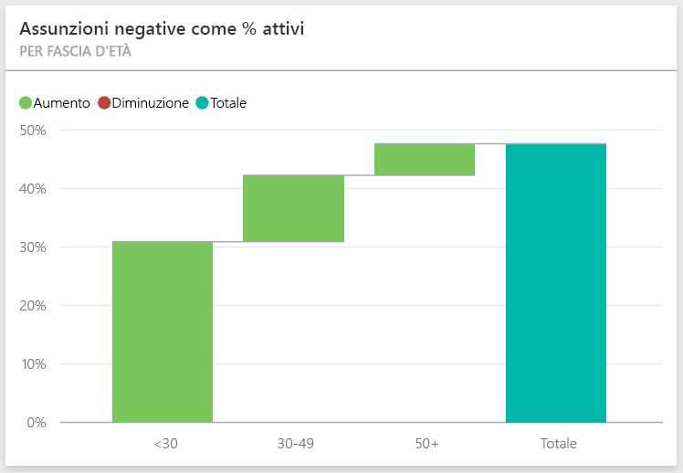  
2. Selezionare la casella di controllo **Northwest** nel filtro dei dati Region a sinistra e la sezione **Male** nel grafico ad anello Bad Hire Count by Gender.  Esaminare gli altri grafici nella pagina "Bad Hires". Ci sono più uomini che donne tra le assunzioni non andate a buon fine e molte sono nel Gruppo A.
   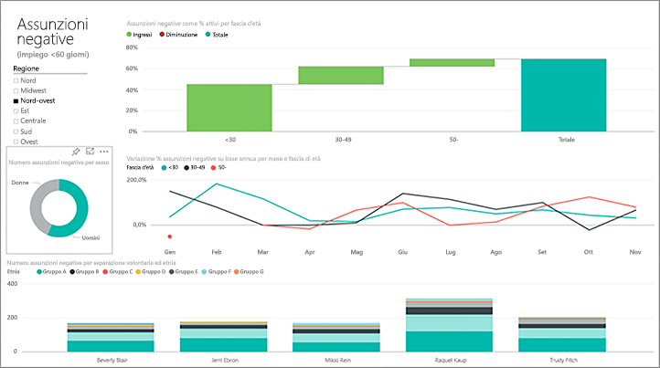  
3. Osservando il grafico ad anello **Bad Hires by Gender** e facendo clic nel filtro dei dati **Region** si nota che l'area est è l'unica ad avere più donne che uomini tra le assunzioni non andate a buon fine.  
4. Per tornare al dashboard, selezionarne il nome nella barra di spostamento superiore.

## Porre una domanda nella casella Domande e risposte
Nella casella della domanda in [Domande e risposte](power-bi-tutorial-q-and-a.md) è possibile digitare la domanda usando il linguaggio naturale. Domande e risposte riconosce le parole digitate e determina la posizione nel set di dati in cui trovare la risposta.

1. Fare clic nella casella delle domande di Domande e risposte. Come si può notare, la casella Domande e risposte contiene suggerimenti prima ancora che si inizi a digitare:

   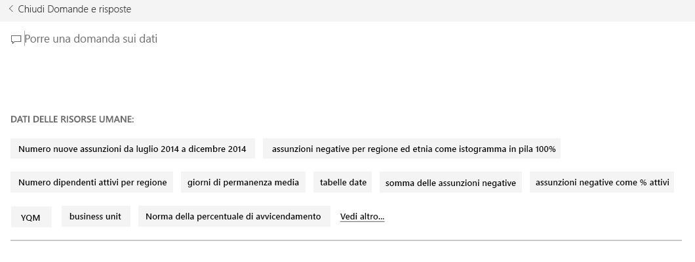
2. È possibile scegliere uno dei suggerimenti o digitare: **show age group, gender and bad hires SPLY  where region is east**.  

   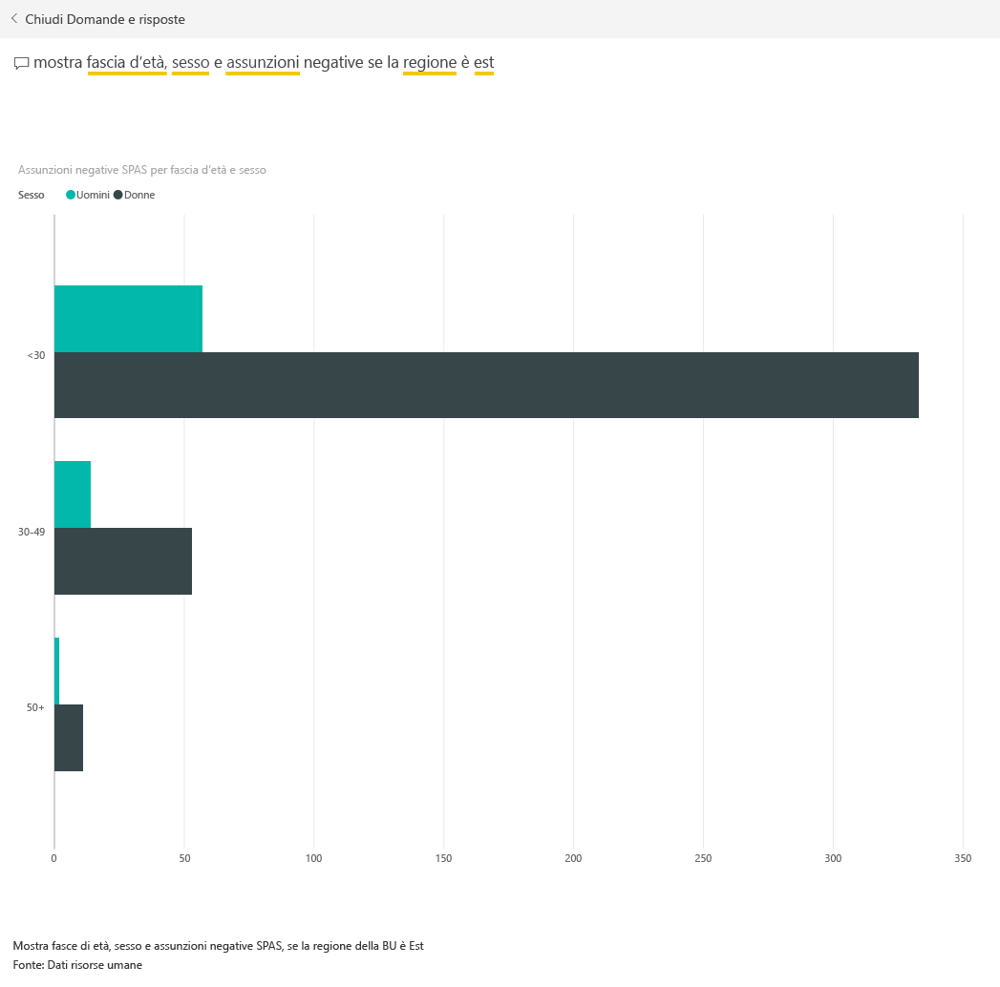

   Si noti che la maggior parte delle assunzioni non andate a buon fine di sesso femminile ha un'età inferiore ai 30 anni.

Si tratta di un ambiente sicuro in cui operare: è sempre possibile scegliere di non salvare le modifiche, ma, se le si salva, è sempre possibile scegliere **Recupera dati** per ottenere una nuova copia di questo esempio.

## Passaggi successivi: Connettersi ai dati
Ci auguriamo che questa presentazione abbia illustrato in che modo i dashboard di Power BI, le domande e risposte e i report forniscono informazioni dettagliate sui dati delle risorse umane. È ora possibile connettersi ai propri dati. Con Power BI è possibile connettersi a una vasta gamma di origini dati. Per altre informazioni, vedere [Introduzione a Power BI](service-get-started.md).  
