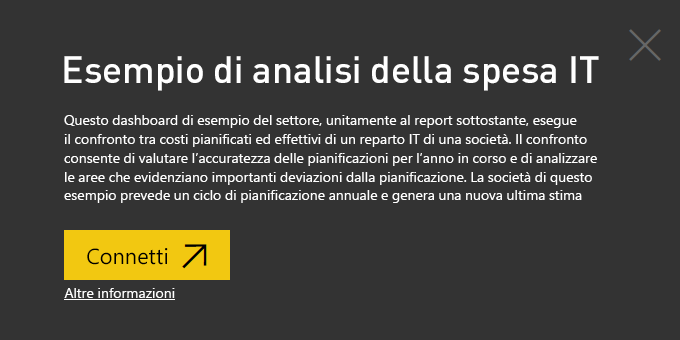
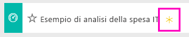
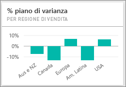
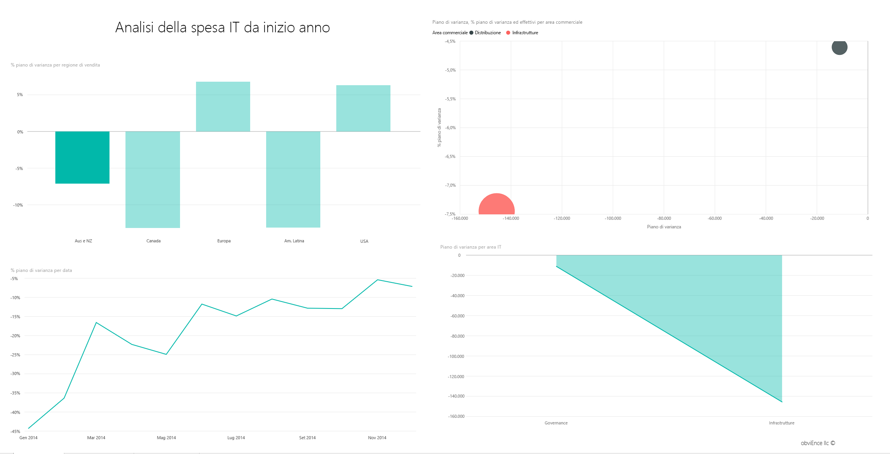
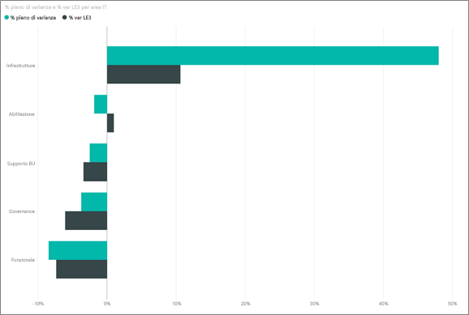
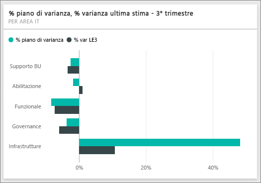
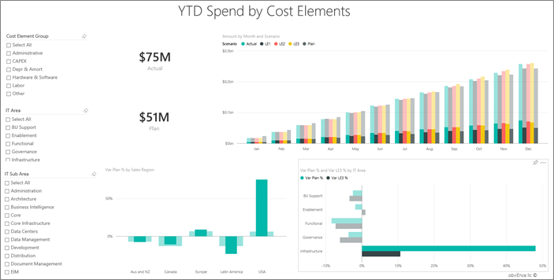
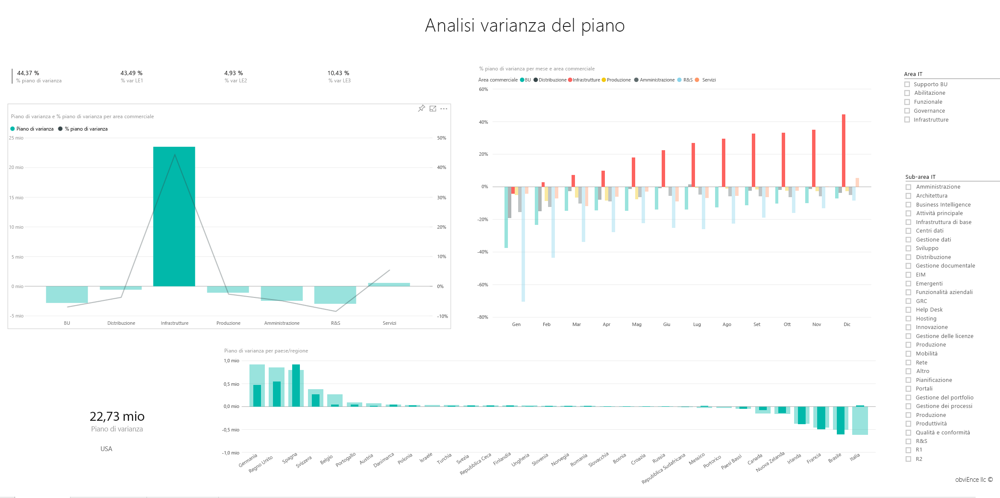

# Esempio di analisi della spesa IT per Power BI: Panoramica

## Panoramica dell'esempio di analisi della spesa IT
Il [pacchetto di contenuto](service-organizational-content-pack-introduction.md) per l'analisi della spesa IT (dashboard, report e set di dati) analizza il confronto tra costi pianificati ed effettivi di un reparto IT. Il confronto consente di valutare l'accuratezza delle pianificazioni per l'anno in corso e verificare le aree che evidenziano importanti deviazioni dalla pianificazione. La società di questo esempio prevede un ciclo di pianificazione annuale e genera una nuova ultima stima ogni trimestre per valutare le variazioni nella spesa IT nel corso dell'esercizio fiscale.

Questo esempio fa parte di una serie che illustra come usare Power BI con dati, report e dashboard orientati al business. Si tratta di dati reali di obviEnce (<http://obvience.com/>) che sono stati resi anonimi.

## Prerequisiti

 Prima di poter usare l'esempio, è necessario scaricarlo come [pacchetto di contenuto](https://docs.microsoft.com/power-bi/sample-it-spend#get-the-content-pack-for-this-sample), [file con estensione pbix](http://download.microsoft.com/download/E/9/8/E98CEB6D-CEBB-41CF-BA2B-1A1D61B27D87/IT%20Spend%20Analysis%20Sample%20PBIX.pbix) o [cartella di lavoro di Excel](http://go.microsoft.com/fwlink/?LinkId=529783).

### Scaricare il pacchetto di contenuto per questo esempio

1. Aprire il servizio Power BI (app.powerbi.com) ed eseguire l'accesso.
2. Nell'angolo in basso a sinistra selezionare **Recupera dati**.
   
    
3. Nella pagina Recupera dati che viene visualizzata selezionare l'icona **Esempi**.
   
   
4. Selezionare l'**Esempio di analisi della spesa IT** e quindi scegliere **Connetti**.  
  
   
   
5. Power BI importa il pacchetto di contenuto e aggiunge un nuovo dashboard, report e set di dati all'area di lavoro corrente. I nuovi contenuti sono contrassegnati con un asterisco giallo. 
   
   
  
### Scaricare il file con estensione pbix per questo esempio

In alternativa, è possibile scaricare l'esempio come file con estensione pbix, progettato per l'uso con Power BI Desktop. 

 * [Esempio di analisi della spesa IT](http://download.microsoft.com/download/E/9/8/E98CEB6D-CEBB-41CF-BA2B-1A1D61B27D87/IT%20Spend%20Analysis%20Sample%20PBIX.pbix)

### Scaricare la cartella di lavoro di Excel per questo esempio
È anche possibile [scaricare solo il set di dati (cartella di lavoro di Excel)](http://go.microsoft.com/fwlink/?LinkId=529783) per questo esempio. La cartella di lavoro contiene fogli di Power View che è possibile visualizzare e modificare. Per visualizzare i dati non elaborati, selezionare **Power Pivot > Gestisci**.

## Dashboard di Esempio di analisi della spesa IT
I due riquadri numerici sul dashboard, cioè **Var Plan %** e **Variance Latest Estimate % Quarter 3**, offrono una panoramica dell'andamento rispetto ai piani e alla stima dell'ultimo trimestre (LE3 = Latest Estimate Quarter 3). In generale, la varianza rispetto al piano è di circa il 6%. Ma qual è la causa di questa varianza? Quando e dove si verifica e in quale categoria?

## Pagina "YTD IT Spend Trend Analysis"
Selezionare il riquadro del dashboard **Var Plan % by Sales Region** per aprire la pagina "IT Spend Trend Analysis" (Analisi delle tendenze della spesa IT) del report IT Spend Analysis Sample (Esempio di analisi della spesa IT). È subito possibile osservare che esiste una varianza positiva negli Stati Uniti e in Europa e una varianza negativa in Canada, America Latina e Australia. Per gli Stati Uniti la varianza è del 6% +LE, mentre per l'Australia è del 7% +LE.

Ma osservare semplicemente il grafico e trarne delle conclusioni può essere fuorviante. È necessario esaminare gli importi in valuta effettivi per ridimensionare il tutto.

1. Selezionare **Aus and NZ** nel grafico Var Plan % by Sales Region e osservare il grafico Var Plan by IT Area.

   
2. A questo punto, selezionare **USA**. Come si può osservare, se confrontata con gli Stati Uniti, l'Australia contribuisce in minima parte alla spesa complessiva.

    Ora che il campo è stato ristretto agli Stati Uniti, come si deve procedere? Occorre esplorare quale categoria negli Stati Uniti è causa della varianza.

## Ottenere le risposte dai dati
1. Selezionare **Esempio di analisi della spesa IT** nella barra di spostamento superiore per tornare ai dashboard.
2. Nella casella per la domanda, digitare "show IT areas, var plan % and var le3 % bar chart".

   

   Nella prima area IT, **Infrastructure**, la percentuale è cambiata drasticamente tra il piano di varianza iniziale e la stima più recente del piano di varianza.

## Pagina “YTD Spend by Cost Elements”
Tornare al dashboard ed esaminare il riquadro **Var Plan %, Var LE3%**.

Colpisce subito l'enorme varianza positiva rispetto al piano dell'area Infrastructure.

1. Fare clic su questo riquadro per passare alla pagina "YTD Spend by Cost Elements" (Spesa IT per elementi di costo dall'inizio dell'anno) del report IT Spend Analysis Sample.
2. Fare clic sulla barra **Infrastructure** nel grafico "Var Plan % and Var LE3 % by IT Area" in basso a sinistra e osservare la varianza rispetto al piano in "Var Plan % by Sales Region" a sinistra.

    
3. Fare clic sul nome di ogni gruppo di elementi di costo nel filtro dei dati per trovare l'elemento di costo con una varianza di grande entità.
4. Tenendo **Other** selezionato, fare clic su **Infrastructure** nell'area IT, quindi fare clic sulle aree secondarie del filtro dei dati IT Sub Area per trovare l'area secondaria con la varianza maggiore.  

   Si osserva un'enorme varianza in **Networking**.

   Apparentemente l'azienda ha deciso di regalare ai propri dipendenti dei servizi telefonici come benefit, ma questa iniziativa non era stata pianificata.

## Pagina "Plan Variance Analysis"
Fare clic sulla scheda "Plan Variance Analysis" in basso per passare a pagina 3 del report.

Nel grafico combinato "Var Plan, and Var Plan % by Business Area" a sinistra, fare clic sulla colonna Infrastructure per evidenziare i valori dell'infrastruttura nel resto della pagina.

Si osservi nel grafico "Var plan% by Month and Business Area" che l'infrastruttura ha iniziato ad avere una varianza positiva intorno a febbraio, aumentandola progressivamente. Si noti anche come il valore della varianza rispetto al piano vari in base al paese rispetto al valore per tutte le aree commerciali. Usare i filtri dei dati "IT Area" e "IT Sub Areas" a destra per filtrare i valori nel resto della pagina invece di evidenziarli. Fare clic sulle diverse aree IT a destra per esplorare i dati in un altro modo. È anche possibile fare clic su IT Sub Area e osservare la varianza tale livello.

## Modificare il report
Fare clic su **Modifica Report** in alto a sinistra angolo ed esplorarlo nella Visualizzazione di modifica.

* Osservare la conformazione delle pagine, con i campi in ogni grafico e i filtri nelle pagine
* Aggiungere pagine e grafici basati sugli stessi dati
* Modificare il tipo di visualizzazione per ogni grafico
* Aggiungerli al dashboard

Si tratta di un ambiente sicuro in cui operare: è sempre possibile scegliere di non salvare le modifiche, ma, se le si salva, è sempre possibile scegliere Recupera dati per ottenere una nuova copia di questo esempio.

## Passaggi successivi: Connettersi ai dati
Ci auguriamo che questa presentazione abbia illustrato in che modo i dashboard di Power BI, le domande e risposte e i report forniscono informazioni dettagliate sui dati della spesa IT. È ora possibile connettersi ai propri dati. Con Power BI è possibile connettersi a una vasta gamma di origini dati. Per altre informazioni, vedere [Introduzione a Power BI](service-get-started.md).
