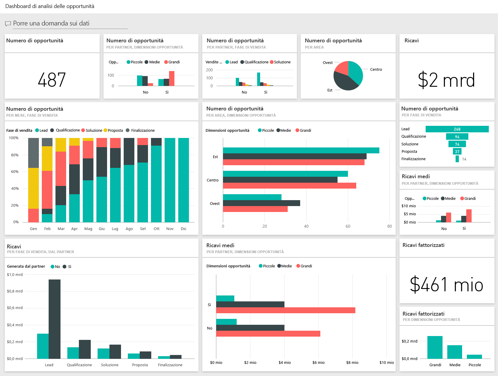
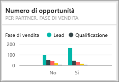
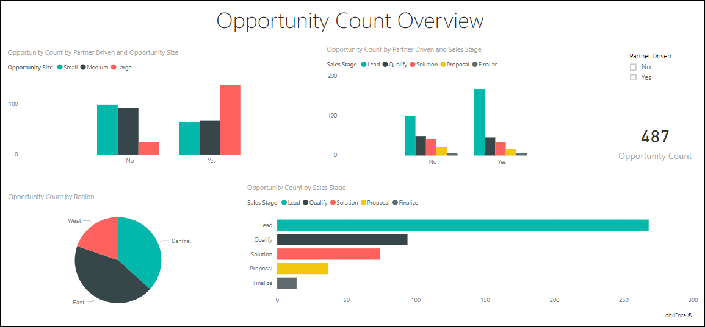
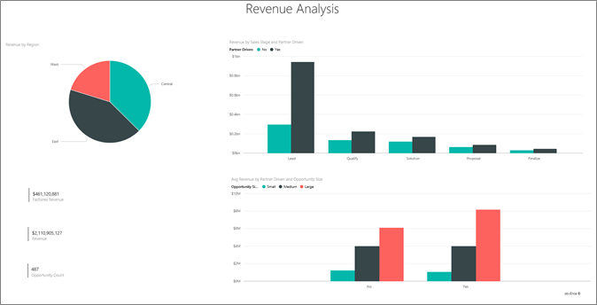

# Presentazione dell'esempio di analisi delle opportunità per Power BI
L' **esempio di analisi delle opportunità** contiene un dashboard (e un report associato) per una società software con due canali di vendita: *diretto* e *partner*. Il responsabile delle vendite ha creato questo dashboard per tener traccia delle opportunità e dei ricavi per area, volume dell'offerta e canale.

Il responsabile delle vendite si basa su due misure per i ricavi:

* **Ricavi** : la stima di un venditore relativa ai ricavi previsti.
* **Ricavi fattorizzati** : calcolato moltiplicando i ricavi per la probabilità (%) e generalmente considerato un fattore di previsione più preciso per stimare i ricavi effettivi delle vendite. La probabilità viene determinata dalla ***fase di vendita*** corrente della trattativa.
  * Lead – 10%  
  * Qualificazione – 20%  
  * Soluzione – 40%  
  * Proposta – 60%  
  * Finalizzazione – 80%

Questo esempio fa parte di una serie che illustra come usare Power BI con dati, report e dashboard orientati al business. Si tratta di dati reali messi a disposizione da obviEnce ([www.obvience.com](http://www.obvience.com/)) che sono stati resi anonimi.

È anche possibile [scaricare solo il set di dati (cartella di lavoro di Excel) per questo esempio](http://go.microsoft.com/fwlink/?LinkId=529782).  

## Informazioni fornite dal dashboard
La responsabile delle vendite ha creato un dashboard per tener traccia delle metriche più rilevanti. Quando trova dati interessanti, può selezionare un riquadro per analizzarli in dettaglio.

1. I ricavi della società ammontano a due miliardi di dollari, mentre i ricavi fattorizzati a 461 milioni.
2. Il numero di opportunità e i ricavi seguono un modello a imbuto familiare, in cui i totali diminuiscono a ogni fase successiva.
3. La maggior parte delle opportunità si trova nell'area orientale. 
4. Le opportunità di grande entità generano più ricavi rispetto a quelle di piccola o media entità.
5. Le trattative di grande entità condotte dai partner generano più ricavi: in media, otto milioni di dollari contro i sei milioni delle vendite dirette. 

Poiché la quantità di lavoro richiesto per concludere una trattativa di grande, media o piccola entità è la stessa, la società dovrebbe analizzare i dati per ottenere maggiori informazioni sulle opportunità di grande entità. 

Selezionare il riquadro **Opportunity Count by Partner Driven and Sales Stage** per aprire la prima pagina del report.  

## Esplorare le pagine del report
### Il titolo della prima pagina del report è "Opportunity Count Overview".

* L'area orientale è l'area principale in termini di numero di opportunità.  
* In un grafico a torta selezionare un'area alla volta per filtrare la pagina. Per ogni area i partner cercano di ottenere opportunità notevolmente maggiori.   
* L'istogramma Opportunity Count by Partner Driven and Opportunity Size mostra che gran parte delle opportunità di grande entità sono basate sui partner, contrariamente a quelle di piccola e media entità. 
* Selezionare ciascuna fase di vendita nel grafico a barre nell'angolo in basso a sinistra per visualizzare la differenza dei numeri in base all'area. Notare che, anche se l'area orientale rappresenta l'area più estesa in termini numerici, le tre aree mostrano numeri analoghi nelle fasi Soluzione, Proposta e Finalizzazione. Ciò indica una percentuale maggiore di trattative concluse nelle aree centrale e occidentale. 

### Il titolo della seconda pagina del report è "Revenue Overview".
Questa pagina offre un'analisi dei dati analoga alla precedente, ma basata sui ricavi invece che sui numeri.  

* L'area orientale è l'area principale in termini di numero di opportunità, ma anche di ricavi.  
* Se si filtra per Partner driven (selezionare **Yes** nella legenda nell'angolo in alto a destra), vengono visualizzati ricavi pari a 1,5 miliardi e 294 milioni di dollari. Confrontarli con i 644 miliardi e i 166 milioni di dollari dei ricavi non basati sui partner.  
* Se l'opportunità è basata sui partner, i ricavi medi per gli account di grande entità sono maggiori (8 milioni) rispetto ai 6 milioni per le opportunità non basate sui partner.  
* I ricavi medi per le opportunità di grande entità basate sui partner sono quasi il doppio rispetto a quelli per le opportunità di media entità (4 milioni).  
* I ricavi medi per le attività di piccola e media entità basate e non basate sui partner sono analoghi.   

Si evince che i partner hanno maggior successo nella vendita ai clienti.  Pertanto, andrebbe privilegiato questo canale per la gestione delle trattative.

### Il titolo della terza pagina del report è "Region Stage Counts"
In questa pagina vengono analizzati dati analoghi ai precedenti, che però vengono divisi per area e fase.  

* Se si filtra per East (selezionare **East** nel grafico a torta), si vede che le opportunità nell'area orientale sono suddivise piuttosto equamente tra quelle basate sui partner e quelle non basate sui partner. 
* Le opportunità di grande entità sono più frequenti nell'area centrale, quelle di piccola entità nell'area orientale e quelle di media entità nell'area occidentale. 

### Il titolo della quarta pagina del report è "Upcoming Opportunities"
Anche in questa pagina vengono analizzati fattori simili, ma con una prospettiva temporale.  

La responsabile amministrativa usa questa pagina per gestire il carico di lavoro. Osservando le opportunità di ricavi per fase di vendita e mese, può elaborare una pianificazione efficace.

* I ricavi medi più alti sono quelli della fase Finalizzazione. La chiusura di queste trattative è prioritaria.
* Se si filtra per mese (selezionando il nome del mese nel filtro dei dati a sinistra), si vede che la percentuale maggiore di trattative di grande entità è concentrata nel mese di gennaio e nella fase Finalizzazione con ricavi fattorizzati pari a 75 milioni di dollari. Invece il mese di febbraio ha il maggior numero di trattative di media entità nelle fasi Soluzione e Proposta.
* In generale, i numeri dei ricavi fattorizzati oscillano in base alla fase di vendita, al numero di opportunità e alle dimensioni della trattativa. Per altre informazioni approfondite, aggiungere i filtri per questi fattori usando il riquadro dei filtri sulla destra.

Si tratta di un ambiente sicuro in cui operare: è sempre possibile scegliere di non salvare le modifiche, ma, se le si salva, è sempre possibile scegliere **Recupera dati** per ottenere una nuova copia di questo esempio.

## Passaggi successivi: Connettersi ai dati
Ci auguriamo che questa presentazione abbia illustrato in che modo i dashboard di Power BI, le domande e risposte e i report forniscono informazioni dettagliate sui dati dell'analisi delle opportunità. È ora possibile iniziare e connettersi ai propri dati. Con Power BI è possibile connettersi a una vasta gamma di origini dati. Per altre informazioni, vedere [Introduzione a Power BI](service-get-started.md).

[Download esempi](sample-datasets.md)  

