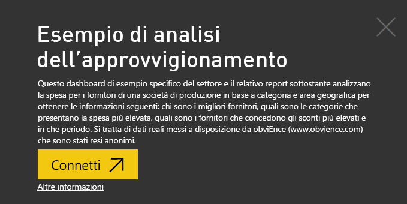

# Esempio di analisi dell'approvvigionamento per Power BI: Presentazione

Il pacchetto di contenuto Procurement Analysis Sample contiene un dashboard, un report e un set di dati che consentono di analizzare le spese per i fornitori di una società manifatturiera in base a categoria e località. Nell'esempio vengono analizzate le aree seguenti:

* Chi sono i fornitori principali
* Quali sono le categorie per cui si spende di più
* Quali fornitori offrono gli sconti maggiori e in quali casi

Questo esempio fa parte di una serie che illustra come usare Power BI con dati, report e dashboard orientati al business. L'esempio è stato creato con dati reali di [obviEnce](http://www.obvience.com/), che sono stati resi anonimi. I dati sono disponibili in diversi formati: pacchetto di contenuto, file di Power BI Desktop con estensione pbix o cartella di lavoro di Excel. Vedere [Esempi per Power BI](sample-datasets.md). 

Questa esercitazione esplora il pacchetto di contenuto Procurement Analysis Sample nel servizio Power BI. Dato che l'esperienza per i report è simile in Power BI Desktop e nel servizio, è anche possibile seguire le descrizioni usando il file con estensione pbix dell'esempio in Power BI Desktop. 

Non occorre una licenza di Power BI per esplorare gli esempi in Power BI Desktop. Se non si ha una licenza Power BI Pro, è possibile salvare l'esempio nell'area di lavoro personale nel servizio Power BI. 

## Ottenere l'esempio

Prima di poter usare l'esempio, è necessario scaricarlo come [pacchetto di contenuto](#get-the-content-pack-for-this-sample), [file con estensione pbix](#get-the-pbix-file-for-this-sample) o [cartella di lavoro di Excel](#get-the-excel-workbook-for-this-sample).

### Scaricare il pacchetto di contenuto per questo esempio

1. Aprire il servizio Power BI (app.powerbi.com), eseguire l'accesso e aprire l'area di lavoro in cui salvare l'esempio. 

    Se non si ha una licenza Power BI Pro, è possibile salvare l'esempio nell'area di lavoro personale.

2. Nell'angolo in basso a sinistra selezionare **Recupera dati**.

    
3. Nella pagina **Recupera dati** che viene visualizzata selezionare **Esempi**.

4. Selezionare **Procurement Analysis Sample** e quindi scegliere **Connetti**.  
  
   
   
5. Power BI importa il pacchetto di contenuto e quindi aggiunge un nuovo dashboard, report e set di dati all'area di lavoro corrente.
   
   
  
### Scaricare il file con estensione pbix per questo esempio

In alternativa, è possibile scaricare Procurement Analysis Sample come [file con estensione pbix](https://download.microsoft.com/download/D/5/3/D5390069-F723-413B-8D27-5888500516EB/Procurement%20Analysis%20Sample%20PBIX.pbix), progettato per l'uso con Power BI Desktop. 

### Scaricare la cartella di lavoro di Excel per questo esempio

Se si vuole visualizzare l'origine dati per questo esempio, è disponibile anche come [cartella di lavoro di Excel](https://go.microsoft.com/fwlink/?LinkId=529784). La cartella di lavoro contiene fogli di Power View che è possibile visualizzare e modificare. Per vedere i dati non elaborati, abilitare i componenti aggiuntivi di Analisi dati, quindi selezionare **Power Pivot > Gestisci**. Per abilitare i componenti aggiuntivi Power View e Power Pivot, vedere [Esplorare gli esempi di Excel in Excel](sample-datasets.md#explore-excel-samples-inside-excel) per informazioni dettagliate.

## Tendenze di spesa
Per prima cosa, eseguire una ricerca delle tendenze di spesa per categoria e località.  

1. Nell'area di lavoro in cui è stato salvato l'esempio, aprire la scheda **Dashboard**, quindi trovare il dashboard **Procurement Analysis Sample** e selezionarlo. 
2. Selezionare il riquadro del dashboard **Total Invoice by Country/Region** che viene aperto nella pagina **Spend Overview** del report **Procurement Analysis Sample**.

    

Tenere presenti questi dettagli:

* Nel grafico a linee **Total Invoice by Month and Category** la categoria **Direct** mostra una spesa uniforme, mentre **Logistics** e **Other** presentano un picco, rispettivamente nei mesi di dicembre e febbraio.
* Nella mappa **Total Invoice by Country/Region** gran parte della spesa è localizzata negli Stati Uniti.
* Nell'istogramma **Total Invoice by Sub Category** le categorie di spesa maggiori sono **Hardware** e **Indirect Goods & Services**.
* Nel grafico a barre **Total Invoice by Tier** la maggior parte delle attività viene svolta con i fornitori di livello 1 (primi 10). Ciò consente di gestire relazioni con i fornitori migliori.

## Spesa in Messico
In seguito analizzare le aree di spesa in Messico.

1. Nella mappa **Total Invoice by Country/Region** selezionare la bolla **Mexico**. Si noti che nell'istogramma **Total Invoice by Sub Category** la spesa maggiore si trova nella sottocategoria **Indirect Goods & Services**.

   
2. Eseguire il drill-down della colonna **Indirect Goods & Services**:

   * Nel grafico **Total Invoice by Sub Category** selezionare la freccia di drill-down  nell'angolo superiore destro del grafico.
   * Selezionare la colonna **Indirect Goods & Services**.

      Come si può notare, la spesa più elevata è di gran lunga per la sottocategoria **Sales & Marketing**.
   * Selezionare nuovamente **Mexico** nella mappa.

      Per Mexico la spesa maggiore è nella sottocategoria **Maintenance & Repair**.

      
3. Selezionare la freccia rivolta verso l'alto nell'angolo in alto a sinistra del grafico per eseguire il drill-up.
4. Selezionare di nuovo la freccia di drill-down per disattivare il drill-down.  
5. Nel riquadro di spostamento superiore selezionare **Esempio di analisi dell'approvvigionamento** per tornare al dashboard.

## Valutare diverse città
È possibile usare l'evidenziazione per valutare città diverse.

1. Selezionare il riquadro del dashboard **Total Invoice, Discount % By Month**, che viene aperto nella pagina **Discount Analysis** del report **Procurement Analysis Sample**.
2. Nella mappa ad albero **Total Invoice by City** selezionare a turno ogni città per confrontare i dati. Si noti che quasi tutte le fatture di Miami provengono da fornitori di livello 1.

   

## Sconti dei fornitori
Nella sezione seguente analizzare gli sconti offerti dai fornitori e i periodi in cui si ottengono gli sconti più alti:
* Gli sconti sono diversi ogni mese o restano invariati?
* Alcune città ottengono sconti maggiori di altre?

### Sconti per mese
Se si osserva il grafico combinato **Total Invoice and Discount % by Month**, si nota che febbraio è il mese più movimentato, mentre settembre è il mese meno attivo. 

Esaminare la percentuale di sconto durante questi mesi: con l'aumento del volume lo sconto viene ridotto e quando il volume è basso lo sconto aumenta. Nei periodi in cui sarebbe utile avere degli sconti, le offerte risultano, al contrario, meno vantaggiose.

### Sconti per città
Un'altra area da analizzare riguarda lo sconto per città. Selezionare a turno ogni città nella mappa ad albero per vedere come cambiano gli altri grafici:

* St. Louis mostra un notevole picco della fatturazione totale nel mese di febbraio e un calo altrettanto significativo dei risparmi derivati dagli sconti nel mese di aprile.
* Città del Messico ha la percentuale di sconto più alta (11,05%), mentre Atlanta quella più bassa (0,08%).

### Modificare il report
Selezionare **Modifica report** nell'angolo in alto a sinistra e aprirlo nella visualizzazione di modifica:

* Esaminare l'aspetto delle pagine.
* Aggiungere pagine e grafici basati sugli stessi dati.
* Modificare il tipo di visualizzazione per un grafico, ad esempio trasformare una mappa ad albero in un grafico ad anello.
* Aggiungere grafici al dashboard.

## Passaggi successivi: Connettersi ai dati
Questo ambiente è sicuro perché è possibile scegliere di non salvare le modifiche, ma, se le si salva, è sempre possibile scegliere **Recupera dati** per ottenere una nuova copia di questo esempio.

La presentazione ha tentato di mostrare il modo in cui i dashboard, la casella Domande e risposte e i report di Power BI possono fornire analisi approfondite dei dati di esempio. È ora possibile iniziare e connettersi ai propri dati. Con Power BI è possibile connettersi a una vasta gamma di origini dati. Per altre informazioni, vedere [Introduzione al servizio Power BI](service-get-started.md).

