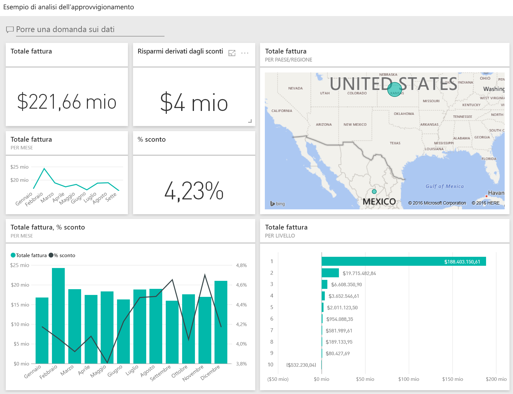
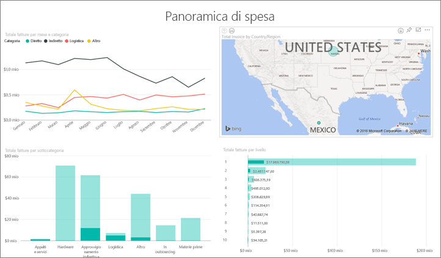
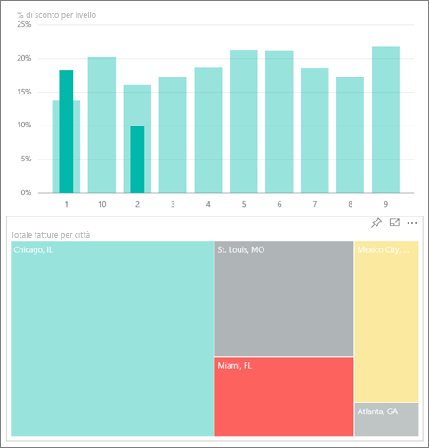
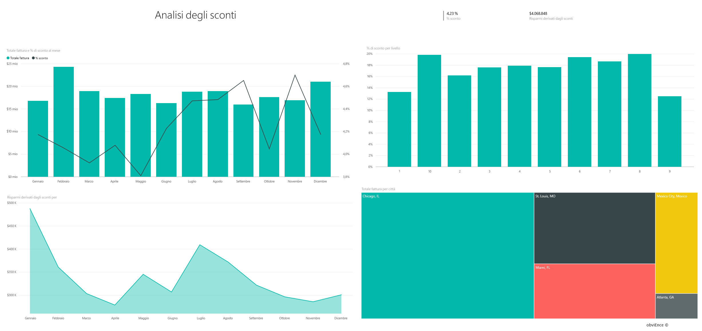
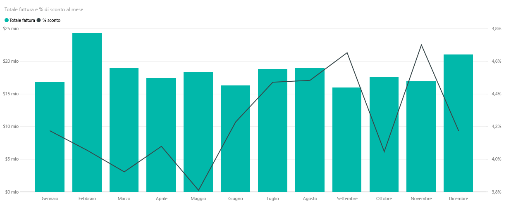
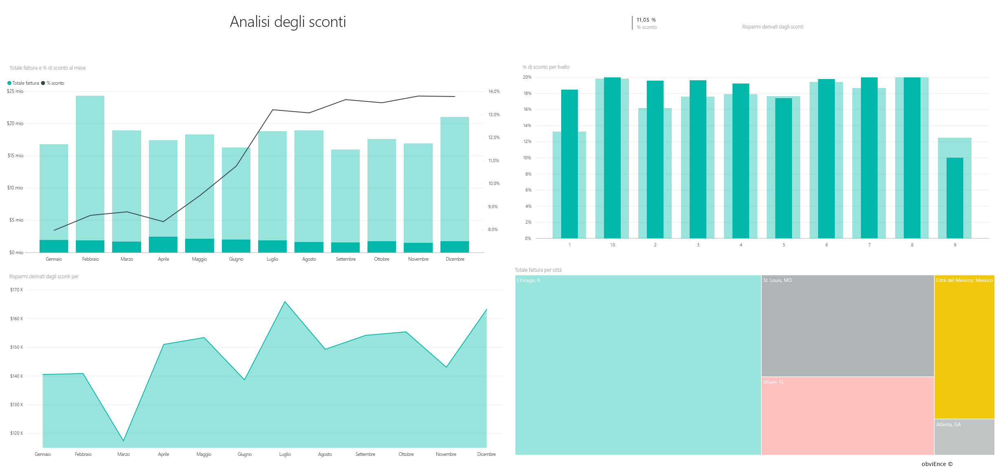

# Presentazione dell'esempio di analisi dell'approvvigionamento per Power BI
Questo dashboard di esempio del settore, unitamente al report sottostante, consentono di analizzare la spesa per i fornitori di una società di produzione in base a categoria e località. Nell'esempio vengono analizzate le aree seguenti:

* Chi sono i fornitori principali
* Quali sono le categorie per cui si spende di più
* Quali fornitori offrono gli sconti maggiori e in quali casi

Questo esempio fa parte di una serie che illustra come usare Power BI con dati, report e dashboard orientati al business. Si tratta di dati reali messi a disposizione da obviEnce ([www.obvience.com](http://www.obvience.com/)) che sono stati resi anonimi.

Per iniziare, nel [servizio Power BI](https://powerbi.com) passare a **Recupera dati > Esempi > Esempio di analisi dell'approvvigionamento > Connetti** per ottenere una copia dell'esempio.

È anche possibile [scaricare solo il set di dati (cartella di lavoro di Excel)](http://go.microsoft.com/fwlink/?LinkId=529784) per questo esempio.

## Tendenze di spesa
Verrà eseguita prima una ricerca delle tendenze di spesa per categoria e località.  

1. Nell'area di lavoro aprire la scheda **Dashboard** e selezionare il dashboard dell'esempio di analisi dell'approvvigionamento.
2. Selezionare il riquadro del dashboard **Total Invoice by Country/Region**. Si apre la pagina "Spend Overview" del report sull'esempio di analisi dell'approvvigionamento.
   
    

Si noti che:

* Nel grafico a linee **Total Invoice by Month and Category**: la categoria **Direct** mostra una spesa abbastanza uniforme, mentre **Logistics** e **Other** presentano un picco, rispettivamente, nei mesi di dicembre e febbraio.
* Nella mappa **Total Invoice by Country/Region**: gran parte della spesa è localizzata negli Stati Uniti.
* Nell'istogramma **Total Invoice by Sub Category**: le categorie di spesa maggiori sono **Hardware** e **Indirect Goods & Services**.
* Nel grafico a barre Total Invoice by Tier: la maggior parte delle attività viene svolta con i fornitori di livello 1 (primi 10). Ciò consente di gestire meglio le relazioni con i fornitori.

## Spesa in Messico
Di seguito verranno analizzate le aree di spesa in Messico.

1. Nel grafico a torta selezionare la bolla **Mexico** nella mappa. Nell'istogramma "Total Invoice by Sub Category" il valore maggiore si trova nella sottocategoria **Indirect Goods & Services**.
   
   
2. Eseguire il drill-down della colonna **Indirect Goods & Services**:
   
   * Selezionare la freccia del drill-down  nell'angolo in alto a destra del grafico.
   * Selezionare la colonna **Indirect Goods & Services**.
     
      Finora la spesa maggiore in questa categoria in generale è Sales & Marketing.
   * Selezionare nuovamente **Mexico** nella mappa.
     
      La spesa maggiore in questa categoria per il Messico è Maintenance & Repair.
     
      
3. Selezionare la freccia rivolta verso l'alto nell'angolo in alto a sinistra del grafico per eseguire il drill-up.
4. Selezionare di nuovo la freccia per disattivare il drill-down.  
5. Selezionare **Power BI** nella barra di spostamento superiore per tornare all'area di lavoro.

## Valutare diverse città
È possibile usare l'evidenziazione per valutare città diverse.

1. Selezionare il riquadro del dashboard **Total Invoice, Discount % By Month**. Il report si apre alla pagina "Discount Analysis".
2. Selezionare le diverse città nella mappa ad albero **Total Invoice by City** per poterle confrontare. Quasi tutte le fatture di Miami provengono da fornitori di livello 1.
   
   

## Sconti dei fornitori
Nella sezione seguente verranno analizzati gli sconti offerti dai fornitori e i periodi in cui si ottengono gli sconti più alti. 

In particolare, si risponderà a queste domande:

* Gli sconti cambiano da un mese all'altro o sono gli stessi ogni mese?
* Alcune città ottengono sconti maggiori di altre?

### Sconti per mese
Se si osserva il grafico combinato **Total Invoice and Discount % by Month**, si nota che **febbraio** è il mese più movimentato, mentre **settembre** è il mese meno attivo. Se si guarda la percentuale di sconto durante questi mesi,
si nota che gli sconti diminuiscono quando il volume aumenta e viceversa. Nei periodi in cui sarebbe utile avere degli sconti, le offerte risultano, al contrario, meno vantaggiose.

### Sconti per città
Un'altra area da analizzare riguarda gli sconti per città. Selezionare le singole città nel grafico ad albero per vedere come cambiano gli altri grafici. 

* St. Louis mostra un notevole picco della fatturazione totale nel mese di febbraio e un calo altrettanto significativo dei risparmi derivati dagli sconti nel mese di aprile.
* Città del Messico ha la percentuale di sconto più alta (11,05%), mentre Atlanta quella più bassa (0,08%).

### Modificare il report
Selezionare **Modifica report** nell'angolo in alto a sinistra e aprirlo in Visualizzazione di modifica.

* Esaminare l'aspetto delle pagine
* Aggiungere pagine e grafici basati sugli stessi dati
* Modificare il tipo di visualizzazione per un grafico, ad esempio trasformare un grafico ad albero in un grafico ad anello
* Aggiungerli al dashboard

Si tratta di un ambiente sicuro in cui operare: è sempre possibile scegliere di non salvare le modifiche, ma, se le si salva, è sempre possibile scegliere **Recupera dati** per ottenere una nuova copia di questo esempio.

## Passaggi successivi: Connettersi ai dati
Ci auguriamo che questa presentazione abbia illustrato in che modo i dashboard e i report di Power BI forniscono informazioni dettagliate sui dati dell'approvvigionamento. È ora possibile iniziare e connettersi ai propri dati. Con Power BI è possibile connettersi a una vasta gamma di origini dati. Per altre informazioni, vedere [Introduzione a Power BI](service-get-started.md).

