# Presentazione dell'esempio di analisi delle vendite al dettaglio

Questo dashboard di esempio del settore, unitamente al report sottostante, consentono di analizzare i dati delle vendite al dettaglio relativi ad articoli venduti in più negozi e in più zone. Grazie alle metriche è possibile confrontare le prestazioni dell'anno corrente con quelle dell'anno precedente in diverse aree, tra cui vendite, unità, profitto lordo e scostamento, oltre ad analizzare i nuovi negozi. Si tratta di dati reali messi a disposizione da obviEnce ([www.obvience.com](http://www.obvience.com)) che sono stati resi anonimi.

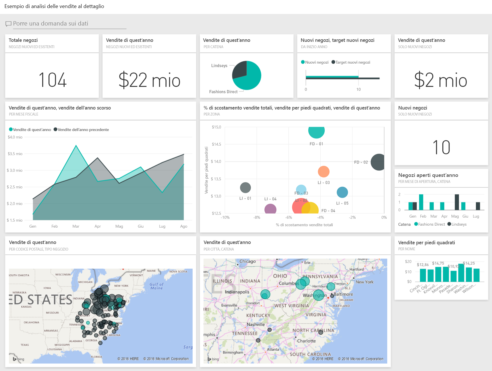

## Prerequisiti

 Prima di poter usare l'esempio, è necessario scaricarlo come [pacchetto di contenuto](https://docs.microsoft.com/power-bi/sample-datasets#get-and-open-a-sample-content-pack-in-power-bi-service), [file con estensione pbix](http://download.microsoft.com/download/9/6/D/96DDC2FF-2568-491D-AAFA-AFDD6F763AE3/Retail%20Analysis%20Sample%20PBIX.pbix) o [cartella di lavoro di Excel](http://go.microsoft.com/fwlink/?LinkId=529778).

### Scaricare il pacchetto di contenuto per questo esempio

1. Aprire il servizio Power BI (app.powerbi.com) ed eseguire l'accesso.
2. Nell'angolo in basso a sinistra selezionare **Recupera dati**.
   
    
3. Nella pagina Recupera dati che viene visualizzata selezionare l'icona **Esempi**.
   
   
4. Selezionare l'**esempio di analisi delle vendite al dettaglio** e scegliere **Connetti**.  
  
   
   
5. Power BI importa il pacchetto di contenuto e aggiunge un nuovo dashboard, report e set di dati all'area di lavoro corrente. I nuovi contenuti sono contrassegnati con un asterisco giallo. 
   
   
  
### Scaricare il file con estensione pbix per questo esempio

In alternativa, è possibile scaricare l'esempio come file con estensione pbix, progettato per l'uso con Power BI Desktop. 

 * [Esempio di analisi delle vendite al dettaglio](http://download.microsoft.com/download/9/6/D/96DDC2FF-2568-491D-AAFA-AFDD6F763AE3/Retail%20Analysis%20Sample%20PBIX.pbix)

### Scaricare la cartella di lavoro di Excel per questo esempio
È anche possibile [scaricare solo il set di dati (cartella di lavoro di Excel)](http://go.microsoft.com/fwlink/?LinkId=529778) per questo esempio. La cartella di lavoro contiene fogli di Power View che è possibile visualizzare e modificare. Per visualizzare i dati non elaborati, selezionare **Power Pivot > Gestisci**.

## Iniziare dal dashboard e aprire il report
1. Nel dashboard, selezionare il riquadro "Total Stores":

   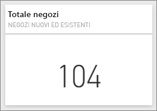  

   Verrà visualizzata la pagina "Store Sales Overview" nel report. Come si può osservare, ci sono in totale 104 negozi, 10 dei quali nuovi. Sono presenti due catene: Fashions Direct e Lindseys. In media, i negozi Fashion Direct hanno dimensioni maggiori.
2. Nel grafico a torta selezionare **Fashions Direct**.

   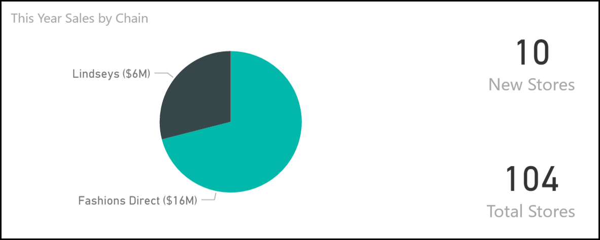  

   Osservare il risultato nel grafico a bolle:

   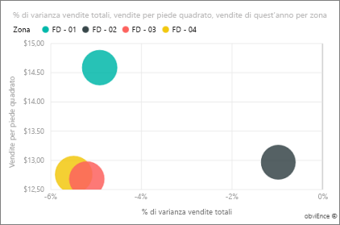  

   La zona FD-01 ha la media di vendite più elevata per piede quadrato, FD-02 ha la varianza più bassa nelle vendite rispetto all'ultimo anno, FD-03 e FD-04 hanno le peggiori prestazioni complessive.
3. Fare clic su singole bolle o altri grafici per visualizzare l'evidenziazione incrociata, che rivela l'impatto delle selezioni.
4. Per tornare al dashboard, selezionarne il nome nella barra di spostamento superiore (barre di navigazione).

   
5. Nel dashboard, selezionare il riquadro denominato "This Year's Sales" (Vendite anno in corso).

   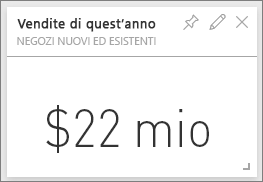

   Ciò equivale a digitare "This year sales" nella casella della domanda.

   Verrà visualizzata la schermata seguente:

   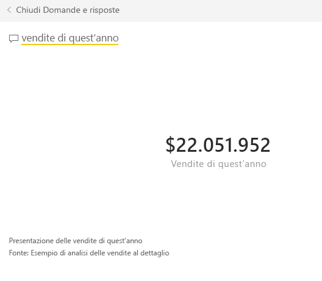

## Esaminare un riquadro creato con Domande e risposte di Power BI
Entriamo nello specifico.

1. Aggiungere "this year sales **by district**" (vendite dell'anno per zona) nella casella della domanda. Osservare il risultato. La risposta viene automaticamente inserita in un grafico a barre e vengono suggerite altre frasi:

   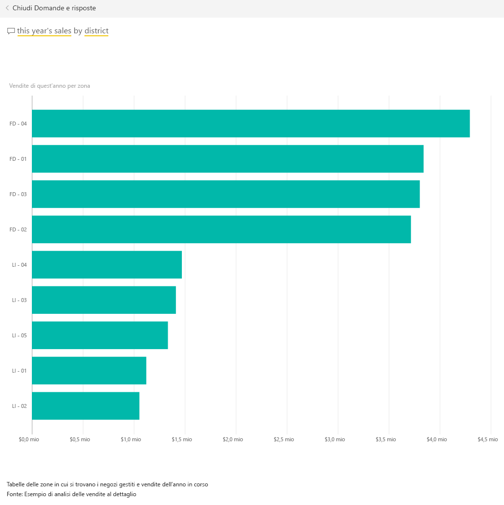
2. Modificare ora la domanda in "this year sales **by zip and chain**" (vendite dell'anno per CAP e catena).

   Come si può osservare, mentre si digita la domanda, si ottiene una risposta con i grafici appropriati.
3. Provare a porre altre domande e a vedere quali risultati si ottengono.
4. Al termine, tornare al dashboard.

## Esplorare i dati in dettaglio
A questo punto verrà eseguita un'analisi più dettagliata delle prestazioni delle varie zone.

1. Nel dashboard selezionare il riquadro di confronto tra le vendite dell'anno corrente e quelle dell'anno precedente.

   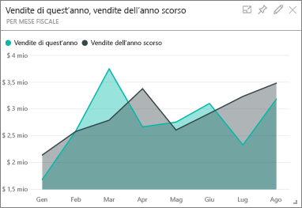

   Si noti l'importante variabilità della percentuale di varianza rispetto all'anno precedente, di cui gennaio, aprile e luglio sono stati mesi particolarmente scarsi.

   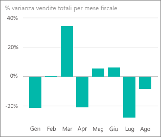

   Vediamo se è possibile circoscrivere i possibili problemi.
2. Selezionare il grafico a bolle e scegliere **020-Mens**.

   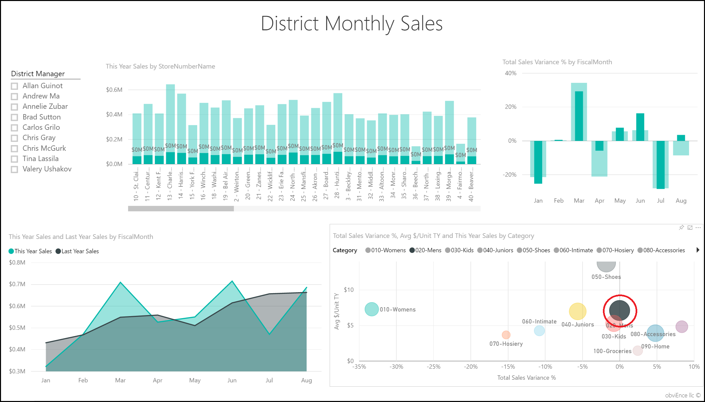  

   Osservare che il fatturato totale della categoria maschile non ha subito gravi ripercussioni nel mese di aprile, ma che gennaio e luglio sono stati due mesi problematici.
3. Ora, selezionare il grafico a bolle **010-Womens**.

   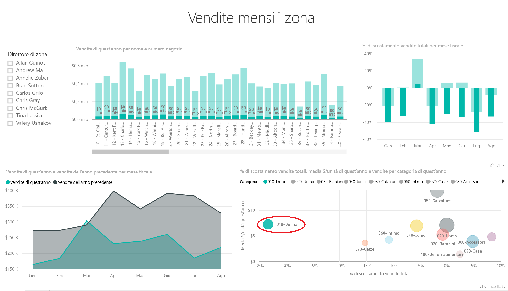

   Osservare che la categoria femminile ha avuto complessivamente prestazioni molto peggiori, quasi ogni mese rispetto all'anno precedente.
4. Selezionare di nuovo la bolla per cancellare il filtro.

## Provare il filtro dei dati
Esaminiamo le prestazioni di ogni specifica zona.

1. Selezionare Allan Guinot nel filtro dei dati in alto a sinistra.

   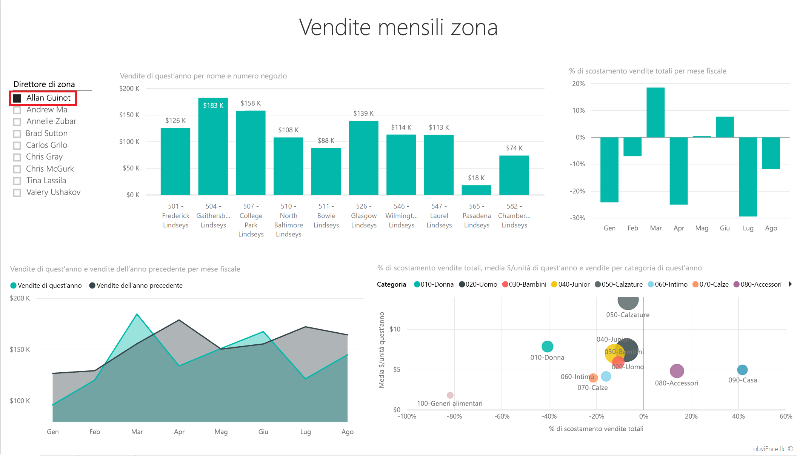

   Si noti che la zona di Allan Guinot ha avuto prestazioni migliori l'anno precedente nei mesi di marzo e giugno.
2. Tenendo selezionato Allan Guinot, fare clic sulla bolla Women's.

   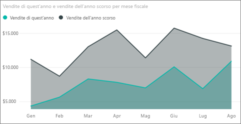

   Notare che per la categoria femminile la sua zona non ha mai realizzato il volume dell'anno precedente.
3. Esplorare i manager e le categorie dell'altra zona: quali altre importanti informazioni è possibile dedurre?
4. Al termine, tornare al dashboard.

## Cosa rivelano i dati sull'incremento delle vendite di quest'anno?
L'ultima area da esplorare è la crescita, cioè i nuovi negozi aperti quest'anno.

1. Selezionare il riquadro "Stores Opened This Year".

   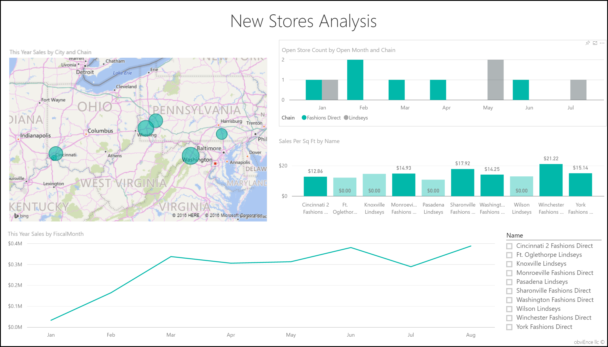

   Come è chiaro dal riquadro, quest'anno sono stati aperti più punti vendita Fashions Direct che non Lindseys.
2. Osservare il grafico 'Sales Per Sq Ft by Name':

   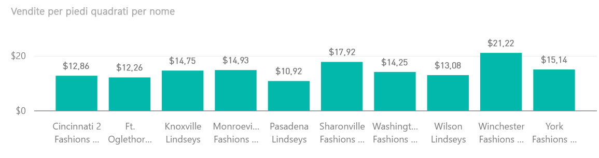

    C'è una netta differenza nel valore Average Sales per SFW tra i nuovi negozi.
3. Fare clic sull'elemento della legenda di Fashions Direct nel grafico in alto a destra. Si noti come, anche per la stessa catena, il miglior negozio (Winchester Fashions Direct) ha prestazioni migliori rispetto al negozio con prestazioni peggiori in assoluto (Cincinnati 2 Fashions Direct), e cioè rispettivamente di $21,22 e $12,86.

   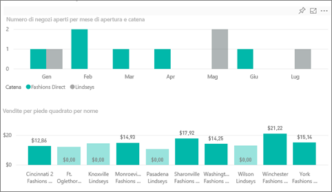
4. Fare clic su Winchester Fashions Direct nel filtro dei dati e osservare il grafico a linee. I primi dati sulle vendite risalgono a febbraio.
5. Fare clic su Cincinnati 2 Fashions Direct nel filtro dei dati per vedere nel grafico a linee che è stato aperto a giugno e sembra essere il negozio con le prestazioni peggiori in assoluto.
6. Come in precedenza, esplorare facendo clic sulle altre barre, linee e bolle dei grafici e vedere quali informazioni è possibile ottenere.

Si tratta di un ambiente sicuro in cui operare: è sempre possibile scegliere di non salvare le modifiche, ma, se le si salva, è sempre possibile scegliere Recupera dati per ottenere una nuova copia di questo esempio.

## Connettersi ai dati
La presentazione ha tentato di mostrare il modo in cui i dashboard, la casella Domande e risposte e i report di Power BI possono fornire analisi approfondite dei dati del settore della vendita al dettaglio. È ora possibile iniziare e connettersi ai propri dati. Con Power BI è possibile connettersi a una vasta gamma di origini dati. Per altre informazioni, vedere [Introduzione a Power BI](service-get-started.md).

## Passaggi successivi
* [Scaricare il pacchetto di contenuto dell'esempio di analisi delle vendite al dettaglio](sample-tutorial-connect-to-the-samples.md)
* [Scaricare un file zip di tutti i file di esempio](http://go.microsoft.com/fwlink/?LinkId=535020)    
* [Scaricare la cartella di lavoro di Excel per questo esempio di Power BI](http://go.microsoft.com/fwlink/?LinkId=529778)    
* [Recuperare dati per Power BI](service-get-data.md)    
* [Power BI - Concetti di base](consumer/end-user-basic-concepts.md)    
* Altre domande? [Provare la community di Power BI](http://community.powerbi.com/)
